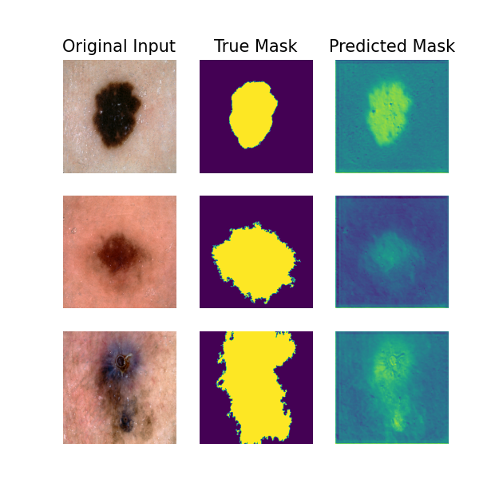

# ISICs dataset segmentation with an Improved UNet Model
#### Author: Deven Bhasin
##### Student Number: 48241328
## Introduction
In this project an improved UNet model is used for image segmentation.
### Algorithm Description
The UNet is an architectural model that consists of two paths: Contraction and Expansion. Contraction is the process
of capturing the context of an image by reducing its features. This is done traditionally through stacks of
convolutional and max pooling layers [3]. Expansion is the process of reintroducing information into higher resolution
layers [3]. In the improved UNet model used, other techniques like dropout, batch normalization, leaky ReLU layers, and
segmentation are used to improve upon the initial model.
### Dataset Description
The ISIC 2018 dataset is a dataset that was released as a resource for an automated image analysis tool development
competition [2].
### Hyperparameters
After modifying the hyperparameters of the model, I found that the best performance occurred with the following values:
- Training/Validation/Testing split of 80%/10%/10%
- Batch Size = 16
- Epochs = 10
- Initial filters used in the convolutional layer = 16
- Convolutional layer padding = 'same'
- Convolutional layer activation = 'relu'
- Dropout rate of 0.3 (30%)
- Leaky ReLU alpha parameter (Zero substitution value) = 0.1
- Model optimizer = 'adam'
- If the dataset should be shuffled (Set to True be default)
### Training/ Validating/ Testing data split justification
A dataset split for training/ validating/ testing was decided to be 80%/10%/10% of the ISIC dataset. This was due to the 
large amount of data present in the dataset.
### Accuracy and Loss performance metric justification
The accuracy and loss metric measured for training is the dice similarity coefficient, which was selected to achieve
what was asked in the assessment specification.
## Accuracy of the model
Trained models with this architecture was able to consistently achieve a dice similarity coefficient of greater or equal
to 80% in training, validation, and testing. With the default parameters, the following performance was achieved:
### Figure 1: Example image segmentation achieved by the model, presented next to the original model and the true mask

### Figure 2: Example performance of the model's training and validation accuracy over epochs run

### Figure 3: Example performance of the model's training and validation loss over epochs run

## Parameters for visualisation and saving
Included in the model are parameters that the user can modify to generate and save certain plots that show the
performance of the model. Included are:
- The number of displayed examples displayed per generated plot (Default set to 3)
- If a subset of the original photos are to be displayed (Image and equivalent Mask)
- If a subset of the processed photos are to be displayed (Image and equivalent Mask)
- If a subset of the predicted masks are to be displayed alongside the original photo and true mask
- If plots generated should be saved in the subdirectory '/Results'
#### NOTE: If the subdirectories needed are not present, they will be created automatically
#### NOTE: If there are files present before the program is run, these files will be overwritten with new data
#### NOTE: A visual representation of the model is generated automatically and saved to the subdirectory '/Results'
## How to build and run
To run the program, the downloaded dataset is needed to be extracted and copied to same folder before running the **predict.py**
script. The following dependencies will also be needed:
## Dependencies
- Python (Tested: 3.11.6)
- Tensorflow (Tested: 2.14.0)
- matplotlib (Tested: 3.8.0)
- graphviz (Tested: 0.20.1)
- pydot (Tested: 1.4.2)
- CUDA (Tested: 12.1)
## References
- [1] https://github.com/angadbajwa23/Segmentation-of-2D-Brain-MR-Images-using-Deep-Neural-Architectures/blob/master/2d/U_net_Model.ipynb.
- [2] https://challenge.isic-archive.com/data/#2018.
- [3] https://towardsdatascience.com/understanding-semantic-segmentation-with-unet-6be4f42d4b47.
- [4] https://www.jeremyjordan.me/semantic-segmentation/.
- [5] https://www.tensorflow.org/tutorials/images/segmentation.