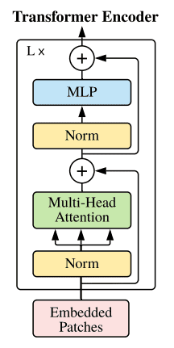
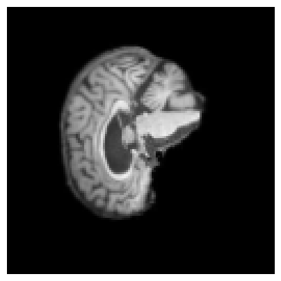
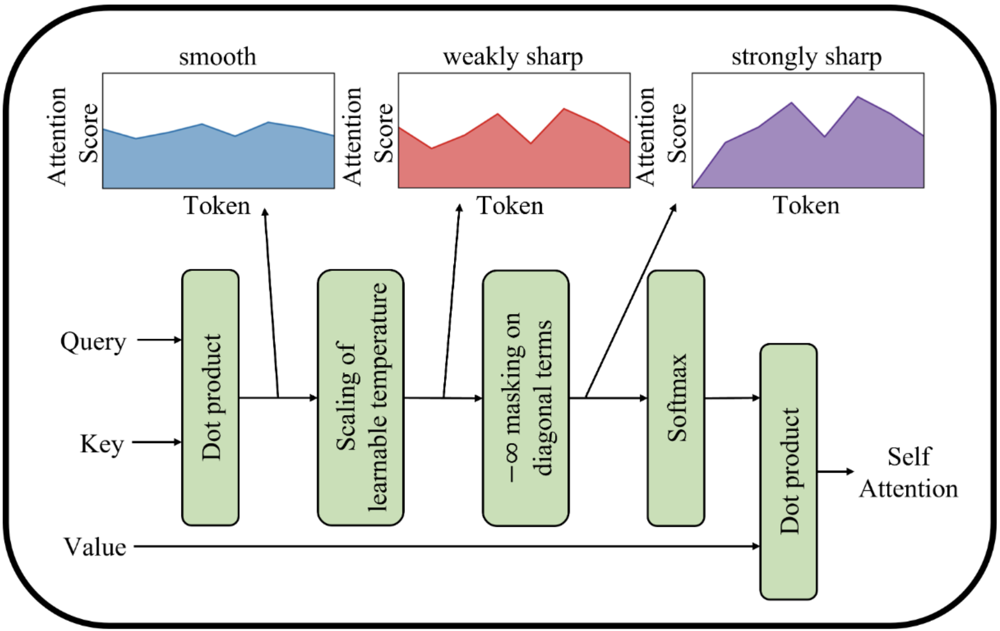
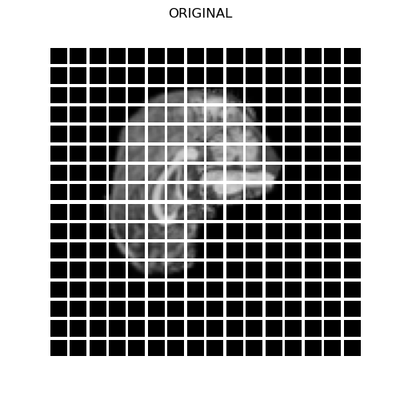
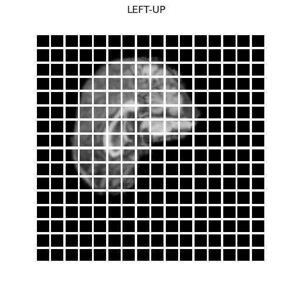
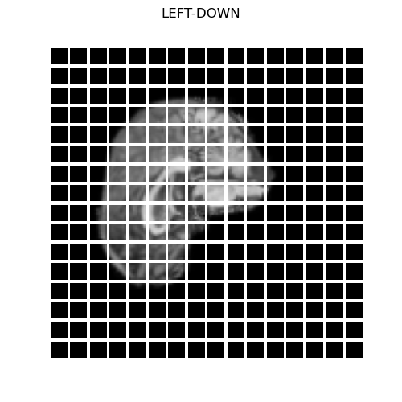
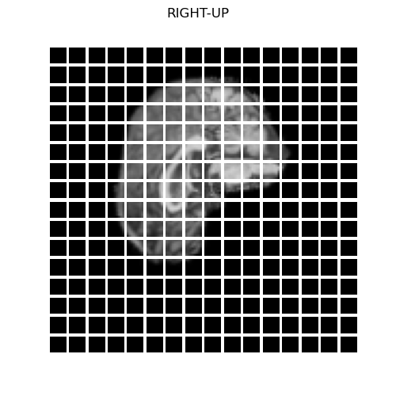
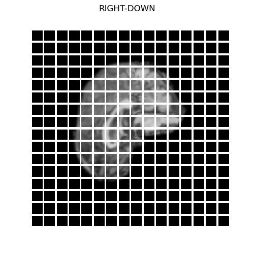

ADNI_Brain_Visual_Transformer_47306725
# Visual Transformer for the Classification of Alzheimer's Disease

Ritika Rana (Student Noumber : 47306725)

## Overview
The rapidly expanding field of medical imaging leverages deep learning and neural networks to enhance diagnostic accuracy and reduce human errors in healthcare and medicine. This project seeks to create a Vision Transformer. The objective is to enable the Vision Transformer to categorize MRI brain scans as either indicative of Alzheimer's Disease or Normal Cognitive function as Vision Transformers can achieve excellent results compared to convolutional networks while demanding fewer training resources. The target for this model is a testing accuracy of at least 80%.

## Vision Transformers
Conventional Transformers employ the self-attention mechanism to discern the interplay among multiple inputs. Referred to as ViT (Vision Transformers), these models take the original Transformer architecture and adapt the attention mechanism to process 2D images, making them suitable for classification tasks.

    

You can input 2D images into the Vision Transformer (ViT), and the images are divided into smaller patches. These patches are then transformed into 1D vectors through linear projections. Learnable class embeddings can be included, and to maintain the patch ordering, positional encodings can be introduced. These flattened patches, enriched with class or positional embeddings, are subsequently processed by conventional Transformer encoders to identify relationships within the image data patches. Finally, a Multi-Layer Perceptron (MLP), a neural network capable of learning relationships, is employed for the classification of inputs.
Components in a Transformer Encoder are as follows:

    

## Project Requirements 
The following dependencies were likely to provide the most reliable performance:

- Python version 3.10.4
- Tensorflow version 2.10.0, which is employed for tasks such as data loading, model construction, training, and prediction.

- Tensorflow Addons version 0.18.0, specifically utilized to implement the 'AdamW' optimizer for the model.

- Matplotlib version 3.5.2, used for generating visualizations, including plots for model loss and accuracy, as well as confusion matrices for evaluating test results.

## Overview of the Repository

The document has the following sections:

The resources/ directory houses the images utilized in this README document.

"Parameters" includes the hyperparameters employed to define data loading and model configurations.

"Modules" has the elements that make up the Vision Transformer.

"Dataset" contains the function responsible for data loading.

"Train" can access the functions for assembling and training the model.

"Predict" comprises the functions required for making predictions using the trained model.

Lastly, "Utils" encompasses functions dedicated to data visualization.

## Setting Parameters
Prior to initiating model training, make sure to configure the global variables located in parameters.py. The variables that require configuration include:

IMG_SIZE: The height and width of the image.
PATCH_SIZE: The height and width of individual patches.
BATCH_SIZE: The batch size for both training and testing data.
PROJECTION_DIM: The dimensions of the attention layer.
LEARN_RATE: The learning rate for the optimizer.
ATTENTION_HEADS: The number of attention heads.
DROPOUT_RATE: The fraction of units to drop out in each Dense Layer (expressed as a decimal).
TRANSFORMER_LAYERS: The quantity of transformer encoders to incorporate.
WEIGHT_DECAY: The weight decay used by the optimizer.
EPOCHS: The number of epochs for model training.
MLP_HEAD_UNITS: The number of units in the MLP head classifier for feature learning (specified as an array, with each element representing the units in an additional Dense Layer).
DATA_PATH: The path from which the dataset will be loaded.
MODEL_SAVE_DEST: The location to save the model.
The variables INPUT_SHAPE, HIDDEN_UNITS, and NUM_PATCHES are calculated automatically.

## Build and Train the Model
After configuring the parameters, execute till train.  Upon completion of training, the model will be saved in HDF5 format at the directory specified by MODEL_SAVE_DEST. Additionally, loss and accuracy curves will be generated and saved in the working directory.

To make predictions using the trained model, run predict. This script loads the model from MODEL_SAVE_DEST and evaluates the test set. A confusion matrix will be automatically generated and saved in the working directory.

## Dataset
we can download the original dataset from the ADNI website. To specify the data source path, modify the DATA_LOAD_DEST constant in parameters. The data is expected to adhere to the following file structure:

train/
    AD/
        images
        ...
    NC/
        images
        ...
test/
    AD/
        images
        ...
    NC/
        images
        ...

Given that this dataset exclusively contains two categories, it is loaded using binary encoding. In this scheme, the value 0 represents the AD class for brains afflicted with Alzheimer's Disease, and 1 is assigned to NC, signifying brains with normal cognitive function.

## Training, Validation and Test Splits
The provided dataset consisted of 21,520 images in the training folder, and 9000 images in the testing folder. Since Vision Transformers are very data-hungry models which require a lot of data for training, it was decided that the validation set would be split from half of the image data in the testing folder. This gives a dataset split of:

21,520 images in training set
4500 images in validation set
4500 images in testing set

## Data Augmentation
The data loaded was also augmented before passing to the model for training and prediction.
Normalization, RandomFlip, RandomZoom and RandomRotate layers were applied to each image in the three datasets.
By augmenting the data, the model would be less likely to overfit on the already small set of training data. The randomized actions have all been passed a seed parameter to allow for the reproducibility of results.
for example:

    

## Vision Transformer Implementation
### Changes made to Original Vision Transformer
The architecture of the implemented Vision Transformer model exhibits slight deviations from the original model.

The key distinctions include the incorporation of Shifted Patch Tokenization and the utilization of Local Self-Attention. 
Transformers, along with these techniques, can enhance the learning process of Vision Transformers, particularly when dealing with smaller datasets. Given our relatively limited dataset consisting of only 30,520 images, we made the deliberate choice to incorporate the aforementioned methods into the model.

Shifted Patch Tokenization is a method that involves making slight adjustments to input images by shifting them either to the right or left and up or down. This adjustment effectively expands the Transformer's receptive field, thereby improving its capacity to recognize the connections between different patches within the image.

Local Self-Attention shares similarities with the conventional Multi-Head Attention (MHA) layer, but it introduces an extra diagonal mask. This mask redirects the Vision Transformer's attention towards relationships between tokens, as opposed to focusing solely on its own tokens. Additionally, a Learnable Temperature Scaling component is integrated into the model, enabling it to autonomously adapt the temperature of the Softmax layer within the MHA layer. This adjustment aids in fine-tuning the score distribution or attention distribution, enhancing the model's performance.

    

Furthermore, the class token that was part of the Transformer Encoder in the original paper has been omitted. An author of the original paper argued that the class token is dispensable and not crucial. Consequently, in our model, the classification task is executed by employing an MLP (comprising Dense layers) designed to acquire and learn features.

## Architecture of Vision Transformer 
Following the initial input layer of the Vision Transformer, the data proceeds to the PatchLayer. Within this layer, the images are divided into patches, each with dimensions defined by the constant PATCH_SIZE. Moreover, Shifted Patch Tokenization is employed on the input images before the patching process. As a result of this operation, the original image is partitioned into patches as follows:

    

The images which have Shifted Patch Tokenization applied and are patched become:

    
    

    
    

Subsequently, these images are transformed into vectors through flattening and then directed to the EmbedPatch layer. This layer is responsible for embedding positional information into the flattened vectors. Once the patches have been encoded with their respective positions, these vectors are passed into the Transformer blocks. Within these Transformer blocks, a structure akin to the original model is adhered to, with the exception that Local Self-Attention is applied in conjunction with the Multi-Head Attention layer, rather than utilizing the Multi-Head Attention layer in isolation. After the Transformer encoder blocks, MLP layers come into play for feature learning and final classification, given that the class token is no longer employed.

During testing, it was observed that maintaining logits and performing BinaryCrossEntropy evaluation based on logits yielded more stable results. Consequently, the final MLP classification layer does not incorporate any activation functions.

## Training and Testing Process
Numerous permutations of hyperparameters were experimented with and adjusted, guided by the outcomes derived from training, validation, and testing accuracies. The subsequent section details the outcomes of three distinct models, each characterized by varying levels of complexity.

## Model 1
This model was initially trained with the following hyperparameters:
'''
IMG_SIZE = 128
PATCH_SIZE = 8
BATCH_SIZE = 32
EPOCHS = 10
WEIGHT_DECAY = 0.0001
PROJECTION_DIM = 512 # MLP-blocks depth
LEARN_RATE = 0.0005
TRANSF_LAYERS = 5 # No. of transformer-encoder-blocks
DROPOUT_RATE = 0.2
ATTENTION_HEADS = 5
MLP_HEAD_UNITS = [256, 128]
'''

these parameters give 65,729,926 trainable parameters. The loss and accuracy plots of training and validation for this model were as follows:

    

    

The confusion matrix for the test set is presented. In this matrix, the label '0' corresponds to brains afflicted with Alzheimer's Disease, whereas '1' corresponds to brains with Normal Cognitive function.

    

From the plots above, it is evident that the model is greatly overfitting in only 10 epochs. When training the model for more epochs, overfitting would worsen. Evaluating the test set on this model resulted in a 64.65% accuracy, not meeting the 80% accuracy goal.

## Model 2

In a subsequent effort to train the model and mitigate the observed overfitting from the previous outcome, alterations were made to the hyperparameters, resulting in the following configuration:
'''
IMG_SIZE = 128
PATCH_SIZE = 8
BATCH_SIZE = 32
EPOCHS = 10
WEIGHT_DECAY = 0.0001
PROJECTION_DIM = 128 # MLP-blocks depth
LEARN_RATE = 0.001
TRANSF_LAYERS = 3 # No. of transformer-encoder-blocks
DROPOUT_RATE = 0.4
ATTENTION_HEADS = 5
MLP_HEAD_UNITS = [64, 32]
'''

This specific set of parameters results in 3,445,764 trainable parameters. Notably, the model's complexity was substantially reduced, aiming to make it more challenging for the model to overfit during training. The outcome of this model was a testing accuracy of 62.68%. Below, you can find the representations of the loss and accuracy curves, as well as the confusion matrix.

    

    

    

The visual representations make it apparent that the overfitting issue remains unaddressed, and the outcomes closely resemble those observed previously. The confusion matrix further underscores that there has been no enhancement in testing dataset accuracy.

## Model 3

`A final model, characterized by substantially reduced complexity, was trained using the subsequent parameters:
IMG_SIZE = 128
PATCH_SIZE = 8
BATCH_SIZE = 32
EPOCHS = 10
WEIGHT_DECAY = 0.0001
PROJECTION_DIM = 16 # MLP-blocks depth
LEARN_RATE = 0.0001
TRANSF_LAYERS = 1 # No. of transformer-encoder-blocks
DROPOUT_RATE = 0.3
ATTENTION_HEADS = 2
MLP_HEAD_UNITS = [16, 8]

This particular model comprises a mere 90,418 trainable parameters and achieved a testing accuracy of 57.96%. Below, you will find the visualizations of the accuracy and loss curves, along with the confusion matrix.

    

    

    

Once more, it is evident that the model displays noticeable overfitting characteristics. Furthermore, this less intricate model resulted in a reduction in accuracy compared to the initial Model 1. Consequently, the determination was made that training less complex models would not effectively address the overfitting problem and would, in fact, lead to more significant declines in testing accuracy.

Additional attempts were made to fine-tune the model by experimenting with diverse hyperparameters, encompassing both larger and smaller models. Various optimizers and learning rates were also tested, yet all the models exhibited overfitting tendencies. Ultimately, the highest testing accuracy achieved was the 57.96% attained by Model 1.

## Conclusion
The results from the three models trained and assessed above underscore a substantial problem with model overfitting, given the inability to attain validation or testing accuracy above 64.65%.

To enhance this project and potentially bring the model's accuracy closer to the 80% objective, it is recommended to consider employing a larger dataset.

Another viable strategy for enhancing accuracy involves leveraging pre-trained Vision Transformers and subsequently fine-tuning the model on the specific dataset. This approach has the potential to boost the model's accuracy.

## References
[1] Shifted Patch Tokenization and Locality Self Attention, https://keras.io/examples/vision/vit_small_ds/

[2] Vision Transformer for Small-Size Datasets Paper, https://arxiv.org/abs/2112.13492

[3] Vision Transformer Implementation, https://keras.io/examples/vision/image_classification_with_vision_transformer/

[4] dataset, https://adni.loni.usc.edu/

[5] Vision transformer understanding, https://en.wikipedia.org/wiki/Vision_transformer
