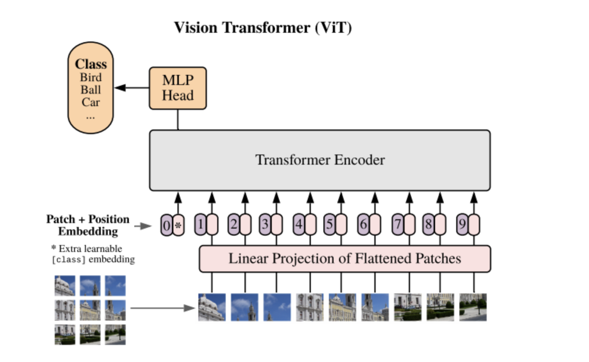
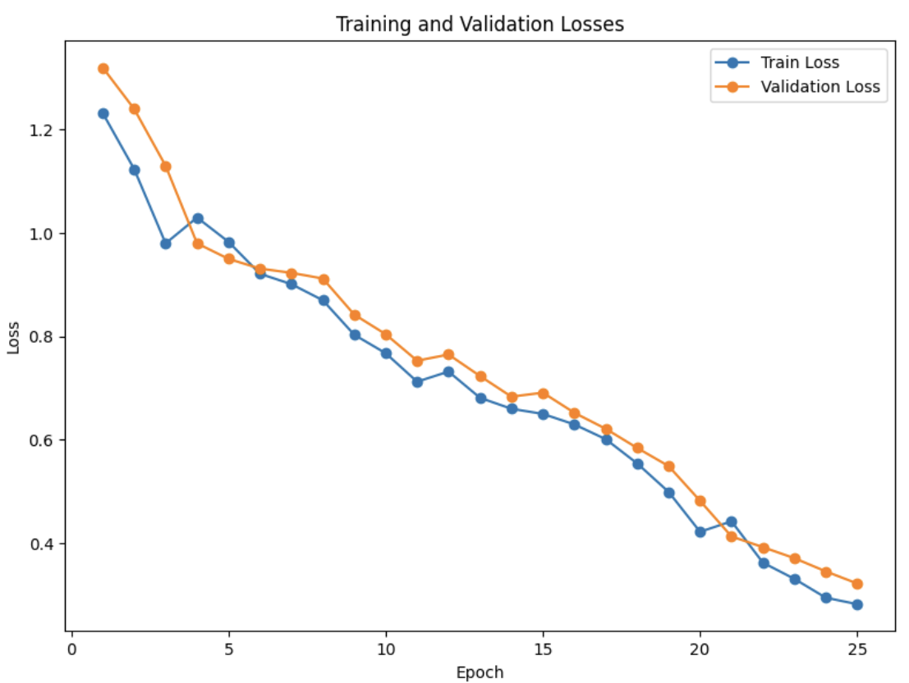
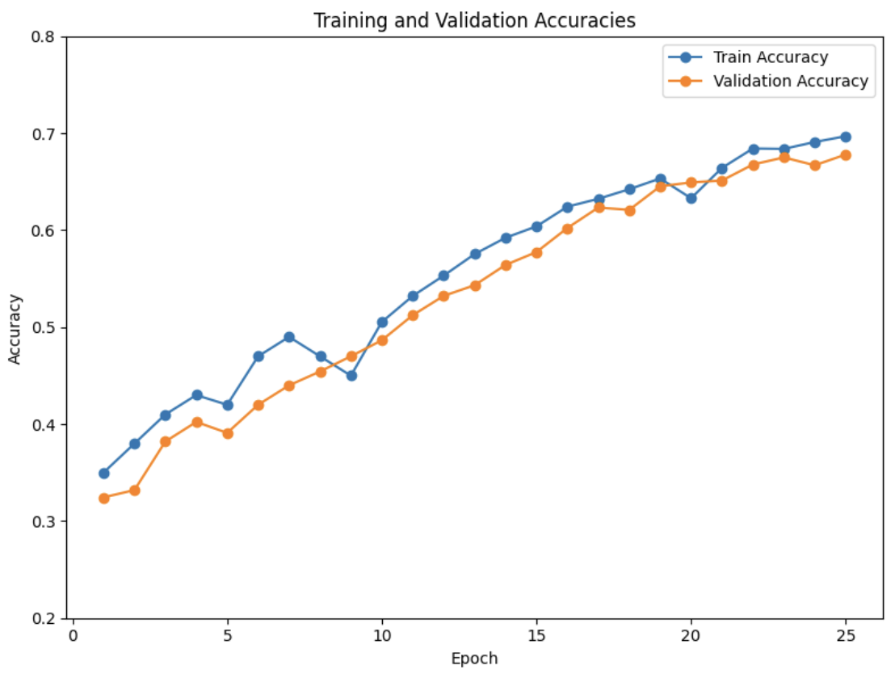

## Vision Transformer for the Classification of Alzheimer’s Disease of ADNI Dataset

### Overview/ the Problem

I have implemented a Convolutional Neural Network Vision Transformer (CViT), an adaptation of the standard Vision Transformer (ViT) approach to classify Alzheimer’s disease (normal NC and Alzheimer’s Disease AD) within the ADNI dataset. The notion of a CViT was encouraged by the CvT: Introducing Convolutions to Vision Transformers paper ([link](https://arxiv.org/abs/2103.15808)).

### Background/ Model Overview

Prior to deciding on a CNN-VIT, I thoroughly researched various aspects of transformers to understand their functionality, advantages, and limitations. This led me to the paper ‘Attention Is All You Need’ ([link](https://arxiv.org/abs/1706.03762)), a prevalent paper in the field of deep learning introducing the concept of a transformer.

This paper introduced a revolutionised way of processing sequences, by solely relying on attention mechanisms, dispensing the need for recurrent layers. As suggested by the title, the utilisation of “self-attention” enables the model to weigh the significance of different parts of an input sequence differently. It is able to capture contextual relations between elements (i.e. pixels), regardless of their position in the sequence. This contextual awareness can lead to more accurate classifications, as the model dynamically adjusts the significance it assigns to various input features based on the information it has learned. In the context of AD classification, the model focuses on crucial parts of the input data that are most indicative of the disease. It pains me to admit that this however, was not what drew my eye to this paper, but rather the fact that I shared a name with one of the authors- it’s a rare occurrence for someone named Noam.

#### Vision Transformer (ViT)

A standard ViT breaks down images into fixed-size patches and linearly embeds them as sequences of vectors. This sequence includes an additional ‘class’ token for classification tasks. These sequences are then processed, applying self-attention mechanisms as mentioned above. The output corresponding to the ‘class’ token passes through a feed-forward neural network (FFN) to predict the image’s class. ViT leverages positional embeddings to maintain the image structure information. A visualisation of the ViT articheture can be seen below. 

Whilst this model ushers numerous advantages in image processing, ViTs also yield several limitations in the context of image classification tasks:

1.	Data Efficiency- ViT work best on large, labelled datasets- outperformed by CNNs on smaller datasets
2.	Feature Localisation- ViT treats an image as a sequence of patches, losing explicit local feature representations that are innate to CNNs
3.	Computational Efficiency- self-attention mechanism in ViT computes pairwise interactions between patches (computationally expensive for high-resolution images)
4.	Fine-grained Feature Sensitivity- ViTs may overlook subtle cues due to patch-based processing (relevant in medical image context)- CNNs capture such details more robustly

Integrating CNNs into the model aims to reduce the impact of these limitations. This is achieved by:

1.	Data Efficiency- CViT model can extract hierarchical features better in lower data regimes- leverages inductive biases of CNNs that require less data to generalise well
2.	Localisation of Features- Beginning with convolutional layers, CViT maintains advantages of localised feature extraction- enables transformer part to focus on global feature relationships
3.	Computational Efficiency- CNN used to reduce spatial resolution (and thus sequence length) prior to transformer stage, making attention computations more manageable
4.	Fine-grained Feature Sensitivity- CViT utilise CNN in capturing detailed nuances and global reasoning capabilities of transformers

Merging CNNs and ViTs addresses shortcomings of ViTs by harnessing the strengths of both architectures; it integrates the hierarchal feature learning ability of CNNs with the high-level reasoning capabilities of Transformers. This aims to facilitate the robustness, versatility, and proficiency of the transformer, and hence, outperform traditional ViT or CNN architectures in isolation.

#### Convolutional Vision Transformer (CViT)

My implementation of CViT initiates with a series of convolutional layers, acting as feature extractors; segmenting input images into numerous patches and concurrently learning hierarchical features. This prepares the data for the subsequent transformer architecture, designed to capture complex dependencies and relationships between these patches, irrespective of their spatial positions in the image.

The core of this model, the transformer section, is structured into stages; each of which comprising of one or more transformer blocks. These blocks are integral in handling the model’s reasoning and analytical capabilities, and each block contains multi-head self-attention mechanisms followed by FFNs. This enables the model to focus on different facets of the data and consider various contextual relationships.

Unique to this model is the adaptive configuration of attention heads, MLP ratios, and other hyperparameters across different stages, allowing a more customised approach to learn these hierarchical representations. To ensure the model’s resilience against overfitting and facilitate more stabilised learning, the CViT employs specific regularisation techniques, including layer normalisation and dropout strategies.

The final part of the model compresses the transformer’s output, focusing on a CLS token and passes it through a linear layer that acts as a classifier. This translates the information from preceding stages into concrete predictions for

## ADNI Brain Dataset & Pre-Processing

The project utilises images from the Alzheimer’s Disease Neuroimaging Initiative (ADNI) dataset ([ADNI](https://adni.loni.usc.edu)). Each 2D, 256 x 240 pixel image is one of 20 slices from a specific patient’s scan collection.

Data pre-processing is conducted within `dataset.py`, making use of various Pytorch functionalities for streamlined and effective data handling.

#### Dataset.py
- Importing dataset from designated directories
- Constructing a structured DataFrame that organises image file paths alongside their respective labels, providing foundational mapping for subsequent stages
- Implementing patient-level split by extracting unique patient IDs from image paths; the script ensures a non-overlapping distribution of patients between training and validation sets, preserving the integrity of evaluation
- Conducting data augmentation and normalisation to enhance the robustness of the model
- Facilitating batch processing to expedite the computational process (images batched together during training)

## Training and Validation Performance 
The model was trained over 25 epochs, with hyperparameters defined in modules.py. The loss and accuracy metrics over both training and validation sets are shown in the below figures. 

The model attained an accuracy of 69.4% for the training set and 67.8% for the validation set. The accuracy (and loss) plots indicate that the discrepancy between training and validation set decreases, suggesting that the model generalises well as opposed to memorising the training data. Training the model over additional epochs is likely to further prevent over-fitting, despite attempted prevention in hyperparameters. However, this was not feasible given the additional computational cost associated in doing so. The graphs indicate some convergence, and training the model on additional epochs is expected to enhance this convergence. 

## Dependencies
- Python 3.10.12
- PyTorch 2.0.1
- torchvision 0.15.2  
- matplotlib 3.7.2
- pandas 2.0.3
- scikit-learn 1.3.0  
- Pillow (PIL) 10.0.0  

## Testing Environment
GPU access is fundamental for accelerating training and inference processing. This task made use of Google Colab Pro+'s GPU to benefit from its faster GPU and access to more memory, which are much needed for this project. 
- **Platform**: Google Colab Pro+
- **GPU**: NVIDIA GPU
- **OS**: Linux (as provided by Google Colab)

## Usage Description 
Ensure all dependencies are installed, and access to a GPU or other high-performing machine. To prepare the dataset, data loading and pre-processing is required by making use of the ADNC_Dataset class within dataset.py. Next, loading and splitting of the data via the load_data function prevents overlap between patients in the training and validation sets. Once the data is prepared, the create_data_loaders function is used to create data loaders for the training and validation sets. Once this data handling is complete, the model can be trained, using the train.py script; making use of the data loaders. The number of epochs and batch size can be specified as such --epochs 10 and --batch_size 32. Otherwise, the default is set to 2 epochs and a batch size of 16 (these were not the specifications used in training for this model). To make predictions using a pre-trained model, the predict.py script can be used, by providing the path to the image wanting to be classified. Note that the hyperparameters of the model can be adjusted using the config_params_dict as needed. That is:
  - ‘modules.py’ – contains source code for the model, and can be modified if required
  - 'dataset.py’  – can be altered to change the way in which data is pre-processed and handled. 

## References
- **ADNI dataset**:
  - Alzheimer's Disease Neuroimaging Initiative (ADNI) database. [Link](https://adni.loni.usc.edu)

- **ViT architecture image**:
  - https://github.com/google-research/vision_transformer 

- **Papers**:
  - Vaswani, A. et al. (2017). 'Attention Is All You Need'. [Link](https://arxiv.org/abs/1706.03762)
  - Wu, Z. et al. (2021). 'CvT: Introducing Convolutions to Vision Transformers'. [Link](https://arxiv.org/abs/2103.15808)

- **Model & Configuration**:
  - Convolutional Vision Transformer (CvT) - used for hyperparameters. [HuggingFace Documentation](https://huggingface.co/docs/transformers/model_doc/cvt#transformers.CvtConfig.embed_dim)
  - Note: above shows use of pre-trained model

## License
This project is licensed under the terms of the MIT license.