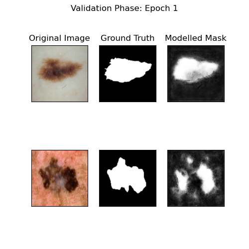
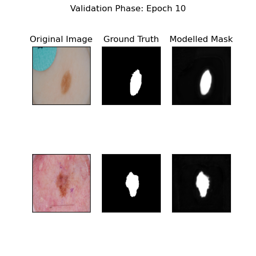
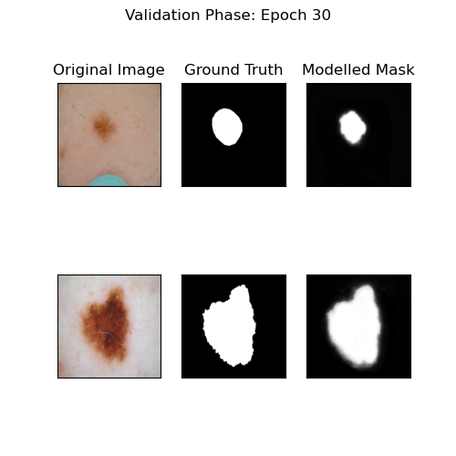
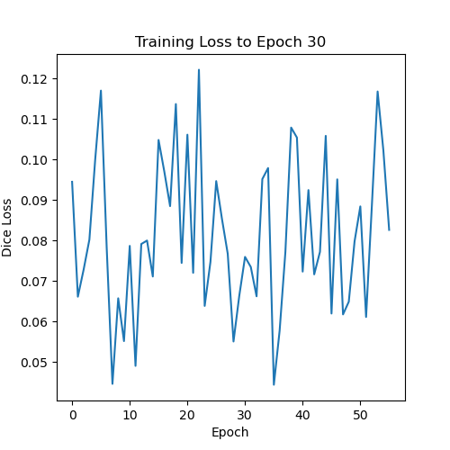
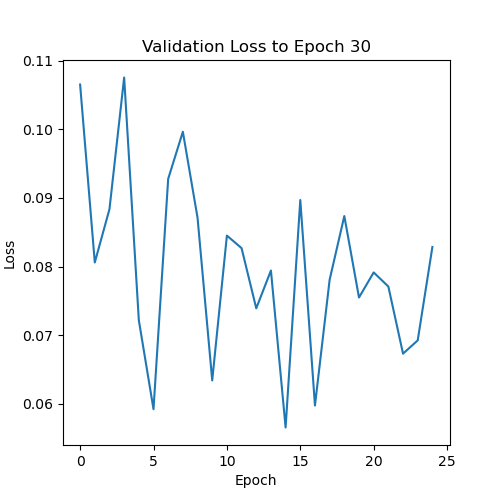

# Improved UNet with the ISIC Dataset
## Daniel Kasumagic - s4742286

##  Description
### Design Task
The convolutional neural network (CNN) developed for Task 1 is the Improved UNet, which for the duration of the report is called IUNet. This implementation was fitted specially for the ISIC2018 Dataset, which is an image dataset depicting lesions on the skin. The task is to use the IUNet to craft segmentation masks of the ISIC dataset, and achieve a Dice Co-efficient that is greater than 0.8.

### Model Overview
![Figure 1: Improved UNet Architecture [^1]](UNetArchitecture.png)

As seen above in Figure 1, this specific implementation was designed both for RGB images of 256x256 pixels and binary masks images of the same size. The purpose of the localization pathway is to move contextual information encoded at a low spatial resolution to a higher spatial resolution through the application of features from lower layers of the network. To accomplish this, the low resolution feature maps are first upsampled using a straightforward upscale method that duplicates the feature voxels twice in each spatial dimension. This is followed by a 3x3 convolution that reduces the number of feature maps in half. Next, we use concatenation to recombine the upsampled features with the features from the matching level of the context aggregation pathway. A localization module then recombines these features after concatenation. In order to further reduce memory consumption, it also further reduces the amount of feature maps. A 1x1x1 convolution, which reduces the number of feature maps in half, comes after a 3x3x3 convolution in a localization module. By integrating segmentation layers at various network levels and merging them via elementwise summing to create the final network output, we use deep supervision in the localization pathway. For all feature map calculating convolutions, we employ leaky ReLU nonlinearities with a negative slope of 10−2. Instance normalisation instead of batch normalisation was also used to improve stochasticity of the model [^1].

### Aims and Objectives
The principal aim of this task was to use IUNet to conduct segmentation on images from the ISIC2018 dataset and produce masks that isolated lesions from healthy skin, which would aid in medical imaging software and the medical industry. 

### Training Procedure
By using a loss function that utilises the dice co-efficient, we can measure loss in the same way we measure overlap between 2 sets, which is helpful when calculating the similarity between 2 segmentation masks. 

## Dependencies
### Pytorch
Pytorch 2.1.0 is the version this project was built on.

### Dataset
Uses the ISIC2018 dataset, which can be found [here](https://challenge.isic-archive.com/data/#2018), though we used a downsampled version of only 16000 images.

### Hardware
GPUs are necessary to receive results in a reasonable amount of time. 30 epochs of a large dataset with a large number of convolutional layers results in a time of `TIME` with a100 GPUs.

## Results
### Data Preprocessing
Functions related to data preprocessing are located in `dataset.py`. The `CustomISICDataset` takes in 1 or 2 directories of ISIC images and transforms them according to the `transform` function, also in `dataset.py`. 

### Example Inputs and Outputs
Upon training for a certain number of epochs, we show progress by plotting out some examples. In Epoch 1, we see this.

We can clearly see the beginnings of the model training, with the model picking out the easy elliptical lesion, but not the difficult fragmented one. Along with the fuzzy edges, it still has a long way to go.
In Epoch 10,

We can clearly see the mask take more of a shape as the fuzzy outlines go away and retrieve a sharper mask.
And in Epoch 30,

We can clearly see an appropriate segmentation mask for the task. More grouped result comparisons can be seen in the `predictoutputs` folder. As can be seen, the model does converge to make a very accurate segmentation mask.

### Training Results (Epoch vs Loss)
We had 2 loss graphs, one for training and one for validation. 
Across the entire epoch timeline, the training loss graph is

We can clearly see that the dice loss stays below 0.2 for most of the phase, which indicates that the model is doing a very good job in predicating the segmentation mask.

The validation loss graph as calculated during the phase is

The loss in the validation phase was even less noticeable, with the model clearly able to stay below 0.15.

For every 5 epochs, the loss graph was also calculated and can be viewed in the `outputs` file. The x-axis in these files was not appropriately adjusted but still provides meaningful insights into the loss of the phase during that epoch.

Utilising the final model in `predict.py`, the overall dice_score of a random sample is revealed to be 0.9917987585067749, which would indicate that the model is extremely accurate. And indeed, as can be seen in the `predictoutputs` folder, it never highlights any artifacts and traces the lesion very well.

## Reproducibility
### Hyperparameters
We used a learning rate of 10-4, which was considered small enough we were not at risk of jumping over minima in the problem. A batch size of 32 was also used, and 30 epochs was used to ascertain the reliability of the model.
### Optimiser
The Adam optimizer varies the network weights accordingly. The learning decay option was not selected as training convergence was not considered an issue.
### Problems and Potential Improvements
The segmentation masks produced never quite get rid of the fuzziness around the edges. Since the segmentation masks are between 0 and 1, a fix could be rounding up, which comes with the risk of identifying regular skin as lesion, or rounding down, which runs the risk of not identifying the full lesion. For medical professionals, the former would be ideal, as getting rid of dangerous lesions is more important than keeping healthy skin.

Even though IUNet may generate very good first segmentations, more processing steps are frequently required to improve the outcomes and eliminate false positives. The segmentation pipeline becomes more intricate as a result, which could increase processing power, dangerous especially in a situation where real-time accurate processing is imperative.

This IUNet may struggle to find proper segmentation masks of people with different skin colours, as the vast majority of most samples are of caucausian descent. This may impact minorities unfairly in a medical setting, which can be fixed with mroe diversified data.
## References
[^1]: Isensee, F., Kickingereder, P., Wick, W., Bendszus, M., & Maier-Hein, K. H. (2018). Brain Tumor Segmentation and Radiomics Survival Prediction:     
  Contribution to the BRaTS 2017 Challenge. doi:10.48550/arXiv.1802.10508

