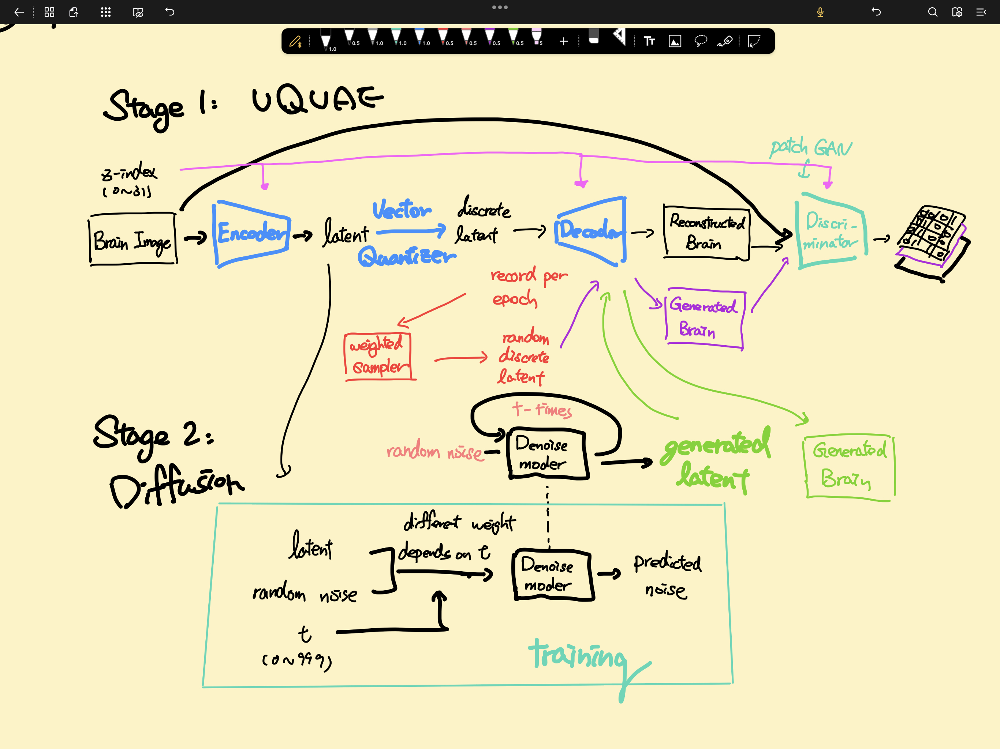

Stable Diffusion & VQVAE on OASIS 
===

# Project Overview

## Files

### Non-Script
* `model_ckpt\*`: models' checkpoints.
* `log\*`: training log. (Can use `logger.py` to visualize it.)
* `*_vis\*`: visualization of images when training.
* `playground`: we write some code to figure out some algorithms.
* `README.md / report.pdf`: The file you current see.
* `tech_note.md / tech_node.pdf`: The main algorithm I used.

### Common
* `util.py`: useful function, such as ssim, positional encoding.
* `module.py`: useful network module, such as resblock.
* `dataset.py`: get dataset from given folder.
* `logger.py`: script that can check the training log.

### First Stage
* `model_VAE.py`: `VAE` and `VQVAE` model for first stage.
* `model_discriminator.py`: The GAN part when training `VAE` or `VQVAE`.
* `prestage_train.py`: Training Script for first stage.

### Second Stage
* `latent_dataset.py`: Collect the latent data given an first stage mode.
* `pixelCNN.ipynb`: Do pixelCNN (here we use transformer) when random generation from VQVAE model.
* `model_diffusion.py`: The model of stable diffusion. It's UNet.
* `stable_diffusion.py`: Do stable diffusion when random generation from `VQVAE` or `VAE` model.
* `diffusion_visualize.py`: Generate the image through diffusion process.

### About dataset & SSIM Score
* We trained our VQVAE on the train and validate dataset provided by the OASIS dataset. Then, we tested the SSIM score on the test dataset, which yielded a score of approximately 0.78 to 0.79.
  * It's important to note that the SSIM settings, such as the window size, are configured in the same way as those described on Wikipedia.
* In the second stage, we employed the entire dataset as the training data to train the LDM (Latent Diffusion Model) in the stable diffusion framework. This allowed us to generate images from random noise.
* Furthermore, we also used a transformer and treated as PixelCNN to randomly generate brain images.

## Run

1. Requirements
```python
einops==0.6.1
torch==1.11.0+cu113
torchvision==0.12.0+cu113
tqdm==4.66.1
Pillow==9.0.1
numpy==1.22.2
matplotlib==3.5.1
imageio==2.22.4
```
2. Change dataset, which is in `__init__` in `dataset.py`
3. For first stage
   1. run `prestage_train.py`. You can select the mode among `VAE` and `VQVAE` in `line 27` in this script.
4. For second stage
   1. Choose which first stage model you use and run `latent_dataset.py`. This script will collect latent data.
   2. Choose which first stage model you use and run `stable_diffusion.py`. 
      1. If you want to use Transformer-like PixelCNN, you can run `pixelCNN.ipynb`

## Results

#### VQVAE Reconstruction on Test (idx=441)


#### VQVAE + Random Generation


#### VQVAE + VisionTransformer (PixelCNN like)


#### VQVAE + Stable Diffusion


> Diffusion Process through T

## Diffusion Process GIF

## Algorithm Overview

1. I've applied VAE/VQVAE to the OASIS dataset, achieving a high SSIM score of approximately 0.78.
Here's your description with improved grammar:

2. In the first stage of training, which involves training an autoencoder on the OASIS dataset, I have explored several enhancements:
   1. Introduced a GAN component to improve image reconstruction clarity (VAEGAN).
   2. Utilized a transformer to predict the latent space (VQGAN).
   3. Integrated an auxiliary loss to train the decoder (or generator) using random latent vectors as input due to the limited dataset availability.
   4. Employed the z-index of brain data as a conditioning factor to teach the model how to generate images with specific conditions (Pix2pix or conditional GAN).
   5. Implemented a cyclical annealing schedule for VAE to prevent mode collapse.
   6. For VQVAE, I employed a weighted sampler to sample the discrete latent space and used it to train the decoder and discriminator within the sampled space.

7. After training the VQVAE, I applied DDPM (Denoising Diffusion Probabilistic Models) to the latent space, which is the core idea behind stable diffusion.
   * Note that stable diffusion comprises with two key contributions: DDPM on the latent space and cross-attention across different modalities. However, since the OASIS dataset lacks of other conditions, we did not implement cross-attention in this repository.

## Total Flow Chart


> Oops, I mis-drew this workflow. The generated latent should pass through the vector quantizer.

The main concepts and related workds are in `tech_note.md`
