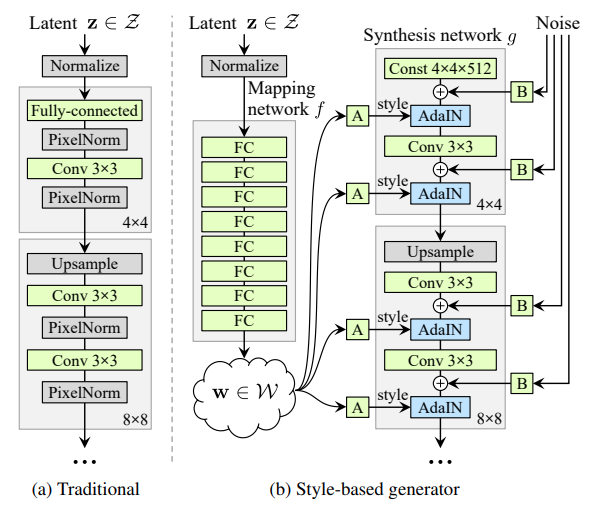
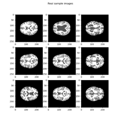
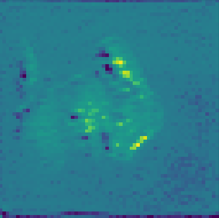

# Pattern Analysis - StyleGAN
A StyleGAN is a improved implementation of a standard GAN model, which was made by NVIDIA to offer an improved method of generating faces using a deep neural network.
Traditional GAN's function as seen in (a) in the figure below, through starting with a latent vector z, and using transposed convolution layers to scale up the image to a generated image. Then with this generated image, a separate network, the discriminator,
will be trained to distinguish between the generated images and real images from a dataset. The better the discriminator performs, the higher the generator's loss is.
This same principle is applied to the StyleGAN however instead of a linear sequential model, it instead has different networks working in conjunction to build a combined synthesis network.

The below figure (b) shows the structure of the StyleGAN, the networks denoted "A" are learned affine transforms that map the w vector to the Adaptive Instance Normalization (ADaIN) layer by applying weights and biases to the values in the w-vector.
The Mapping network is a sequential linear network that maps the z-vector latent space to the w-vector to be fed into the ADaIN layers.
The networks denoted "B" are learned scalars for the injected noise applied to the network, which then is added to the output of the convolution layers.
This diagram is followed to then transform the 4x4 constant image with 512 channels (or any other pre-defined size) to the desired size and number of channels for the final image.

INSTRUCTIONS TO RUN:

To run the network and produce images, run main.py with line 11 (load_image()) uncommented, similarly to train the model, run main.py with line 10 (train_model()) uncommented.

Example training data:

Example output:

