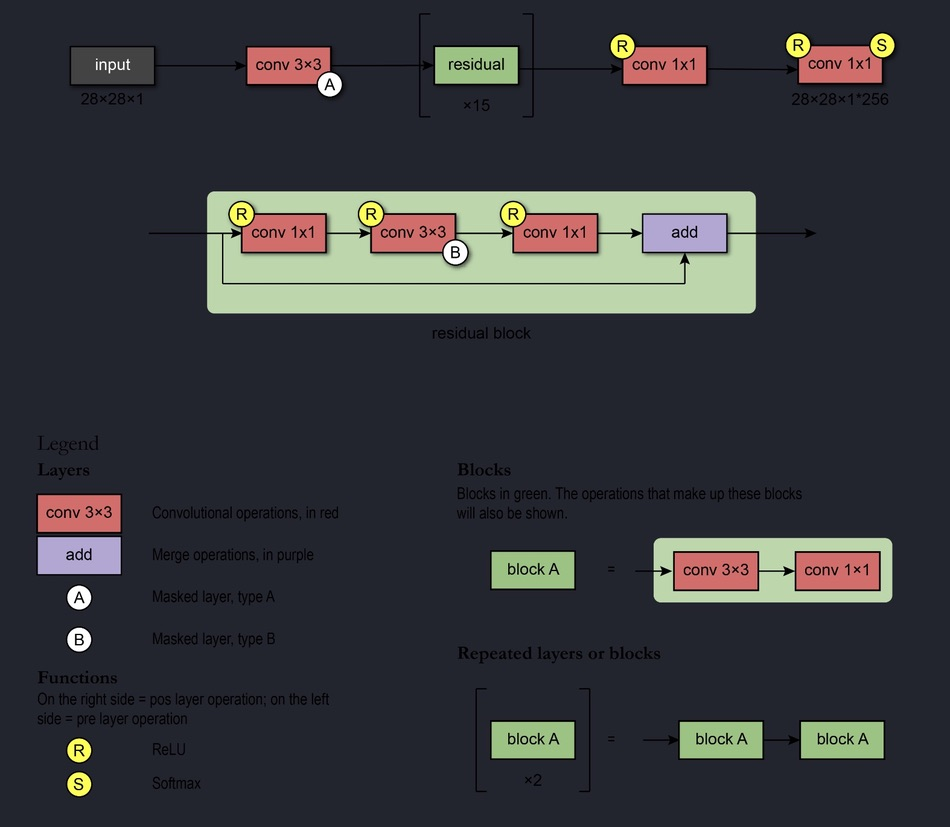

# COMP3710 Report - VQ-VAE (Brain MRI)
---
# Table of Contents

- [**Introduction**](#introduction)
- [**Dataset**](#dataset)
  - [Training, Testing, and Validation Splits](#dataset)
  - [Image Specifications](#dataset)
  - [Dataset Samples](#dataset)
- [**Model Definitions**](#model-definitions)
  - [**VQ-VAE**](#vq-vae)
    - [VQ-VAE Architecture](#vq-vae)
    - [VQ-VAE Framework](#vq-vae)
    - [Description and Components](#vq-vae)
    - [Loss Mechanisms](#vq-vae)
    - [Pseudocode](#vq-vae)
  - [**PixelCNN**](#pixelcnn)
    - [PixelCNN Architecture](#pixelcnn)
    - [How it Works](#pixelcnn)
    - [The Loss Mechanism](#pixelcnn)
- [**Visualization**](#visualization)
  - [Sample Output Images](#visualization)
  - [Training Progress GIFs](#visualization)
- [**Training Insights**](#training-insights)
  - [Overview of Metrics](#training-insights)
  - [Graphs and Observations](#training-insights)
- [**Scope of Improvement**](#scope-of-improvement)
  - [Model Architecture Enhancements](#scope-of-improvement)
  - [Hyperparameter Tuning](#scope-of-improvement)
  - [Data Augmentation](#scope-of-improvement)
  - [And more...](#scope-of-improvement)
- [**Future Roadmap**](#future-roadmap)
- [**Dependencies**](#dependencies)
- [**Directory Structure**](#directory-structure)
- [**Usage**](#usage)
  - [Mounting Google Drive](#usage)
  - [Path Set-up](#usage)
  - [Running the Main Function](#usage)
- [**Training**](#training)
- [**Prediction with Optional Pre-trained Model**](#prediction-with-optional-pre-trained-model)
- [**Output**](#output)
- [**References**](#references)


# VQ-VAE with PixelCNN for Oasis Brain MRI Image Reconstruction and Generation

## Introduction

This project explores the use of Vector Quantized Variational Autoencoders (VQ-VAE) combined with PixelCNN for the purpose of brain image reconstruction and generation. The code demonstrates the complete pipeline, starting from dataset loading and preprocessing, to model training, and finally visualization of results.

## Dataset

The dataset consists of brain slice images. The data is zipped and stored in Google Drive, but can be easily extracted and processed for use in the project. 

The dataset is split into:
- Training: 9664 images
- Testing: 544 images
- Validation: 1120 images

Each image is of shape 128x128.


## Model Definitions

### VQ-VAE

#### VQ-VAE Architecture


#### VQ-VAE Framework


VQ-VAE is used for the compression of brain images. It comprises three main components: an encoder, a vector quantizer, and a decoder. The encoder maps input images to a continuous representation, which is then quantized by the vector quantizer. The quantized representation is finally mapped back to the original image space using the decoder.

When we talk about the loss in the VQ-VAE model, it's a blend of three primary components:

1. **Total Loss**: This is like the grand total on a bill. It combines the losses from the vector-quantization layer and the image reconstructions.
2. **Vector Quantization (VQ) Loss**: This is further split into two parts:
    - **Commitment Loss**: This ensures that the encoder remains loyal to a particular codebook. It's essential because while our encoder learns pretty quickly,
      our codebook takes its sweet time. The commitment loss is like a gentle nudge to ensure they remain in sync. We also introduce a scaling factor, termed as the beta parameter.
      Even though the original VQ-VAE paper mentioned that the model is sturdy against changes in this parameter, it still plays a role in the commitment.
    - **Codebook Loss**: This is simply the L2-norm error, which nudges our embedding or codebook vectors to align better with the encoder's output.
3. **Reconstruction Loss**: At the end of the day, we want our reconstructed image to resemble the original. This loss measures how well we're doing in that aspect.

   The formula for the total loss can be represented as:

**Total Loss** = Reconstruction Loss + VQ Loss

Where:

**VQ Loss** = Commitment Loss + Codebook Loss

### Pseudocode
```
INITIALIZE necessary libraries
SET device, paths, and directories

DEFINE BrainSlicesDataset:
    INITIALIZE with image slices
    DEFINE methods to get length and item

DEFINE function to load and extract image slices
DEFINE function to retrieve image slices and provide summary

DEFINE VectorQuantizer class:
    INITIALIZE embeddings and parameters
    FORWARD function to perform quantization and compute loss

DEFINE Encoder class:
    INITIALIZE encoder neural network
    FORWARD function to encode input

DEFINE Decoder class:
    INITIALIZE decoder neural network
    FORWARD function to decode input

DEFINE VQVAE class:
    INITIALIZE encoder, vector quantizer, and decoder
    FORWARD function to perform end-to-end VQ-VAE processing

DEFINE VQVAETrainer class:
    INITIALIZE VQ-VAE model
    FORWARD function to compute losses and perform reconstruction

DEFINE PixelConvLayer class:
    INITIALIZE convolutional layer with mask
    FORWARD function to apply masked convolution
    CREATE mask based on mask type

DEFINE PixelCNN class:
    INITIALIZE layers for PixelCNN
    FORWARD function for end-to-end PixelCNN processing

DEFINE training functions:
    TRAIN VQ-VAE
        LOOP through epochs:
            FORWARD pass through VQ-VAE
            COMPUTE losses
            BACKWARD pass
            UPDATE model weights
        VISUALIZE results after each epoch
    TRAIN PixelCNN
        LOOP through epochs:
            FORWARD pass through PixelCNN
            COMPUTE loss
            BACKWARD pass
            UPDATE model weights

DEFINE visualization functions:
    VISUALIZE original vs reconstructed images
    VISUALIZE samples generated by PixelCNN
    COMPARE original with PixelCNN generated image

MAIN function:
    LOAD brain slice images
    INITIALIZE and TRAIN VQ-VAE
    INITIALIZE and TRAIN PixelCNN
    VISUALIZE results using the trained models

EXECUTE main function
```

### PixelCNN
PixelCNN is like an artist with a paintbrush, creating images one pixel at a time. It's a generative model that cleverly utilizes convolutional and residual blocks. 
The idea is to compute the distribution of prior pixels to guess the next pixel.



**How it Works:**
1. **Initial Convolution**: The input image is passed through a convolutional layer.
   This process is a bit like using a magnifying glass to inspect the image, where the "receptive fields" help the model learn features for all the pixels simultaneously.
   But there's a catch! We use masks, termed 'A' and 'B', to ensure that we're not "cheating" by looking at pixels we shouldn't.
   The 'A' mask restricts connections to only the pixels we've already predicted, while the 'B' mask allows connections only from predicted pixels to the current ones.
   
2. **Residual Blocks**: After the initial convolution, the data flows through residual blocks.
   These blocks are smart! Instead of trying to learn the output directly, they focus on learning the difference (or residuals) between the expected output and the current one.
   This is achieved by creating shortcuts (or skip connections) between layers.

### The Loss Mechanism:
For PixelCNN, the loss metric used is the Sparse Categorical Crossentropy loss. This quantifies the error in selecting the right latent vectors (or pages from our codebook) for image generation.
PixelCNN is a generative model trained to predict the next pixel's value in an image given all the previous pixels. It's employed post-VQ-VAE training to refine the generated images, making them more realistic.

## Visualization

Functions are provided to visualize the reconstructions made by the VQ-VAE, as well as images generated by the PixelCNN. This includes side-by-side comparisons of original and reconstructed/generated images, histograms of encoding indices, and various loss plots.

#### Sample Output Image
Output at epoch = 2
  

Output at epoch = 30


#### Training Progress
     

## Training Insights

The training phase of the project was critical. The VQ-VAE's loss and the PixelCNN's loss provided insights into how well the models were learning and reconstructing the brain images. Additionally, metrics like perplexity gave a deeper understanding of the model's predictive distribution in comparison to the actual data distribution. 

From the data provided:
- **Reconstruction Loss** - This measures how well the reconstructed output matches the original input. A lower reconstruction loss indicates that the VQ-VAE is able to more accurately reproduce the original images from its encoded representations.
- **VQ Loss** - Vector Quantization (VQ) loss measures the difference between the encoder's output and the nearest embedding from the codebook. It ensures that the continuous representations from the encoder are effectively quantized to discrete values.
- **Perplexity** - Perplexity provides insights into the diversity of the embeddings being used. A higher perplexity indicates that more embeddings from the codebook are being actively used.
  
1. **Reconstruction Loss:**
   
This graph showcases the reconstruction loss over epochs. The reconstruction loss quantifies how well the reconstructed output from the VQ-VAE matches the original input. A lower value of this loss indicates that the VQ-VAE is effectively reproducing the original images from its encoded representations.


#### Observations:

The reconstruction loss demonstrates a declining trend, which suggests that as the training progresses, the model becomes better at reconstructing the input data.
This is expected behavior during training as the model adapts its weights and biases to minimize the difference between the original input and the reconstructed output.

2. **VQ Loss:**
   
This graph depicts the vector quantization (VQ) loss over epochs. The VQ loss measures the discrepancy between the encoder's output and the nearest embedding from the codebook. It ensures that the continuous representations from the encoder are effectively transformed to discrete values that can be looked up in the codebook.


#### Observations:

The VQ loss also displays a general decreasing trend, albeit with some fluctuations. This indicates that, over time, the encoder's outputs are getting closer to the codebook embeddings, ensuring effective quantization.
The fluctuations might suggest that the model is exploring different parts of the latent space during training.

3. **Perplexity:**
   
This graph illustrates the perplexity over epochs. Perplexity offers insights into the diversity of the embeddings being used. A higher perplexity indicates that a wider range of embeddings from the codebook is being actively utilized.


#### Observations:

The perplexity seems to rise initially and then stabilizes, which implies that as the model trains, it starts using a broader variety of embeddings from the codebook.
The stabilization of perplexity suggests that the model has reached a point where it consistently uses a certain number of embeddings from the codebook for representation.
Overall, these graphs provide insights into the training dynamics of the VQ-VAE model. The decreasing reconstruction and VQ losses indicate that the model is learning effectively. The behavior of perplexity suggests that the model is leveraging a diverse set of embeddings from the codebook for representation, which is a good sign of a well-trained model.

# Scope of Improvement
- **Model Architecture Enhancements**: The current architecture can be improved by adding more convolutional layers or integrating techniques like batch normalization to stabilize and accelerate the training process.

- **Hyperparameter Tuning**: There's always room to experiment with hyperparameters such as learning rate, batch size, and the number of epochs. Automated hyperparameter optimization tools like Optuna or Ray Tune can be used for this purpose.

- **Data Augmentation**: Introducing data augmentation can help in enhancing the diversity of the training dataset, leading to better generalization during reconstruction.

- **Loss Function Refinements**: Modifying the loss function or incorporating additional loss terms can lead to better reconstructions or faster training.

- **Integration with other GANs**: The current setup can be integrated with other Generative Adversarial Networks (GANs) to improve the quality of generated images.

- **Code Optimization**: From a coding perspective, some parts of the code can be modularized further, making it easier for community contributions and extensions.

- **Parallel Processing**: Leveraging GPU parallel processing capabilities more efficiently can reduce the training time.

- **Regularization**: Implementing dropout or other regularization techniques might improve the model's robustness and prevent overfitting.

- **Evaluation Metrics**: Incorporating additional evaluation metrics can give a clearer picture of the model's performance, such as PSNR or MAE for reconstruction tasks.

- **Model Interpretability**: Leveraging tools like TensorBoard or integrating modules to visualize the intermediate activations and embeddings can help in understanding and debugging the model better.

### Future Roadmap
1. **Integration with Advanced GANs**: Explore the integration of VQ-VAE with advanced Generative Adversarial Networks like CycleGAN or BigGAN for improved image synthesis.
2. **Expand Dataset**: Incorporate more diverse brain images, possibly from different imaging techniques.
3. **Model Pruning and Optimization**: Aim to make the model lighter while retaining its performance, making it suitable for real-time applications.
4. **Deploy on Edge Devices**: With optimized models, plan to deploy the VQ-VAE on edge devices for real-time brain image processing.


## Dependencies

The list of dependencies required for this implementation are as follows:
```
- Python
- PyTorch
- NumPy
- PIL
- Matplotlib
- scikit-image
- prettytable
- Google Colab utilities (for mounting drive)
```
## Directory Structure

```
 /content/GAN_Dataset/

   |-- keras_png_slices_train/

   |-- keras_png_slices_test/

   |-- keras_png_slices_validate/
```
  
## Usage

To use the code:
1. Mount Google Drive (specific to Google Colab).
2. Set the path for the output directory and dataset zip file.
3. Run the main function to start the training and visualization process.

## Training
To train the model based on the VQ-VAE architecture:
Two main training functions are present: one for the VQ-VAE and the other for the PixelCNN. The VQ-VAE training involves both reconstruction loss and vector quantization loss. 
After VQ-VAE training, the PixelCNN is trained to refine the outputs further.

```
$ python3 train.py
```
## Prediction with Optional Pre-trained Model
If preferable different VQ-VAE Model can be used, add an optional -m command to load a prebuilt VQ-VAE model. Ensure the folder containing the **VQ-VAE** model is labeled** "VQVAE_Model"**. 
If model is not set up correctly or the system is unable to load it, the script will use the default model.

```
$ python3 predict.py [-m <PathToPreBuiltVQVAEModel>]
```
## Output

The output consists of various visualizations showcasing original vs. reconstructed/generated images, histograms of encoding indices, and loss plots.

Sample Outputs during training:
  
## References

1. [Papers with Code. (n.d.). VQ-VAE Explained.](https://paperswithcode.com/method/vq-vae)
  
2. [Keras. (n.d.). Vector-Quantized Variational Autoencoders.](https://keras.io/examples/generative/vq_vae/)

3. [GitHub. (2023, February 15). PyTorch implementation of VQ-VAE-2 from "Generating Diverse High-Fidelity Images with VQ-VAE-2".](https://github.com/topics/vq-vae)

4. [Stack Overflow. (n.d.). Implementation of VQ-VAE-2 paper.](https://stackoverflow.com/questions/55125010/implementation-of-vq-vae-2-paper)

5. [van den Oord, A., et al. (n.d.). Neural Discrete Representation Learning. arXiv.](https://arxiv.org/abs/1711.00937)

6. [Royer, A. (n.d.). VQ-VAE Implementation in Keras / Tensorflow. Amélie Royer.](https://ameroyer.github.io/research/2019/08/28/VQ-VAE.html)

