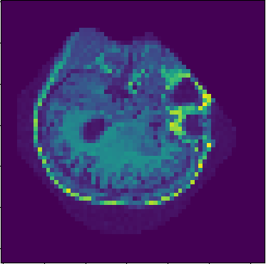

# **StyleGAN for OASIS Brain Dataset**

## Overview

Welcome to the StyleGAN project designed to generate "reasonably clear images" from the OASIS brain dataset. This model is a powerful implementation of the cutting-edge Generative Adversarial Network (GAN) architecture. This project goes beyond the basics of GANs and includes several innovative features to enhance the image generation process.

## Key Model Features

The StyleGAN for the OASIS brain dataset boasts a range of advanced features:

### 1. Progressive Training

Progressive training is a fundamental aspect of our model. It starts with low-resolution images (4x4) and gradually increases the resolution by adding new layers. This approach not only accelerates the training process but also ensures stability. The progressive training technique is supported by both the generator and discriminator and implemented in the train.py file.

### 2. Adaptive Instance Normalization (AdaIN)

I've implemented AdaIN to normalise the style feature of our generator. This feature allows us to effectively modulate and manipulate generated images based on the style factor 'w.' The AdIN class in the modules.py file is responsible for this technique.

### 3. Stochastic Variation with Noise Inputs

I've introduced stochastic variation through scale/resolution-specific Gaussian noises to add depth and fine-grained details to our generated images. The injectNoise class in the modules.py file handles this feature. The learnable scaling factor ensures that specific details, such as hair and freckles, are faithfully represented.

### 4. Weight-scaled Convolution

My model employs weight-scaled convolution to ensure the stability of the training process. This technique involves normalising the weights of convolutional layers based on input channels and kernel size. The WSConv2d class in the modules.py file is responsible for this weight scaling. It's important to note that this feature is applied to both the generator and discriminator, ensuring consistent results.

### 5. Spectral Normalization

In addition to weight scaling, our model incorporates spectral normalisation to enhance training stability further. Spectral normalisation is applied to the discriminator's layers to help maintain equilibrium during the adversarial training process.

### 6. Self-Attention Mechanism

To capture long-range dependencies in images, I've introduced a self-attention mechanism within our model. This component allows the generator to focus on essential image regions, resulting in higher-quality outputs.

### 7. Conditional Generation

Our StyleGAN model supports conditional image generation. By providing additional input, you can control the characteristics of the generated images, allowing for greater flexibility and customisation.
 

Fig 1: Shows the original demonstration of the Style-Based generator [1]

## OASIS Brain MRI input Images

The foundation of our StyleGAN project is the OASIS dataset, comprising tens of thousands of meticulously collected brain MRI images. This dataset serves as the primary input for our image generation model. The pre-processed data used in this project was obtained from the provided download links on the University of Queensland's (UQ) Blackboard platform, ensuring data consistency and quality for our research.

Fig 2: My input data set preview that can be generated by running “dataset.py”
Training Dynamics

## Training Dynamics

Within our model training process, the dynamics are crucial in achieving the desired image generation quality. The losses for both the generator and discriminator are computed following a structured approach:

_Loss Calculation for the Generator:_

For the generator, loss calculation centres on the discriminator's assessment of the fake images it generates. The goal here is to create images that deceive the discriminator, and the loss quantifies the success of this deception.

_Discriminator Loss in the Wasserstein GAN (WGAN) Framework:_
Our approach adheres to the Wasserstein GAN (WGAN) training framework, known for its stability and superior training dynamics. The discriminator's loss comprises several components:

_Negative Score Differential:_
The discriminator's loss primarily focuses on the negative difference between the scores assigned by the discriminator to real and fake images. This negative loss function is optimised within PyTorch's framework, effectively maximising the discriminator's scores for real images while minimising those for fake images. This core concept aligns with the WGAN training strategy.

_Incorporating Gradient Penalty:_ To enhance stability and convergence, we introduce a gradient penalty, which is scaled by a hyperparameter, lambda. This regularisation technique ensures smoother training dynamics, alleviating issues like mode collapse.

_Regularisation Component:_ An additional regularisation term, grounded in the square of the scores assigned by the discriminator to real images, adds to the model's overall regularisation. This enhances the model's consistency in producing high-quality images.

The combination of these elements in the discriminator's loss function maintains a training process that adheres to the WGAN principles, fostering stability and effectiveness for both the generator and discriminator.

This well-structured approach assures that our model progressively refines its ability to generate clear and lifelike images throughout the training journey.

