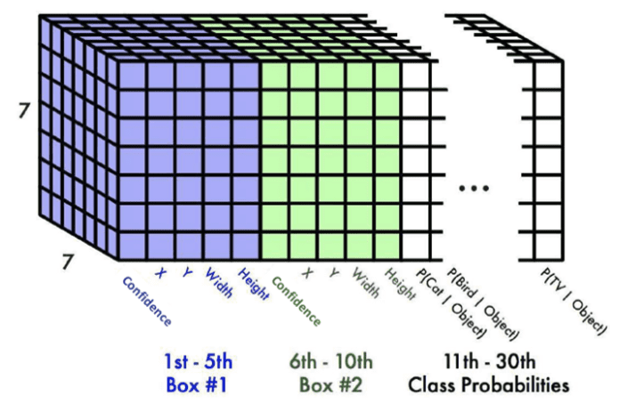

## Lesion detection and classification using YOLOV7 on the ISIC2017 dataset

### Table of Contents
- [Lesion detection and classification using YOLOV7 on the ISIC2017 dataset](#lesion-detection-and-classification-using-yolov7-on-the-isic2017-dataset)
  - [Table of Contents](#table-of-contents)
  - [Installation](#installation)
- [Dataset](#dataset)
  - [Overview](#overview)
  - [Preprocessing](#preprocessing)
  - [Usage](#usage)
  - [Model Architecture: open source YOLOV7 Model](#model-architecture-open-source-yolov7-model)
    - [Core ideas used in the YOLOV1 paper:](#core-ideas-used-in-the-yolov1-paper)
  - [Output](#output)
  - [Training](#training)
  - [Results](#results)
    - [Confusion Matrix](#confusion-matrix)
  - [F1 - curve](#f1---curve)
  - [Precision - Recall curve](#precision---recall-curve)


### Installation
- Prerequisites: python=3.10.12 && cuda=11.7

**A GPU cluster is used for this project, more specifically rangpur @ UQ. Therefore a lot of the training and inference scripts are based on slurm jobs. If needed this can easily be converted to run locally.**

```
git clone git@github.com:larsmoan/PatternAnalysis-2023.git
git submodule init 
git submodule update
pip install -r requirements.txt
```

## Dataset
**Source**: [ISIC 2017 Dataset](https://challenge.isic-archive.com/data/#2017)

### Overview
Each image comes with corresponding label and segmentation file highlighting the lesion.
- **Training Set**: 
  - 2000 images.
  
- **Validation Set**: 
  - 600 images.
  
- **Test Set**: 
  - 150 images.

**Lesion Classes**:
- `Melanoma`
- `Seborrheic Keratosis`
- `Nevi / Uknown`: Technically known as a benign skin lesion. Commonly referred to as a mole.


### Preprocessing
Given that the dataset provides segmentation files, there's a need for preprocessing to convert these labels into YOLO bounding box labels. 

Steps include:
1. Identify the maximum and minimum coordinates within the segmentation area.
2. Fit a bounding box around this region.
3. Assign the class based on the label provided in the associated CSV file.

More information can be found in the file: [dataset_utils.py](./dataset_utils.py)

The dataset itself also needs to be refactored a bit to work with YOLOV7, therefore the structure is changed to the following:
```
dataset/
│
├── train/
│   ├── img_1.jpg
│   ├── ...
│   ├── img_n.jpg
│   ├── img_1.txt
│   ├── ...
│   └── img_n.txt
│
├── val/
│   ├── img_1.jpg
│   ├── ...
│   ├── img_n.jpg
│   ├── img_1.txt
│   ├── ...
│   └── img_n.txt
│
└── test/
    ├── img_1.jpg
    ├── ...
    ├── img_n.jpg
    ├── img_1.txt
    ├── ...
    └── img_n.txt
```

The prepocessed dataset can be downloaded from this link:
https://drive.google.com/uc?id=1YI3pwanX35i7NCIxKnfXBozXiyQZcGbL or from [dataset_utils.py](./dataset_utils.py)


### Usage
- Download the dataset and pretrained yolov7 weights:
  ```
  python dataset_utils.py
  ```
- Train the model:
  Using rangpur cluster:
  ```
  sbatch run_custom_train.sh
  ```
  Or using Google Colab:
  [isic_train.ipynb](./isic_train.ipynb)
- Run inference on testset:
  ```
  sbatch run_test.sh
  ```

### Model Architecture: open source [YOLOV7 Model](https://github.com/WongKinYiu/yolov7)

YOLOV7 is based on the original YOLO paper: [YOLOV1](https://arxiv.org/abs/1506.02640) which was published in 2015 and presented a leap in inference speed for object detection models. The main reason for this was that it was one of the first models that did object detection in a single stage, hence the name YOLO ( you only look once ) in contrast to the two stage models that were popular at the time. Note that some single stage models were present, such as SSD, but they had relatively accuracy performance.

#### Core ideas used in the YOLOV1 paper:

The original paper was trained on input images of size 448X448 and these images where parsed into a grid of 7x7 grid cells.
<figure style="margin-right: 10px; display: inline-block;">
   
   <figcaption>Original grid cells on 448x448 image. Source: <a href="http://www.cv-foundation.org/openaccess/content_cvpr_2016/papers/Redmon_You_Only_Look_CVPR_2016_paper.pdf">"You Only Look Once by Joseph Redmon et al., CVPR 2016</a>.</figcaption>
</figure>

The idea was that each grid cell was responsible for predicting a object if the center of that object was within the given grid cell.
**In this example the red grid cell would be responsible to detecting the car present in the top right corner**

 In the paper it was also proposed that each grid cell's output was two bounding boxes each with their own confidence / objectness score + a class probability vector. I.e was each grid cell only capable of predicting one detection, altough it could predict two bounding boxes. The bounding box with the highest objectness score was chosen in addition to the class with the highest probability.

<figure style="margin-right: 10px; display: inline-block;">
   
  <figcaption>YOLOv1 output tensor. Source: <a href="http://www.cv-foundation.org/openaccess/content_cvpr_2016/papers/Redmon_You_Only_Look_CVPR_2016_paper.pdf">"You Only Look Once by Joseph Redmon et al., CVPR 2016</a>.</figcaption>
</figure>

In the figure above the core ideas is presented, each grid cell proposing two bounding boxes (in black) but only one class. The "best" box and class over a certain treshold is then used as the final prediction.

### Output
Following from the description above about what the model outputs. Because the model uses a 7x7 grid, the output is a tensor of shape (batch_size, 7, 7, 30). Where 30 is the number of parameters that is predicted for each grid cell. The 30 parameters per grid cell are:
[objectness_score, box_x, box_y, width, height] + [objectness_score, box_x, box_y, width, height] + [class_probabilities].
Two bounding boxes + a vector of class probabilities. In the case of the original YOLO paper, the model was trained on the [PASCAL dataset](http://host.robots.ox.ac.uk/pascal/VOC/) where there are 20 classes present. Hence the 30 parameters per grid cell.


<figure style="margin-right: 10px; display: inline-block;">
   
   <figcaption>YOLOv1 output tensor. Source: <a href="http://www.cv-foundation.org/openaccess/content_cvpr_2016/papers/Redmon_You_Only_Look_CVPR_2016_paper.pdf">"You Only Look Once by Joseph Redmon et al., CVPR 2016</a>.</figcaption>
</figure>


### Training
Training was mainly done on the rangpur cluster, using the P100 gpu and a batch size of 32

- Hyperparameters that was used is described in: [hyp.scratch.p6.yaml](./hyp.scratch.p6.yaml)

### Results
#### Confusion Matrix


### F1 - curve


### Precision - Recall curve
