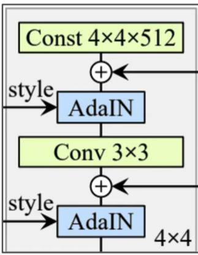

# StyleGAN for the OASIS Brain Dataset

## StyleGAN Architecture
- Introduces a mapping framework alongside the generator.
- Introduces Affine Transformation (A) and Adapative Normalisation (AdaIN).
- Adds noise throughout the network, not just the beginning. Also scaled the noise with B.

- IN extends Batch Normalisation
- AdaIN extends IN

- Started of a Progressive GAN, added in bilinear tuning -> added mapping network and styles (A) -> Remove traditional input (adds a constant tensor) -> added noist inputs (B) -> Mixing regularisation.

Mixing Regularisation:
- Generate two vectors w_1 and w_2 by passing two latent vectors z_1 and z_2.
- Use w1 and w2 at completely randomly chosen style layers during training
- Use this mixing with certain % of training data only

## How it works
- 

## Results

## References
