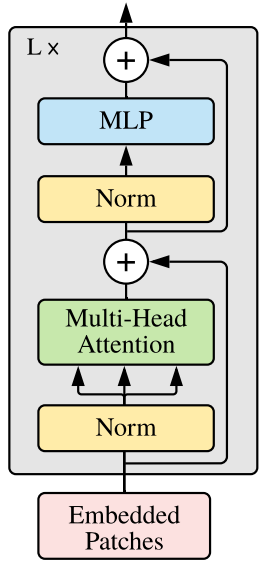

# Vision Transformer for ADNI
This project explored the use of a Vision Transformer for the classification of Alzheimer's disease in the ADNI brain dataset. The model is based on the architecture presented in the paper [An Image Is Worth 16x16 Words](https://arxiv.org/pdf/2010.11929.pdf) [1], with special thanks to Daniel Bourke's guide [4] on implementing this architecture in PyTorch.

# Contents
1. [Introduction](#1-introduction)
2. [Vision Transformer Background](#2-vision-transformer-background)
3. [Dependencies & Requirements](#3-dependencies--requirements)
4. [Results](#4-results)
5. [Recommendations](#5-recommendations)
6. [References](#6-references)

# 1. Introduction
The Alzheimer's Disease Neuroimaging Initiative (ADNI) is designed to provide researchers with study data to assist in defining the progression of Alzheimer's disease. The aim of this project was to classify Alzheimer's disease (normal and AD) of the ADNI brain data using a Vision Transformer, based on the architecture presented by the ViT paper [1].

This project used the dataset that contained 2D slices of MRI data for a patient, with the folder structure:
```
AD_NC
|--train (21,520 total images)
|  |--AD
|  |  |-- 10,400 images
|  |--NC
|  |  |-- 11,120 images
|--test (9,000 total images)
|  |--AD
|  |  |-- 4,460 images
|  |--NC
|  |  |-- 4,540 images
```
This means that there is ~70% of the total data in the training set, with the test set containing ~30%. Note that all images are formatted as ```{Patient ID}_{Slice Number}.jpeg```.

# 2. Vision Transformer Background
## 2.1. ViT Architecture Overview
| Vision Transformer (ViT) | Transformer Encoder |
| :---: | :---: |
|  |  |

## 2.2. How it works
The Vision Transformer architecture is comprised of a several stages:

1. **Patch and Position Embeddding (Inputs)**:
    - This converts the input image into a sequence of non-overlapping image patches. Each patch is treated as an individual token in the model's input sequence. Position embeddings are added to specify the spatial order of these patches in the image.
2. **Linear projection of flattened patches (Embedded Patches)**:
    - After extracting the patches, this stage projects them into a learnable embedding space. Using embeddings rather than raw pixel values allows the model to capture meaningful  representations of image content.
3. **Norm (Layer Normalisation)**:
    - Normalises the activations of the embedded patches within each layer, ensuring consistent mean and variance. This helps stabilise training and reduces overfitting.
4. **Multi-Head Attention (Multi-Headed Self Attention)**:
    - Enables the model to focus on different parts of the input sequence (patches) and capture complex relationships between patches. It helps the model understand dependencies and context within the image.
5. **MLP (Multi-Layer Perceptron)**:
    - This stage introduces non-linearity into the model and processes the attended features. It consists of linear layers with activations and dropout, allowing the model to perform complex transformations on the attended information.
    - Within the ViT paper [1], the MLP block contains two linear layers with a GELU non-linear activation function between them and a droput layer after each.
6. **Transformer Encoder**:
    - This is a collection of the layers listed above. There are two skip connections inside the encode (the "+" symbols) meaning the layer's inputs are fed directly to immediate layers as well as subsequent layers. The overall ViT architecture is just a number of Transformer encoders stacked on top of each other.
7. **MLP Head**:
    - This is the output layer of the architecture. It converts the learned features of an input to a class output. Since this is a classification problem, this would be called the "classifier head".

## 2.3. Problem It Solves
The base transformer architecture has become the standard for natural language processing (NLP) tasks due to their computation efficiency and scalability. However, its applications in computer vision (CV) is limited. In CV, convolutional neural networks (CNN) have remained dominant, but there have been several attempts to apply attention mechanisms to CV tasks. These attempts have either applied attention in conjunction with CNNs, or replaced certain components of CNNs while keeping their overall structure in place. The viT paper [1] explores how a transformer can be applied to CV tasks by converting an image into a sequence of patches, then continuing as usual. It was found that on mid-sized datasets, the ViT model had modest accuracy compared to CNNs. However, on large datasets, the ViT model had comparable or even superior performance to CNNs. 

The benefit of using Vision Transformers is that, once pretrained on large amounts of data, they can outperform modern convolutional networks in multiple benchmarks while requiring fewer computational resources to train. Furthermore, ViTs offer advantages in scenarios where global dependencies and contextual understanding are crucial, such as object detection.

This project's implementation attempts to solve the problem of binary classification of Alzheimer's on the ADNI dataset.

# 3. Dependencies & Requirements
To run all the files within this repository, a conda environment can be created using the provided
```environment.yml``` file. After installing conda, one can run the following to instantiate a
new environment with the required dependencies:
```
conda env create -n {environment name} -f environment.yml
```
The main packages used in this repository are:
```
Python ver 3.11
PyTorch ver 2.0.1
Matplotlib ver 3.7.1
SciPy ver 1.11.1
```

## 3.1. Repository Structure
The structure of the repository is:
```
config.py:          Configure user parameters
driver.py:          Driver script that runs everything else
dataset.py:         Creates datasets and dataloaders
modules.py:         Contains model structure
train.py:           Contains train, validation and test methods
predict.py:         Contains functionality to show usage of model
utils.py:           Contains helper functions
environment.yml:    Contains conda environment
misc:               Contains images for the README
```

## 3.2. How to use the model
To use the model, the ```config.py``` file can be adjusted based on user preferences, then ```driver.py``` can be run either directly in an IDE or through terminal by calling:
```
>>> python driver.py
```
The hyperparameters that a user can change are:
```
# General user preferences
will_save:          True if user wants to save the model
will_load:          True if user wants to load a model
show_model_summary: True if user wants a summary of the model
will_train:         True if user wants model to be trained
will_test:          True if user wants model to be tested

# Dataloader specific parameters
data_path:          Folder where data is stored
batch_size:         Batch size
n_channels:         Number of image channels
image_size:         Desired image size (will be converted to a square shape)
n_classes:          Number of classes in the dataset
data_split:         Ratio between training and validation data

# Change this at user risk
train_mean:         Training data mean (calculated)
train_std:          Training data standard deviation (calculated)
test_mean:          Testing data mean (calculated)
test_std:           Testing data standard deviation (calculated)

# Training specific parameters
n_epochs:           Number of epochs model will be trained for
learning_rate:      Learning rate for model

# Transformer model specific parameters
patch_size:         Patch size of each image patch that model will process
n_heads:            Number of attention heads to use in MSA block
n_layers:           Number of transformer encoder layers
mlp_size:           Dimensionality of MLP
embedding_dim:      Number of hidden dimensions within the MLP
mlp_dropout:        Dropout rate applied within MLP
attn_dropout:       Dropout rate applied to the attention weights in MSA block
embedding_dropout:  Dropout rate applied to token embeddings

# Model storage specific parameters
load_path:          Path to load model from
save_path:          Path to save model to
results_path:       Folder to store images of results
```

Note that, if the user wishes to show any plots, then one must close these plots so the model can continue. Furthermore, the test accuracy will be printed once the model has finished testing. If the user wishes to change the loss function or optimiser, further customisation would need to be done in the ```modules.py``` and ```driver.py``` files.

# 4. Results
## 4.1. Data Preprocessing
The dataset contains only a training and test folder, so a validation set was made by splitting the training data based on the patient ID. This was done to ensure no data leakage occurred, in that the model would not be tested on patient data that it had already seen during training. After this data split was completed (using a standard 80/20 split [6]), the datasets were shaped like:
- Train data: 17,200 images     (~56% of total data)
- Validation data: 4,320 images (~14% of total data)
- Test data: 9,000 images       (~30% of total data)

The model created for this project requires square images as input, so that square patches can be created. Each image in the ADNI dataset is 240x256, so the image was initially just resized to 224x224 (this was the size used in the ViT paper).

An example of a patched image using a 16x16 patch size on the basic preprocessed data can be seen below:


It is clear to see that for an essentially unprocessed image, many of the patches do not contain useful information. Thus, further preprocessing needed to be completed.

### 4.1.1. Varying Image Preprocessing
Several data augmentation processes were introduced to improve model accuracy. These are outlined below.
- Normalisation:
    - The mean and std devation of the train and test data were calculated separately and applied to the images during transformation for the dataloaders.
- RandomHorizontalFlip / RandomVerticalFlip:
    - This was added to allow for variation in the training data, so the model could learn more features.
- Recentering:
    - Recentering the image based on the brain segment was also explored, although unfortunately was not able to be extensively tested. In theory, this would allow the model to better understand the features of the MRI due to all the images being in the same location each time. This was done by finding the center of the brain segment in the image, then translating that center to the center of the image. Please refer to Section 5 for future improvements.

## 4.2. Experimentation
### 4.2.1. Basic Model
The model was first trained and tested using the parameters specified by the Vision Transformer paper for the Base version (viT-Base):
```
img_size = 192          # Reduced from 224 to 192 to allow training completion.
patch_size = 16         # From paper
n_heads = 12            # Table 1 from [1]
n_layers = 12           # Table 1 from [1]
mlp_size = 3072         # Table 1 from [1]
embedding_dim = 768     # Table 1 from [1]
mlp_dropout = 0.1       # Table 3 from [1]
attn_dropout = 0.0      # Not used in paper
embedding_dropout = 0.1 # Table 3 from [1]
learning_rate = 0.003   # Table 3 from [1]
```

Due to the computational resources required to train the model, it was only trained for 5 epochs to demonstrate that a model of this size (85,367,042 parameters based on model summary) would have difficulty training on a dataset as small as ADNI. The results of this training can be seen below:


As was expected, using a comparatively large model on a small dataset resulted in the model overfitting the training data, which led to the validation data having negligible improvements in accuracy, while the loss did decrease. In turn, the test loss was 0.69 and the accuracy was 49.58%. Further research needed to be completed.

### 4.2.2. Research to improve model
Based on the test accuracy of the ViT-Base model, the knowledge that ViTs introduced by the paper [1] work on large datasets and the fact that the ADNI dataset is relatively small, it was decided that further research into improving performance of ViTs on small datasets needed to be completed. Based on the information found in the paper [How to Train Vision Transformer on Small-scale Datasets?](https://arxiv.org/pdf/2210.07240.pdf) [2] and the article [5 Tips for Creating Lightweight Vision Transformers](https://wandb.ai/dtamkus/posts/reports/5-Tips-for-Creating-Lightweight-Vision-Transformers--Vmlldzo0MjQyMzg0) [3], the following changes were identified that needed to be made:
- Use more patches per image to allow the model to learn more features.
- Use a low number of transformer layers so that the model doesn't overfit the training data.
- Have a deep MLP to allow the model to learn more complex features.
- Use a low embedding dimension to reduce the number of parameters in the model.

Applying this to the model:
```
patch_size = 8 (increases number of patches per image)
n_heads = 8 (reduces number of heads to reduce number of parameters)
n_layers = 2 (reduces number of layers to reduce number of parameters)
embedding_dim = 24 (reduces number of parameters)
mlp_size = 768 (decreases size of MLP to reduce parameters, but deep enough to capture complex features)
```

The model size has been greatly decreased, with only 87,014 parameters (based on model summary). Furthermore, making these changes drastically improved test accuracy to 61.73% (loss of 0.91). However, the model began 
to overfit the training data after ~15-20 epochs (as can be seen below). This is due to the model beginning to memorise the dataset, rather than learning the features of the dataset, which is also a problem prevalent for small datasets when trained for long periods.

 

Thus, for the purposes of this project, the model didn't need to be trained for more than 15-20 epochs to get performance (this is bad practice in real life, please refer to Section 5 for more information).

### 4.2.3. Hyperparameter Tuning
The following parameters were kept the same throughout testing (unless specified in the table below):
```
img_size = 224
patch_size = 8
n_heads = 6
n_layers = 2
mlp_size = 768
embedding_dim = 24
mlp_dropout = 0.1
attn_dropout = 0.0
embedding_dropout = 0.1
learning_rate = 0.0005
loss function = Cross Entropy Loss
optimiser = Adam
n_epochs = 15
```
The model test accuracy for the standard form was 62.31% (loss of 0.77).

Unfortunately, the tests performed were limited in scope due to the computational resources required to train the model. The following table outlines the tests that were performed:

| Test Type     | Change            | Accuracy   |
|---------------|-------------------|------------|
| Data Split    | 0.6, 0.7, 0.9     | 66.56%, 65.29%, 61.49% |
| Learning Rate | 0.1, 0.01, 0.001  | 50.44%, 55.86%, 62.81% |
| Optimiser     | AdamW, SGD        | 63.87%, 50.44% |
| Patch Size    | 16, 32, 64*       | 60.27%, 57.38%, 56.87% |
| Augmentation  | Image Recentering | 60.94% |

Unexpectedly, the model perfomed worse after recentering the images. This is likely due to the images being downscaled first, then being recentered. A better method would be to locate the center of the brain segment, recenter the image, crop the image to remove the black background and resize it such that the image isn't warped (e.g. a 100x240 segment being warped to 224x224). This would need to be a future improvement to the model.

Another interesting point to note is that increasing the validation data resulted in better performance, which is likely due to the model (since having a low number of transformer layers and parameters to adjust overall) being able to learn the training data features quickly, so there is more information to generalise the model on.

Incoroporating these corrections, the final model's test loss was 0.65, and test accuracy was 67.14%. Unfortunately, although better than all previous versions, this model still does not meet the requirements of the project to have 80% test accuracy.

Further experimentation would involve changing the loss functions, such as using Binary Cross Entropy Loss, as this is a standard loss function for binary classification problems. Moreover, adding a learning rate scheduler would prove more beneficial than manually changing the learning rate, as this would allow the model to train for longer and potentially reach a better minimum.

*Image had to be resized to 256x256 to suit this patch size.

## 4.3. Reproducibility of Results
The results produced by the ViT can be reproduced consistently, where the only source of randomness that affects the model is the shuffling of the training data during training at each epoch. This is considered a crucial step so that the model can escape local minima and converge to a global minimum. Random seeds are also used to ensure that the model can be reproduced consistently. Lastly, it should be mentioned that the ```predict.py``` file uses a random subset of the test data for the model to predict on.

## 4.4. Example Usage
The model can be used to predict the class of a random subset of images based on a given dataloader, which can be found in the ```predict.py``` file as the method ```predict()```. An example usage of this function can be seen below:


# 5. Recommendations
For future training and testing, it is recommended that the PyTorch EarlyStopping handler so that the model can be saved at the epoch with the best validation accuracy. This will allow the model to be trained for long enough to reach its best performance, but not overfit the training data. Furthermore, using a larger dataset or even augmenting the data in such a way that more of it can be used as features (potentially converting to RGB or HSV) would prove beneficial due to the nature of ViTs. In conjunction with this, pretraining the model on similar data would result in fair better results compared to the 'from scratch' method used in this project. Lastly, an emphasis needs to be made that if the data is preprocessed well (e.g. cropping the image to remove black, then resizing to have only the brain segments), this would be a significant benefit to the proficiency of the model, as with the current methods almost have the image sequence would contain just black patches.

# 6. References
[1] Dosovitskiy A, Beyer L, Kolesnikov A, Weissenborn D, Zhai X, Unterthiner T, et al. An Image is Worth 16x16 Words: Transformers for Image Recognition at Scale [Internet]. 2020. Available from: https://arxiv.org/pdf/2010.11929.pdf

[2] Cao J, Yang Y, Xu M, Huang L. Evo-ViT: Searching for Evolutionary Vision Transformer [Internet]. 2022. Available from: https://arxiv.org/pdf/2210.07240.pdf

[3] Tamkus D. 5 Tips for Creating Lightweight Vision Transformers [Internet]. Weights & Biases; 2023. Available from: https://wandb.ai/dtamkus/posts/reports/5-Tips-for-Creating-Lightweight-Vision-Transformers--Vmlldzo0MjQyMzg0

[4] [Burke D]. Flattening the patch embedding with torch.nn.Flatten [Internet]. Learn PyTorch; 2023. Available from: https://www.learnpytorch.io/08_pytorch_paper_replicating/#44-flattening-the-patch-embedding-with-torchnnflatten

[5] Wu Y, He K. ConViT: Improving Vision Transformers by Soft Distillation [Internet]. 2021. Available from: https://arxiv.org/pdf/2106.10270.pdf

[6] [No author]. Vision Transformer: A step by step guide [Internet]. V7 Labs; 2023. Available from: https://www.v7labs.com/blog/vision-transformer-guide#h2

[7] [No author]. Creating train_step and test_step functions and train to combine them [Internet]. Learn PyTorch; 2023. Available from: https://www.learnpytorch.io/05_pytorch_going_modular/#4-creating-train_step-and-test_step-functions-and-train-to-combine-them

