# Detection of Alzheimer's Disease with a Vision Transformer on the ADNI Dataset

## Background
Transformers have typically seen success in natural language processing tasks, however, with the research performed in the paper ["An Image is worth 16x16 words"](https://arxiv.org/abs/2010.11929), it can be seen that transformers also have the potential to be used in computer vision and image processing tasks.

Transformers are deep learning models which break the input data into "tokens" which in the case of text are small chunks of characters which are frequently seen together, but in the case of images, are small "patches" of pixels which are positioned close together. These tokens are fed into the encoder layer of the transformer which extracts the relationships between the tokens, and the decoder layer of the transformer which generates the output.

Transformers form a more generalised model compared to traditional CNNs, since the usage of patch embeddings allows the model to __**learn**__ the relationships (or attention) between the tokens, without introducing biases (In the case of CNNs, this involves spatial biases from the kernel - which groups pixels within the kernel's range as "areas of interest"). This allows the model to be applied to a wider range of tasks, such as image classification, object detection, and image segmentation.

While transformers typically require large datasets to be able to overcome the lack of biases, augmentations can be applied to "generate" new images, and current image datasets have grown to a size which makes transformers possible to train. This project aims to apply transformers to the ADNI dataset, which is a dataset of MRI scans of patients with Alzheimer's Disease, and patients without Alzheimer's Disease.

## Architecture


Architecture of a Vision Transformer.

The vision transformer (ViT) is composed of a a few key components, namely - the patch and position embeddings, a transformer encoder layer, and a transformer decoder layer. The patch embedding layer takes in the input image and breaks it into patches of pixels, which are then flattened into one dimensional patch embeddings. This matrix is then fed into the transformer encoder layer which extracts the relationships between the patches, and a final transformer decoder consisting of a linear layer.

1. Patch Embedding - The patch embedding consists of a 2D convolutional layer which breaks the grayscale square input image into patches of pixels, and then flattens the patches into a one dimensional matrix. The output of this layer is a matrix of patch embeddings which is fed into the transformer encoder layer and each patch serves as a "token" in the traditional sense of a natural language processing (NLP) transformer. Increasing the number of patches increases the number of tokens which the model can learn from - and hence derive more intricate spatial relationhips, however, this also increases the number of parameters in the model, and thus increases the training time and space complexity of the model. A class token is also typically appended to the patches at this stage which allows the model to extract the overall output of the data at the end of the transformer.

2. Transformer Encoder - The transformer encoder layer commonly known as a backbone consists of a set of transformer encoder blocks, which again are each made of a layer normalisation (LN) layer followed by a multi-head self-attention layer, another layer normalisation layer, and then a feed forward layer.

    2.1. Layer normalisation (LN) - Layer normalisation is a normalisation technique which normalises the output of the previous layer to have a set mean and standard deviation. This is done to prevent the output of the previous layer from being too large or too small, and thus causing the model to be unable to learn from the results of backpropagation.

    2.2. Multi-head Self-Attention (MHSA) - The Multi-Head Self-Attention layer is a layer which calculates the attention between each token in the input. The input to this layer is of the form Query, Key, Value which is then encoded in the encoder block.

    2.3. Feed Forward Layer (MLP) - The feed forward layer is a linear layer which calculates the relationships between each token in the input. The output of this layer is then fed into another layer normalisation layer. Increasing the dimension of the feed forward layer increases the model's ability to learn more complex relationships in the data at the cost of training time and space. 
3. Transformer Decoder - The transformer decoder block commonly known as the "Head" can be thought of as a layer which tries to make a conclusion out of the attention and relationships extracted from the transformer encoder layer. While this head can have many different forms depending on the task, the most common form is a linear layer which outputs the classification of the image.


## Preprocessing
The ADNI dataset consisted of a train set and test set with grayscale images of dimension 256x240 and each dataset was further split into a cognitive normal (CN) and Alzheimer's Disease (AD) set as subdirectories. This allowed for easy parsing of the data into a train and test set with labels 0 for CN and 1 for AD.


### Loading Data
The data was first loaded into the program using a custom function which parsed all images in a list of directories, labeled based on directory, and split the training directories into a train and validation set with an 90:10 split. This split was chosen since it is known that vision transformers require alot of data to train, and I thus gave more data to the train set. The set split was conducted on a per subject and per group basis - hence there would be approximately the same number of AD and CN subjects in the train and validation sets. The test directories were also parsed with the same function. These loaded images and labels were then loaded into a custom torch dataset which performed the specified preprocessing to the data, before finally being put into a dataloader to be used in the future.

### Center Cropping
Upon reviewing the images, it was found that each image contained a lot of blank space, and the brain only made up the center section of it. This meant that if the raw image was used, the model would have to process an unnecessarily large image which would cause it to be larger and have to unnecessary relationships between the blank space and the brain. To improve the runtime and space complexity, a center crop was performed to resize the image to 192x192, however, it was later found that some brains were truncated by this crop and the image was cropped to 224x224 instead.

### Normalisation
While this was the only preprocessing performed during the first few iterations of training, it was found that the model was unable to exceed a test accuracy of 60%. To attempt to remedy this, the mean and standard deviations of the training set was calculated, and used to normalised the training, validation, and test sets. Overall, normalisation seemed to have a great effect on the model's performance, and the model was able to achieve train accuracies > 95% and validation accuracies > 80% after 50 epochs, while struggling to reach 70% validation accuracy before normalisation.

## Training
At first, I had tried to implement the [Medium](https://medium.com/mlearning-ai/vision-transformers-from-scratch-pytorch-a-step-by-step-guide-96c3313c2e0c) tutorial which built all the vision transformer components manually, however, upon training with the model developed in this tutorial, I found that the model was prone to overfitting (Refer to the Validation Accuracy Graph Below - validation accuracy begins to drop after 25 epochs) due to the lack of dropout layers and the model was also quite slow to train (~15 mins per epoch even on a smaller model). The best accuracy I was able to achieve with this model was 67% on the validation set, and 59% on the test set which was not very good.

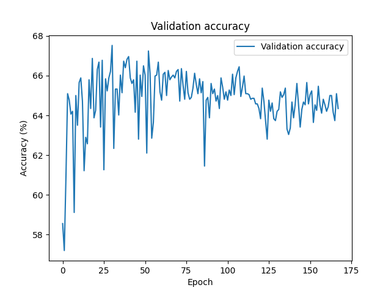

The validation accuracy graph above also showed that the learning rate of the training was too high as the model was oscillating and struggling to converge. I thus decided to use the [LearnPytorch](https://www.learnpytorch.io/08_pytorch_paper_replicating/#44-flattening-the-patch-embedding-with-torchnnflatten) tutorial which again implemented the model's layers from scratch, however, I made improvements on the model by using the torch.nn.TransformerEncoderLayer instead of the custom model used in the tutorial - this improved the efficiency of the model and increased the training speed by almost 10x compared to the Medium tutorial (reducing the training time from 20 mins to 2 mins per epoch) for the same model size. This model had the added benefit of having dropout layers which reduced the overfitting. The best accuracy I was able to achieve with this model was 82% on the validation set, and 64.43% on the test set which was a slight improvement over the Medium tutorial.

### Test performance
To evaluate the test performance of each selection of parameters, I chose the saved model with the highest validation accuracy and used it to predict the test set. A rough parameter search was performed to determine the best parameters for the model, and the results of this parameter search can be seen in the results section below.


## Results
Below are graphs for the training and validation loss of the initial model developed following the medium tutorial:
<p float="middle">
  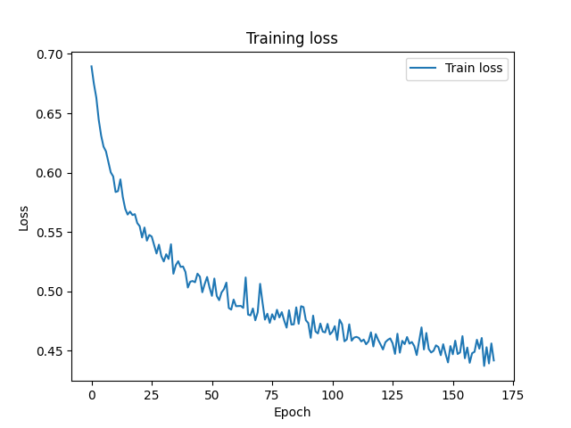
  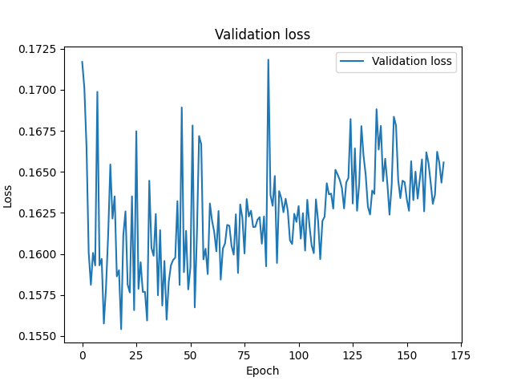 
</p>
<p float="middle">
   
</p>


The saved model with the highest validation accuracy was used to determine the test accuracy of the model.This model achieved a test accuracy of 59% and can be seen to be quite noisy during training as both the train and validation losses and accuracies oscillated quite a bit. This model was also prone to overfitting as the validation accuracy began to drop after 25 epochs - once again likely due to the lack of dropout layers and normalisation.

After switching to the new model, it can be seen that the noise in the validation accuracy and loss significantly decreased, and the model performed better overall in the validation set.

<p float="middle">
  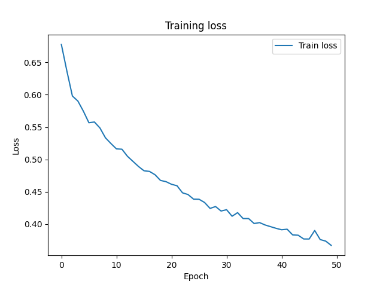
  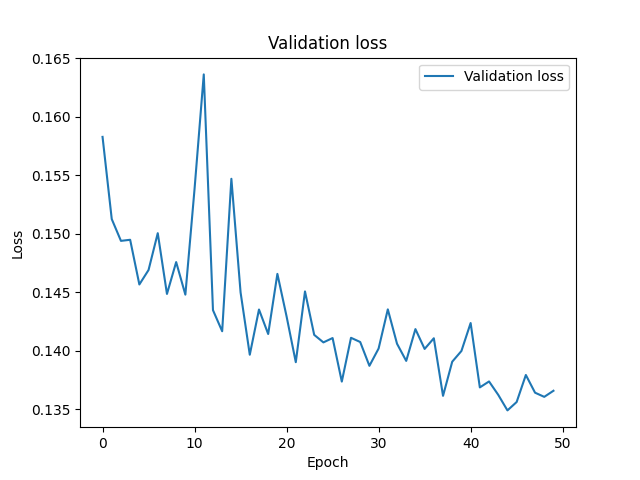 
</p>
<p float="middle">
   
</p>


After adding dropout layers to the model, the trained model was again much less noisy than the previous model, this model was also able to achieve a train accuracy of 98% and validation accuracy of 82% after 50 epochs. The test accuracy of this model was 63.52% which was a slight improvement over the previous model.

<p float="middle">
  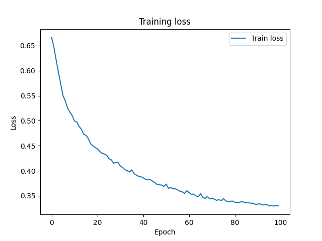
  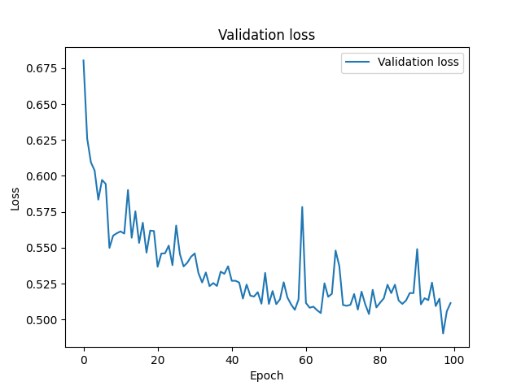 
</p>
<p float="middle">
  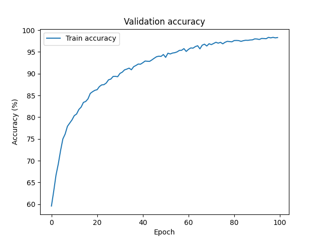 
  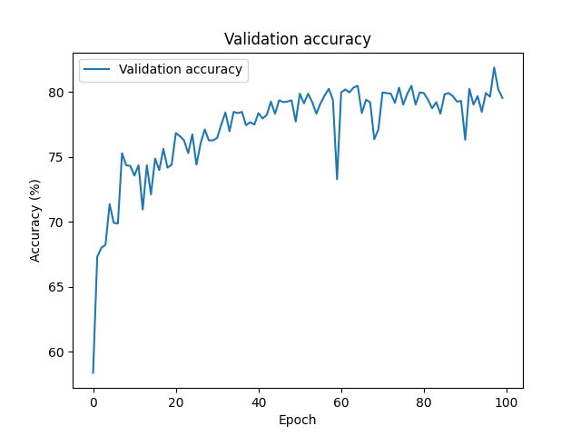 
</p>


Finally, after performing a parameter search, I arrived on my best model which also able to achieve a train accuracy of 98% and validation accuracy of 82% after 50 epochs. The test accuracy of this model was 64.43% which was a slight improvement over the previous model.

<p float="middle">
  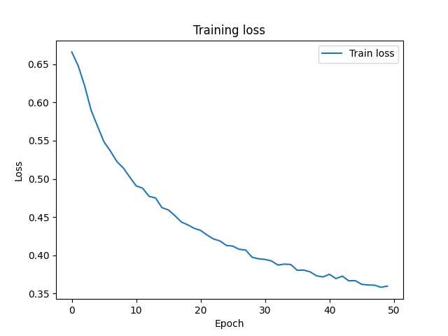
   
</p>
<p float="middle">
   
   
</p>

Below is a table of the parameters used for each model, and the test accuracy of each model. While other models with varying learning rates, batch sizes, and number of epochs were trained, they were not included in the table below as they did not perform as well as the models below, and the model parameters were mistakenly lost.

| Model No. | Img Size | Patch Size | No. Transformer Layers | Embedding Dimension | MLP Size | No. Transformer Heads | Normalised? | Dropout? | Test Acc |
|-----------|----------|------------|------------------------|---------------------|----------|-----------------------|-------------|----------|----------|
| 21        | 224      | 16         | 12                     | 256                 | 256      | 8                     | True        | True     | 64.11    |
| 20        | 224      | 16         | 12                     | 256                 | 128      | 16                    | True        | True     | 63.80    |
| 19        | 224      | 16         | 8                      | 256                 | 128      | 16                    | True        | True     | 61.99    |
| 18        | 224      | 16         | 8                      | 512                 | 256      | 16                    | True        | True     | 62.8     |
| 16        | 224      | 16         | 12                     | 256                 | 256      | 16                    | True        | True     | 64.43    |
| 15        | 224      | 14         | 8                      | 256                 | 256      | 16                    | True        | True     | 62.14    |
| 14        | 224      | 14         | 4                      | 256                 | 256      | 16                    | True        | True     | 59.96    |
| 10        | 192      | 16         | 12                     | 256                 | 256      | 16                    | False       | True     | 59.63    |
| 7         | 192      | 24         | 8                      | 256                 | 32       | 4                     | False       | False    | 50.44    |

### Sample Predictions From Best Model
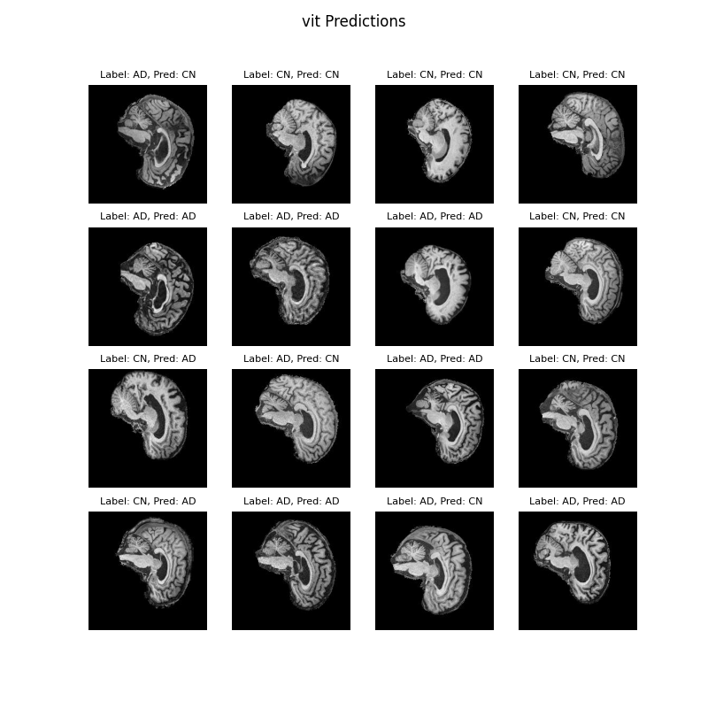

## Running the code

### Dependencies
To run the code, the following core dependencies are required:
- PyTorch
- Numpy
- Matplotlib
- Torchvision
- torchsummary
- tqdm

The following command can be used to create an identical copy of my conda environment used to train the model:

```
conda env create -n {environment_name} -f environment.yml
```

When running the subsequent steps ensure the conda environment is activated using the command:
```
conda activate {environment_name}
```

### Training
First ensure that the ADNI dataset is downloaded and placed into a directory named "data" in /PatternAnalysis-2023/recognition/45816967_ADNI_Vision_Transformer, and a "models" directory is created in the same directory. Then, run the following command to train the model:

```
train.py --img_size 224 --patch_size 16 --num_layers 12 --embed_dim 256 --mlp_size 256 --num_heads 16 --n_epochs 50 --batch_size 64
```

### Testing
To predict the test set and show the results, run the following command:

```
predict.py --model_dir models/{model_name}.pth --dim 2
```

### All together
Alternatively, to train, test, and predict using the model all together, run the following command:

```
driver.py
```


## Reproducibility of results

While the results of the ViT training seem quite non-deterministic, training the same model with the same parameters seemed to produce roughly the same performance. It is suspected that using a seed at the start of the training script might help with the reproducibility of the results, however, this was not wanted while I was training the model as I was simply trying to obtain the best model possible. After the model has been trained and saved, the results of the model then become reproducible.

## Future Work
In the future, transfer learning could be investigated using a transformer backbone trained on a larger dataset such as imagenet. This could be useful since the transformer would have been able to learn more complex and refined attention maps between the tokens, and thus be able to extract more information from the ADNI dataset. Also, an alternative transformer head could be investigated such as a CNN or a more complicated MLP. This could improve the results of the model since the transformer head would be able to learn more complex relationships from the outputs of the transformer encoder.