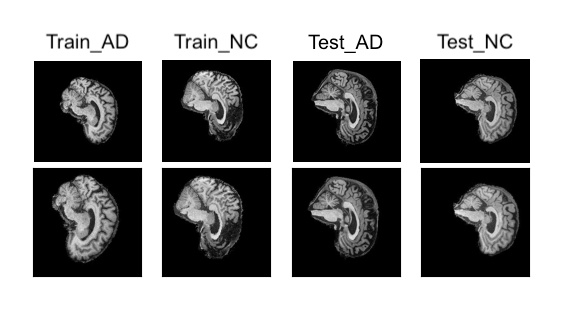
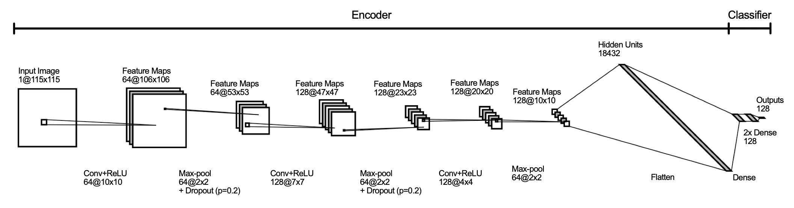

# Siamese network-based Classifier on ADNI Brain Dataset 

#### Author: Evvvacaaat
#### Student Number: 46233002

## Introduction
The aim of this project is to develop a classifier based on the Siamese network to classify Alzheimer's disease in the ADNI brain dataset.  

### Algorithm implemented
A Siamese neural network is an architectural model that computes comparable output vectors from two or more input vectors. It contains two parts: feature extraction and classification. It extracts features from multiple inputs simultaneously with identical subnetworks that share the same parameters and weights. Then, features are mapped to high-dimensional feature space where features of different classes are separated as much as possible. Eventually, the features extracted by each subnetwork are joined and used for classification. 

Traditionally working with image pairs and Euclidean distances, the improved implementation of Siamese-based networks work with triplets that contain an anchor image, a positive image of the same class, and a negative image of a different class[^1]. Triplet losses are used to maximise the distance between the anchor and the positive image and to minimise that between the anchor and the negative image. 

An even more recent breakthrough is the separation of feature extraction and classification into two[^2]. In this way, the feature extraction can be trained separately to maximise the performance of the extraction, which heavily influences the capacity of the downstream classifier. 

### Datasets used

The ADNI dataset is kindly provided by the Alzheimer's Disease Neuroimaging Initiative (ADNI) for purposes of scientific investigation, education, and research studies[^3]. The version received has been preprocessed into two folders: training and testing, each containing two further folders named "AD" and "NC" respectively.

## Data Preprocessing
Before performing any transformation, a train-validation split has to be performed for fine-tuning. A validation dataset is split from the training dataset by a ratio of 1:9 (10% of the initial training dataset forms the validation dataset). The split is performed on a patient level by retaining the patient ID order to prevent a biased validation. The entire test set was kept for trained model evaluation. The distribution of the datasets before and after the data split is outlined below. 

### Dataset distribution before data split. 

| Data (Pre-split) | AD | NC |
| ------------- | ------------- | ------------- |
| Train Set  | 10400 | 11120  |
| Test Set  | 4460 | 4540 |

### Dataset distribution after data split. 

| Data (Post-split) | AD | NC |
| ------------- | ------------- | ------------- |
| Train Set  | 9360 | 10008  |
| Validation Set  | 1040 | 1112 |
| Test Set  | 4460 | 4540 |

The preprocessing was greatly inspired by Goceri (2023)[^4]. Each of the training, validation, and testing datasets is converted to tensors. Training data is randomly cropped, rotated, rescaled. Validation and testing data are center cropped to square to prevent distortion. All datasets are resized to (225, 225) and normalised separately. Each image in the dataset is labelled with 1 if it belongs to the AD class, or 0 if it belongs to the NC class. The dataset is shuffled and batched with a size of 16. An example of preprocessin is down below.



## Model Architecture 

### Choice of Model
The architecture of the Siamese-based classifier in this report contains an encoder based on a convolutional neural network (CNN) to generate embeddings from inputs and a simple classifier of two fully connected layers. This model is inspired by the original paper of the Siamese network proposed by Koch [^5], but a simplified and dissected version that contains more dropout layers and max-pooling to prevent overfitting and extract more informative patterns. The number of layers and vectors has been reduced to prevent overfitting to the relatively small datasets. The fully connected layers are separated from the convolutional blocks to optimise training efficiency. 

The CNN-based encoder contains three convolution layers, each followed by a batch normalisation layer, a rectified linear unit (ReLU), and a 2x2 max-pooling. Between the convolutional layers, a dropout layer of 0.1 probability is also implemented. The hidden units in the final convolutional layer are flattened and condensed to 128 embeddings using a fully connected network. The structure of the encoder is rather complex and hence visualised below.

The classifier consists of only two fully connected layers with a ReLU in between. The first layer maps the 128 embeddings to 128 hidden units. In between is a dropout layer of 0.2 probability. The second layer maps the hidden units to the number of classes and is followed by a sigmoid operation. 



### Hyperparameters

- Batch size: 16 
- Learning rates: 0.0001
- Number of epochs: 12

A batch size of 8, 16, 32, and 64 has been experimented with the model and 16 was the only one with decent performance. While a batch size of 32 and 64 seems to introduce noise, a batch size of 8 seems to cause underfitting. Learning rates from 1e-01 to 1e-04 were attempted and the most commonly used 1e-04 appeared to be the most suitable. The number of epochs was originally over 30 but after the introduction of miners it was significantly reduced to 12. 

### Performance Regulation: Loss functions, Miners, Optimizers, Schedulers

The encoder and the classifier use different loss functions due to their natural differences. 

To optimise embeddings, the encoder uses the 'losses.TripletMarginLoss' function from the 'pytorch_metric_learning' library. The function automatically forms all possible triplets within the batch and computes the loss based on the given labels. The formula of the loss is: L = max(0, d(a, p) - d(a, n) + m) where a, p, n, and m stand for anchor, positive, negative, and margin. The goal of the function is to minimise the distance between anchor and positive and maximise that between anchor and negative. To increase accuracy, a mining function 'miners.BatchHardMiner(pos_strategy=miners.BatchEasyHardMiner.EASY, neg_strategy=miners.BatchEasyHardMiner.SEMIHARD)' is also implemented to generate most efficient triplets to learn from. The parameters were set as suggested in Xuan et al. (2020)[^6] to improve the quality of embeddings. I also experimented with other combinations and this was the one that performed the best and fastest. The args were set as such since during trials we realised the positive labels (AD) appeared to be more difficult to classify. 

The classifier uses the 'nn.CrossEntropyLoss' function from the 'torch' library. Cross entropy loss is a common loss function for classification tasks. It attempts to minimise the predicted probability (between 0 and 1) from the true labels.

For both encoder and classifier, 'torch.optim.SGD()' is the optimizer and 'torch.optim.lr_scheduler.OneCycleLR' is the scheduler. 

## Model Performance 

Since this is a binary classification task, the performance of the model mainly relies on accuracy to maximise specificity and sensitivity. With the previously mentioned data preprocessing and hyperparameters, the model was able to achieve approximately 65% accuracy on all test data. 


## How to Use

Before running, please ensure all dependencies are met (python version, python libraries/packages, datasets and cuda environment (highly recommended).)

```
module load cuda/11.8
python train.py 
```

## Dependencies

- python (3.7)
- pytorch (1.13.1)
- torchvision (0.13.1)
- opencv2 (3.4.2)
- pytorch-metric-learning (2.3.0)
- ADNI data can be obtained upon request to ADNI[^3]

## Reference

[^1]: Hoffer, E., Ailon, N. (2015). Deep Metric Learning Using Triplet Network. In: Feragen, A., Pelillo, M., Loog, M. (eds) Similarity-Based Pattern Recognition. SIMBAD 2015. Lecture Notes in Computer Science, 9370. Springer, Cham. https://doi.org/10.1007/978-3-319-24261-3_7

[^2]: Cheng, Y., Wang, A., Wu, L. (2022). A classification method for electronic components based on Siamese network. _Sensors_. _22_, 6478. https://doi.org/10.3390/s22176478

[^3]: Alzheimer's Disease Neuroimaging Initiative. (2017). Access data and sample. https://adni.loni.usc.edu/data-samples/access-data/

[^4]: Goceri, E. (2023). Medical image data augmentation: techniques, comparisons and interpretations. _Artificial Intelligence Review_, _56_, 12561–12605. https://doi.org/10.1007/s10462-023-10453-z

[^5]: Koch, G., Zemel, R., Salakhutdinov, R. (2015). Siamese Neural Networks for One-shot Image Recognition. _JMLR Workshop and Conference Proceedings_. _37_. https://www.cs.cmu.edu/~rsalakhu/papers/oneshot1.pdf

[^6]: Xuan, H., Stylianou, A., Pless, R. (2020). Improved Embeddings with Easy Positive Triplet Mining. _2020 IEEE Winter Conference on Applications of Computer Vision_, Snowmass, CO, USA, 2463-2471. https://doi.org/10.48550/arXiv.1904.04370