# OASIS brain dataset - Stable Diffusion Task

The aim of this model is to generate a brain from a noisy image using the Stable Diffusion Model.


## Stable Diffusion

Stable Diffusion is a type of diffusion model that works in a two step process that uses a technique similar to how a generative model would work. The diffusion model operates by gradually adding noise to an input image in a forward process and then retrieves the original image by denoising (backwards process). 

In the (parametrized) backwards process, the model predicts the noise added in each of the images and generates new datapoints using a neural network. Afterwards, when the noise is done being added, the model will work backwards, predicting the noise added to the image and then subtracting the noise from the image. Eventually, this will result into a clearer, denoised image.

This diffusion model will be using a U-Net for the backwards process.


## Dependencies

* PyTorch: `>=2.0.1`
* Numpy: `>=1.24.3`
* Pillow (PIL): `>=10.0.0`
* Torchvision: `>=0.15.2`
* Matplotlib: `>=3.7.1`


## File Structure and How to Use

1. Clone/Download the repository
2. Install required dependencies
3. Download Preprocessed OASIS MRI dataset from [__here__](https://cloudstor.aarnet.edu.au/plus/s/tByzSZzvvVh0hZA) and unpack into a folder called `data`

The file structure should end up looking like this:

```
46429515_OASIS_brain_SD(-topic-recognition)/
|- data/keras_png_slices_data/
|  |- keras_png_slices_seg_test/
|  |- keras_png_slices_seg_train/
|  |- keras_png_slices_seg_validate/
|  |- keras_png_slices_test/
|  |- keras_png_slices_train/
|  |- keras_png_slices_validate/
|- image_output/
|  |- epoch_710_step_000_generated.png
|  |- ...
|- predict_image/
|  |- input_image_0.png
|  |- ...
|  |- input_image_9.png
|- predict_output/
|  |- ...
|- util/
|  |- loss_plot.png
|- README.md
|- dataset.py
|- module.py
|- predict.py
|- train.py
|- utils.py
|_ train_predict.sh
```

In the terminal, move to the folder `46429515_OASIS_brain_SD` and then run the bash script with the command:

```
./train_predict.sh
```

This will run the python file to run train.py and then predict.py while checking the exit code of the python files (training the model, then loading the model and generating an image using the model).


## Usage Example

### Stable Diffusion Generating Outcomes - predict.py
The images generated from the noisy image inputs (images that came from epoch 0 of training with learning rate of 0.001) have resulted in images that look more like some details of a brain rather than the entire shape of a brain itself. This may be because of the training, possibly meaning that the model has not trained enough to learn the defining shape of a brain.

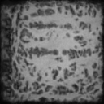 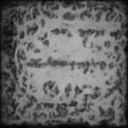 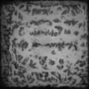 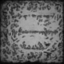 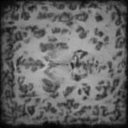 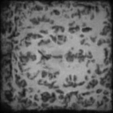 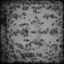 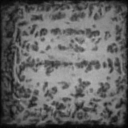 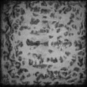 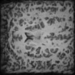 

A correlation for the model not generating brains as intended would be due to the training process of the model which can be seen in a loss over epochs plot (can be seen in Training section of the documentation). The cause for this loss/epoch graph may be due to the model used for stable diffusion as the model is a simple U-Net model which is not speciailized to learning important details in a short amount of time.

It is possible that the model did not learn the shape of a brain. This can be seen from the blurry output from the training images at the higher epochs despite clearly having the shape of a brain with some details (images can be seen in Training section of documentation).


### Saving Generated Images - predict.py

In this file, the parameters of the saved model is loaded into a newly instanced model. The preprocessing done on the input images is simply a resizing and normalizing:

```python
preprocess = transforms.Compose([
    transforms.Resize((utils.IMAGE_SIZE, utils.IMAGE_SIZE)),
    transforms.ToTensor(),
    transforms.Normalize(mean=[0.5], std=[0.5]),
])
```

The saving of the generated images is done similarly for training images which can be found in the code.


### Dataset Creation - dataset.py

With a custom dataset class created (OASISDataset), this will enable the images to be transformed as desired, as well as implement the dataset into a dataloader to be used for our task, where our specified root_path is the path to the parent folder of images of the dataset and the batch size is 32 (can be found in utils.py).

```python
train_data = OASISDataset(root=f'{root_path}/keras_png_slices_train', 
                        label_path=f'{root_path}/keras_png_slices_seg_train', 
                        transform=transform)
test_data = OASISDataset(root=f'{root_path}/keras_png_slices_test', 
                        label_path=f'{root_path}/keras_png_slices_seg_test', 
                        transform=transform)
combined_data = ConcatDataset([train_data, test_data])
validate_data = OASISDataset(root=f'{root_path}/keras_png_slices_validate', 
                        label_path=f'{root_path}/keras_png_slices_seg_validate', 
                        transform=transform)

data_loader = DataLoader(combined_data, batch_size = BATCH_SIZE, 
                        shuffle=True, drop_last=True)
validate_loader = DataLoader(validate_data, batch_size=batch_size)
```


### Noise Scheduler (Forward Process) - module.py

In this process, we build more gradually noisy images to be inputted into our model. Here, noise-levels/varianes are pre-computed and we sample each timestep image separately (Sums of Gaussians = Gaussian). 

The precomputed values can be seen in the module.py section in utils.py
The diffusion noising code can be found in the noise scheduler section in module.py


### U-Net (Backwards Process) - module.py

In the backwards process, we create a U-Net model to predict the nose in the image where the input is a noisy image (coming from forward process) and the output is the noise in the image. For the U-Net, it is a simple network which consists of a downsampling, residual sampling (via sinusoidal position embedding) and upsampling of data. To create a model of the network:

```python
model = UNet()
```

The number of parameters in the model can be found as follows (output included):

```python
print("Num params: ", sum(p.numel() for p in model.parameters()))
output -> Num params:  21277921
```

The neural network cannot distinguish between each timesteps as the network has its parameters shared across time but it is required to filter out noise of varying intensities. This is worked around by using positional embeddings which stores the noise intensity information. The positions index are calculated using sine and cosine: 

$$P(k, 2i) = \sin(k / (n^{2i/d}))\text{, } P(k, 2i + 1) = \cos(k / (n^{2i/d}))$$

These are added as additional input alongside the noisy image. The following code is used in the U-Net model:

```python
self.time_mlp = nn.Sequential(
            PositionalEmbedding(time_emb_dim),
            nn.Linear(time_emb_dim, time_emb_dim),
            nn.ReLU()
        )
```


### Loss Function - train.py

Diffusion models calculate the distance of the predicted noise and actual noise in the image to determine the loss (denoising score similarity equivalent to variational inference). The loss function is simply used in the training process as follows:

```python
loss = utils.get_loss(model, images, t)
loss.backward()
```

In this model, the loss function is simply using the L1 loss (Mean Absolute Squared) where the loss is calculated based on the noise and the predicted noise obtained from the sampled noise and backwards process noise respectively.

$$\frac{1}{n} \sum |\text{noise} - \text{predicted noise}|$$

The get_loss function can be found in utils.py in the train.py section.


### Sampling - train.py

Since noise variances has been pre-calculated for the Noise Scheduler, the noise variances must also be passed into the U-Net for denoising.

In this section, the model is called and subtracts the noise prediction from the current image inputted.

The following is the returned image when denoising, using an equation:

```python
# Subtracting noise from image
model_mean = sqrt_recip_alphas_t * (
        x - betas_t * model(x, t) / sqrt_one_minus_alphas_cumprod_t
    )
```

The sampling codes can be found in the train.py section of utils.py


### Training - train.py

In this section of the code, the Adam Optimizer is used for the training of the model.

```python
# Adam Optimizer for training the model
optimizer = Adam(model.parameters(), lr=0.001)
```

When training over epochs, the code goes through two sections:

1. Training Loop
2. Validation Loop

The model goes through training and saves the processed image every 10 epochs, and the model goes through a validation every 5 epochs. In the validation process, if the model is found to be the best so far, the model will be saved for future usage in predict.py.

The respective sections of the trainings can be found inside the train.py file.

Alongside the saving of images and model parameters, the losses during training are also been printed out to the system. The following image is a plot of the losses over epochs during the training.

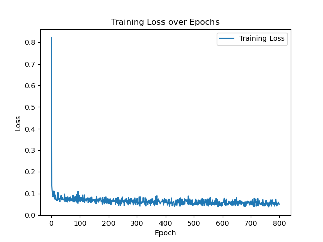

From the training of the model, it can be seen that the loss initially is significantly high, as expected since the model has yet to learn about the shape and details of a brain using the provided OASIS dataset. Afterwards, there is a sharp drop in loss implying that the model has learned atleast the outline of a brain but it then does not seem to have reached a significant process in training in the later epochs.

The images outputted during the training loop appear to provide the shape and details of a brain, but it is blurry and not reaching the expectations of the training image (black background - white brain grayscaled). The following images are sample images of the training at epochs 710, 730, 770, 790.

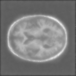 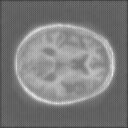 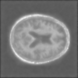 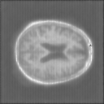

These images are a general idea of what the model has generated from denoising images after adding noise to the images. This possibly provides an insight to why the model does not properly generate an image of a brain as expected.


## Justification

The Adam optimizer is a popular choice for deep learning modules as it adapts learning rates to each parameters during training, thus selecting a basic learning rate of 0.001 allows for balanced learning between initial progression and fine-tuning together with the optimizer's features.

The batch size was sized to be 32 as the provided OASIS dataset have been sliced into 32 per case. The image size has been selected to be 128x128 as 64x64 is considered to be too small for proper clarity of the image outputs and 256x256 may be too big for some of the images from the dataset provided, thus possibly adding inaccuracy to the model.

The number of discrete steps, T, was set to be 500, as it would provide a finer control over denoising process while not taking too long for the model to be trained compared to 200 where it was faster but of lower quality denoising, and 1000, where it would have a higher quality denoising but slower computational complexitity.

Due to time constraints, training was set to be over the course of 800 epochs.


## Future Direction

There are multiple ways that this stable diffusion model from scratch can be improved upon. The main methods for significant improvements are:
* Increasing the complexity of the model for the Backwards Process
* Changing from simple UNet to other models such as ResNet or Conditional U-Nets
* Change the beta schedule equation used (sinusoidal, etc.)
* Improve accuracy of the model by applying different transformations to the initial images
* Changing the number of epochs and change learning rates
* Higher discrete timestep interval for noising/denoising process
* Turn the dataset adapatable to all sorts of MRI images (assuming the dataset is in the same format)
* Check and save best model parameters more often rather than 5 epochs intervals

Areas of significance that needs to be improved upon:
* Obtaining desired images (brains) from results of generating images


## References
* [A Diffusion Model from Scratch in Pytorch](https://colab.research.google.com/drive/1sjy9odlSSy0RBVgMTgP7s99NXsqglsUL) (Heavily Referenced)
* [The Annotated Diffusion Model](https://colab.research.google.com/github/huggingface/notebooks/blob/main/examples/annotated_diffusion.ipynb)
