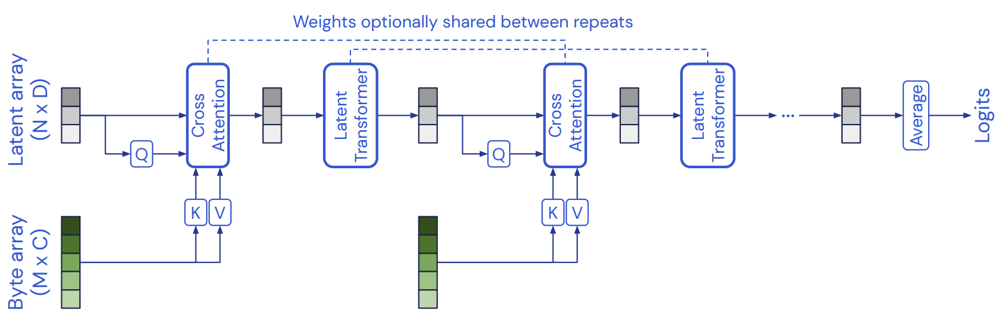
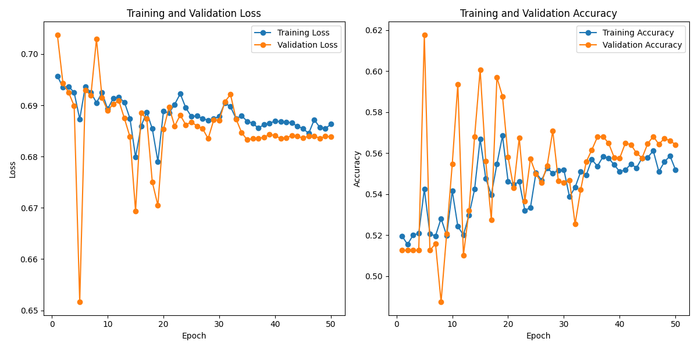
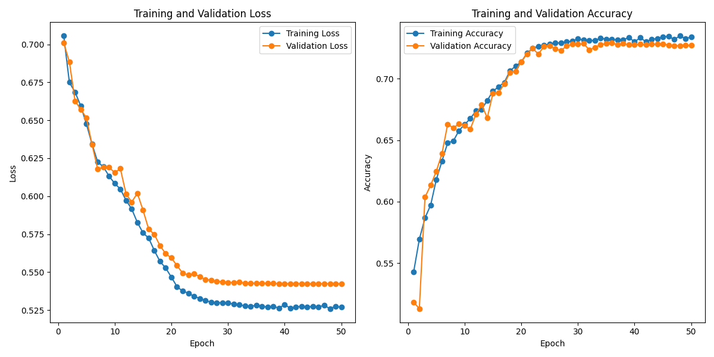

# Pattern Analysis

  

## Introduction

Alzheimer's disease (AD) is a neurodegenerative disorder that affects millions of individuals worldwide. In this project, I leveraged the power of state-of-the-art deep learning techniques to attempt to develop a classifier for Alzheimer's disease, with a focus on differentiating between normal and AD patients using data from the Alzheimer's Disease Neuroimaging Initiative (ADNI).

My approach centers around the Perceiver Transformer, which is a deep learning model based on the groundbreaking research presented in the paper [Perceiver: General Perception with Iterative Attention (arxiv.org)](https://arxiv.org/pdf/2103.03206.pdf). This model has demonstrated remarkable capabilities in a number of computer vision tasks and exhibits promising potential for medical image analysis.
 
The goal is to distinguish between normal and Alzheimer's disease (AD) patients, leveraging magnetic resonance imaging (MRI) data from the Alzheimer's Disease Neuroimaging Initiative (ADNI).

**ADNI Dataset**: ADNI provides an extensive dataset containing MRI scans from healthy individuals and AD patients. This data helps us understand structural brain changes in Alzheimer's disease.

In this README, I explain my approach to data preprocessing, Perceiver Transformer model implementation, training process, and model performance. So far, the model achieved an accuracy of approximately **65%** on the test set.


## Dependencies

Here are the dependencies listed on the [`requirements.txt`](https://github.com/lorenzopolicar/PatternAnalysis-2023/blob/main/requirements.txt):

matplotlib 3.8.0

numpy 1.24.1

scipy 1.11.3

torch 2.1.0+cu118

ADNI dataset


## Perceiver Transformer Model Architecture

 

The Perceiver model is designed to overcome key limitations observed in standard transformer models. Let's delve into its core components:

**Input Array Processing**

The Perceiver begins its journey with input data, which in this case are MRI images. Before entering the attention modules, the input needs to be processed. Specifically, the image is transformed from a (input_channels x height x width) matrix into a (input_channels x height*width) matrix through flattening. However, flattening the image in this manner can lead to the loss of position-dependent context in the image representation. To mitigate this issue, Position Encoding is introduced as a solution.

**Position Encoding: Retaining Spatial Context**

Preserving spatial information is a fundamental challenge in various data processing tasks. In the context of the Perceiver model, a unique technique known as Fourier position encoding is employed to capture and represent the spatial relationships between elements within the input data. The Perceiver model, as described in the paper, [Perceiver: General Perception with Iterative Attention (arxiv.org)](https://arxiv.org/pdf/2103.03206.pdf), is distinguished by its "permutation invariant" principle. This principle signifies that the Perceiver model does not directly depend on the specific spatial arrangement of the elements in the input data (Jaegle et al., 2021).

Instead of relying on the raw spatial positions, the Perceiver model leverages Fourier position encodings. Fourier position encoding is created with a different channel count than the image representation. It's not added to the input data; instead, it's concatenated along the channel dimension, facilitating attention calculations between positions and input (Tigges, 2022). The resulting combined representation is then flattened and can be further adapted using 1D convolution to suit the task at hand and for effective feature extraction. This approach allows the Perceiver model to handle diverse data without relying on explicit spatial information.

 

**Latent Array: A Learnable Parameter**

In the original paper, this array was initialised randomly by drawing from a truncated normal distribution with a mean of 0, a standard deviation of 0.02, and truncation boundaries of [-2, 2] (Jaegle et al., 2021). Remarkably, the model's performance remains relatively consistent across different initialisations of this array. These values were used to initialise my latent array, which plays a significant role in shaping the query vectors used in the cross-attention mechanism.

**Perceiver Cross-Attention: Handling Diverse Inputs**

At the core of the Perceiver's architecture lies the cross-attention module, which maps a byte array and a latent array to a latent array, before processing it using a deep stack of Transformer-style self-attention blocks in the latent space (Jaegle et al., 2021). Here's an overview of how it operates:

- **Layer Normalisation**: The Perceiver starts with layer normaliaation, diverging from the traditional transformer's approach (Tigges, 2022). This is done before being undergoing linear layers to produce each of the query, key, and value inputs.
- **Multi-Head Attention**: For this, a single attention head is used. The latent array functions as the query, while the input data, with position information, fulfills the roles of both key and value inputs.
- **Residual Connection**: A critical aspect is the integration of the latent array with the output of the multi-head attention module, ensuring a smooth flow of data.
- **Layer Normalisation and Feedforward**: After normalisation, a feedforward network with linear layers and the GeLU activation function continues the data transformation process.
- **Dropout**: The inclusion of the dropout enhances the model's robustness, which is subsequently followed by another residual connection. Dropout aids in preventing overfitting by randomly deactivating a fraction of neural units during training, which promoted better generalisation and robustness. This, coupled with the residual connection, further stabilises the model and assists in maintaining the flow of information during training and inference.

**Latent Transformer: Leveraging Decoders**

Following the cross-attention stage, the output proceeds to the "latent transformer tower” as described in the paper. In the paper, the Latent Transformer uses the GPT-2 architecture, which itself is based on the decoder of the original Transformer architecture (Jaegle et al., 2021). This part processes the input data and performs cross-attention over the data patches to create a latent representation. Here, a series of decoder layers are deployed. Notably, this architecture utilises multiple heads to enhance the attention mechanism.

**Perceiver Block: Combining Insights**

These blocks help the model learn complex patterns and features in the data. The Perceiver Block unifies the cross-attention and latent transformer components. It manages either the initial latent array or the output from the previous Perceiver Block.

**Classification Head: Generating Results**

The final part of the Perceiver model includes a classifier head for making binary predictions (AD or normal) based on the learned representations. In the realm of classification, the Perceiver adopts a straightforward approach. It averages the final output from the latent transformer across the index dimension, producing a vector with values corresponding to distinct target classes, which in this case is 2.

This standard architecture of the Perceiver Transformer model described in the paper is implemented in `module.py` and in the following sections, we'll delve deeper into data preprocessing, training, and the model's performance.

## Data Preprocessing and Pipeline

Before feeding the data into the Perceiver model, it is essential to undergo thorough preprocessing to ensure compatibility and effectiveness. The data preprocessing and pipeline in this project consist of the following key steps:

1. **Data Acquisition**

The Alzheimer's Disease Neuroimaging Initiative (ADNI) dataset is the primary data source for this project, which is downloaded from the course blackboard. This dataset contains magnetic resonance imaging (MRI) scans from both healthy individuals and Alzheimer's disease (AD) patients. The dataset serves as the foundation for understanding structural brain changes associated with Alzheimer's disease.


2. **Data Splitting**


To train and validate the Perceiver model, the dataset is divided into separate sets. The common practice is to split the data into three subsets: training, validation, and test sets.

  

- **Training Set**: This portion is used to train the Perceiver model, allowing it to learn and adapt to the underlying patterns in the data. It plays a crucial role in the model's training process.

  

- **Validation Set**: During training, this set helps monitor the model's performance and generalisation. It provides insights into how well the model is learning and whether it's at risk of overfitting or underfitting.

  

- **Test Set**: Once the model is trained, the test set is employed to assess its performance on unseen data. This set helps determine the model's real-world predictive capability and generalizability.

  

The data from the zipped folder [ADNI Alzheimer's dataset](https://adni.loni.usc.edu/) was already split into a training and test set to prevent data leakage, with each dataset containing a split between Alzheimer's and control patients. Each patient had a unique patient ID which ensured their 20 images MRI images were kept together.

  

3. **Data Transformation**

  

Data is subjected to various transformations to ensure uniformity and suitability for the Perceiver model. These transformations may include:

  

- **Resizing**: To maintain consistency in input dimensions, images are resized to a predefined shape (e.g., 256 x 256 pixels).

  

- **Normalisation**: Data normalisation is applied to ensure that pixel values fall within a specific range. This step is vital for effective model training and convergence. The mean values were found by running a script which iterated over the samples and calculated the average.

  

- **Data Augmentation**: Techniques like random horizontal flipping and rotation are employed to augment the dataset, diversify the input, and enhance the model's ability to handle variations.

  

4. **Data Loading**

  

The preprocessed data is loaded into data loaders, a critical component of the training pipeline. Data loaders efficiently handle data batching, shuffling, and other data-related tasks. These loaders are used during both training and validation phases, ensuring that data is fed to the model in a systematic and efficient manner.

  

5. **Batch Processing**

  

During training, the data is processed in batches. Batch processing helps manage memory usage and speeds up the training process. The batch size can be adjusted based on system capabilities and specific requirements.

  

6. **GPU Utilisation**

  

To accelerate model training, the code is designed to utilise Graphics Processing Units (GPUs) when available. GPUs offer significant speed improvements, allowing the model to process data and update parameters more quickly.

  

The data preprocessing and pipeline are designed to make the Perceiver model compatible with the ADNI dataset and to facilitate effective model training and evaluation. These steps lay the foundation for robust and accurate Alzheimer's disease classification. 

  

##  Training and Validation: Hyperparameters Tuning and Improvements

  

### Initial Performance

  

Initially I set my parameters to the following:  
  

| Parameter             | Value                |
|-----------------------|----------------------|
| input_shape           | (256, 256)           |
| latent_dim            | 16                   |
| embed_dim             | 16                   |
| attention_mlp_dim     | 16                   |
| transformer_mlp_dim   | 16                   |
| transformer_heads     | 8                    |
| dropout               | 0.1                  |
| transformer_layers    | 8                    |
| n_blocks              | 8                    |
| n_classes             | 2                    |
| lr                    | 0.001                |
| batch_size            | 16                   |


  

The log and plot suggests that the model's performance is not improving significantly over the 50 epochs. The training and validation accuracy values appear to be relatively stable, with the model achieving accuracy levels around 0.51 to 0.57. The validation accuracy does not seem to show substantial improvement, which could indicate that the model definitely needs further optimisation or adjustments to achieve better classification performance. There are a couple of reasons why the performance was poor:

  

- **Small Batch Size**: Because the batch size is too small, the model is not able to learn effectively from each batch, leading to erratic behavior. Larger batch sizes can provide more stable updates.
- **Complexity of Model**: The model architecture, with multiple Perceiver blocks and a high number of layers, might be overly complex for the dataset. This can make the training process more sensitive to initial conditions and prone to erratic behavior.
- **No Data Augmentation**: This was before I implemented the data augmentation. Without data augmentation, the model trains on the exact same dataset repeatedly and thus might not learn rich and discriminative features. This lack of diversity can lead to overfitting, where the model becomes highly specialised to the training examples but struggles to generalise to unseen data.
- **Incorrect Fourier Position Encoding Implementation**: This was before I revised my fourier features function. If Fourier position encoding is not correctly applied, it can fail to capture the relationships and spatial dependencies between different elements in the input. This loss of spatial context can lead to misinterpretations of the data. The attention mechanism in the Perceiver model relies on accurate positional information. If the Fourier encoding is not properly integrated, it can hinder the model's ability to attend to the right parts of the input, impacting its decision-making.

  

### Improved and Final Performance


| Parameter             | Value                |
|-----------------------|----------------------|
| input_shape           | (256, 256)           |
| latent_dim            | 32                   |
| embed_dim             | 32                   |
| attention_mlp_dim     | 32                   |
| transformer_mlp_dim   | 32                   |
| transformer_heads     | 6                    |
| dropout               | 0.2                  |
| transformer_layers    | 6                    |
| n_blocks              | 6                    |
| n_classes             | 2                    |
| lr                    | 0.004                |
| batch_size            | 32                   |

 
 

 - **Following the paper**: I revised the original paper and aligned a few hyperparameters with the best performing model in their experiments. Matching the number of transformer layers to the best-performing model in the paper (6 blocks) can boost the model's ability to comprehend intricate patterns. Similarly, aligning the number of Perceiver blocks with the best-performing model in the paper (6 blocks) grants the model a robust representational capacity (Jaegle et al., 2021). It was also mentioned that increasing the size of the latent dimension helps performance up to a point, but often leads to overfitting. By experimenting with the dimensions, I found that these dimensions parameters had the best performance.
 - **Reducing Complexity**: Furthermore, I decided to reduce the complexity of the model. Occam's Razor is a principle in machine learning that suggests that the simplest model that explains the data is often the best. A complex model introduces more parameters, making it more flexible and capable of fitting the training data more closely. However, a simpler model, with fewer parameters and a more straightforward structure, is more likely to generalise well to unseen data. As there was a limited amount of training data, complex models with many layers, hidden units, or attention heads have a higher risk of overfitting. With a limited dataset, there may not be enough diverse examples to support highly complex models. A simpler model is less prone to fitting the noise in the data, which is why I reduced the number of layers and blocks.
 - **Increase Batch Size**: Additionally, I increased the batch size to provide more stable and consistent updates to the model's weights. This can lead to faster convergence during training, which may help in regularising the model.
 - **Scheduler** I also implemented a scheduler for the learning rate, which dynamically adjusts the learning rate during training to help improve model convergence and achieve better results.
 - **Data Augmentation** Data augmentation also improved my training. By applying transformations like rotations, translations, flips, and scaling to the original data, I created a more diverse set of training examples. This increased variety exposes the model to a wider range of patterns, shapes, and orientations. It helps the model learn to be invariant to small changes in the input data and generalise better to unseen examples. It also reduces overfitting as it acts as a form of regularisation by introducing randomness and diversity into the training set. This helps the model generalise better to the validation and test datasets and reduces overfitting.

  

## Final Plot Analysis and Conclusion

  

- **Training Loss**: The training loss starts relatively high and decreases over the epochs. This is typical behavior as the model learns to fit the training data better.

  

- **Validation Loss**: The validation loss also starts high and decreases initially but appears to stabilise or slightly increase after a certain number of epochs. This could be a sign of overfitting. When the training loss continues to decrease while the validation loss starts to increase or plateaus, it suggests that the model might be overfitting.

  

- **Training Accuracy**: The training accuracy increases over the epochs, indicating that the model is fitting the training data better.

  

- **Validation Accuracy**: The validation accuracy increases initially but eventually reaches a plateau, indicating that the model's performance on the validation data is not improving significantly after a certain point.

  

Here's a breakdown:

  

- Initially, the model is learning and improving both in terms of training and validation accuracy.
- After a certain epoch, the validation loss appears to stabilise or slightly increase, while the training loss continues to decrease. This is a clear sign of overfitting. The validation accuracy also plateaus or shows little improvement after this point, even though the training accuracy continues to increase.
- More experimentation should be conducted in finetuning the hyperparameters and reducing complexity of the model to prevent overfitting.
- More experimentation could have also been done on different drop out rates and different regularisation techniques.
- Training for more epochs, could have also improved the accuracy, but early stoppage should be observed if there are no improvements in validation loss.

  

## Reproducibility

  

The dataset folder is in the following structure:

	ADNI/
		train/
			AD/
				IMAGES
			NC/
				IMAGES
		test/
			AD/
				IMAGES
			NC/
				IMAGES

  
  

To reproduce the data loading module, go to `dataset.py` and insert the path to the ADNI folder that has the above structure.

  

You can run the `train.py` with any of the hyperparameters, but you should specify the path and filename for where you want to store the model file like so:

  

```torch.save(best_model_state, 'saved/best_model.pth')```

  

After training is finished, you can copy and paste the output of the script (training data) on a text file in the `out/` directory. You can then run the `plot.py` script which plots the training and validation accuracy and loss with `matplotlib`.

  

If you want to see your model’s accuracy on the unseen test set, run the `test.py` script which loads your saved model file and evaluates the test dataset.

  

## References

Jaegle, A., Gimeno, F., Brock, A., Zisserman, A., Vinyals,  O., & Carreira, J. (2021). Perceiver: General Perception with Iterative Attention. ArXiv:2103.03206 [Cs, Eess]. Retrieved from https://arxiv.org/abs/2103.03206

Tigges, C. (2022, August 19). The Annotated Perceiver - Curt Tigges - Medium. Retrieved October 19, 2023, from Medium website: https://medium.com/@curttigges/the-annotated-perceiver-74752113eefb