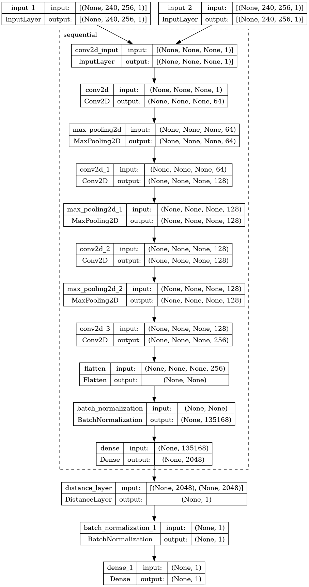
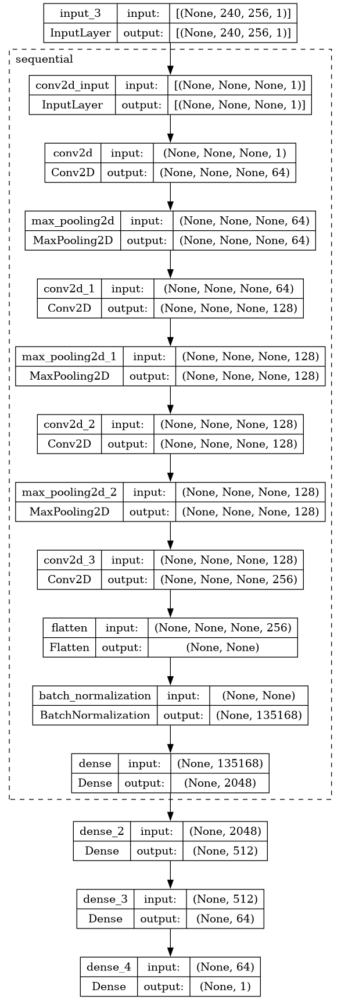
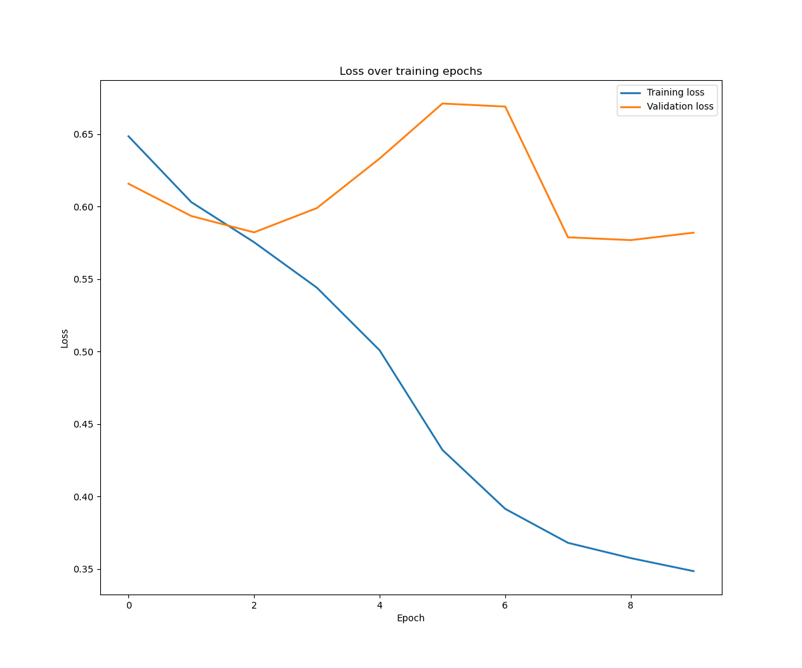
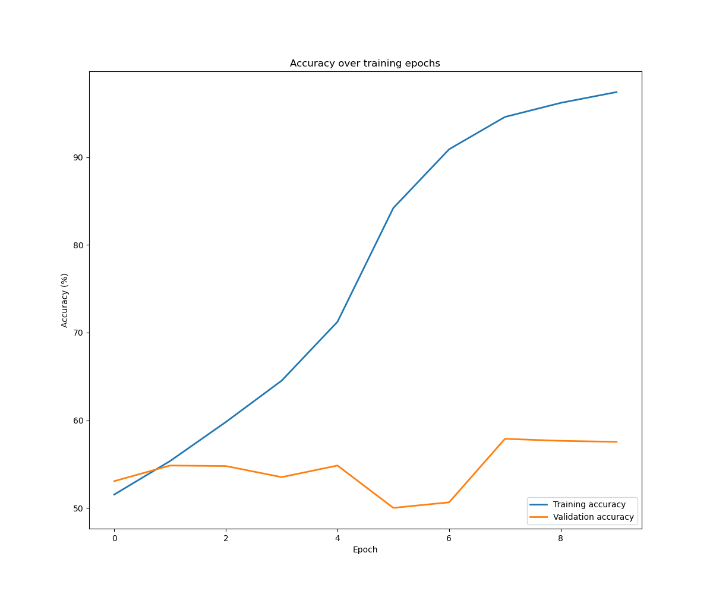
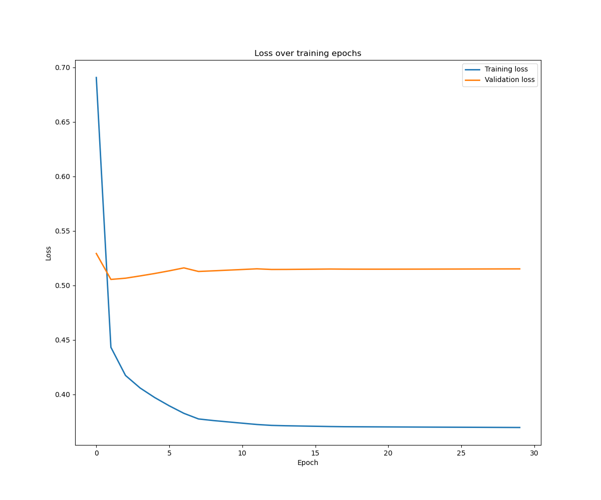
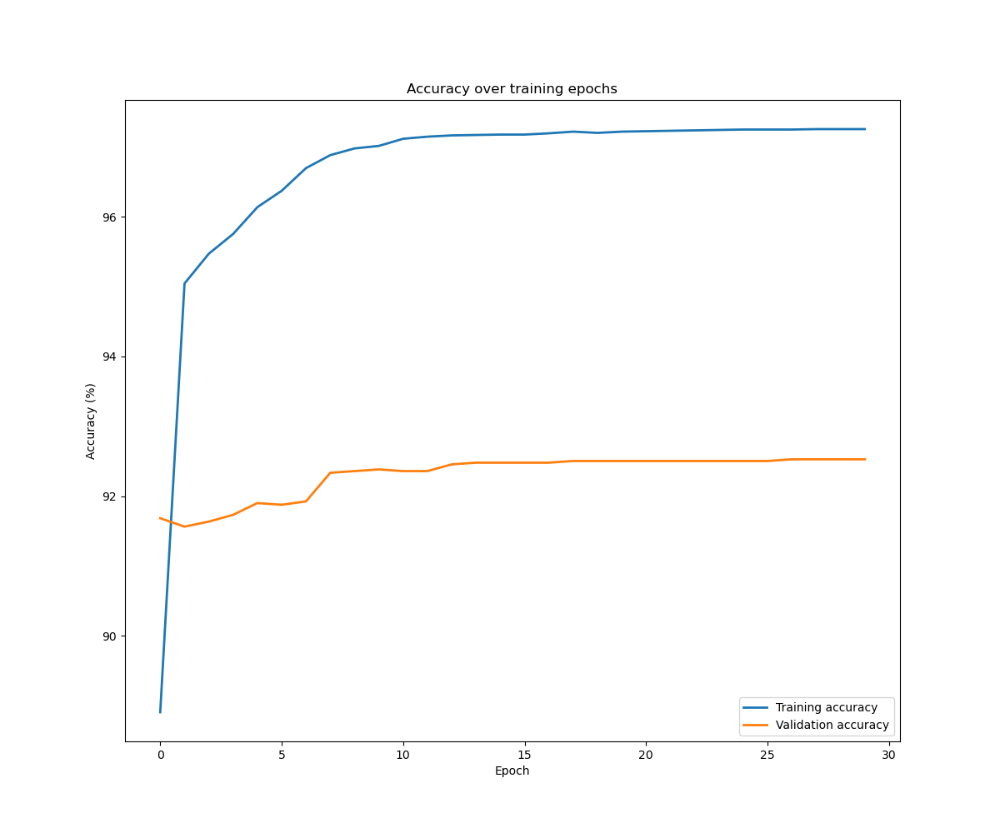
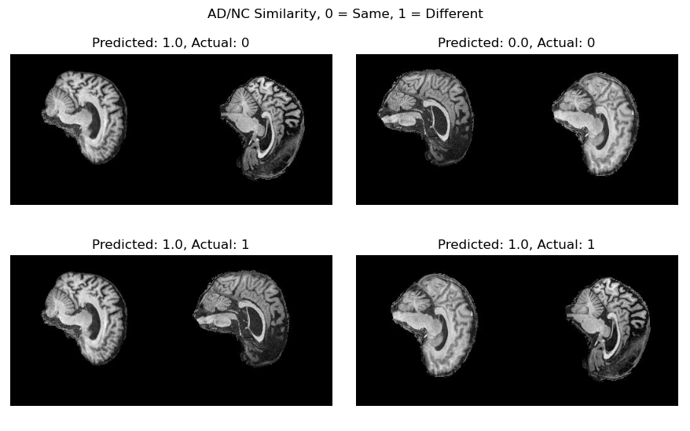
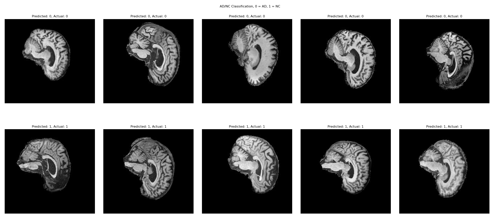

# Siamese Network classifier for the [Alzheimer's Disease Neuroimaging Initiative Dataset](https://adni.loni.usc.edu/)

## Problem to solve

The goal of this project is to train a Siamese network to perform similarity checks on brain MRI images and then extract the trained embedded network to classify the images into one of the following classes:
- `AD` (Alzheimer's Disease present)
- `NC` (Cognitive Normal)

## Data

The dataset used for this project is the [Alzheimer's Disease Neuroimaging Initiative Dataset](https://adni.loni.usc.edu/), which contains MRI images of the brain from patients with Alzheimer's Disease and Cognitive Normal patients.

All images are `240x256` grayscale images.

An example image, with Alzheimer's Disease present, is shown below:


### Preprocessing

The dataset was preprocessed using the following steps for training the Siamese network:
- Images loaded in grayscale.
- Color values normalized to `[0, 1]` by dividing by `255`.
- Images were randomly paired and labeled as `0` if they were from the same class and `1` if they were from different classes (i.e. similar or dissimilar).
- The `train` subset was balanced, shuffled and then split into training and validation sets using an `80:20` split. Patient-level stratification was used to ensure that the same patient did not appear in both the training and validation sets.

For the classifier, the following steps were used:
- Images loaded in grayscale.
- Color values normalized to `[0, 1]` by dividing by `255`.
- Images were assigned a label of `0` if they were from a patient with Alzheimer's Disease and `1` if they were from a patient with Normal Cognition.
- The `train` subset was balanced, shuffled and then split into training and validation sets using an `80:20` split. Patient-level stratification was used to ensure that the same patient did not appear in both the training and validation sets.

## Architecture

The architecture was originally based on the [Siamese Neural Networks for One-shot Image Recognition](https://www.cs.cmu.edu/~rsalakhu/papers/oneshot1.pdf) paper by Koch et al. The model has been modified with some additional layers to improve performance.

The Siamese network is shown below (note that the sequential group of layers is repeated for each image in the pair - `input_1` and `input_2`):



For the classifier, the embedded network is used to extract features from the images. These features are then passed through a fully connected layer with a `sigmoid` activation function to predict the class of the image. The architecture used for the classifier is shown below:



### Custom distance layer

Since a Siamese network is used to determine the similarity between a pair of inputs, a custom distance layer is used to calculate the distance between the two embedded vectors.

For this task, I implemented the `L2` norm distance function in a custom `DistanceLayer`, which can be found in `modules.py`.

### Loss functions

The loss function used for the Siamese network is the `contrastive_loss`. This loss function is from [Image similarity estimation using a Siamese Network with a contrastive loss](https://keras.io/examples/vision/siamese_contrastive/#define-the-contrastive-loss) by the Keras team.

The loss function used for the classifier is TensorFlow's built-in `binary_crossentropy` loss function, since the classifier is a binary classifier (AD or NC).

## Performance

The Siamese network was trained for 10 epochs with a batch size of 32. The classifier was trained for 30 epochs, again, with a batch size of 32.

Graphs of the training and validation loss and accuracy for both the Siamese network and the classifier are shown below, along with the final test accuracy for each model.

### Siamese network





Test accuracy: 52.14%

### Classifier





Test accuracy: 67.12%

Unfortunately, the classifier did not perform as well as expected and did not meet the 80% accuracy requirement. This is likely due to the fact that the Siamese network was not able to learn the features of the images well enough to be able to classify them. Even when the Siamese network was trained and achieved a test accuracy of >99%, the classifier was only able to achieve limited test accuracy.

### Results

Similarity and classification results for the Siamese network and classifier, generated by `predict.py`, are shown below:





Over the limited set of 10 images, the classifier was able to correctly classify all 10 images. Though as mentioned above, the accuracy over the entire test set was only 67.12%.

## Dependencies

Recommended library/runtime versions (all code was tested using these versions):

- `tensorflow >= 2.13.0`
- `numpy >= 1.26.1`
- `matplotlib >= 3.8.0`
- `python >= 3.11.5`

## Training and testing the model

### Training

To train the model, run the following command:

```bash
python train.py
```

This will train the model(s) and save the model in the TensorFlow `SavedModel` format in the `models` directory. The dataset directory is specified in the `constants.py` file. The tree of the directory must be as follows:

```
dataset
├── train
│   ├── AD
│   │   ├── 1234_1.jpeg
│   │   ├── ...
│   │   └── 4321_9.jpeg
│   └── NC
│       ├── 5678_1.jpeg
│       ├── ...
│       └── 8765_9.jpeg
└── test
    ├── AD
    │   ├── 1234_1.jpeg
    │   ├── ...
    │   └── 4321_9.jpeg
    └── NC
        ├── 5678_1.jpeg
        ├── ...
        └── 8765_9.jpeg
```

### Testing

To test the model(s), run the following command:

```bash
python predict.py
```

This will load the Siamese network and classifier models from the `models` directory and test them on the test dataset.

It will also sample some images from the test set, perform a similarity check using the original Siamese network and plot them along with their predicted labels using the classifier model.
