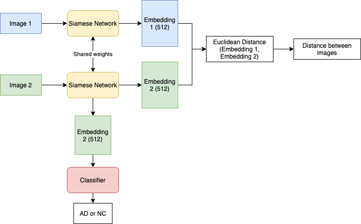
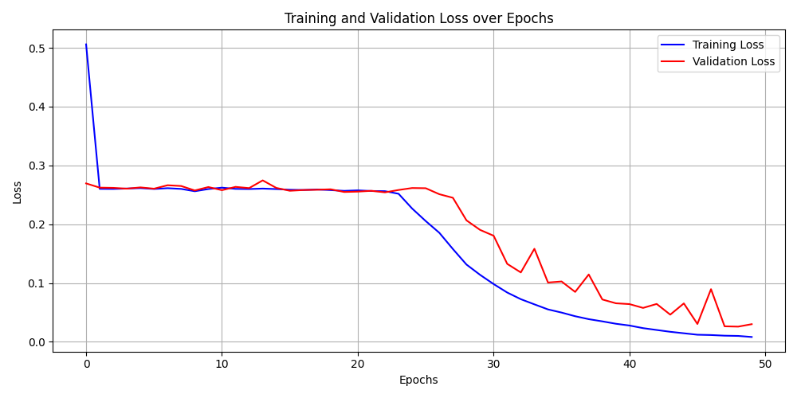
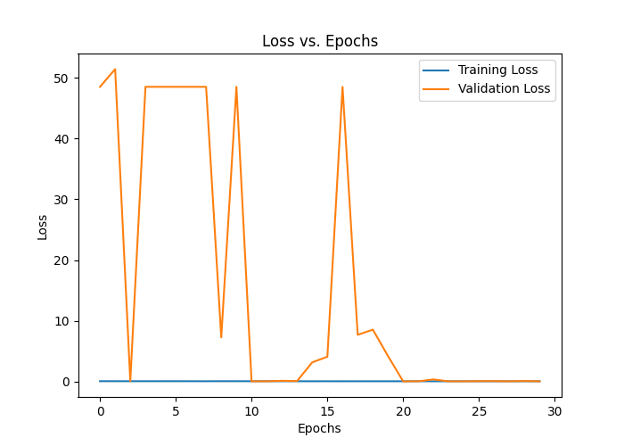
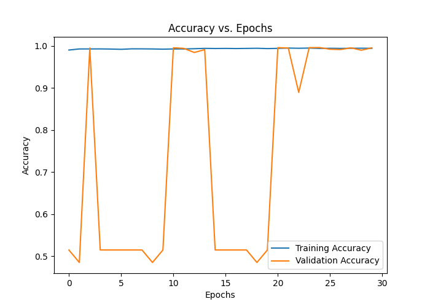

# Classifier based on Siamese Network to Classify Alzheimer's Disease on ADNI Dataset

This repository implements a Siamese Network that will be trained to generate embeddings of images of the ADNI dataset. A classifier (fully connected layers) is added at the end of the trained Siamese Network to classify Alzheimer's  Disease on the dataset.

## ADNI Dataset
The ADNI dataset consists of brain MRI images with the class labels AD (0) and NC(1). There are 21520 images in the training dataset and 9000 images in the testing dataset. Images in the dataset has the dimensions 240x256.

AD            |  NC
:-------------------------:|:-------------------------:
  |  


## General Overview of the Siamese Network
A Siamese Neural Network or twin neural network is an architecture that is made to differentiate between two inputs. It consists of two sub-networks that share the same weights and parameters. Each sub-network accepts a single input, or in this case image, and produces a feature vector or embeddings of the image. The euclidiean distance between the embeddings from both sub-networks are then calculated to determine the similarity between the inputs. The goal is to update the weights of the sub-networks so that the distance between inputs of the same class is small and the distance between inputs of different classes is large.

The loss function that is used in this implementation is the contrastive loss. The loss penalises large distances for similar pairs (pairs in the same class) by increasing the loss as the distance grows. For dissimilar pairs (pairs in different classes), it penalises distances that are less than a specified margin, ensuring that images that are different should be at least a margin apart.

```
class ContrastiveLoss(torch.nn.Module):
   # label=0 for negative pairs, label=1 for positive pairs
    def __init__(self, margin=1.0):
        super(ContrastiveLoss, self).__init__()
        self.margin = margin

    def forward(self, distance, label):
        # Compute contrastive loss
        loss_contrastive = torch.mean((label) * torch.pow(distance, 2) +
                                      (1-label) * torch.pow(torch.clamp(self.margin - distance, min=0.0), 2))
        return loss_contrastive
```

Below is a graph that explains the data flow through the networks:



Pairs of images are fed into the Siamese network to generate their embeddings. The euclidean distance between the pair of embeddings are then calculated and passed into the contrastive loss during training. A classifier is added on at the end of the trained Siamese network to classify Alzhemier's Disease.

The backbone architecture of the Siamese network used in this implementation is based on PyTorch's ResNet-18 with several modifications. The modifications include modifing the first convolutional layer and deleting the last layer. The classifier's architecture consists of fully connected layers, utilising ReLU activation functions, dropout, and batch normalisations. Most importantly, the classifier model incorporates a pre-trained Siamese network, with its weights frozen during training.

## Pre-processing the Dataset
The training data of the ADNI dataset is split into 80% training and 20% validation data.

To train the Siamese network, the training and validation data need to be grouped into pairs. Pairs that are in the same class are labelled as 1 and pairs that are in different classes are labelled as 0. The process of grouping the dataset into pairs can be found in `dataset.py`.

To train the classifier, training and validation data are loaded using the DataLoader library, without organizing them into pairs.

The training data goes through these pre-processing steps: 
1. Convert images into grayscale.
2. Do data augmentation by RandomHorizontalFlip.
3. Convert images to tensors .

## Training Parameters and Results
The process of training a Siamese network and a classifier is a follows:
1. Train a Siamese Network on image pairs using contrastive loss.
2. Train classifier that is added at the end of the trained Siamese network, while freezing the trained Siamese network weights. BCE Loss is used along with a with a learning rate scheduler.
3. The trained classifer will then be evaluated on the test set.

The hyperparameters that are tuned for both models are number of epochs and learning rate. An additional hyperparameter for the Siamese network is the margin for the contrastive loss. Both the Siamese network and the classifier uses the Adam optimiser during training.

The training experiments for both the Siamese network and the classifier are detailed below in a table. The experiments include trying out different hyperparameter values and model architectures. The 'Test Result' column indicates the accuracy achieved by the trained classifier on the test set.

| Siamese Model Name | Epoch | Learning Rate | Margin | Loss Training | Loss Validation | Classifier Name                   | Epoch | Learning Rate | Loss/Accuracy Training for the last epoch | Loss/Accuracy Validation for the last epoch | Test Result | Notes                                                                                         |
| ------------------ | ----- | ------------- | ------ | ------------- | --------------- | --------------------------------- | ----- | ------------- | ----------------------------------------- | ------------------------------------------- | ----------- | --------------------------------------------------------------------------------------------- |
| siamese_50.pth     | 50    | 0.1           | 1      | 0.008         | 0.03            | classifier_model_50_30.pth        | 30    | 0.01          | 0.693/0.518                               | 0.694/ 0.506                                | 0.504       |                                                                                               |
| siamese_40.pth     | 40    | 0.01          | 1      | 0.253         | 0.254           | classifier_model_40_30.pth        | 30    | 0.01          | 0.693/0.519                               | 0.693/ 0.508                                | 0.504       |                                                                                               |
| siamese_50.pth     | 50    | 0.1           | 1      | 0.008         | 0.03            | classifier_model_50_25.pth        | 25    | 0.1           | 52.201/0.478                              | 49.630/0.504                                | 0.496       |                                                                                               |
| siamese_50.pth     | 50    | 0.1           | 1      | 0.008         | 0.03            | classifier_model_50_50.pth        | 50    | 0.01          | 48.356/0.516                              | 48.171/0.518                                | 0.504       |                                                                                               |
| siamese_50.pth     | 50    | 0.1           | 1      | 0.008         | 0.03            | classifier_model_50_20.pth        | 20    | 0.01          | 0.031/0.994                               | 48.681/0.513                                | 0.504       | make classifier's architecture more complex                                                   |
| siamese_50.pth     | 50    | 0.1           | 1      | 0.008         | 0.03            | classifier_model_50_20_2.pth      | 20    | 0.01          | 0.035/0.994                               | 0.262/0.948                                 | 0.648       | increase dropout for classifier, add weight decay for optimiser                               |
| siamese_50.pth     | 50    | 0.1           | 1      | 0.008         | 0.03            | classifier_model_50_30_2.pth      | 30    | 0.01          | 0.036/0.992                               | 49.190/0.509                                | 0.504       |                                                                                               |
| siamese_50.pth     | 50    | 0.1           | 1      | 0.008         | 0.03            | best_classifier_model_50_30_3     | 30    | 0.01          | 0.026/0.995                               | 0.017/0.996                                 | 0.721       | Saved the best model of the whole training loop and tested on it, add learning rate scheduler |
| siamese_40_2.pth   | 40    | 0.1           | 1      | 0.003         | 0.042           | best_classifier_model_40_20.pth   | 20    | 0.01          | 0.041/0.994                               | 0.019/0.995                                 | 0.68        |                                                                                               |
| siamese_40_3.pth   | 40    | 0.1           | 1      | 0.003         | 0.021           | best_classifier_model_40_20_2.pth | 20    | 0.01          | 0.014/0.997                               | 0.006/0.998                                 | 0.71        | make the classifier simpler                                                                   |


At first, two Siamese networks were trained, each having different hyperparameters. The best out of the two is the "siamese.50.pth" that has the lower training and validation loss. Multiple classifiers are then trained on top of "siamese.50.pth" with different hyperparameters.

The classifer that has the highest accuracy is "best_classifier_model_50_30_3.pth" with the accuracy score of 0.721. To reach this accuracy, it involved a series of  experimental adjustments: making the classifier's architecture more complex, increasing the dropout rate of the classifier, introducing weight decay to the optimiser, adding a learning rate scheduler during training, and implementing a strategy to save the best classifier during training.

Below is the loss plot when training siamese.50.pth (the best Siamese)
 
Observing the plot above, the Siamese model converges to a low loss.

Below are the loss and accuracy plots when training best_classifier_model_50_30_3.pth (the best classifier)
Loss of classifier         |  Accuracy of classifier
:-------------------------:|:-------------------------:
 |  

Observing the loss plot above, from the first epoch, the training loss has already reached a minimum loss. The validation loss in the first couple of epochs fluctuates and then converges to a minimum loss at 20 epochs.

Observing the accuracy plot above, from the first epoch, the training accuracy is already above 0.9. The validation accuracy in the first couple of epochs fluctuates and then converges to a high accuracy at 23 epochs.

From both plots above, it can be concluded that the classifier overfits to the training data. One way to remedy overfitting is to make the classifier's architecture simpler since the current architecture can already learn well during the first few epochs. 

## Testing Results
The best classifer was only able to reach 72% on the test set. More experiements (changing architectures, more data augmentation, do normalisation,regularisation, etc.) and more time can hopfully achieve higher accuracy.
 
 To do inference on a trained Siamese and classifier, run the `predict.py` file. There is a section called `#----DEFINE MODEL PATHS----  ` where you can modify the paths of the trained models. The `predict.py` will do inference using both models of one input image. A test set path needs to be defined to extract a single input image and its corresponding label.

## Dependencies and Reproducibility
Below are the librarys needed to run the files in this repository:
- python 3.11.4
- torch 2.0.1
- torchvision 0.15.2
- numpy 1.25.2
- matplotlib 3.7.2 

To run the code files, make sure you have the ADNI dataset downloaded and modify the data paths in the `train.py` and `predict.py` if needed. The downloaded dataset must have the following file structure for the `dataset.py` to successfully process it:
```
├── AD_NC
│   ├── test
│   │   ├── AD
│   │   ├── NC
│   ├── train
│   │   ├── AD
└── └── ├── NC
 ```

 To train your own Siamese and classifier, run the `train.py`. This code file will train the Siamese network, train the classifer, and evaluate the classifier on the test set. `train.py` will also save the trained Siamese and classifer into your local repository, including some training plots. Make sure to modify the name paths of the saved models if needed. 

Concerning reproducibility, you won't get the same results because of the randomness on how to make pairs of images and splitting the data into training and validation. For further improvements, setting a seed to generate the pairs of images and to split the data can increase the chances of reproducibility and get more stable testing results.

This code was implemented and executed on rangpur with vgpu. It would be preferable if you execute the code(s) on a device or server that provides a GPU for accelarated training.

## References
-  https://github.com/pytorch/examples/blob/main/siamese_network/main.py
- https://pyimagesearch.com/2021/01/18/contrastive-loss-for-siamese-networks-with-keras-and-tensorflow/ 
-  https://keras.io/examples/vision/siamese_contrastive/  
- https://en.wikipedia.org/wiki/Siamese_neural_network 
