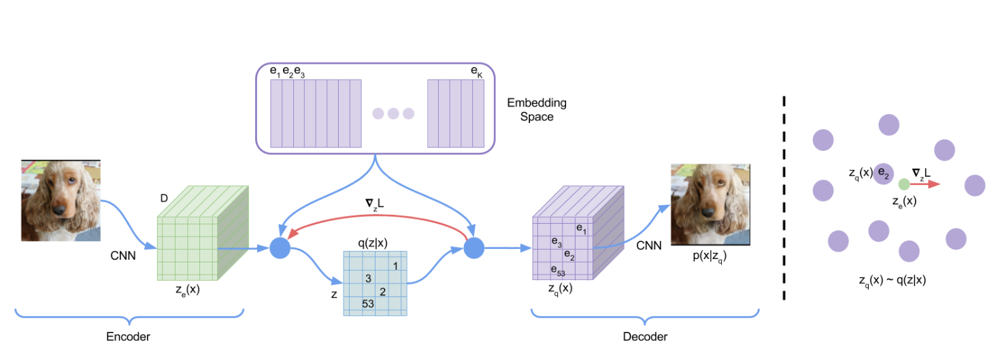
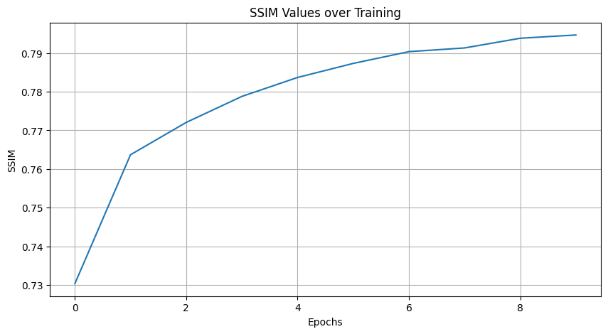
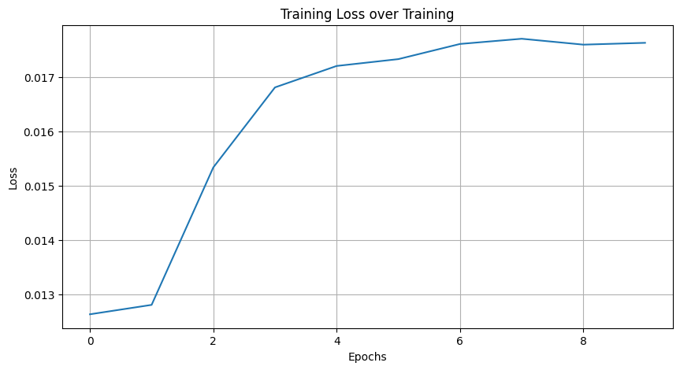
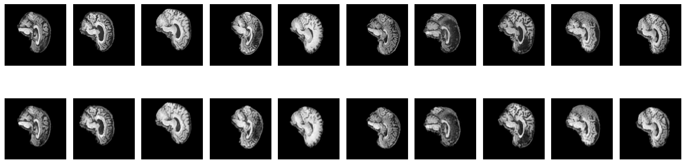
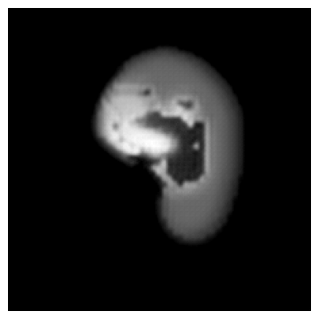

# COMP3710 - Pattern Recognition & Analysis Report

student number: 47670668

Chosen project: #8 - Vector Quantised Variational Auto Encoder (VQ-VAE) on ADNI dataset.

# VQVAE for ADNI Brain Data Set Generation
## Description
Variational autoencoders (VQVAE) are a class of generative models proficient in reconstructing and generating high-dimensional data from lower-dimensional embeddings. In our unique implementation, we incorporate histogram distribution to generate new latent codes. Our combined approach not only reconstructs the intricate details and structures of brain scans but also achieves a Structured Similarity (SSIM) of over 0.6.

## How it works
### VQVAE:
VQVAE employs an encoder that maps input images to lower-dimensional latent codes and a decoder that reconstructs images from these codes. A distinguishing feature of VQVAE is the use of a vector quantizer, which discretizes the continuous latent space, allowing for a more effective training and reconstruction process.

The image below depicts the architecture of the VQVAE  

## Data Pre-processing
The ADNI brain data set was pre-processed by:

- Normalizing the pixel values between 0 and 1.
- Resizing the images to a consistent size for input to the VQVAE.
- Training-Validation Split: 80-20

The training set accounts for 80% of the train directory from the ADNI dataset. The validation set, 20%, ensures hyperparameter tuning without overfitting. The test set comes from a separate test directory from the ADNI dataset.

### Model Overview

Encoder: The encoder architecture begins with an input image in greyscale (single channel). It uses a series of Conv2D layers with varying kernel sizes and strides to gradually reduce the spatial dimensions while increasing the channel depth. Each convolutional layer is followed by a batch normalization layer and ReLU activation function.

Codebook: The codebook is defined by the number of embeddings and their dimensions. It is a crucial part of the VQ-VAE, acting as a discrete latent space for the encoder's output.

Decoder: The decoder architecture uses ConvTranspose2D layers (deconvolution) to upscale the spatial dimensions and restore the input image's original resolution. The output is passed through a tanh activation function to obtain the final reconstructed greyscale image.

### Hyperparameters

- Max training iterations: 10,000 updates
- Epochs: 10
- Encoder/Decoder hidden units: 256
- Residual hidden units: 64
- Number of residual layers: 2
- Embedding dimensions: 64
- Number of embeddings: 128
- Commitment cost: 0.25
- Weight decay: 1e-5
- Learning rate: 1e-5

### Model Architecture
Residual Stack: A stack of convolutional layers where the output is added to the input, facilitating the flow of information and gradients during training. This architecture contains two types of convolutional layers: a 3x3 followed by a 1x1 convolution.

Encoder Details: The encoder consists of three convolutional layers with increasing depth. Following the convolutional transformations, the encoded representations are passed through a residual stack for further processing.

Decoder Details: The decoder starts by upscaling the quantized latent space using deconvolutional layers. Similar to the encoder, it uses a residual stack to enhance the reconstructed representations. The final layers upscale the features back to the original resolution.

## Model Results

### SSIM VQVAE plot
After 10 epochs the model got an average ssim of . After running the model on the test set it has the average SSIM of 0.8988.

The graph below plots the SSIM value throughout training the VQVAE  

The graph below plots the training loss throughout training the VQVAE  

## Dependencies
- Pytorch
- torchvision
- Matplotlib
- numpy
- pytorch-msssim
- copy

## Usage

### Installation
Ensure that you have Python 3.x and all the dependencies listed above installed. Clone this repository to your local machine and navigate to the cloned directory.

### Using Custom Datasets

The `dataset.py` script is currently set up to work with the ADNI dataset. If you wish to use a different dataset, you may need to make a few adjustments to the script.

#### For ADNI Dataset
To use the ADNI dataset:

1. Download the ADNI brain dataset from the [ADNI website](http://adni.loni.usc.edu/data-samples/access-data/).
2. Place the dataset in an appropriate directory (e.g., `./AD_NC/`).
3. The script assumes the following directory structure: 
/AD_NC/ 
├── train/ 
│ ├── class1/ 
│ ├── class2/ 
│ ... 
└── test/ 
├── class1/ 
├── class2/ 
... 

#### For Other Datasets
To adapt `dataset.py` for a different dataset:

1. **Data Directory**: Ensure your data is structured in a similar way to the ADNI dataset, with separate folders for training and testing.
2. **Modifications in `dataset.py`**: You may need to modify the data loading and preprocessing steps. Specifically, pay attention to:
- The path to your dataset in the script.
- Image preprocessing steps such as resizing, normalization, or augmentation methods to match the characteristics of your new dataset.
- The split ratio between training and validation datasets, if different from the current setup.
3. **Adjusting the Model**: Depending on the nature of your new dataset, you might need to adjust the input channel size in the model architecture.

After making these changes, you can proceed with training and evaluating the model on your custom dataset as described in the next section.

### Running the Code
To train the model with the default settings, simply run:
 
`python train.py`

For testing the model and generating new images, use:
 
`python predict.py`

## Example Inputs, Outputs, and Generated Images
### Reconstructed MRI Image by VQVAE
The image below is the reconstructions from training at the last (10th) epoch. The top images are the original brain scans and the bottom are the reconstructions.  

The image below is the reconstructions from testing. The top images are the original brain scans and the bottom are the reconstructions.  

### Generated: New MRI Images
The image below is the generated images from the samples fetched from the histogram distribution.  

## References

This project was inspired by and based on the following works:

- Oord, A. van den, Vinyals, O., & Kavukcuoglu, K. (2017). [Neural Discrete Representation Learning](https://arxiv.org/abs/1711.00937). 
- [Official VQ-VAE implementation in TensorFlow](https://github.com/google-deepmind/sonnet/blob/v2/sonnet/src/nets/vqvae.py) by DeepMind.
- [Vector Quantised-Variational AutoEncoder (VQ-VAE) PyTorch Implementation](https://github.com/airalcorn2/vqvae-pytorch) by [airalcorn2](https://github.com/airalcorn2).
