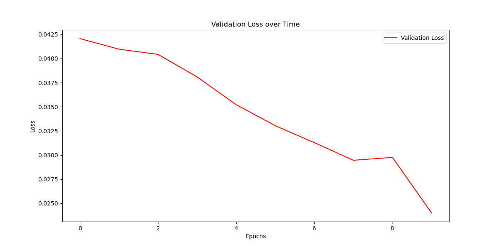
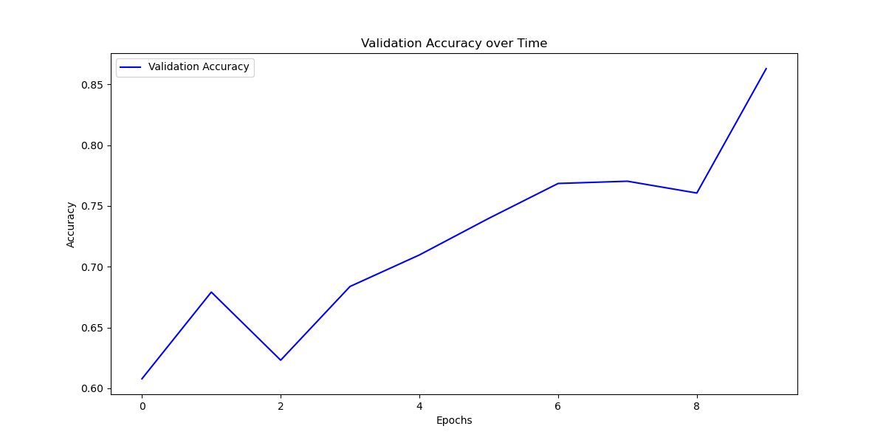

# AlzViT

This repository contains the code for training a custom made Visual-Transformer based model used to identify Alzheimer's disease in 2D sliced MRI brain scans. The model was trained on the [Alzheimer's Disease Neuroimaging Initiative (ADNI)](http://adni.loni.usc.edu) dataset which contains a number of sliced MRI brain scan images separated into Cognitive Normal (NC) and Alzheimer's (AD) classifications. The model is centered around the Vision Transformer (ViT) first introduced in the paper "An Image is Worth 16x16 Words: Transformers for Image Recognition at Scale" [1] which works by dividing an image into fixed-size patches and leveraging self-attention mechanisms for feature extraction and pattern recognition.

## The Visual Transformer Algorithm

ViT is a groundbreaking deep learning architecture originally designed for image recognition, inspired by the "An Image Is Worth 16x16 Words" paper by Dosovitskiy et al. [1]. The algorithm processes images by breaking them down into patches, treating each patch as a token, and leveraging transformer layers to capture global image relationships. ViT's efficiency and scalability make it an invaluable tool in computer vision tasks, offering the ability to extract complex patterns and relationships within images effectively.

### Why ViT in Our Use Case?

In our Alzheimer's Disease Classifier project, ViT plays a pivotal role in the accurate diagnosis of Alzheimer's disease from brain scan images. ViT's adaptability to image data, strong performance in classification tasks, and scalability align perfectly with our goals. By integrating ViT, we empower medical professionals and researchers with an advanced tool to help identify potential Alzheimer's in a patient's brain.

## Dependencies

-   Python 3.x
-   torch==1.10.0
-   torchvision==0.11.1
-   Pillow==8.2.0
-   scikit-learn==0.24.2
-   matplotlib==3.4.2

To install the required packages, run the following command:

```
pip install -r requirements.txt
```

### Environment Used for Development

Please note that this code base was developed and used on an ARM64 architecture making use of the mps api within the pytorch library. The machine used for testing having 64 GB of RAM and an M1 Max Chip.

If you do wish to replicate these results I suggest either using an ARM based system or if using a Windows based system alter the code base to make use of the CUDA GPU Acceleration.

## Dataset

The dataset used in this project is the Alzheimer's Disease Neuroimaging Initiative (ADNI) dataset, which is widely recognized for Alzheimer's disease research. The ADNI dataset includes neuroimaging scans, clinical data, and other relevant information. The dataset can be obtained from the [ADNI website](https://adni.loni.usc.edu/).

The ADNI dataset contains images of brain scans, specifically Magnetic Resonance Imaging (MRI) scans. The data is categorized into two classes:

-   Alzheimer's Disease (AD): Patients diagnosed with Alzheimer's disease.
-   Normal Control (NC): Healthy individuals with no neurological conditions.

### Preprocessing

To prepare the data for training and testing, the following preprocessing steps were applied:

1. **Image Resizing**: All images were resized to a common size of 224x224 pixels to ensure consistency, this being the same size used in the original paper [1].

2. **Data Splitting**: The dataset was divided into three subsets: training, validation, and testing. This split helps in evaluating the model's performance accurately particularly it's generalization ability through the use of an individual validation set. The validation set was derived from the original training set within the ADNI data where 10% was reserved for the validation set and the rest supplied to the training set. The test set already being split within the original ADNI dataset containing a relatively even split of data of AD and NC classes for 9000 samples.

3. **Data Augmentation (Training Only)**: Data augmentation techniques, such as random cropping, horizontal flipping, and random adjustments in sharpness, were applied to the training data. Data augmentation helps improve the model's ability to generalize.

4. **Normalization**: The pixel values of the images were normalized to have a mean of approximately 0.141 and a standard deviation of approximately 0.242. These values were derived from the dataset whereby the mean and standard deviation was calculated on the training dataset images and collated. Normalization ensures that the input data has zero mean and unit variance, which aids in training deep neural networks.

5. **Data Loaders**: PyTorch `DataLoader` objects were created to efficiently load and preprocess the data, allowing for easy batch processing during training and testing.

This preprocessing pipeline ensures that the dataset is appropriately formatted and ready for training the model to classify Alzheimer's disease.

**_Please Note:_** The ADNI dataset contains image splits per patient including 20 slices per patient's brain scan meaning the dataset can be elevated to create a 3D model. To maintain simplicity within the model separate 2D slices are utilized with testing of 3D models yielding poor results suspectedly due to a poor relationship mapping that occurs when trying to elevate the 2D data to a 3D dimension.

## Model Architecture

The model's architecture is largely based on the originally introduced paper as seen in the below image;


_Image source: [A. Dosovitsky et al., "An Image is Worth 16x16 Words: Transformers for Image Recognition at Scale"](https://arxiv.org/abs/2010.11929)_

Key components of the ViT model include:

-   **Patch Embedding**: The input image is divided into fixed-size patches and linearly embedded into high-dimensional vectors.
    -   **_Note:_** for our application a 2D convolution layer was used as apposed to a linear layer in the patch embeddings to improve performance.
-   **Positional Encoding**: To provide spatial information to the model, positional encodings are added to the patch embeddings.
-   **Transformer Encoder**: The heart of the model, where self-attention mechanisms are applied to capture global and local dependencies among patches.
-   **Classification Head**: A fully connected layer that produces class predictions based on the encoded features.

## Usage

1. Clone the repository:

```
git clone https://github.com/LeSnack/PatternAnalysis-2023-46966775.git
cd PatternAnalysis-2023-46966775/recognition/AlzheimerClassifierNN_ZacharyWalls_46966775
```

2. Train the model:

```
python train.py
```

This will train the AlzViT model on the ADNI dataset and save the trained model to `trained_model_weights.pth` within the base AlzheimerClassifierNN_ZacharyWalls_46966775 folder.

For the model used within the results the model was trained for 50 Epochs.

3. Predict Disease:

```
python predict.py --model_path /path/to/model_weights.pth
```

You can customize predictions using the following optional arguments:

-   `--image_folder`: Path to a folder with images for prediction (default is None).
-   `--output_folder`: Path for saving prediction results (default is './predictions').
-   `--batch_size`: Set batch size for predictions (default is 64).

4. Review Results

Predictions are saved as images and a text file in the output folder. The text file includes a confusion matrix and accuracy.

### Note

Ensure your dataset matches the specified folder structure as seen below;

'''
user_data/
├── AD/
│ ├── image1.jpg
│ ├── image2.jpg
│ └── ...
├── NC/
├── image1.jpg
└── image2.jpg
'''

## Results

The AlzViT model achieved impressive results with an accuracy exceeding 80% on the Alzheimer's Disease Neuroimaging Initiative (ADNI) test dataset. This showcases the power of Vision Transformers (ViTs) in handling complex medical image classification tasks.

When putting the data set through the model the following confusion matrix was outputted:

|              | Predicted AD | Predicted NC |
| ------------ | ------------ | ------------ |
| True AD (AD) | 3817         | 643          |
| True NC (NC) | 882          | 3658         |

The resulting outputs yielded an accuracy of 83.06% with a higher percentage of false predictions being false Alzheimer's predictions which considering the application and overall risk is a better weighting to have causing more false Alzheimer's reading than less false Normal reading. Within future iterations of this model it is suggested to place a class weighting to add further weighting to the model if it misclassifies Alzheimer's as False.

Please see below for the Training Loss and Accuracy during training (please note that the model used for testing was trained for 50 epochs, the below data is a reference to the training performance over shorter periods as training the model is quite computer intensive as such a smaller epoch count is displayed for performance reference);





From above we can see a fairly stable and very low Training loss value between Epochs, this suggests that the model is fitting the training data relatively well allowing for the model to converge and effectively minimize the loss on the validation set.

Additionally, from above we can see the Validation Accuracy steadily increases per Epoch suggesting the model has an increasing generalization ability on data it has not seen before.

Both results indicate the model is fitting well with the data and pulling the relative relationships within the data.

Please see below for some of the outputs for the prediction script;

<div style="display: flex; justify-content: space-between;">
    
    
    
</div>

Whilst this model performed well it's worth noting that there is always room for improvement. Future work on this architecture could explore the integration of additional models, such as Convolutional Neural Networks (CNNs), to enhance feature extraction capabilities. A recent study in this direction [5] suggests that combining ViTs with CNNs can lead to even more robust and accurate results for medical image analysis. By leveraging the strengths of both architectures, we can further advance the accuracy and reliability of Alzheimer's disease classification systems.

## Acknowledgements

[1] A. Dosovitsky et al., "An Image is Worth 16x16 Words: Transformers for Image Recognition at Scale", arXiv: 2010.11929 [cs.CV], 2021.

[2] "Vision Transformers for Remote Sensing Image Classification," Remote Sens., vol. 13, pp. 516-535, Feb. 2021. [Online]. Available: https://www.mdpi.com/2306-5354/10/9/1015.

[3] "lucidrains/vit-pytorch," GitHub. [Online]. Available: https://github.com/lucidrains/vit-pytorch.

[4] "Vision Transformers for Alzheimer's Disease Classification," arXiv:2209.07026. [Online]. Available: https://arxiv.org/abs/2209.07026.

[5] Y. Fan, R. Wu, L. Cheng, and Q. Liu, "Integrating Vision Transformers and Convolutional Neural Networks for Improved Medical Image Classification," in Frontiers in Physiology, vol. 13, p. 1066999, 2022. doi: 10.3389/fphys.2022.1066999.
