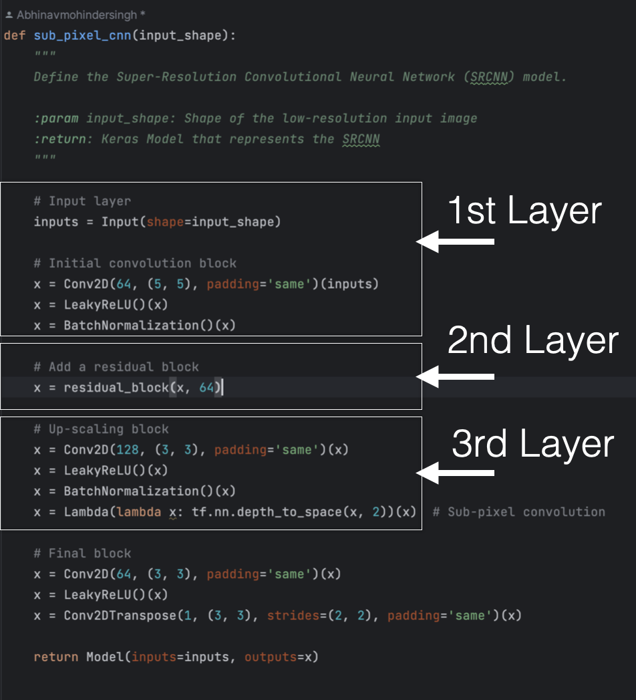
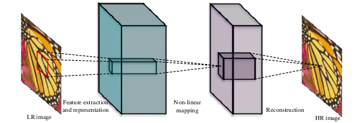
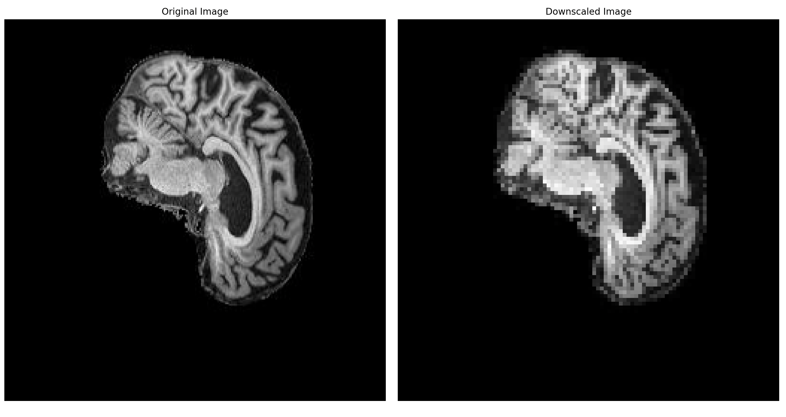
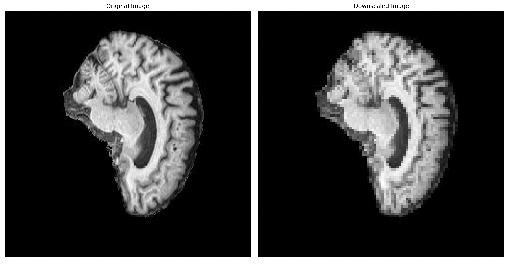
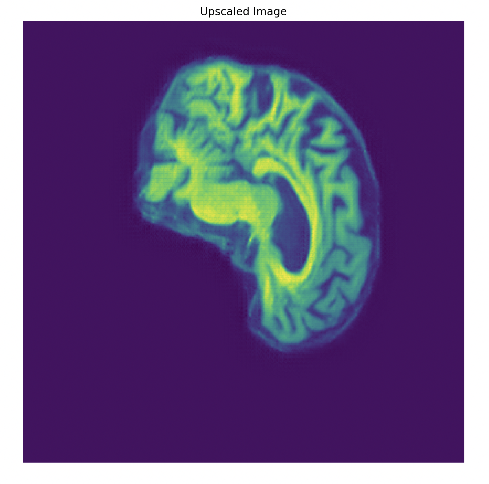
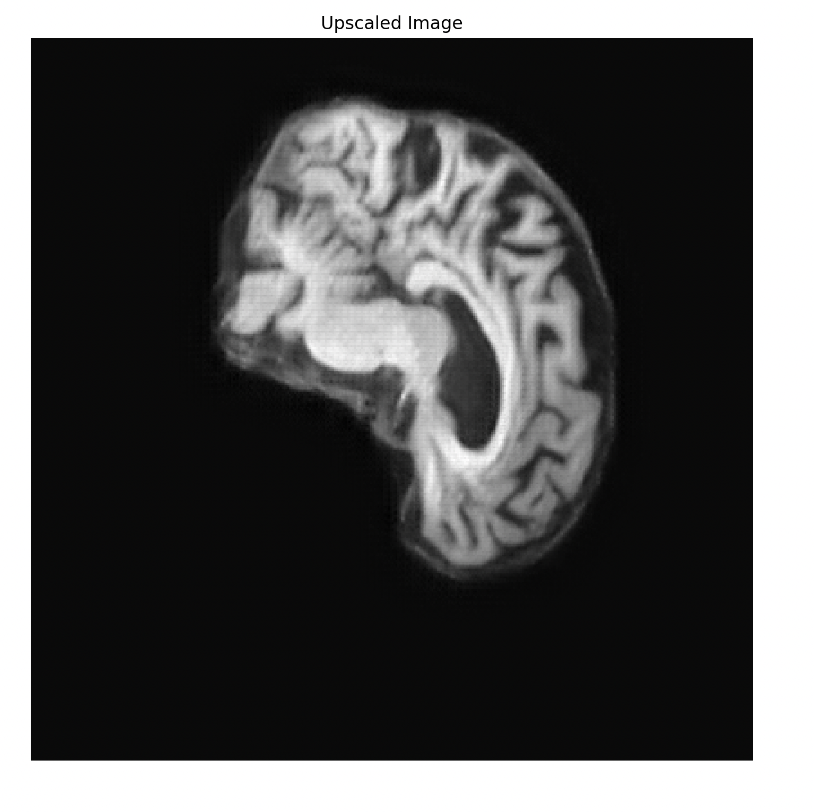
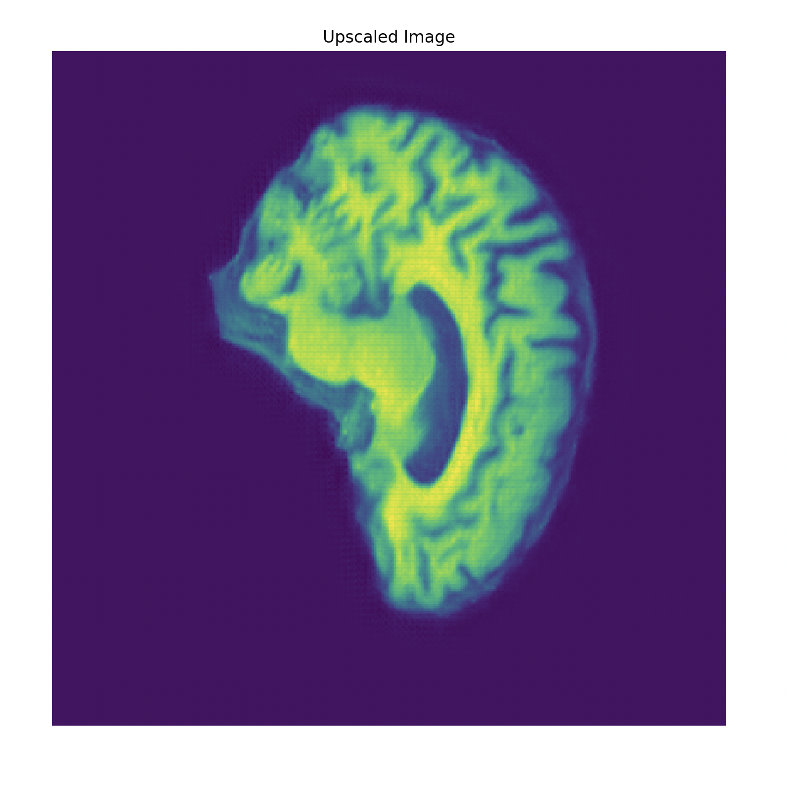
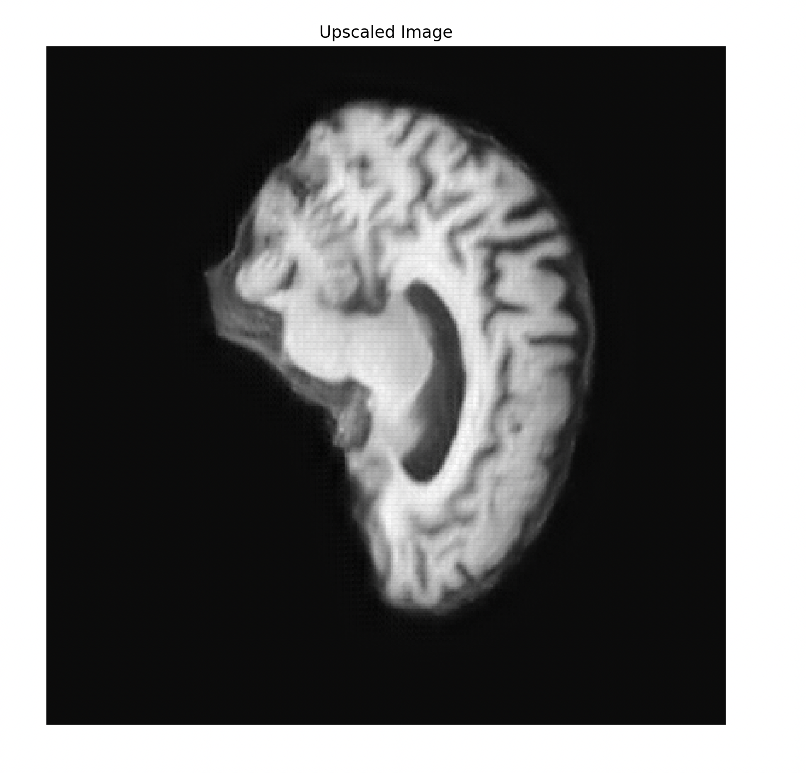

# PatternAnalysis-2023
## Report - Super Resolution CNN Network
**Author**: Abhinav-48244178

### Introduction :

Report details the implementation of a Brain MRI super-resolution network trained on ADNI dataset.This approach leverages a super-resolution CNN layer to generate high-resolution images from their lower-resolution counterparts. By comprehending patterns and structures within the downscaled training images, the network applies this knowledge to upscale the images effectively. In Today time, the significance of such super-resolution techniques are implemented over large scale either it be medical field or satellite imaging almost everything requires visualization.
         
### Description :
                   
The Super-Resolution Convolutional Neural Network (SRCNN) is used for single image super resolution (SR). Network operates in distinct phases to upscale images.
Firstly , through a process of patch extraction and representation, it extracts patches from the low-resolution images.
Then, during the non-linear mapping phase, the network harnesses its capacity to learn intricate patterns and details from the data.
Lastly, in the reconstruction phase, the final layer of the SRCNN is dedicated to generating the high-resolution image from the acquired feature maps.The filters within this layer are meticulously trained to collate the information from these feature maps, ensuring the output is a finely upscaled image.               
SRCNN models have various implementations across different domains. They offer a more feasible approach to obtaining high-resolution images than relying on the availability of high-cost sensors and advanced optics manufacturing technology. The medical field greatly benefits from SRCNN due to its ability to enhance image quality, which is pivotal for precise diagnostics and treatments.  

### Working :

On a large dataset. First,on running data_loader preprocessing of the the images, which involves padding and down sampling resulting in creation of new folders. The adjusted images are fed into the Sub-pixel CNN model. Inside the model, a residual block ensures making training easier and tackles the vanishing gradient problem, allowing for smoother training. The model then increases the detail of these images using a traditional convolutional layer and further enhances it with a sub-pixel convolution layer. Finally, a deconvolution layer produces the high-resolution image.
For training,mixed preprocessed samples from different categories are divided into training and validation groups. During training, model uses a PSNR metric, the Adam optimizer, and try to minimize the mean squared error. The best version of the model is saved based on validation results and stop training if no progress is seen after several attempts. Once training is done, we use charts to show how training went.
For predictions, a function called displayPredictions takes a test image, resizes it, and makes a low-quality version of it.Both of the original and low-quality image are displayed. Then, using our trained model, upgradation the low-quality image to high-resolution takes place. The model is loaded from a specific place on our computer, and we finish by showing how good the model is with a test image.

### Problem Adressed :

SRCNN makes the enhancing of old photographs or videos very easy. This comes in handy especially when trying to improve the quality of CCTV footages or upscaling digital media to be compatible with larger screens. also particularly useful application is the restoration of images that have undergone heavy compression. Such images often lose significant detail and exhibit compression artifacts; SRCNN can mitigate these effects by restoring some of the lost details. In cases where images contain text, conventional upscaling methods often blur or render the text illegible. SRCNN, however, can produce clearer and more readable text upon upscaling. In specialized sectors, such as geospatial analysis and medical imaging, the need for high-resolution images is paramount. SRCNN can play a crucial role here by enhancing satellite and aerial imagery or providing clearer views from MRI and CT scans.

### Data Splitting:
 
- **90% Training data**: Ensures the model has a diverse set of samples for effective learning.
- **10% Validation data**: Monitors overfitting and gauges the model's performance on unseen data.

Representative figures are used for testing purposes.

### Dependencies and Constants: 

- Numpy
- Tensorflow
- Keras
- Matplotlib
- PIL (from the Image and ImageOps imports)

Constants:
- WIDTH = 256
- HEIGHT = 240
- DOWNSCALE_FACTOR = 4

### Inputs: 

- **Input1**: 
- **Input2**: 

### Outputs: 

- **Output1**: 
- **Output1 (Gray)**: 
- **Output2**: 
- **Output2 (Gray)**: 
- **PSNR**: 
- **Training vs Validation**: 

### Results: 

Analyzing the graph of the training PSNR over epochs, we notice a consistent increase in the PSNR values, indicating an improvement in the quality of the super-resolved images. In the initial epochs, the PSNR initially start from a lower value, indicating that the model's predictions are quite different from the ground truth high-resolution images. However, as the training progresses, the network learns to make better predictions, resulting in a higher PSNR.
The steady growth in PSNR indicates that the model is effectively learning the patterns and structures from the training images. It's capturing the necessary details to upscale the lower-resolution images to their high-resolution counterparts towards the end it started to plateaued.
Accompanied by small increase in PSNR for validation that represents the model is generating or reconstructing higher quality images as it continues to train and generalizing well to unseen data.
The training loss decreasing significantly while validation loss shows only a marginal decrease suggests that the model is becoming proficient at fitting to the training data, possibly capturing noise and outliers

### References:

- [Review SRCNN - Super Resolution](https://medium.com/coinmonks/review-srcnn-super-resolution-3cb3a4f67a7c)
- [Stanford Paper](https://cs229.stanford.edu/proj2020spr/report/Garber_Grossman_Johnson-Yu.pdf)
- [Keras Example](https://keras.io/examples/vision/super_resolution_sub_pixel/)
- [Super Resolution Overview](https://homepages.inf.ed.ac.uk/rbf/CVonline/LOCAL_COPIES/AV1011/Super_Resolution_CVonline.pdf)
