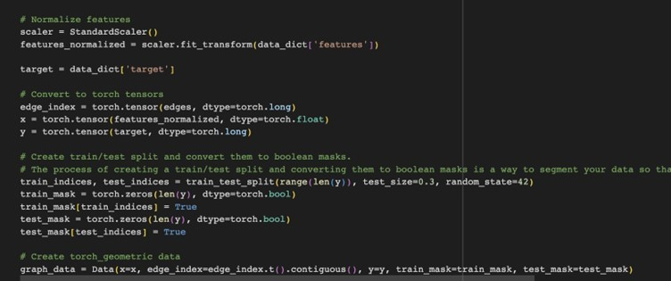
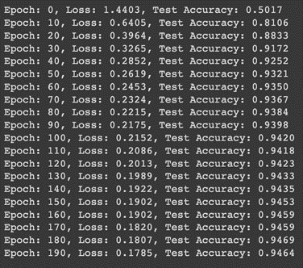
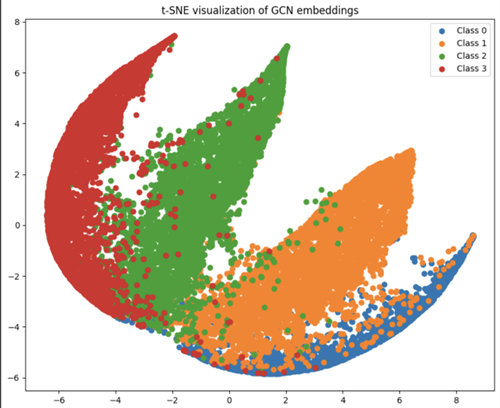

# GCN Model for Node Classification

## Description
This project implements a Graph Convolutional Network (GCN) to perform node classification on the Facebook Large Page-Page Network dataset.

## Algorithm
The GCN is a type of neural network that operates directly on graphs. It uses the graph structure and node features to predict a label for each node.

## Dependencies
- torch
- torch_geometric
- numpy
- sklearn

## Usage
1. Train the model:

2. Predict with the trained model:

## Data Preprocessing
The node features are normalized using `StandardScaler` from `sklearn`. The dataset is split into 70% training and 30% testing. The process also involves creating train/test split and convert them to boolean masks. This is a way to segment the data so that the model can learn from one subset and be evaluated on another, ensuring a fair assessment of its performance.

## Results
The model achieves an accuracy of 94% on the test set.

## Example output

0, 1, and 2 represents different facebook page category.

## t-SNE visualization

t-SNE (t-distributed Stochastic Neighbor Embedding) is a dimensionality reduction technique used to visualize high-dimensional data in a 2D or 3D space. It's particularly good at preserving local structure, which means data points that are close to each other in the high-dimensional space will likely be close in the 2D/3D visualization.

## Insights
-	Well-separated clusters of a single color indicate that the GCN has learned to differentiate that class effectively from others.
-	Mixed color regions can suggest a couple of things: The classes are hard to distinguish, possibly because they are inherently similar or the features don't provide enough information. The model might need further tuning or more complex architectures to better distinguish these classes. Sparse vs. Dense regions: If some regions of the plot are particularly dense or sparse, it might indicate areas of the high-dimensional space where many nodes have been mapped closely together or spread out. Dense areas might represent common or typical node embeddings, while sparse areas might represent more unique or rare node embeddings

## Limitations :
As with any dimensionality reduction technique, there's a loss of information when going from high dimensions to 2D or 3D. This means that while t-SNE is great for getting an overview and spotting patterns, it shouldn't be used as the sole method for drawing conclusions about the data.