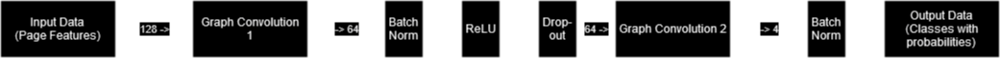
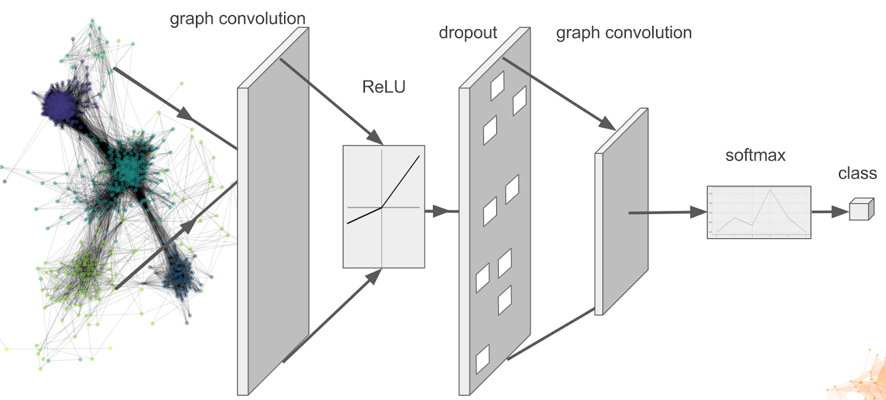
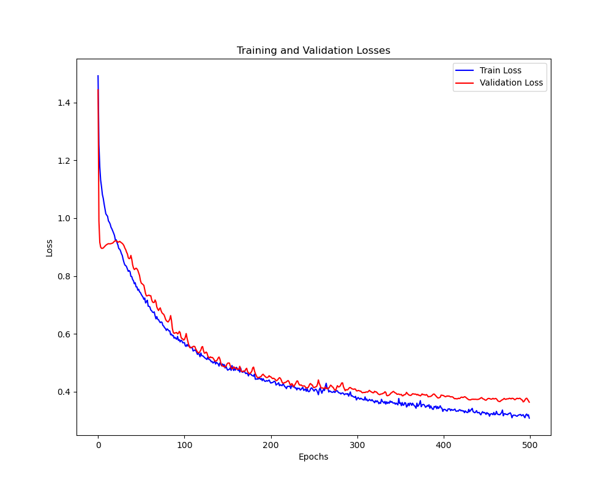
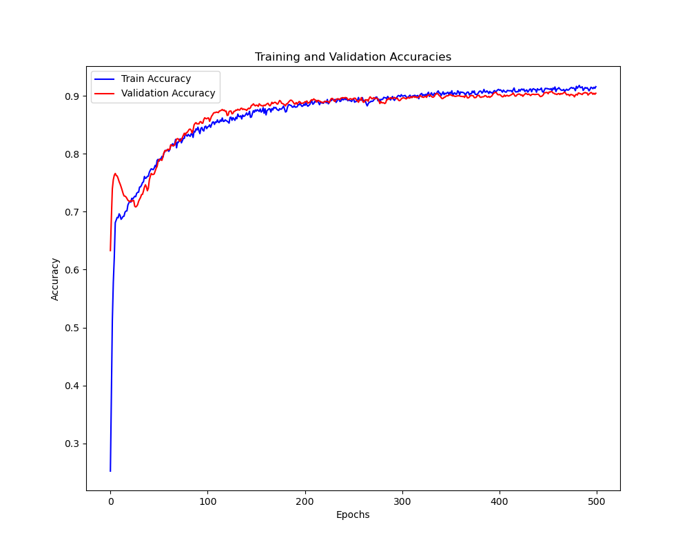
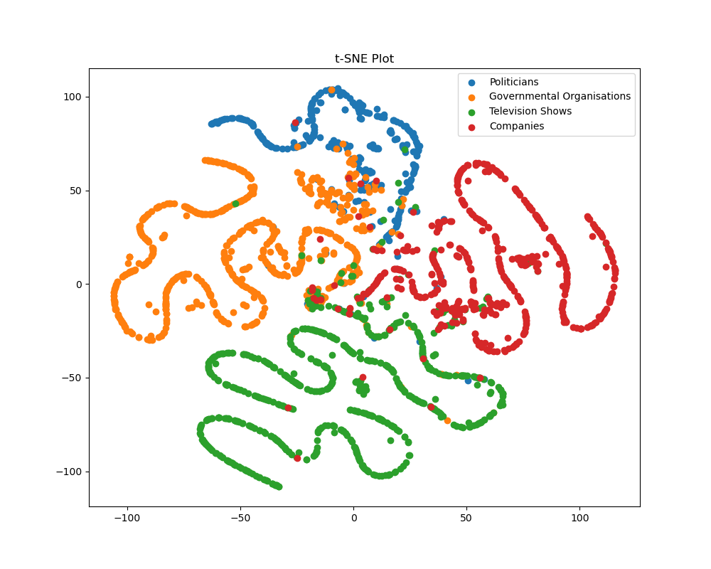

# Semi-supervised Multi-class Node Classification of Facebook Page-Page Network data via GCN
This Graph Convolutional Model is used to perform semi-supervised multi-class node classification. The nodes in question are Facebook pages, the edges are mutual likes between these pages and the features are descriptions of the pages created by their owners. The classes are politicians, governmental organisations, television shows and companies. In summary, this model is used to classify webpages into one of the four aforementioned categories.

## About the Data
This model uses a pre-processed dataset where features are in the form of 128 dim vectors. This was provided by the University of Queensland.

The data is loaded from a .npz file using numpy.load(), and the "edges", "features" and "targets" are extracted. The edges are stored as a 171,002 * 2 matrix, representing rows of connected nodes. The features are stored as a 22,470 * 128 matrix, meaning there are 22,470 nodes, each with 128 features. Hence the targets are represented with a one-dimensional list of 22,470 integers which correspond to the four classes. The features and targets are loaded into tensors as x and y respectively. Random masks for the test, train and validation data splits are calculated. An adjacency matrix is generated from the edge information to be used in the graph convolution. Finally, all of the information is combined into a single GCNData object to be used during the training.

10% of the data is used for testing, 10% is used for validation, and the remaining 80% is used for training.

## About the Model
Convolution is a powerful method of extracting features from connected data, particularly effective in the area of pattern recognition for images. However, it is only applicable to structured data (typically 2-Dimensional).

Graph convolution is based upon convolutional networks, but applies to data without structured connections, aka N-dimensional data. To perform convolution on a graph, an adjacency matrix is required to track the connections between nodes/neurons. With this matrix, information can be propagated between neighbouring nodes. Below is a figure demonstrating how convolution is performed on 2D data vs graph data.

Graph convolution is best suited for tasks such as this, where the input data has unstructured connections. Webpages are connected via mutual likes, as opposed to having neighbouring positions like pixels in an image.

### Architecture
The model consists of the following:
- A graph convolutional layer, which performs graph convolution on the input page features, using the adjacency matrix to propagate information from neighbouring nodes.
- A batch normalisation layer, which normalises the given input, improving regularisation.
- A ReLU activation, which zeroes negative values to reduce vanishing gradient.
- A dropout layer, which randomly zeroes a portion of the weights, improving regularisation.
- A second graph convolutional layer.
- A second batch normalisation layer.

In the above diagram, it can be seen that the first convolutional layer takes input of size 128, and reduces it to 64. The second convolutional layer then reduces this to size 4, for the 4 possible classes. The diagram is specific to the GCN model implemented for this task, but admittedly it is quite poor. For a diagram that is easier on the eyes and not entirely dissimilar from my model, see below.

### Hyperparameters and Functions
As mentioned earlier, the model uses a ReLU activation function after the batch normalisation layer. This mitigates the vanishing gradient problem and generally improves training performance.

For training, the optimizer used is Adam, and the loss function is Cross Entropy Loss. These are commonly used for classification tasks, and other optimizers and loss functions did not outperform them.

The chosen hyperparameters are as follows:
- Number of epochs: 500
- Learning rate = 1e-2
- Dropout probability = 0.5
- Hidden dimensions = 64

## Figures and Results 
Below is a plot displaying the model's loss throughout training and including validation.

Below is a plot displaying the model's accuracy throughout training and including validation.

We can observe a small amount of overfitting, as the training loss is slightly lower than the validation loss (and the opposite is true of accuracy), however this is to be expected, and the difference is not significant. The accuracy reaches 88% at around 200 epochs, slowly increasing afterwards. This is where the overfitting becomes particularly apparent, as the training accuracy increases significantly faster when compared to the validation accuracy. When developing the model, this overfitting was mitigated by implementing methods of regularisation such as the dropout layer.

Below is a t-SNE plot generated after training.

We can observe fairly distinct clusters in the t-SNE plot, suggesting the model has successfully learned meaningful representations of the data in lower dimensions. That being said, there are many overlaps particularly closer to the centre of the plot.

The model's average accuracy is around 90-92%. This fits with the above t-SNE plot. To improve accuracy, techniques such as initial residuals might be considered, to allow more convolutional layers to be added. When attempting to add these layers without such techniques during development, accuracy decreased. It is not recommended that the training split be increased any further, as it is likely to worsen the overfitting. Decreasing the training split did not yield any high accuracies during development.

## Files and Usage
- `dataset.py` - Contains classes and functions for loading and preparing data for training / testing.
- `modules.py` - Contains the Model class and its supporting modules.
- `utils.py` - Sets the device to GPU where possible, and contains constants.
- `train.py` - Contains functions for training, testing and plotting. Can be run to train and test the model, and plot the results.
- `predict.py` - Loads the model if saved, and tests it, then plots the t-SNE results.

Note that the `SEEDS` constant in utils.py can be used to guarantee reproducibility. 

To train and test the model, and then plot the results, run `train.py`. To test an already existing model, run `predict.py`.

Note that by default, `dataset.py` expects to read from a file `facebook.npz` in the `data` directory. `train.py` expects to load a model called `Facebook_GCN.pth`

## Dependencies
Required packages are as follows:
- torch
- sklearn
- scipy
- matplotlib

## References

Data taken from:

https://snap.stanford.edu/data/facebook-large-page-page-network.html

GNNLayer code (as well as general inspiration) taken from:

https://github.com/gayanku/SCGC

2D Convolution vs Graph Convolution figure taken from:

https://arxiv.org/pdf/1901.00596.pdf

Graph Convolution Neural Network figure taken from:

https://www.experoinc.com/expero-resources/node-classification-by-graph-convolutional-network