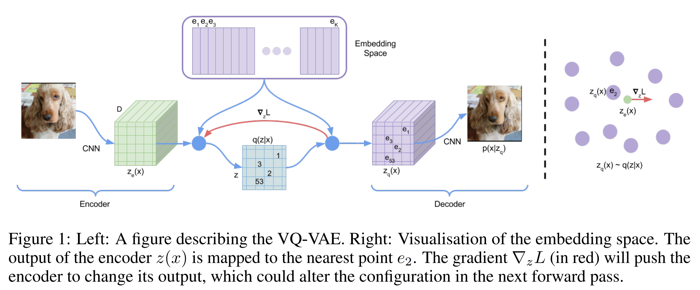
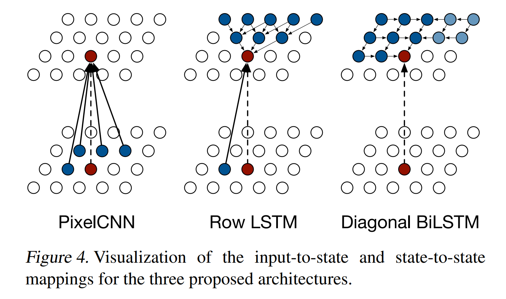
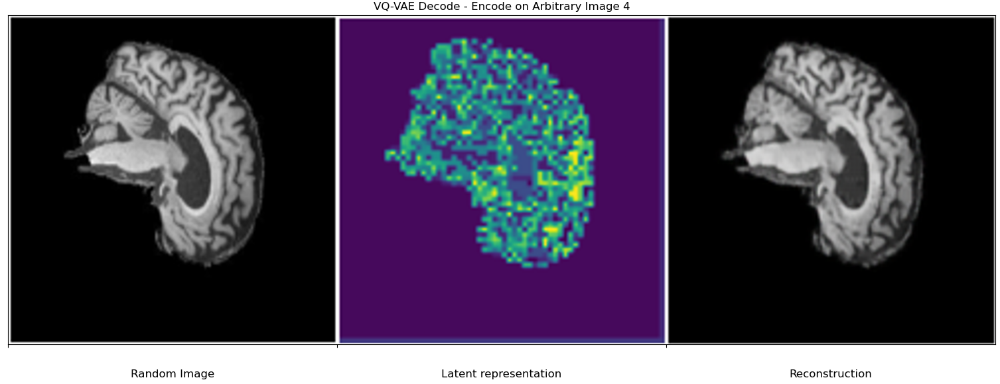

# Generative VQ-VAE + PixelCNN for the ADNI brain data set

## 0.0 Overview
My project implements a Vector-Quantised Variation Autoencoder [VQ-VAE](https://arxiv.org/abs/1711.00937) with a 
[PixelCNN](https://arxiv.org/abs/1601.06759v3) prior for the purpose of generating fake samples based on the ADNI 
brain dataset. The PixelCNN can be utilised to generate randomised discrete representations from the latent spaced
learnt by the VQ-VAE, to consequently generate fake brain images once the reconstruction is decoded by the VQ-VAE. 

 

## 1.0 Algorithm Summary / Background

The purpose of this section is to provide brief background theory on the models used in my generative model. For more 
detailed description, see the original [VQ-VAE](https://arxiv.org/abs/1711.00937) and [PixelCNN](https://arxiv.org/abs/1601.06759v3).
I also found Aleksa Gordić's YoutTube video [VQ-VAEs: Neural Discrete Representation Learning](https://youtu.be/VZFVUrYcig0?si=WxpLWRl29EnONKiI)
to be extremely helpful in building understanding of the VQ-VAE model. 
 
 

### 1.1 VQ-VAE
To motivate the idea of a VQ-VAE, let us first revisit the idea of traditional Variational AutoEncoders (VAE). A VAE 
made up of a decoder and an encoder. The purpose of the decoder is to, given a series of inputs, learn the probability 
distribution over the latent vector space, which act as a reduced representation of the model inputs. Given the reduced 
representation, a working encoder should reconstruct this image so that is is similar to the image passed into the VAE. 

 
  
As outlined in Oord's, Vinyals', and Kavukcuoglu's paper [Neural Representation Learning](https://arxiv.org/abs/1711.00937),
a VQ-VAE differs from a traditional VAE in two key ways. The encode network outputs discrete, as opposed to continuous, 
codes, and the prior (in this implementation a PixelCNN) is learnt rather than static. The discrete representation of the
latent space is represented as a set of vectors collectively known as a codebook. Vectors from the encoder are quantised
using a Vector Quantisation layer. Figure 1 (Sourced from [this paper](https://arxiv.org/abs/1711.00937)) details VQ-VAE
architecture which was utilised in my 
implementation.

 

 

Initially, the embedding space it randomly intisialised using a uniform distribution and is later refined using the loss
function defined in [Neural Representation Learning](https://arxiv.org/abs/1711.00937). Namely,

$$L = \log\left( p\left( x \mid z_q\left( x\right) \right) \right) + \left| \left| \text{sg}\left[ z_e(x)\right] - e 
\right| \right|_2^2 + \beta \left|\left| z_e(x) - \text{sg}[e] \right| \right|_2^2$$

Where:
* $\text{sg}$ is the stop-gradient operator
* Given some arbitrary input $x$, $z_e(x)$ and $z_q(x)$ denote the encoded, and decoded inputs
* $e$ is the unique element in the codebook in which $z_e(x) - e$ has the least euclidean norm.
* $||\cdot||$ denotes the l-2 norm.

Alternatively, the three individual terms in $L$ can be understood to represent reconstruction loss, the distance between
the encoded input and it's nearest embedding, and finally a term to 'commit' the encoder to the closest embedding.

 

### 1.2 PixelCNN

A PixelCNN (PCNN) is an autoregressive neural network model. As the name suggests, the NN learns recursively, starting
from the loft left pixel and traversing the image from left to right, top to bottom, predicting the values of the next
pixel based on the convolutional values obtained from the current pixel. 

 

 

It should be noted that my implementation, and the implementation suggested in Oord's, Vinyals', and Kavukcuoglu's 
original paper utilise a traditional PixelCNN instead of either a Row LSTM or a Diagonal BiLSTM. To estimate the next
pixel the PCNN utilises a mask to 'zero-out' the required pixels. Two types of mask are used in my implementation. 
Namely, 

Mask A zeros out all previous pixels, including the current pixel, wheras Mask B zeros out all of the previous pixels
excluding the current pixel. Type A masks are used only in the first layer, and Type B masks are used in all ensuing
layers.

 

## 2.0 ADNI Brain Dataset + Preprocessing
The [Alzheimer's Disease Neuroimaging initiative](https://adni.loni.usc.edu/) dataset consists of 256 x 256 pixel 2D
slices of neuroimaging data of people with Alzheimers Disease. Data was sourced from [here](https://cloudstor.aarnet.edu.au/plus/s/L6bbssKhUoUdTSI),
and downloaded for usage. In `dataset.py`, the image is processed using `tensorflow`'s `image_dataset_from_directory`
function with relevant parameters, and then normalised and shifted so that all pixels lie in the intercal $[-0.5, 0,5]$.
Note that the user has access to both greyscale and rgb data processing options.

In the model implementation, a $70/30$ training / validation split was made on the data. This can be changed by altering
the `validation_split` parameter. The purpose for doing so was to allow for more hyper-parameter tuning
of the trained model. 

 

## 3.0 Training / Validation Performance

The model was trained over 7 epochs with the hyper-parameters that are defined in `modules.py`. The loss
metrics on both the training and validation sets are seen in the figures below. The graphs were produced
using data which the code prints to `training.log`. 

 

 

Furthermore, the model achieved a mean ssim on the training data of 0.92562, and 0.92570
on the validation set. In total the Mean SSIM on the VQ-VAE test was 1.28696

 

## 4.0 Reconstruction
Once the model was has been trained, 5 arbitrary images were passed through the VQVAE and the initial
image, the codebook representation, and then the reconstructed image were plot on the same graph.

All in all, I am very happy with the results. These plots really just provide visual evidence for
the SSIM values which were reported in section 3.0

 

## 5.0 Usage Instructions

Provided that the required dependencies are installed, one must first alter `FILE_PATH` in `train.py` so that the 
path directs to the `AD_NC` root directory of the ADNI Brain data (see ADNI Brain Dataset section). That is, the 
only subdirectories of `AD_NC` must be `train` and `test`. As this model is not a classifier, all data labels are
ignored. I.e. the model is trained on both Alzheimers disease (AD), and Cognitive Normal (CN) data.

* `train.py` - Tune hyperparameters on lines 39-48
* `modules.py` - Contains source code for the model. Change if required
* `dataset.py` - Alter to change how data is pre-processed
* `modules.py` - To use the model pre-trained. Assumes weights are downloaded.

For hyper-parameter tuning resort to lines 39-48 in `train.py`. Furthermore, `modules.py` details source code
for the mode. To generate novel images, one can also simply run `predict.py`. 

### 5. 1 Dependencies
* Tensorflow >= 2.10.0
* Tensorflow-probability >= 0.14.0
* numpy >= 1.26.0
* matplotlib >= 3.7.2
* pandas >= 2.0.3

## 6.0 References

[1] VQ-VAE Paper - https://arxiv.org/abs/1711.00937

[2] PixelCNN Paper -https://arxiv.org/abs/1601.06759v3

[3] Vector-Quantized Variational Autoencoder - https://keras.io/examples/generative/vq_vae/
