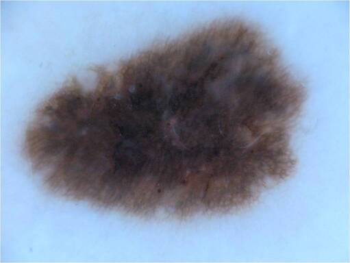
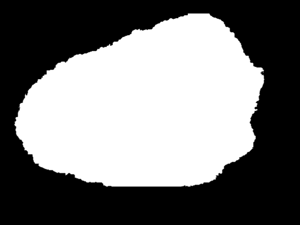
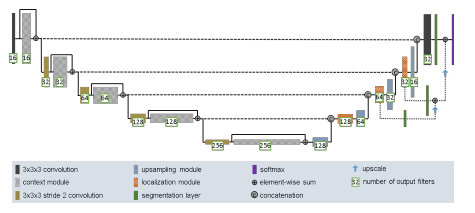
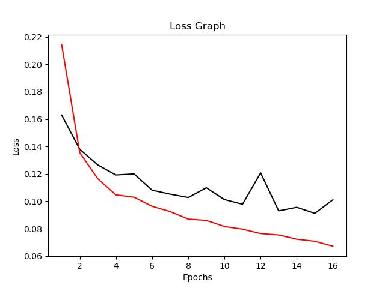
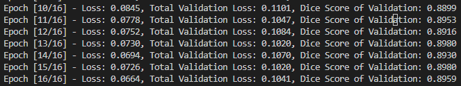
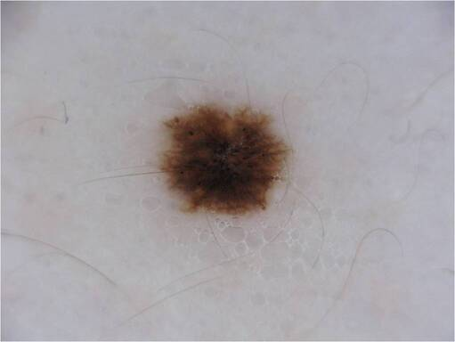
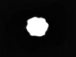

# Improved Unet on ISIC
This reports the usage of the improved Unet on the idetification of skin lesions in the ISIC dataset, The expected result is that the dice corefficent to be greater than 0.8 on the test set.

## Preprocessed ISIC Data set
The data set contains 2,594 images of skin lesions along wwith a mask that contains pixel values of 0 (white) and (255) black. The white represetns the area that the skin lession is in and the black is where it does not contain the skin lession.

Figure 1: Original image for ISIC_0000000

Figure 2: Original image for ISIC_0000000_segmentation

### Data pre processing
Images are scaled down to 96 x 128 comapred to the origional 511 x 384 this way it saves on computer processing time while also fitting the model so that no extra resizes are needed in the model. The mask is then mapped to 0 or 1 where if the pixel values is greater than 128 it is maped to 1 and 0 if it is below 128.

The model is then split into validation and training with a 0.1/0.9 split the test set was given in the database so it will be used in the model.

### Improved Unet Model

Figure 3: Improved Unet

The model is an improvement of the origional Unet model with residual adding, context module and localization modules

The Context module is a combination of a (3,3) same convolution, followed by a dropout layer of 0.3 the followed by another 3,3 same Convolution, with instance normalization and a leakyRelu activations.

The localization module is a (3,3) same convolution followed by a (1,1) same convolution. With instance normalization and LeakyRelu activations.

The Upsampling module uses the upsample module from pytorch followed by a (3,3) same convolution.

The Origional model was developed for 3D models however the ISIC data set is 2D so the model was changed to fit the new data set.

# Method
Download the dataset place the files within the data folder you chould have the paths
- data\ISIC2018_Task1_Training_GroundTruth_x2
- data\ISIC2018_Task1-2_Test
- data\ISIC2018_Task1-2_Training_Input_x2

remove the txt files inside run train then run predict

## Results

Figure 4: Loss Curve

figure 5: Final Dice Scores

The model Achived a dice score of 0.88 after a batch of 16 and 16 epochs however the data set seemed to have stagnated around the 7th epoch so 16 was not needed

Figure 5: Original ISIC image

figure 6: Original ISIC Mask

figure 7: ISIC Mask From model

# Dependecies 
- Python
- Pyroch
- PIL
- numpy
- matplotlib
- Dataset(https://filesender.aarnet.edu.au/?s=download&token=d93a02ff-5b61-465f-9cba-fc1566613384)

# References 
F. Isensee, P. Kickingereder, W. Wick, M. Bendszus, and K. H. Maier-Hein, “Brain Tumor Segmentation
and Radiomics Survival Prediction: Contribution to the BRATS 2017 Challenge,” Feb. 2018. [Online].
Available: https://arxiv.org/abs/1802.10508v1

https://discuss.pytorch.org/t/implementation-of-dice-loss/53552

https://github.com/mcost45/ISICs-improved-unet/blob/main/layers_model.py
