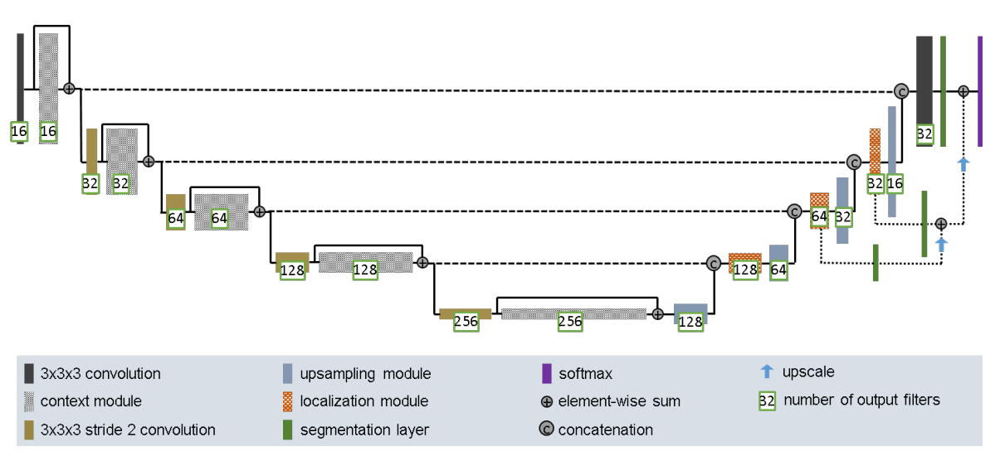
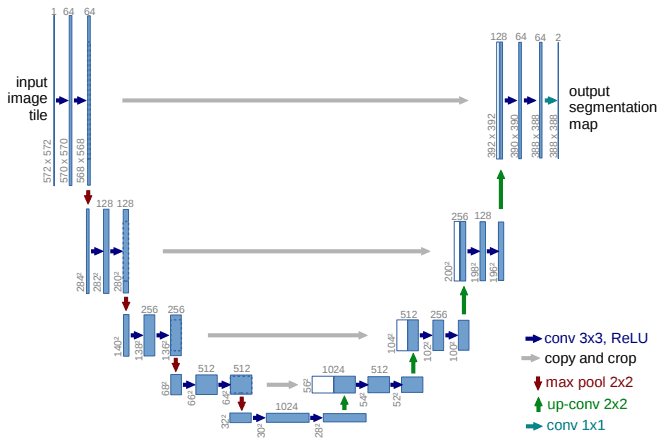
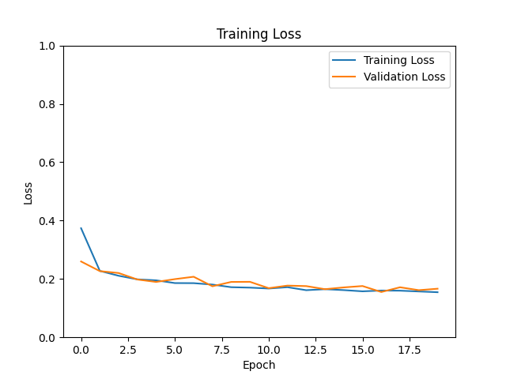
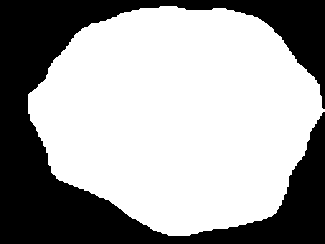
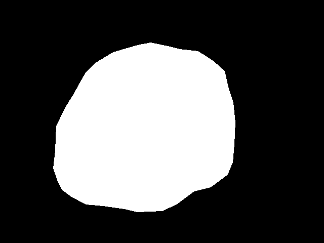
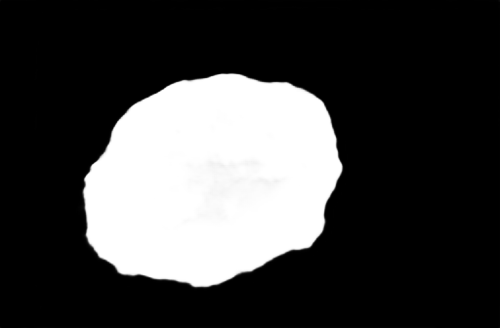
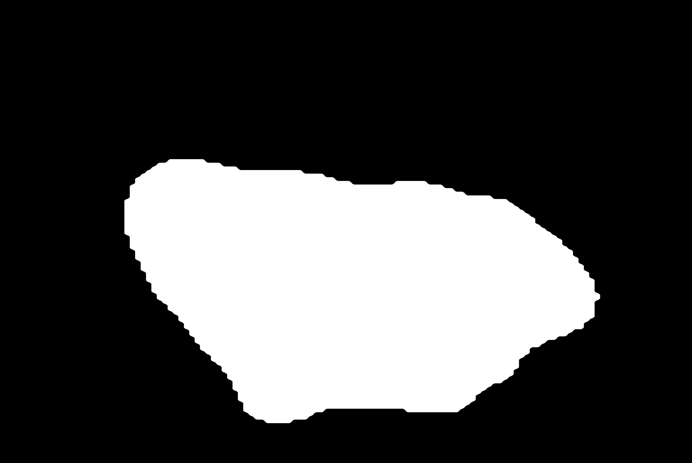
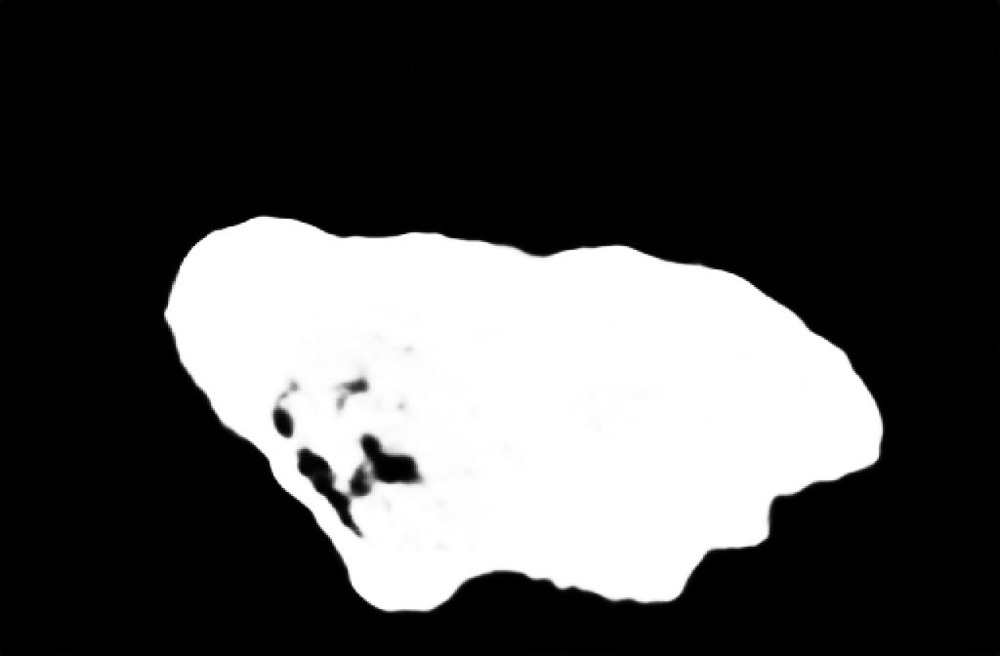

# Improved UNet for ISIC 2018 Dataset - Task 1 Lesion Segmentation
## Description
### Task
This project is a model which attempts to perform segmentation on the ISIC 2018 Task 1 data set which consists of images of skin lesions and an associated mask which segments the skin lesion against normal skin. This data set is available on the following website https://challenge.isic-archive.com/data/#2018.  
The model to be implemented is the Improved UNet as described in the paper https://arxiv.org/abs/1802.10508v1 which contains several differences compared to the original UNet architecture.
### Algorithm
A UNet has an encoder-decoder style scheme. The encoder side reduces the spatial map and expands the feature map with each successive layer while the decoder side expands the spatial map and reduces the feature map. There are skip connections between the layers of the encoder and decoder side which concatenates the the feature maps of both the encoder and decoder layers in order to recover details that may have been lost during downsampling. The major difference when it comes to the Improved UNet is the fact that results from layers of the decoder side is also added to the final result. Another difference is that the transposed convolution is replaced with a convolution.  

The following are the figures of the Improved UNet architecture (https://arxiv.org/abs/1802.10508v1) and the original UNet architecture (https://arxiv.org/abs/1505.04597).  

  

  

## Dependencies
- python 3.10.6
- torch 2.1.0+cu118 (used for implementing and training model)
- torchvision 0.16.0+cu118 (used for transforms to preprocess data)
- PIL/Pillow 9.5.0 (used for loading images)
- matplotlib 3.7.2 (used for plotting loss and output images)
- numpy 1.24.3 (used for converting outputs to numpy arrays for plotting as image)
- cuda 11.8 (used for GPU accelerated performance)

## Dataset and Preprocessing
The dataset was split into training, validation and testing sets. The training and testing splits were done by the ISIC challenge and can be downloaded directly from the website itself. Testing set was downloaded from the website. The training set however was downloaded from Rangapur which was a version that was downsampled by 2. The data set is ISIC 2018 Task 1 Lesion Segmentation.  

The training and valdiation split was done on the training set with a ratio of around 80/20. The images and masks were resized to a width and height of 1024 by 672 in order to standardise the pixel dimensions of the data set and save memory space. The training and validation datasets were loaded in batches of 16 as that was the maximum the GPU could handle during training but the batch size was increased to 64 for the testing dataset.

## Running the Program
### Training, Validation and Testing
The training went for a total of 20 epochs and used an adam optimizer with a learning rate of 1e-3 and a weight decay of 1e-5. The validation accuracy reached the dice coefficient threshold of 0.80 at epoch 4 with a dice score of 0.80 or accuracy of 80.19%. The training accuracy was 80.14% or a dice score of 0.80. Since the validation accuracy reached the threshold at epoch 4 the model was saved but the training was left to continue until the 20 epochs. The testing accuracy for the model at epoch 4 was 78.51% or a dice score of 0.79 which is below the target dice coefficient for this task.  

At the final epoch of 20 the training accuracy was 84.55% or a dice score of 0.85 and the validation accuracy was 83.34% or a dice score of 0.83. The testing accuracy was 78.07% or a dice score of 0.78.  

  

Below are some of the ground truth and predicted masks from the model of epoch 4 using the predict.py file.
### ISIC_0016911 Ground Truth and Prediction

### ISIC_0018507 Ground Truth and Prediction

### ISIC_0023474 Ground Truth and Prediction

### Reproducing the Process
As stated prior, the original training set was downsampled by 2 by an external source and so depending on how you downsample the transformed training set may differ from what was used for this project. This also includes the validation set as it is split from the training set. The test data set is exactly the same as on the website. Most of the code requires no modification aside from the filepaths for saving/loading the model, for loading the datasets, for saving the training/validation loss plots, and for loading an image and the output predicted segmentation mask.

## References
- https://challenge.isic-archive.com/data/#2018 (ISIC 2018 Task 1 lesion segmentation dataset)  
- https://arxiv.org/abs/1802.10508v1 (paper describing Improved UNet)
- https://arxiv.org/abs/1505.04597 (paper describing original implementation of UNet)

- https://theaisummer.com/unet-architectures/
- https://towardsdatascience.com/cook-your-first-u-net-in-pytorch-b3297a844cf3
- https://www.analyticsvidhya.com/blog/2022/10/image-segmentation-with-u-net/

- https://pytorch.org/tutorials/recipes/recipes/amp_recipe.html
- https://discuss.pytorch.org/t/using-same-dropout-object-for-multiple-drop-out-layers/39027
- https://pytorch.org/tutorials/beginner/basics/data_tutorial.html#creating-a-custom-dataset-for-your-files
- https://github.com/pytorch/pytorch/issues/1249#issuecomment-305088398
