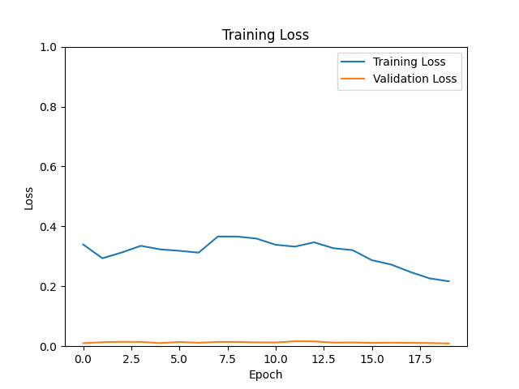
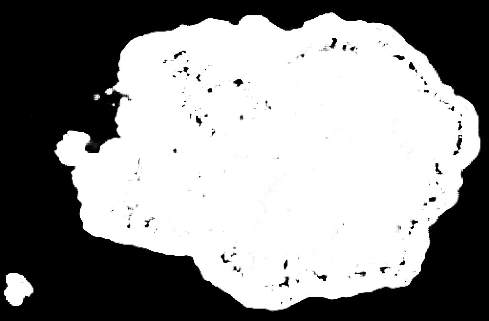
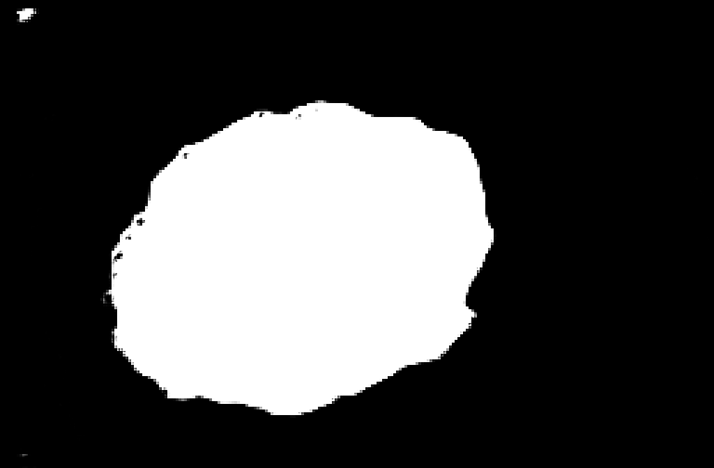

# Improved UNet for ISIC 2018 Dataset - Task 1 Lesion Segmentation
## Description
### Task
### Algorithm
This project implements the UNet architecture as described in the paper: https://arxiv.org/abs/1802.10508v1
The implemented UNet was used on the ISIC 2018 dataset for segementation.
The difference between the Improved UNet and a basic UNet is...
The following is the figure of the Improved UNet architecture and a typical UNet architecture.

PICTURE OF Improved UNet
https://arxiv.org/pdf/1802.10508v1.pdf

PICTURE OF Basic UNet
https://towardsdatascience.com/unet-line-by-line-explanation-9b191c76baf5

## Dependencies
- python 3.10.6
- torch 2.1.0+cu118 (used for implementing and training model)
- torchvision 0.16.0+cu118 (used for transforms to preprocess data)
- PIL/Pillow 9.5.0 (used for loading images)
- matplotlib 3.7.2 (used for plotting loss and output images)
- numpy 1.24.3 (used for converting outputs to numpy arrays for plotting as image)
- cuda 11.8 (used for GPU accelerated performance)

## Dataset and Preprocessing
The dataset was split into training, validation and testing sets. The splits were done by the ISIC challenge and thus were downloaded directly from the website itself. The training set however was downloaded from Rangapur which was a version that was downsampled by 2. The data set is ISIC 2018 Task 1 Lesion Segmentation.

The images and masks were resized to a width and height of 1024 by 672 in order to standardise the pixel dimensions of the data set and save memory space.
The training and validation datasets were loaded in batches of 16 as that was the maximum the GPU could handle during training but the batch size was increased to 64 for the testing dataset.

## Running the Program
### Training and Validation
The training went for a total of 20 epochs and used an adam optimizer with a learning rate of 1e-5 and a weight decay of 1e-5.
The final epoch training accuracy was 78.62% which corresponds to a dice coefficient score of 0.79 and the validation accuracy was 99.06% which corresponds to a dice coefficient score of 0.99.  

### Testing
The testing accuracy was 94.27% which corresponds to a dice coefficient score of 0.94 which is above the target score of 0.8.
Below are some of the ground truth and predicted masks
#### ISIC_0016911
##### Ground Truth

##### Prediction

#### ISIC_0018507
##### Ground Truth

##### Prediction

### Reproducing the Process
As stated prior, the original training set was downsampled by 2 by an external source and so depending on how you downsample the resultant transformed training set may differ from what was used for this project. The rest of the data set (validation/testing) is exactly the same as on the website. Most of the code requires no modification aside from the number of epochs and the filepaths for saving/loading the model, for loading the datasets, for saving the training/validation loss plots, and for loading an image and the output predicted segmentation mask.

## Future Improvements
While the model managed to achieve a high accuracy there is still an avenue that has not been explored when it comes to preprocessing the data set which is data augmentation. Data augmentation would allow the model to improve its generalisability without having to source new data. The possible transforms could include adding random horizontal/vertical flips and random rotations. The effect of the data augmentation would be seen the more epochs the model goes through.

Another possible improvement would be to implement automatice mixed precision to speed up the training of the model. This would mean using autocast and gradscaler from the pytorch library to automatically switch between float 16 and float 32 precision for model calculations. Some types of layers are faster with float 16 like convolution but the default precision in pytorch is float 32.

## References
- https://challenge.isic-archive.com/data/#2018 (ISIC 2018 Task 1 lesion segmentation dataset)  
- https://arxiv.org/abs/1802.10508v1 (paper describing Improved UNet)
- https://arxiv.org/abs/1505.04597 (paper describing original implementation of UNet)

- https://theaisummer.com/unet-architectures/
- https://towardsdatascience.com/cook-your-first-u-net-in-pytorch-b3297a844cf3
- https://www.analyticsvidhya.com/blog/2022/10/image-segmentation-with-u-net/

- https://pytorch.org/tutorials/recipes/recipes/amp_recipe.html
- https://discuss.pytorch.org/t/using-same-dropout-object-for-multiple-drop-out-layers/39027
- https://pytorch.org/tutorials/beginner/basics/data_tutorial.html#creating-a-custom-dataset-for-your-files
- https://github.com/pytorch/pytorch/issues/1249#issuecomment-305088398
