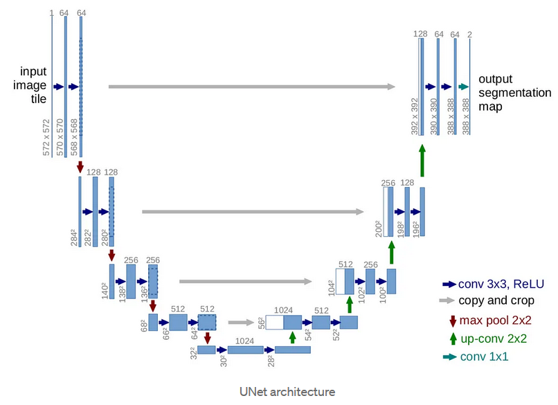
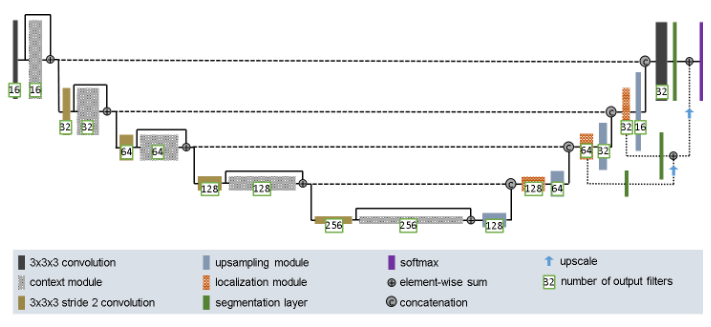
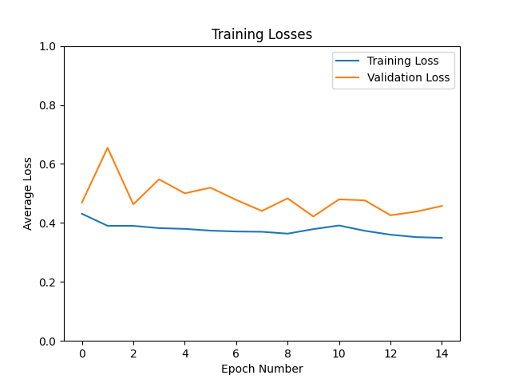
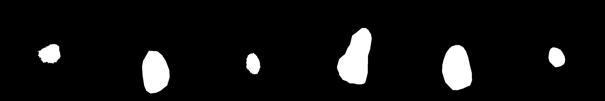

# Improved UNet for Segmenting ISIC Data set

## Description

### The Problem
The ISIC data set is a large collection of images of skin lesions. The data set also contain masks that indicate the area the lesions are located in their correponding image. The problem given is to create and train a Improved UNet model to be able to segment a skin image and show the location of a lesion. To be successfull all labels must have a minimum Dice similarity coefficient of 0.8 on the test set of the data.

### Improved UNet
The Improved UNet as the name suggests, is an advancement of the orginal UNet deep learning architecture that's used for image segmentation. A UNet can be broken into 3 main parts, the encoder, which extracts features, a bottleneck, which is used for abstract features, a decoder with skipconnections, which returns resolution whilst keeping larger details. The major difference that gives the Improved UNet its name is the inclusion of localization modules and segmentation layers. These differences can be seen in the two images below. Specifically in the right decoder part of the figures.

**UNet Architecture**

*Figure 1.1: architecture used for normal UNet from https://towardsdatascience.com/unet-line-by-line-explanation-9b191c76baf5*

**Improved UNet Architecture**

*Figure 1.2: architecture used for Improved UNet from https://arxiv.org/pdf/1802.10508v1.pdf*

## Project

### Training

For training the model, this is call done inside the [train.py](train.py) file. Inside the file, a untrained Improved UNet model is created using the modules in the [modules.py](modules.py) file. This model is then trained using the Adam optimizer and using Dice Loss for the loss function. The Dice Loss funciton used was borrowed from [IssamLaradji](https://github.com/pytorch/pytorch/issues/1249#issuecomment-305088398). The training process used the training and validation data loaded in using [dataset.py](dataset.py). At the end of each epoch, important information such as loss values and dice score were stored and displayed. Once training was completed, the end a plot was created showing the evolution of the training and validation losses as the model trained. Additionally, the model was then saved, to be used by [predict.py](predict.py). 

### Predict

For the predicting section, the model that was trained in [train.py](train.py) is loaded in. The test dataset is also loaded in using [dataset.py](dataset.py). Since predict is more for proof of concept, a single batch of test images are predicted. These predictions are then saved, as well as their corresponding correct masks. Additionally, the dice score is calculated and displayed.  

### Results

Unfortunatly, the results that where aquired during testing were less than favourable. As shown in the plot below, the losses are reducing at a very slow rate, suggesting that the problem is likely related to the learning rate. Additionally, the dice score didn't do well with the highest recorded value being aroun 0.59.

**Training and Validation Loss Plots**

*Figure 2.1: plot that was produced when traing the model on the data*

With that said, a model was still created and this model was then used for the predicting program. When the program was run, as excpected, the predictions were worse than excpected. As shown below, the model failed to produce any masks.

**Excpected Masks**

*Figure 2.2: figure of 8 expected masks*

**Predicted Masks**

*Figure 2.3: figure of 8 predicted masks*

### Recreating

If you wish to recreate the above results, the following depencies will need to be followed when using the code.

#### Dependencies

**Python Version**
- python 3.10.12

**Anaconda Packages:**
- pytorch-cuda 11.8
- torchvision 0.15.2
- matplotlib 3.5.3

**File Addresses:**
- [train.py](train.py)
    - data_path : Directory containing training, validation and test images and masks, all in seperate nested folders.
    - save_path : Location with file name of where to save the trained model.
    - plot_path : Location with file name of where to save the training and validation loss plot. 
- [predict.py](predict.py)
    - data_path : Directory containing training, validation and test images and masks, all in seperate nested folders.
    - model_path : Location with file name of where to find the trained model.
    - image_path : Location to save the predicted and actual masks.  
- [dataset.py](dataset.py)
    - *Note: in dataset.py, the the data loaders use data_path (from train.py and predict.py) as the folder containing the seperate component folders*
    - *Assumed naming convention of folders*
        - *[train, valid, test]* + 'ing_' + *[images, masks]*

**Dataset:**
- This project uses the [ISIC Challenge Dataset](https://challenge.isic-archive.com/data/#2017) dataset. More specifically, the 2017 set with all images in png format. 
- The main preprocessing that was performed was resizing the images and grayscaling the masks and making their values binary.

**Hyper-parameter**
- [train.py](train.py)
    - num_epochs = 15
    - learning_rate = 1e-3
    - image_height = 512 
    - image_width = 512
    - batch_size = 16
- [predict.py](predict.py)
    - image_height = 512 
    - image_width = 512
    - batch_size = 8