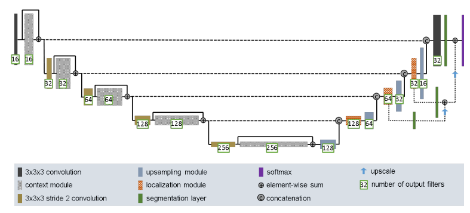
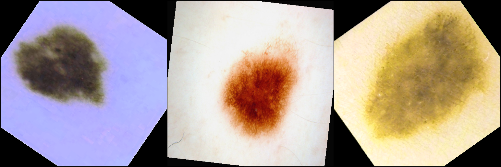
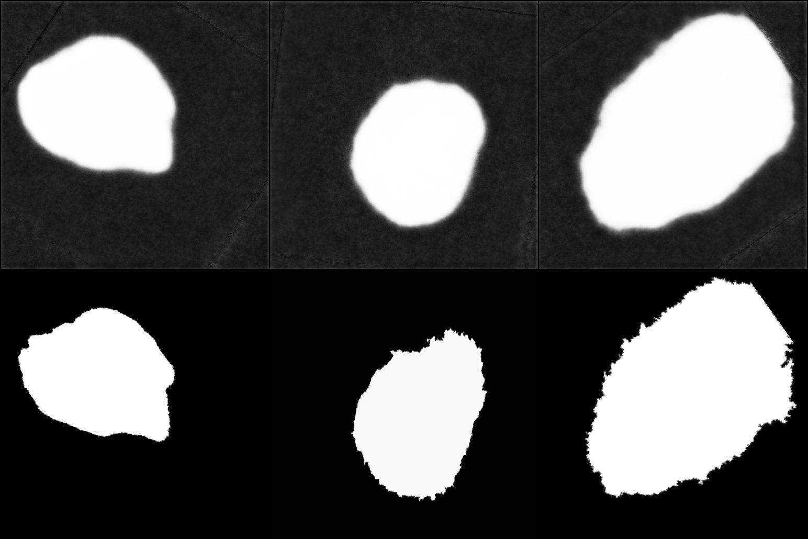

#Binary segmentation of the ISIC 2018 dataset with the UNet model

*Snorre Sveen s4824208*

This project aims to take data from the from the ISIC 2018 dataset and create a UNet model that produces a binary segmentation output. To achive this the model is trained against ground truth images provided throught the dataset. 

##ISIC 2018 dataset
[^1]
The dataset consists of images of 2593 images of lesions with corresponding binary segmented ground truths. For validation the data set was split so that 5% of the images was put into a validation set. For testing the testset and the testground truth was used. The size of the images in the data set could vary so they were resiszed to (512,512).

[^1]: https://challenge.isic-archive.com/data/#2018

##Preprocessing
To diverisfy the dataset there has been applied random transformations to the images. These transformation consist of flipping, rotation, scaling and color manipulation. The idea with these transforms is to achive a wider variety of lesions to make the model more robust.

##Overview of the UNet model
For this project the a UNet model inspired by this paper[^2] was used. The UNet model consists of a contraction path, expansive path, skip connections and segmentaion layers/deep supervision. The contraction path uses convolutional layers combined with downsampling to aquire features. For the contraction path there is implemented a context block with two 3x3 convolutinal layers with a dropout inbetween. This works as a pre-activation before the down sampling. The downsampling is then preformed by a 3x3 convolutional layer with a stride of 2. The combination of the context block and the pre-activation allows for additional features to be created while reducing the spatila dimensions.The expansive path consists of a upsampling module and localization module. The upsamling module increases the spatial dimensions while reducing the feature channels using interpolation and a convolution. After this is done the model concatenates the feature map with the corresponding feature map from the contraction path. This allows the model to keep as much feature information as possbile while upscaling the spatila dimensons. After the concatination the localization module combines the features from the contraction and the expansion path.For the 1,2 and 3 level counted form higher spatial dimensions(see image bellow) there has been implemented segmentation layers to achive deep supervision. These segmentation layers consists of convoluional layers that set the ouptpout channels to one. Further these segmentation layers are added as elementwise sum at the end of the model. This is implemented to avoid loosing important feature information when upsamling. At the very end the model uses the torch sigmoid function give a probability prediction for the likely hood of a pixel being part of the lesion. 

For a more indepth explanation view this paper[^2]. It is important to note that the paper has designed their model for a 3D dataset. Necessary adjustments had been made to account for this. Additionally the pre-activation block is form this paper[^3] and the deep supervison is form this paper[^4].

 [^2]: https://arxiv.org/abs/1802.10508v1 "Improved-UNet"
 [^3]: https://arxiv.org/abs/1701.03056 "pre-activation"
 [^4]: https://arxiv.org/abs/1603.05027 "deep supervision"

##Training and testing
Training was preformed using the ADAM optimizer and the stepLR as the scheduler. For the loss function dice loss was used. The reason for this was because it gives a good representation of the overlap between the prediction and the ground truth. Another thing to note is that the predictions created by the model is not binary but instead consists of values between 0-1. These values are a representation of the probability the model thinks there is a lesion on a spesific pixel. This is fine when calculating the loss during training because it will get more nuansed feeback. For testing on the other hand the prediction made by the model is rounded to either a one or a zero. This essensially makes the model choose excatly where the lesion is and gives a more accurat picture of how well it understands the dataset. During training the model is also validated against a small validation set. The validation will also save the best preforming model.

Throught testing it was discovered that a learning rate between 1e-4 and 1e-5 was yielded the best results. 
For the scheduler a gamma of 0.95 was applied each epoch.
For the batch sizes it ws found that a batch size of three worked the best.

---------PICTURES OF LOSS/trainign pci??---------------------

##Depencencies and reproducibility

Pyton -- 3.10.12
Pytorch -- 2.0.1
Scikit-learn -- 1.3.0
Torchvision -- 0.15.2
Pillow -- 9.4.0

Due to the randomness of the transformations you wont get the same results when running the model twice. Alltought when increaseing the number of epochs you will likely converge towards the same model.

##Results
Below there have been provided some example inputs, predictions and ground thruths.

##Running the code
If you want to create your own UNet model. Download the ISIC2018 dataset. Set the image

Refrences:
1--F. Isensee, P. Kickingereder, W. Wick, M. Bendszus, and K. H. Maier-Hein, “Brain Tumor Segmentation and Radiomics Survival Prediction: Contribution to the BRATS 2017 Challenge,” Feb. 2018.
Available: https://arxiv.org/abs/1802.10508v1

2-- B. Kayalibay, G. Jensen, and P. van der Smagt, “CNN-based segmentation of medical imaging data,” arXiv preprint arXiv:1701.03056, 2017.
Available: https://arxiv.org/abs/1701.03056

3-- K. He, X. Zhang, S. Ren, and J. Sun, “Identity mappings in deep residual networks,” in European Conference on Computer Vision. Springer, 2016, pp. 630–645.
Available: https://arxiv.org/abs/1603.05027

4--ISIC 2018 dataset
Avilable: https://challenge.isic-archive.com/data/#2018

