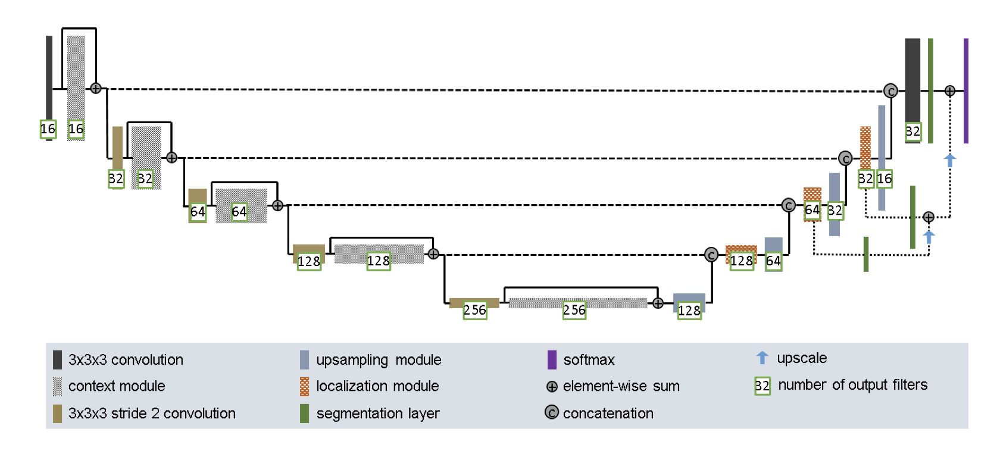

# Image Segmentation for ISIC 2017 Dataset with the Improved UNet model

Author: Selma Gudmundsen - s48207351

## Description of Improved UNet and how it works

The Improved UNet model is inspired by the UNet architecture, which is a popular deep learning architecture for semantic segmenation. It was originally developed for semantic segmentation of medical images, of which it has had great success. The Improved UNet architecture is inspired by this U-shaped encoder-decoder network architecture, but has been modified to maximise brain tumor segmentaion performance. The Improved UNet is designed to process large 3D input blocks. It consist of a context pathway that encodes increasingly abstract representations of the input, followed by a localization pathway that recombines these representations to precisely localize the structures of interest.

Hence the architecture maintains UNets core U-shaped structure. The activations in the context pathway are computed by context modules, which are pre-activation residual blocks with two 3x3x3 convolutional layers and a dropout layer to extract information in the context pathway. Context modules are connected by 3x3x3 convolutions with an input stride of 2. This reduces the resolution of the feature maps to allow more features as the network goes down the aggregation pathway. In the localization pathway, features from the lower levels of the network with contextual information at low spatial resolution are transferred to higher spatial resolution. This is done by upsampling the low-resolution feature maps and recombining them with a concatenation operation, a variation from the transposed convolution often used in U-Net. A localization module follows the upsampling and recombination step, consisting of a 3x3x3 convolution followed by a 1x1x1 convolution that further reduces the number of feature maps. Deep supervision is employed with segmentation layers integrated at different network levels. The network uses leaky ReLU nonlinearities and instance normalization to enhance stability.

## The Problem

The problem this implementation is attempting to solve is semantic segmentation of the ISIC 2017/8 dataset with the Improved UNet with all labels having a minimum Dice similarity coefficient of 0.8 on the test set.

## ISIC Dataset

The ISIC 2017/8 dataset consist of 2000 training data images of skin lesions. The challenge that the dataset was created for had a goal to help participants develop image analysis tools to enable the automated diagnosis of melanoma from these dermoscopic images.

## Requirements and dependencies

pytorch = 1.10.2
torchvision = 0.11.3
numpy = 1.19.2
matplotlib = 3.3.4
PIL = 8.3.1
Python = 3.6.13

## References

Isensee, F., Kickingereder, P., Wick, W., Bendszus, M., Maier-Hein, K.H, "Brain Tumor Segmentation and Radiomics Survival Prediction: Contribution to the BRATS 2017 Challenge". arXiv: Computer Vision and Pattern Recognition, 2018
