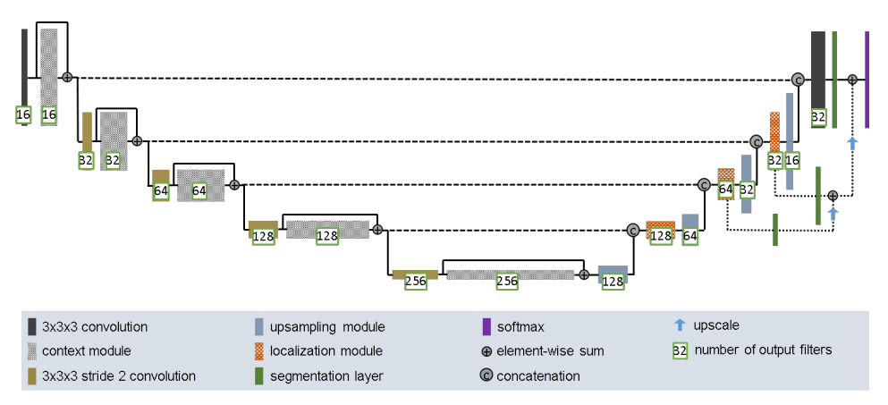
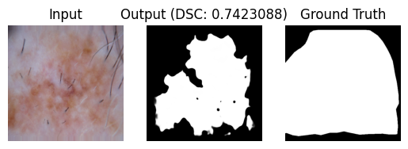
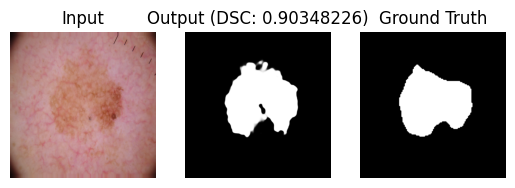
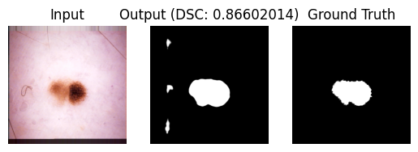
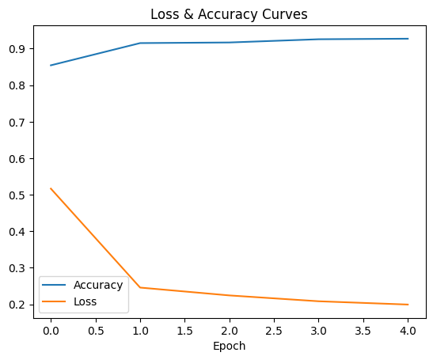
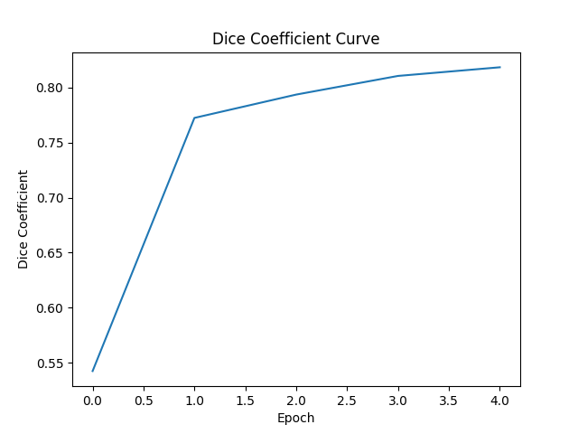

# Improved U-Net for ISIC 2018 Skin Lesion Segmentation

This repository contains the code for the Improved U-Net model for the ISIC 2018 Skin Lesion Segmentation dataset (https://challenge.isic-archive.com/data/#2018). The model contained 2594 dermoscopic images of skin lesions and was trained on a single NVIDIA RTX 3080. The model was trained for 5 epochs, with a batch size of 2. The model was trained using the Adam optimiser with a learning rate of 0.0005. The model achieved a dice coefficient of 0.81 on the test set.

## Architecture Description

The Improved U-Net is a cutting-edge neural network architecture which can be tailored for biomedical image segmentation tasks. Originally inspired by the U-Net architecture, this version boasts enhancements that further optimise its accuracy and performance. The algorithm effectively addresses the problem of segmenting skin lesions from dermoscopic images, a crucial step in early skin cancer detection.

## How It Works

### Upsampling the Feature Maps:

- The first step in the localisation module is to upsample the feature maps coming from the deeper layers (lower spatial resolution) to a higher spatial resolution.
- Instead of directly using a transposed convolution, the Improved U-Net often employs a simpler upscale mechanism. This could involve just doubling each pixel value or using a simple bilinear or nearest-neighbor interpolation.
- After the upscale, a 2D convolution is applied. This helps in refining the upsampled feature maps and can reduce the number of feature channels (if required).

### Concatenation with Skip Connection:

- Feature maps from the corresponding level in the downsampling pathway (or the encoder) are concatenated with the upsampled feature maps. This is the hallmark of the U-Net architecture and is referred to as a skip connection.
- The concatenated feature maps combine the high-resolution spatial details from the encoder with the high-level contextual information from the decoder.



Above is an image that showcases the localisation module in the context of processing 3 dimensional data.

## Dependencies

- **TensorFlow**: version 2.14.0
- **Keras**: version 2.14.0
- **NumPy**: version 1.26.1
- **TensorFlow Addons**: version 0.22.0
- **TensorFlow Estimator**: version 2.14.0
- **Matplotlib**: version 3.8.0
- **Python**: version 3.10.12


## Reproducibility

To ensure the reproducibility of results:
- We use fixed random seeds.
- Exact versions of all dependencies are listed.
- Training procedures, including data augmentation strategies and hyperparameters, are documented in detail.

## Example Inputs and Outputs

**1**: 



**2**: 



**3**:



## Evaluation Metrics

### Accuracy and Loss



### Dice Coefficient



## Final Metrics For Test Set

```
Test Accuracy: 0.8966387510299683
Test Loss: 0.20560072362422943
Test Dice Coefficient: 0.8109999895095825
```


## Data Pre-processing

For the image segmentation task, a series of data pre-processing steps were performed to prepare the input images and corresponding ground truth masks for training and validation.

### Input Images

- **Color Mode:** The color mode for the input images was set to `image_mode`, which is typically 'rgb' for full-color images.

- **Resising:** To ensure consistency, all input images were resised to a common dimension of `image_height` pixels in height and `image_width` pixels in width (e.g., 512x512 pixels).

- **Normalisation:** Normalisation was applied to the input images by rescaling their pixel values to have zero mean and unit variance. This was done using the formula `rescale=1.0 / 255`.

- **Data Augmentation:** Data augmentation techniques were employed to increase the diversity of the training dataset. Augmentation options included shear transformations with a range of `shear_range`, zooming transformations within `zoom_range`, horizontal flips (`horizontal_flip`), and vertical flips (`vertical_flip`). These augmentations help the model generalize better to different variations of the input data.

- **Fill Mode:** The `fill_mode` parameter determined how newly created pixels, if any, were filled during data augmentation. Common options include 'nearest,' 'constant,' and 'reflect.'

### Ground Truth Masks

- **Color Mode:** The color mode for the ground truth masks was set to `mask_mode`, which is typically 'grayscale' for binary masks.

- **Resising:** Similar to the input images, the ground truth masks were resised to the same dimensions of `image_height` pixels in height and `image_width` pixels in width (e.g., 512x512 pixels).

Overall, these pre-processing steps ensured that both input images and ground truth masks were appropriately sized, normalised, and augmented for training and validation of the image segmentation model.

**References**:
- https://arxiv.org/pdf/1802.10508v1.pdf

## Dataset Folder Structure

```
root_directory
│
├── datasets
│   ├
│   ├── training_input
│   ├── training_groundtruth
│   ├── validation_input
│   ├── validation_groundtruth
│   ├── test_input
│   └── test_groundtruth
├── output
├── models
├── assets
│   
├── train.py
├── modules.py
├── dataset.py
├── predict.py
├── utils.py
├── validation.py
└── requirements.txt
```

## Data Splits

The ISIC 2018 data was provided through 6 zip files for 3 types of data: Training, Validation and Testing. The training data contained 2594 images, the validation data contained 100 images and the testing data contained 1000 images.