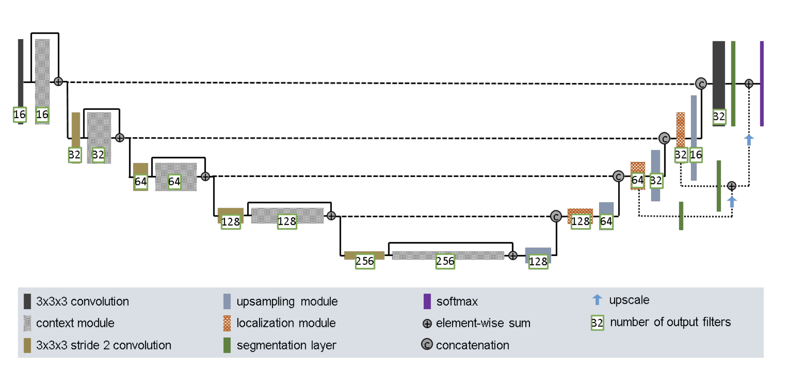
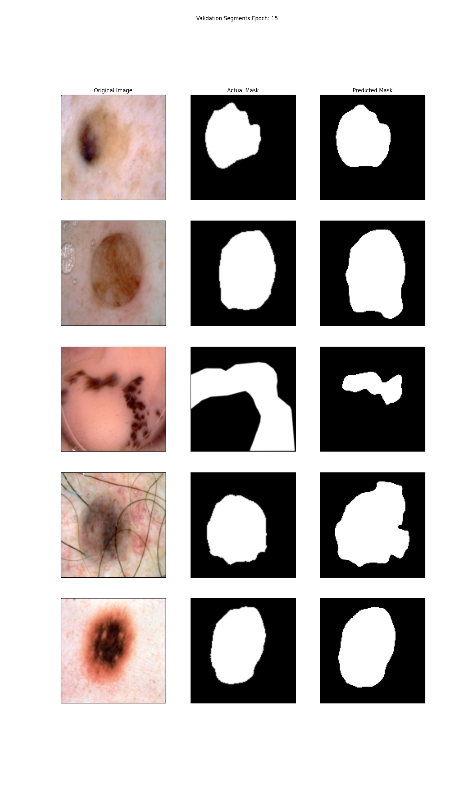
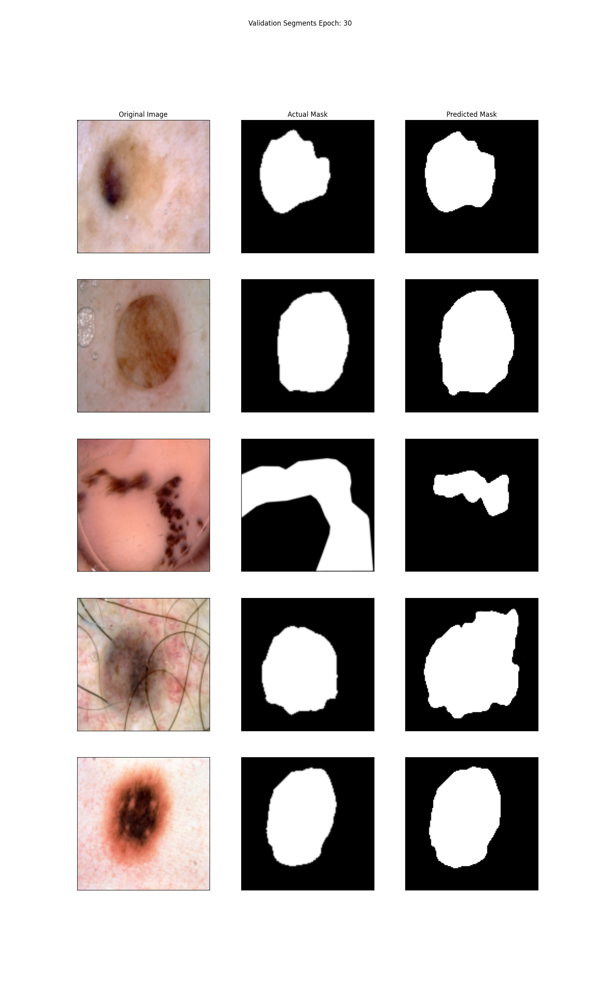

# Segmentation with the Improved U-Net Model (ISIC Dataset)

Released by the International Skin Imaging Collaboration (ISIC), the ISICs 2017 dataset was utilised in the recurring challenge of Skin Lesion Analysis Towards Melanoma Detection

The following is a solution which segments the ISIC data set using an improved U-Net architecture. The model strives to achieve a minimum DICE similarity coefficient of 0.8 on the test set for all labels.

## ISIC Dataset
The ISIC dataset consists of lesion images and their corresponding masks. We are able to download the test, training and validation set (2017) from the ISIC website

### Data Preprocessing
To process the images, all images were converted from a PIL image to a tensor and then cropped to a size of 128 x 128 in order to be run in the network and reduce training and inference time (all images had to be of same size). The lesion images were kept as RGB while the masks were made greyscale. 

## Architecture
The structure followed was presented in 2018 [1], which improves upon the initial U-Net

__Figure 2 (above): The Improved U-Net Architecture [1]__

Our model consists of 2 main sections: the encoder and decoder. The context aggregation pathway encodes and the localisation pathway decodes. Skip connections from the aggregation pathway to the localisation pathway share information about the images. The model will be trained with 30 epochs.

### Context Modules
Relevant features are extracted from the input through our context layers. Input is downsized in these layers using stride 2 3x3 convolutions. A batch dropout coefficient of 0.3 is incorporated during this contextualisation process in order to reduce overfitting risk. 

### Localisation Modules
After the model has passed the inputs through the encoder (context modules), it is passed through the localisation modules and is also upscaled in order to generate an output. The localisation layers put the inputs through stride 1 3x3 convolutions and upscale afterwards.

### Skip Connections
Skip connects connect localisation layers to their corresponding context layer, allowing for communication of input data and recovery of finer details.

### Segmentation Layers
Segmentation layers are integrated throughout the localisation pathway at various levels and combining them via element wise summation in order to generate a final output.

### Computation
Leaky ReLU nonlinearities (incorporating a slope of 10^-2) are used for all feature map computing convolutions. Instance normalisation is also used instead of traditional batch.

### Optimisation & Loss
Adam optimiser with a learning rate of 5e-4 was used.

### Performance Metric
The performance of the model was evaluated with the Dice Similarity Coefficient (DSC). DSC is a measure used to gauge the similarity between two sets, often used in the context of comparing two images in biomedical image analysis.

## Training & Validation: DSC and Loss Plots over Epochs

## Validation Visuals For Epochs

## Test Visuals & Predictions For Final Model

Average Test Loss: 0.6384
Average Dice Coefficient: 0.6579

## Dependencies
torch = 1.10.0
torchvision = 0.11.1
Pillow = 8.4.0
matplotlib = 3.4.3
tqdm = 4.62.3
numpy = 1.21.2
statistics = 1.0.3.5
Python = 3.9.13
 
## References
[1]: Isensee, F., Kickingereder, P., Wick, W., Bendszus, M., Maier-Hein, K.H, "Brain Tumor Segmentation and Radiomics Survival Prediction: Contribution to the BRATS 2017 Challenge". arXiv: Computer Vision and Pattern Recognition, 2018

