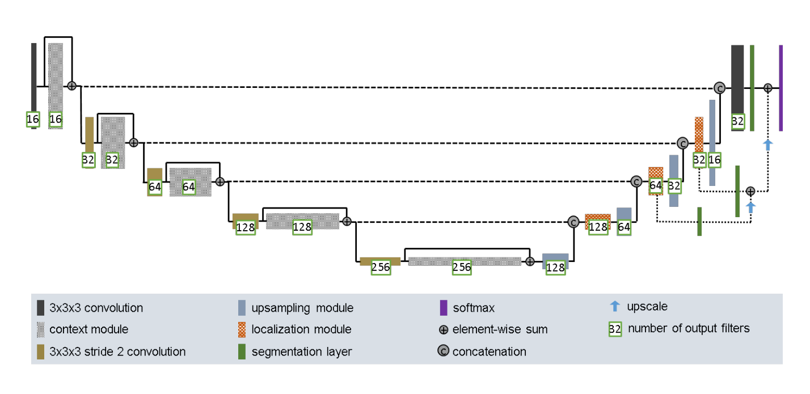
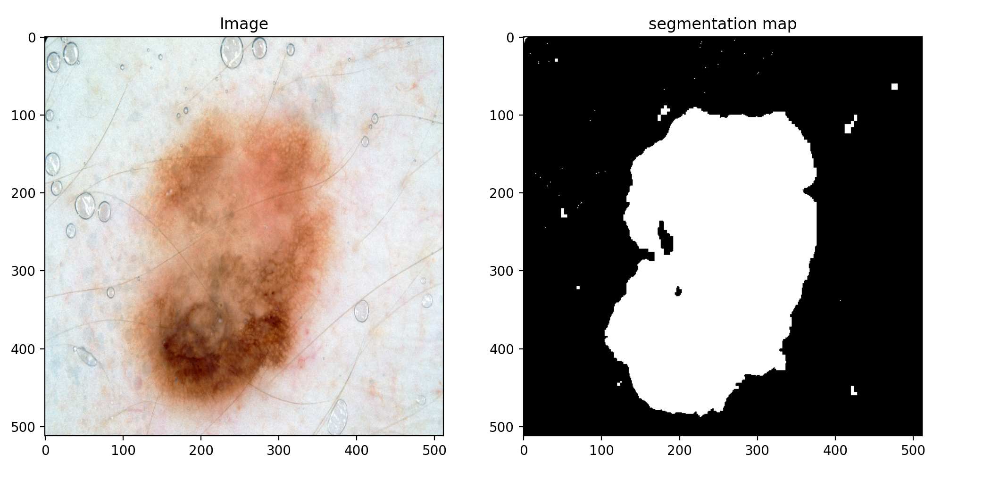

# Improved UNet arcitecture for Image segmentation of the ISIC2018 dataset
## Recognition task
The purpose of the recognition task is to perform image segmentation on the ISIC 2018 dataset. 
For testing on the test set, an average *DSC*[^1] of 0.8 is expected.

[^1]: https://en.wikipedia.org/wiki/S%C3%B8rensen%E2%80%93Dice\_coefficient 
## Dataset
The ISIC 2018 dataset was published by the International Skin Imaging Collaboration (ISIC) as
a large-scale dataset of dermoscopy images. This Task 1 dataset is the challenge on lesion segmentation.
It includes 2594 images.[^2]

[^2]: https://arxiv.org/abs/1909.00166
## Model arcitecture
The classic ***UNet*** arcitecture is a deep learning arcitecture primarily used in semantic image segmentation
which goal is to classify each pixel of a image into a class or object[^3].
The arcitecture consists of three parts. The encoder, bottleneck and Decoder. The encoder consists of multiple
convolutional layers and downsampling operations, and is responsible for capturing features of the image.
The bottleneck is the bottom layer of the network, and also consist of multiple convolutional layers.
The decoder upsamples the feature maps to generate a segmentation mask with the same dimensions as the input.
UNet arcitectures also uses skip connections in each layer of the network to help preserve detailed information of the image. 
The skip connections are combined together with the features learned from the encoder on each layer.

This UNet model is employed according to [^4] with changes made to acommodate for use on the ISIC2018 dataset. \
This includes changing 3d modules to 2d, and returning the output through a sigmoid function instead of softmax. \
The model uses deep supervision wich helps mitigate the vanishing gradient problem. It does this by integrating
intermediate loss signals into the output. This allows for more efficient flow of gradients during backpropegation. \
As with general UNet arcitecture; skip connections are also used for their ability to improve segmentation quality. 

The network takes a RGB channeled image as input, and outputs a binary segmentation map.

[^3]: https://paperswithcode.com/task/semantic-segmentation
[^4]: https://arxiv.org/abs/1802.10508v1



## example segmentation
As you can see in the picture below. The image segmentation works well in some cases, and not so good in other ca


## preprocessing and training
The image sizes in the dataset varey. This causes problems when loading the data from the pytorch dataloader.
As a work around fo this issue a standard image size can be specified in the macro *IMAGE_SIZE* in ***dataset.py*** .
The path of the dataset should be specified in the following macros in ***dataset.py***:
```
TRAIN_DATA_PATH = "Path/to/your/dataset"
TRAIN_TRUTH_PATH = "Path/to/your/dataset"
TEST_TRUTH_PATH = "Path/to/your/dataset"
TEST_TRAIN_PATH = "Path/to/your/dataset"
```

While training on rangpur[^3] the test dataset had no corresponding groundtruth images. 
As a work around for this The *ISICDataset* class in ***dataset.py*** can be specified with a split ratio as well as a boolean train statement. 
This allows the user to specify wich part of the directory he/she wishes 
to use for both training and testing.

example:
```
train_data = ISICDataset(img_dir=TRAIN_DATA_PATH, truth_dir=TRAIN_TRUTH_PATH ,split_ratio=0.9, transform=transform, train=True)
val_data = ISICDataset(img_dir=TRAIN_DATA_PATH, truth_dir=TRAIN_TRUTH_PATH, split_ratio=0.9,transform=transform, train=False)
```

In this example the train data will be allocated the first 90% of the directory. 
And the valuation data will be allocated the last 10%.

## loss function
The dice loss function is used during training on this dataset.
The dice loss is the inverse of the dice coefficent which checks 
for pixel-wise agreement between a predicted segmentation and its groundtruth. 
a small dice loss will therefore correspond with a good segmentation.
The code for this custom loss function is gotten from [Dice Loss Class](https://www.kaggle.com/code/bigironsphere/loss-function-library-keras-pytorch?fbclid=IwAR3q7bjIDoKFlc5IDGpd24TW8QhQdzbxh2TrIP6FCXb7A8FaluU_HhTqmHA). \
code:
```
class DiceLoss(nn.Module):
    def __init__(self):
        super(DiceLoss, self).__init__()

    def forward(self, predict, target):
        predict = predict.view(-1)
        target = target.view(-1)

        intersect = (predict * target).sum()
        dice = (2*intersect)/(predict.sum() + target.sum())
        return 1 - dice
```

## dependencies
* pytorch (2.1.0) for dataset creation, data loading and torchvision functionality
* pillow (10.0.1) for image loading
* matplotlib (3.7.2) for plotting

## References
[1] Noel Codella, Veronica Rotemberg, Philipp Tschandl, M. Emre Celebi, Stephen Dusza, David Gutman, Brian Helba, Aadi Kalloo, Konstantinos Liopyris, Michael Marchetti, Harald Kittler, Allan Halpern: "Skin Lesion Analysis Toward Melanoma Detection 2018: A Challenge Hosted by the International Skin Imaging Collaboration (ISIC)", 2018; https://arxiv.org/abs/1902.03368

[2] Tschandl, P., Rosendahl, C. & Kittler, H. The HAM10000 dataset, a large collection of multi-source dermatoscopic images of common pigmented skin lesions. Sci. Data 5, 180161 doi:10.1038/sdata.2018.161 (2018).

[3] Name not known, , \[RNA\](2021) 'Loss function Library - Keras & PyTorch'. kaggle.com
    12, October. Available at: https://www.kaggle.com/code/bigironsphere/loss-function-library-keras-pytorch?fbclid=IwAR3q7bjIDoKFlc5IDGpd24TW8QhQdzbxh2TrIP6FCXb7A8FaluU_HhTqmHA 
