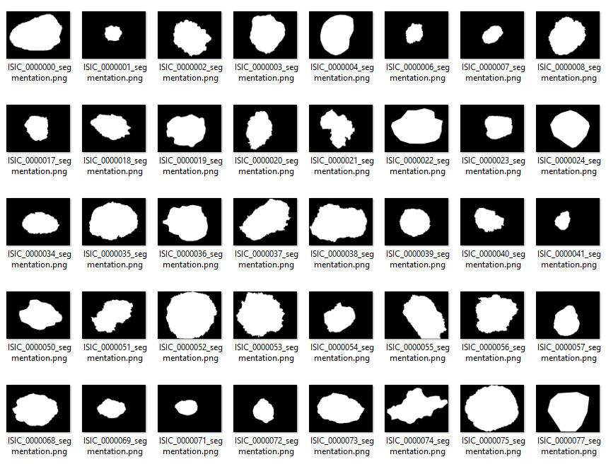
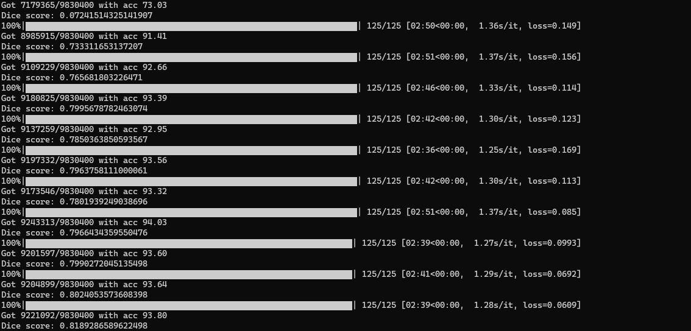
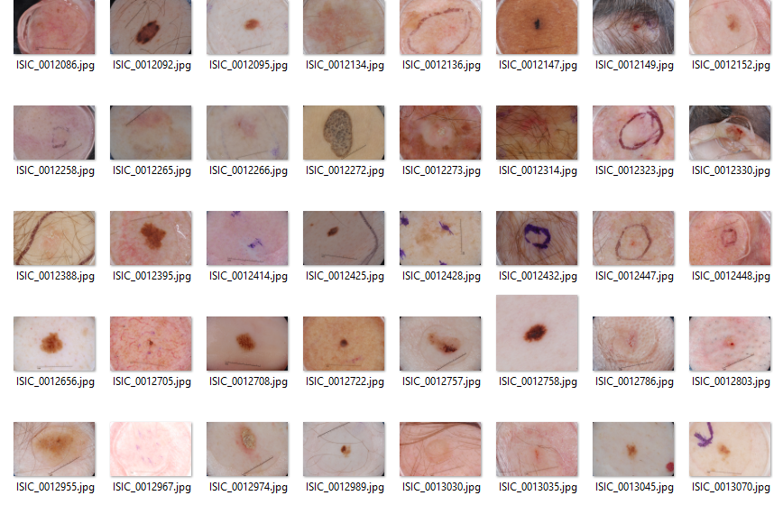
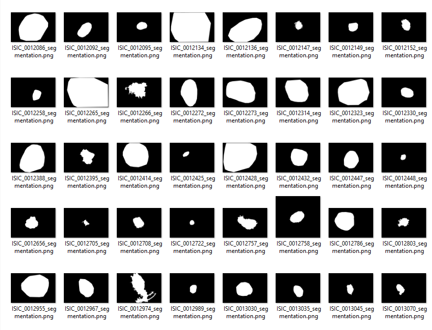
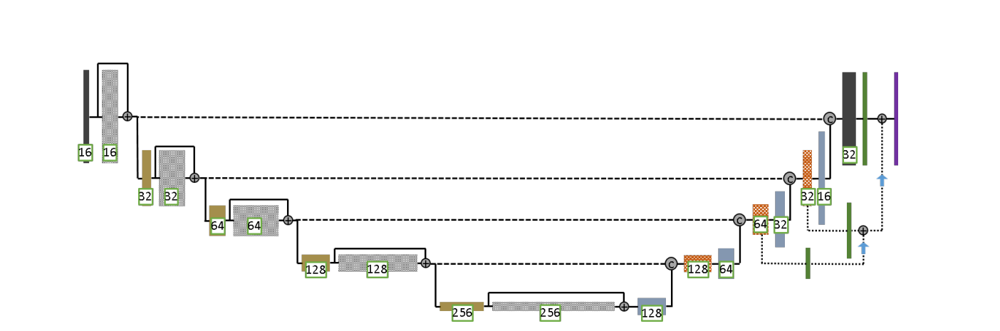

# JunHyuk Kim 2023 Report-ISIC 2017 improved Unet segmentation task.

This is a brief description of my project. The project is made for segmentation of melanoma. 
Task finished was "

## 1. Table of Contents
- [Installation](##Installation)
- [Usage](##Usage)
- [License](##Description)
- [Description](##Description)
- [Description](##Algorithm)

## 2. Installation
### 2.1. Clone the repository
### 2.2. Download Dependencies
### 2.3. Download ISIC 2017 datasets. 
The dataset is under https://challenge.isic-archive.com/data/#2017. Training data, test data, valid data is required and 
The dataset should be positioned in the same folder as the python codes under data, train data images under train_images folder, and train mask data under train_masks folder. Test data should be in the test_images and test_masks and validation should be in val_images and val_masks folder.

## 3. Usage

Run the Train.py with python3 this will create the model.pth file.
this will also create saved.img file if

Run predict.py to get the segmentation and the dice coefficient. 
This file will save all the segmentation predictions under evaluation_folder. T

## 4. Description 
### 4.1. Brief description of the task
The ISIC 2017 improved Unet segmentation task is implemented.
The improve Unet is used and the format follows https://arxiv.org/pdf/1802.10508v1.pdf. 

### 4.2. Dependencies
Modules that are required to run the code:
import tqdm
import torchvision
import albumentations
import torch
import matplotlib
import sklearn
import glob 
import PIL
import os
import pandas
import numpy
python 3.11.5
window 11

#### 4.2.1 Reproducibility
After 10 epochs, the model relably provided dice score arount 80 percent. 

### 4.3. provide example inputs, outputs and plots of your algorithm
For every epoch, the validation set is used to test the segmenation. 
#### 4.3.1. The output when train.py is ran

#### 4.3.2. The output expected after running predict.py

### 4.4 The read me file should be properly formatted using GitHub markdown
Bold was used to highlight the page.

### 4.5. Describe any specific pre-processing you have used with references if any. Justify your training, 
#### 4.5.1. pre-processing
I used transformation to increase the number of samples the model is trained on.
For transformation the 
I also resized the images into 256x256 sizes to increase the performance of training and also because my model works on that sizes. 

#### 4.5.2. Training
The training is done in batch size of 16 with 10 epoches.
The opitmizer used is ADAM and the loss function used is Dice loss function.
The schaduler was used to reduce the learning rate at the end fo the function.
The training accuracy and saved predictions are from validation imagesets. 

## 5. Algorithm/ImprovedUnet
This program uses improved Unet to segment the differnt types of skin conditions such as melanoma.
The improved Unet strucuture explained
### 5.1. Context layer and Localization Layer.
Context Layer consists of 2d convolutional layer with kernel size 3, InstanceNorm2d, LeakyReLU and dropout layer with p value of 3. After that, another 2d convolutional layer with kernel size 3 is applied followed by instanceNorm2d and LeakyReLU. Context layer normally recieves the same output as input channel, which means goingthough context layer doestn really change the dimension of the tensor. 

Localization Layer consists of 2d convolutional layer with kernel size 3, InstanceNorm2d, LeakyReLU. After that, another 2d convolutional layer with kernel size 1 is applied followed by instanceNorm2d and LeakyReLU.
Localization layer changes the dimension of the tensor given by halving it. This is because it recieves the concatination of skip_connection and the previous output from the previous layer. 

### 5.2. Layer going down the layer.
#### 5.1.1. Structure of context pathway
Firstly,2d convolutional layer is applied to the input tensor X, and the output is saved. First convolutional layer changes the dimension of the tensor to 3 to 64, but all the other pathways doubles the dimension of the tensor.
The output if fed into the the context layer, and the output of the context layer and the first convolutional layer is added element wise using the "torch.add()" function. 
The output is saved in the name of skip_connection_n(where n is the layer which the context pathway is in).

Than this countinues 4 more times except for the 5 th time the skip connection is not saved.

### 5.3. Layer going up the layer.
In the layer 5 after applying the context pathway for 5 times, localization pathway is applied. 
Localization pathway consists of first upsampling the tensor(which doubles the size of the image) and a convolutional layer with kernal size of 1, which halves the amount of features the tensor has. After this, the skip layer which corresponds to the layer which the localization layer is positioned is concatinated to the previous output. Than the output is fed into the localization layer, which will halve the amount of features the tensor has. This is because the number of feature is doubled after concatination.
This continues until the the ouput reaches the layer 1, where instead of localization a normal convolutional layer with kernel size 3 is applied. This doesnt change the amount of the feature map.

During the localization pathway, in Kayer 3 localization and Layer 4 localization, and after the final convolutiol layer, segmentaion layer which is just a convolutional layer with out channel of 1 is appied and the output is saved under the name of segmentation 1, segmentaion 2 and segmentation 3.
Segmentation 1 is upscaled and added element wise to segmentaion 2, and the combination of those are upscaled and added to segmenation 3 element wise. 

Finally the combination of all are ran though Sigmoid function and the model returns the output. 

