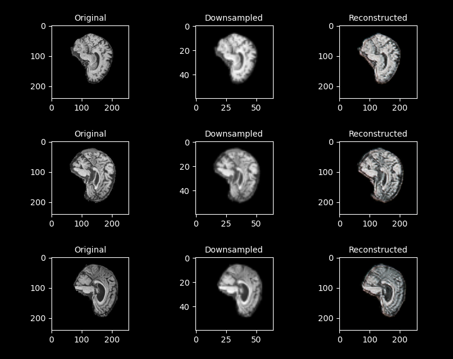

# MRI Super-Resolution Network

### Mike Smith - 46408789

## Description

The MRI Super-Resolution Network developed for this project is a Super-Resolution Deep Convolutional Generative Adversarial Network (SR-DCGAN). This is a machine learning model designed to enhance the resolution of MRI images. This particular implementation uses downsampled (by a factor of 4) MRI images from the Alzheimer's Disease Neuroimaging Initiative (ADNI) MRI dataset. The dataset is preprocessed to create low-resolution versions of the images, simulating downsampled data.

The GAN consists of two neural networks: a generator and a discriminator. The generator creates high-resolution images from low-resolution inputs. The discriminator evaluates these generated images and real high-resolution images from the dataset, aiming to distinguish between them. Through adversarial training, the generator learns to create images that are increasingly difficult for the discriminator to differentiate from real high-resolution images. Both the generator and discriminator utilize deep convolutional neural networks (CNNs).

The core objective of the network is to perform super-resolution by increasing the spatial resolution of the input images. In the context of MRI images, this process helps to reconstruct detailed structures that are lost during downsampling. The training process uses adversarial loss to ensures the generated images are realistic and similar to real images.

## Implementation

### Generator Network

The code for the generator model can be found in the `modules.py` file in `Model_Generator` class. The following is structural desciption of the generator model.

### Discriminator Network

The code for the discriminator model can be found in the `modules.py` file in `Model_Discriminator` class. The following is structural desciption of the discriminator model.

## Dependencies

### PyTorch

Works with PyTorch Version 2.0.1 or above.

### Dataset

Used the Alzheimer's Disease Neuroimaging Initiative (ADNI) MRI dataset. Available at: https://adni.loni.usc.edu/data-samples/access-data/

### Hardware

It is recommended to use hardware acceleration in the form of GPUs when training the model. This SR-GAN network took on around 90 minutes for 100 epochs with the ADNI dataset on NVIDIA A100 GPUs.

## Results

### Data Preprocessing

Data preprocessing is performed in the `dataset.py` in the `Dataset` class. The initialisation function first determines the type of dataset (train or test) based on the train parameter. It constructs appropriate file paths for the dataset, considering whether it's meant for training or testing.

Following that, the dataset then undergoes standardization through normalization. The mean and standard deviation values are set to 0.5 for each channel. Normalization ensures that the pixel values of the images are within a standardized range, making it easier for machine learning models to learn patterns from the data. Additionally, the images are converted into PyTorch tensors.

### Example Inputs and Outputs

### Training Results (Epoch vs Loss)

## Reproducibility

### Hyperparameters

### Variable Learning Rate Scheduller

### Other Issues / Problems

