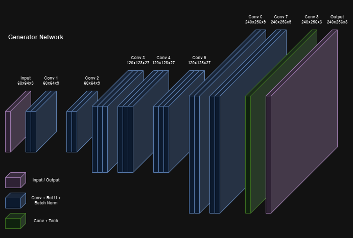
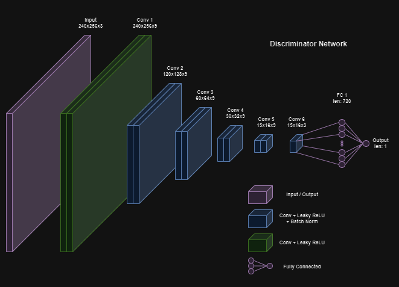
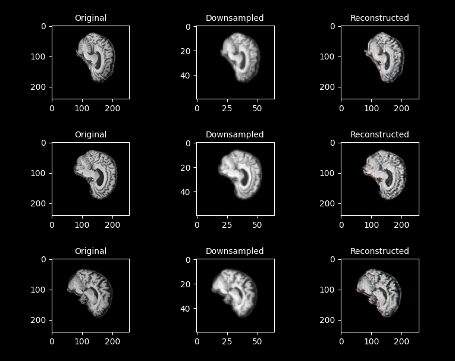
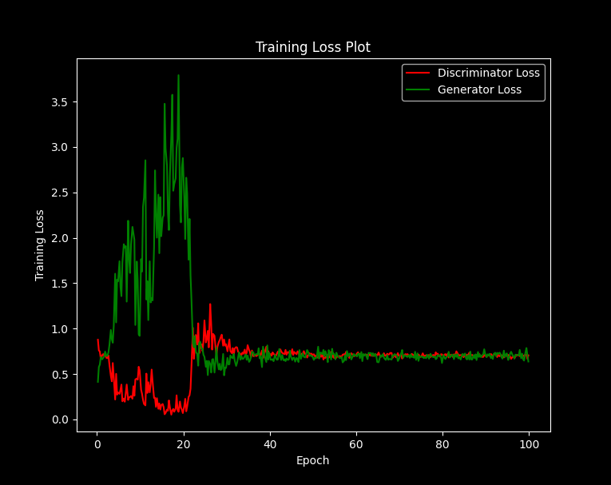
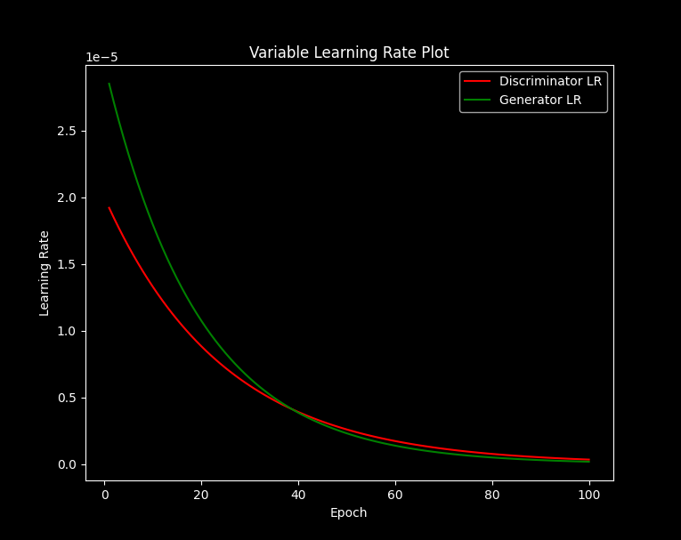

# MRI Super-Resolution Network

### Mike Smith - 46408789

## Description

### Design Task

The MRI Super-Resolution Network developed for this project is a Super-Resolution Deep Convolutional Generative Adversarial Network (SR-DCGAN). This particular implementation is designed to enhance the resolution of MRI images. It uses brain MRI images from the Alzheimer's Disease Neuroimaging Initiative (ADNI) MRI dataset. The original images, with a resolution of 240 x 256, are 4 times downsampled to a resolution of 60 x 64. The generator model then attempts to reconstruct these downsampled images back to the original higher resolution. The dataset is preprocessed to create these low-resolution versions of the images which simulates the downsampled data.

### Model Overview

The GAN implementation consists of two neural networks: the generator and the discriminator. The generator network attempts to recreate high-resolution images from low-resolution inputs. The discriminator evaluates these generated images against the real high-resolution images from the dataset, and aims to distinguish between them. Through the process of adversarial training, the generator learns to create images that are increasingly difficult for the discriminator to distinguish from the real high-resolution images. Similarly, the discriminator learns more complex patterns to better differentiate between the real and generated images. Both the generator and the discriminator use a deep convolutional neural network (CNN) design.

### Aims and Objectives

The main aim and objective of the network is to accurately reconstruct the super-resolution version of the low-resolution input images. Modern MRIs will typically perform a type of sparse sampling to improve speed. This results in an undersampled image. For these MRI images, this process of super-resolution helps to reconstruct detailed structures that are lost due to undersampling [^5]. Finally, as mentioned, the training process uses adversarial loss to ensure that the generated images are realistic and closely resemble the real images.

## Implementation

### Generator Network

As mentioned, the generator network is a deep-convolutional network. It consists of 8 convolutional layers. 

All layers except the last layer use a rectified linear (ReLU) activation paired with batch normalisation. The ReLU introduces non-linearities into the network, which is especially important in deep networks since these non-linearities help take full advantage of all layers in the network. Additionally, batch normalisation is introduced to help improve the efficiency of the training process. Batch normalisation can help address the internal covariance shift that occurs especially in deep neural networks [^2]. This optimisation process helps speed up training by making the optimisation process faster and more stable.

For this generator model, layers 3 and 6 are upsampling convolutional layers using the `ConvTranspose` layer with a stride of 2. All other layers are implmented in a similar way using a stride length of 1 instead.

The final layer does not have batch normalisation and uses a hyperbolic tangent activation (tanh) function. The lack of batch normalisation in the output of the generator is known to reduce sample oscillation and overall model instability [^1]. Finally the use of the hyperbolic tangent function is used to bound the outputs to be displayed as the output image.

<!--
References: https://machinelearningmastery.com/how-to-train-stable-generative-adversarial-networks/
-->

The code for the generator model can be found in the `modules.py` file in `Model_Generator` class. The following is structural desciption of the generator model.

### Discriminator Network

Similarly, the discriminator model mainly consists of a deep-convolutional network consisting of 6 convolutional layers followed by a single fully connected layer that connects the final convolutional layer to the single sigmoid output.

In contrast to the generator, all layers in the discriminator except for the first convolutional layer consists of a Leaky-ReLU actcivation followed by batch normalisation. The Leaky-ReLU, unlike standard ReLU, allows for negative values. This is more useful for the discriminator since it increases the ability for it to distiguish more distinct patterns to help with recognition. Additionally, a gradient of 0.2 is used for the negative values of the Leaky-ReLU activations. Furthermore, batch normalisation is used here again to imporve training efficiency [1].

For the discriminator, layers 2, 3, 4 and 5 are downsampling layers (from 240 x 256 down to 15 x 16). The downsampling layers are implemented as convolutional downsampling using a stride of 2. Convolutional downsampling is used rather than a deterministic kernel (such as max pooling) to furthe extract patterns during these layers [^3]. This is done to improve the efficiency and performance of the discriminator model. Finally, layers 1 and 6 are implemented in a similar way with a stride of 1 instead.

As mentioned, the first layer of the discriminator does not have batch normalisation. Again, similar to the generator, this is done to reduce sample oscillation and overall model instability [^1].

The final output layer consists of a fully connected layer with a single sigmoid output. The sigmoid activation is used to bound the output between 0 to 1 representing the confidence level of the predicted outcome. Values close to 0 represent low confidence that the image is real (being the generated upsampled images) and values close to 1 represent high confidence that the image is real (being the original full-resolution images).

The code for the discriminator model can be found in the `modules.py` file in `Model_Discriminator` class. The following is structural desciption of the discriminator model.

## Dependencies

### PyTorch

Works with PyTorch Version 2.0.1 or above.

### Dataset

Uses the Alzheimer's Disease Neuroimaging Initiative (ADNI) MRI dataset. Available at: https://adni.loni.usc.edu/data-samples/access-data/

### Hardware

It is recommended to use hardware acceleration in the form of GPUs when training the model. This SR-GAN network took on around 90 minutes for 100 epochs with the ADNI dataset on NVIDIA A100 GPUs.

## Results

### Data Preprocessing

Data preprocessing is performed in the `dataset.py` in the `Dataset` class. The initialisation function first determines the type of dataset (train or test) based on the train parameter. It navigates to the appropriate file paths for the dataset, considering whether it's meant for training or testing. Note that the training in `train.py` is done on the training set and the predictions in `predict.py` is made from the testing set.

Following that, the dataset then undergoes normalisation. The mean and standard deviation values are set to 0.5 for each channel. Normalisation ensures that the pixel values of the images are within a standardized range, making it easier for machine learning models to learn patterns from the data. Additionally, the images are converted into PyTorch tensors.

### Example Inputs and Outputs

The following are a few examples of inputs and outputs of the generator along with the original images. The original image (column 1), the downsampled (column 2) and the reconstructed images (column 3).

### Training Results (Epoch vs Loss)

As mentioned in the model descriptions, adverserial loss was used to train this GAN network. The loss for both the generator and the discriminator for the first 100 epochs are shown as follows.

Shown above, the generator loss tends to be high during the start of training before it decreases as training progresses. Likewise, the discriminator loss dips initially before recovering to a more stable level as training progresses.

Notice that the loss for the generator and the discriminator evens out and remains fairly consistent after around the 40th epoch. This is expected, and means that the generator and discriminator are both learning at rate that well compliments each other.

However as mentioned, due to the chaotic nature of training GAN networks, a variable learning rate scheduller was also used. This will be further discussed in the next section.

## Reproducibility

### Hyperparameters

The final model was run in 300 epochs with a batch size of 16 resulting in 1345 batches per epoch for the ADNI dataset. 

As mentioned adverserial loss was used for the training process. To implement this, a Binary Cross-Entropy (BCE) loss was used for the output of the discriminator. This particular loss function is used as the output of the discrinimator is essentially classifying images into two classes: real and generated.

Finally, the Adam optimiser is used with betas values of 0.5 and 0.999. These values determine the expoential decay rates for the first and second moment estimates which is important in regards the training convergence and gradient descent[^4]. The use of this optimiser along with these beta values are found to produce the more optimal training results for this model.

### Variable Learning Rate Scheduller

Furthermore a variable learning rate scheduller is used in addition to the "built-in" exponential decays of the Adam optimiser. This is done to further improve the training process and to help the network converge during the training process. The learning rates for the generator and the discriminator are defined as follows:

$lr_{generator} = 3\times10^{-5}\times 0.95^{epoch}$

$lr_{discriminator} = 2\times10^{-5}\times 0.96^{epoch}$

These relationships ensure that the generator has a higher learning rate during the start of training to prevent the discriminator from learning too quickly relative to the generator. 

Eventually, the generator learning rate drops below that of the discriminator since the images become increasingly difficult to differentiate. Finally, the decaying nature of the learning rate helps ensure stability during training.

The learning rate of the generator and the discriminator for the first 100 epochs are shown in the following plot.

### Problems and Potential Improvements

**Training Stability:** As mentioned in the previous section about the variable learning rate scheduller, GAN networks diverge easily when training and are very sensitive to the initial hyperparameters. The variable LR attempts to mitigate this by exponentially reducing the learning rate. This is not optimal because it required are larger number of epochs for the model to train.

**Training Time:** Another current limitation is the amount of time it takes to train the current model. The model used to generate the output images in the resport ran for 300 epochs which took 258 minutes (4 hours and 18 minutes) on NVIDIA A100 GPUs using the ADNI dataset with a batch size of 16. This is because of the learning rate decay as previously mentioned. Improvements in training stability or increasing the batch size may allow for higher learning rates. However, GANs are extremely sensitive to these hyperparameters therefore other parameters may also need to be changed to ensure a convergent training process.

**Pixel-Level Artifacts:** Finally, GAN models tend to produce small pixel-level artifacts that is not present within the original image. For this model, these aretifacts are not very obvious unless one zooms further into the image. These can be a cause for concern since MRI images are crucial for diagnostics and artifacts in the images that may not exist in reality can be very serious. For this, a much improved model would have to be developed in order to further increase the similarity between the real and reconstructed images.

## References

[^1]: Brownlee, J. (2019) Tips for training stable generative Adversarial Networks, MachineLearningMastery.com. Available at: https://machinelearningmastery.com/how-to-train-stable-generative-adversarial-networks/

[^4]: Brownlee, J. (2021) Gentle introduction to the adam optimization algorithm for deep learning, MachineLearningMastery.com. Available at: https://machinelearningmastery.com/adam-optimization-algorithm-for-deep-learning/

[^3]: Hui, J. (2020) Gan - ways to improve gan performance, Medium. Available at: https://towardsdatascience.com/gan-ways-to-improve-gan-performance-acf37f9f59b

[^2]: Saxena, S. (2023) Introduction to batch normalization, Analytics Vidhya. Available at: https://www.analyticsvidhya.com/blog/2021/03/introduction-to-batch-normalization/#:~:text=Batch%20normalization%20is%20essential%20because,process%20more%20stable%20and%20faster.

[^5]: Sherry, F. et al. (2020) Learning the sampling pattern for MRI - arxiv.org, arxiv.org. Available at: https://arxiv.org/pdf/1906.08754