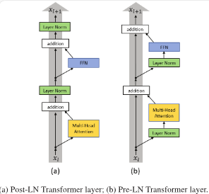
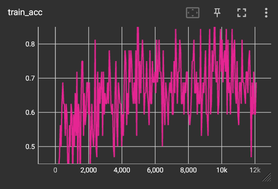
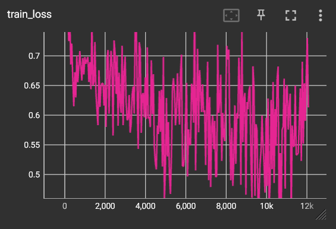
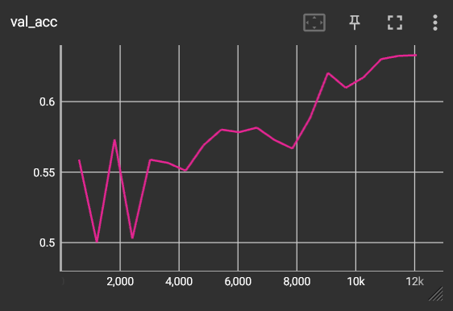
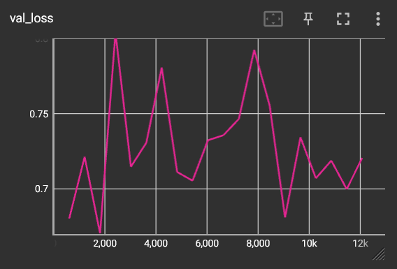
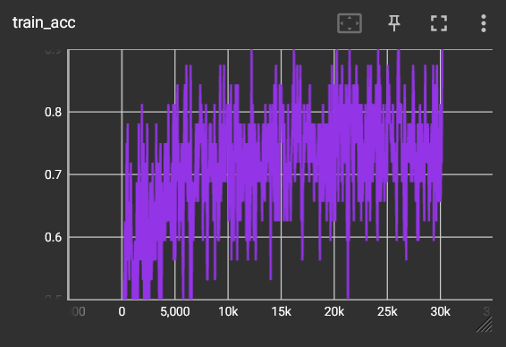
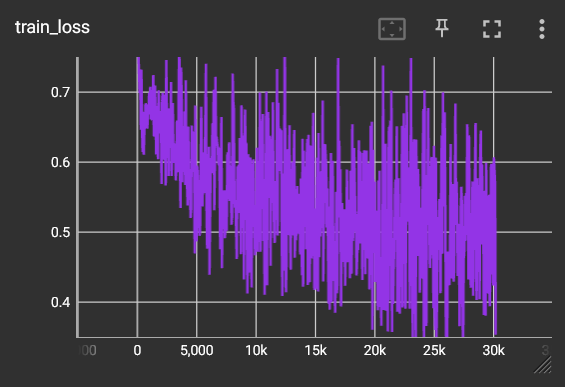
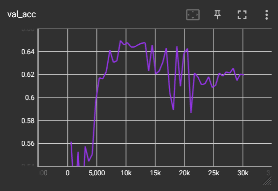
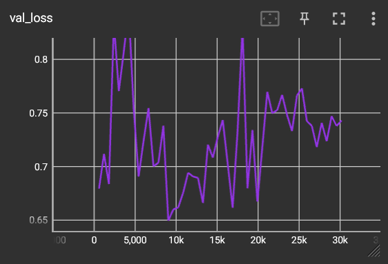

# Vision Transformer for Classification of Alzheimer's Disease

## Author 
Markus Zuegg (Student ID: 47449248)

## Project OverView

This project aims to build a deep learning neural network to classify if a MRI shot has AD (Alzheimer's Disease) or CN (Cognitive Normal) using a Vision Tranformer model (ViT) as first shown in the paper [An Image is worth 16x16 Words](https://openreview.net/pdf?id=YicbFdNTTy). Specifically this project will be a pytorch_lightning implementation of the ViT. Pytorch_lightning is a helpfull package that simplifies the code layout of deep learning models. Transformers and specifically Vision have many real world applications, in feilds such as medical or image recognition (driver-less cars).

## Vision Transformer
The following is the overall layout of the Vision Transformer:
<p align="center">
    
</p>
The ViT splits up the whole image into patches, which it will the feed into neural network. However, becuase it doesnt know where the patches are positional encoding is used to embed information about each patch's location respective to eachother. The ViT, like other tansformers, uses multi-head attention which can be trained to adjust their weights. Which then is fed into a MLP which is used to classify the image.

Specific Encoder block vs usual encoder block:
<p align="center">
    
</p>
This specific layout for the ViT encoder was proposed by Ruibin Xiong et al. in 2020 [2]. Which uses pre-layer normlization(b), not in between residual blocks like conventual ViT's (a). This new layout supports better gradient flow and removes the need for a warm-up stage learning rate schedular.

## Enviorment Dependencies
These packages/ software need to be installed as to run this model:
- python 3.11.4
- cuda 11.8
- pytorch 2.0.1
- pytorch_lightning 1.9.5
- pysoundfile 0.9.0 for windows or sox if linux
- tensorboard 2.14.5

## Repository layout

`readme_imgs` contains images used in this README.md file

`ViT_Pytorch_lightning` folder contains all the following:

`dataset.py` contains data loading class

`modules.py` contains all neural network architecture

`train.py` contains main ViT class and ablity to train/save model

`predict.py`contains scripts to load previous checkpoint and test that model
    
`Data` folder storing data should be located here

## Data set
This project uses the provided [ANDI 2D MRI brain slices](https://cloudstor.aarnet.edu.au/plus/s/L6bbssKhUoUdTSI). Which orginally contains only train and test splits. Which given by the name of the filenames, are assumed to already be patient level split. So we will manually split the train set into a 90-10 train val, this i found was a good mix with enough training samples still left in circulation. 90-10 of patients as to ensure each patient stays in either train, test or val and not more than 1. As this would lead to data leakage.
Data layout as shown below:
```
ANI/
    AD_NC/
        train/
            AD/
                images.jpeg
                ...
            CN/
                images.jpeg
                ...
        test/
            AD/
                images.jpeg
                ...
            CN/
                images.jpeg
                ...
        val/
            AD/
                images.jpeg
                ...
            CN/
                images.jpeg
                ...
```
Example of Data:
<p align="center">
    
</p>

## Usage
To train your own model, use train.py and enter the hyperparameters u wish to use in the variable named ANDI_config:

`embed_dim` Dimensionality of the input feature vectors

`hidden_dim` Dimensionality of the hidden layer

`num_channels` Number of channels of the input

`num_heads` Number of heads to use in the Multi-Head Attention block

`num_layers` Number of layers to use in the Encoder

`num_classes` Number of classes to predict

`image_size` List of image dimensions [height, width]

`num_patches` Maximum number of patches an image can have

`dropout` Amount of dropout to apply in the feed-forward network

These are set up outside of ANDI_config:

`lr` learning rate of the model. Can range from 3e-4 to 1e-5

`max_epochs` number of epochs the model will train for

`batch_size` number of images per batch

To load a pre-trained model and test against test set, using predict.py:
- enter file directory to checkpoint file
- enter name of checkpoint file

## Results

### Model 1
Model 1 was trained on these specific hyperparameters after many instances of tuning, i found these hyperparameters to work best:
```
"embed_dim": 256,
"hidden_dim": 512,
"num_heads": 8,
"num_layers": 6,
"patch_size": 8,
"num_channels": 3,
"image_size": [256, 240],
"num_classes": 2,
"dropout": 0.2,
lr: 3e-5
batch_size: 32
epochs: 20
```
The train loss, acc and validation loss, acc are shown below:
<p align="center">
    
</p>
<p align="center">
    
</p>
<p align="center">
    
</p>
<p align="center">
    
</p>

It is evident from the validation accuarcy that the model could have run for longer as it only just started to platue at the 20th epoch. Both train accuracy and loss are very sporadic. With train loss have a slight trend towards 0.5, and accuracy jumping widly from >80% to <60%, howere staying around the 70% range. Validation loss has an interesting spike in the middle compared to start and ends. The end test score on the test set for Model 1 was 64.27% with a loss of 0.7172.

### Model
For Model 2, I aimed to run the same hyperparameters as Model 1 but for a longer max_epochs. However, due to memory allocation issues I had to drop batch_size to 16 and num_layers to 5.
```
"embed_dim": 256,
"hidden_dim": 512,
"num_heads": 8,
"num_layers": 5,
"patch_size": 8,
"num_channels": 3,
"image_size": [256, 240],
"num_classes": 2,
"dropout": 0.2,
lr: 3e-5
batch_size: 16
epochs: 40
```
The train loss, acc and validation loss, acc are shown below:
<p align="center">
    
</p>
<p align="center">
    
</p>
<p align="center">
    
</p>
<p align="center">
    
</p>

The train accuarcy is just a sporadic and stays very similar to Model 1. Train loss keeps the slight trend down, if not flattening off more than expected. Validation accuracy sees a sudden rise much above Model 1, managing to reach above the 65% line, however sees a large decrease after 20k steps, falling to below Model 1. Validation loss is similar to Model 1, before rising slowly after 20k steps. In the end Model 2 got a score on the test set of 60.24% accuarcy and a loss of 0.7754.

## Disscussion

The maximum test accuracy i was able to achieve was 64.27% using Model 1. Which was 4% better than my second best model, which ran for significantly longer number of epochs, however, with halved batch size. With many different hyperparameter tuning, such as changing layers, batch size and number of epochs, I was not able to get close to Model 1. A trend throught all testing was that the lower the batch size (<32), the model would train well yet underperform on the test set. This is eveident of an underlying issue I was unable to adress, which was that with a large model (all were around 3M parameters) I would run into a memory alloaction error. not allowing me to up the batchsize of the same szie model, or even increase number of epochs in some cases. I suspect that this issue could be from my img_to_patch function, or number of heads. Looking at the sporadic nature of both train loss and accuracy this leads me to believe my loss function or optimzer was not ideal. I did test this, and found milestones to help, however in congunction with the previous issue I was not able to fully investiagte. On the side of preprocessing, my train transform was consistant a randomhorizontalflip, randomreziedcrop and a normalise. No eveidence that these helped with training.

## Conculsion

It is clear that a memory allocation error is a server issue with this model, hindering proper tuning. Non ideal learning rate schedular was evident, as spordic nature of train loss and accuracy. Even with a lowering of the learning rate from 3e-4 to 3e-5, this did not seem to help much. The max accuracy gained on the test set was 64.27%.

To improve it is suggested that maybe a smaller moddel with lower learning rates and higher batch sizes be used.

## Refrences
[1] Vision transformer paper, from: https://openreview.net/pdf?id=YicbFdNTTy

[2] Pre-layer Normilization, from: http://proceedings.mlr.press/v119/xiong20b/xiong20b.pdf

## Code refrences
[3] Pytorch_lightning Vision transformers, from: https://lightning.ai/docs/pytorch/stable/notebooks/course_UvA-DL/11-vision-transformer.html
