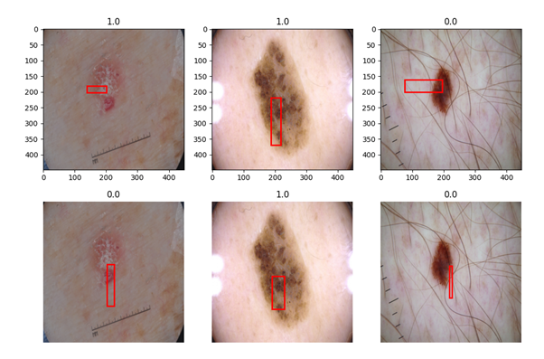

# Detecting lesions within the ISIC 2017/8 data set with a modified YOLOv1
## Algorithm

The algoirthm/model I have chosen for this is the YOLOv1 which has been implemented into pytorch with some minor modifications. The following image is base YOLOv1 architecture. With instead of a 7x30 tensor, it is instead a 7x7x(Object detection, Classes=2 + bbox=4). This was then further changed to be only a 1x1 cell instead of a 7x7 object detection as only one object is ever present which has improved the accuracy. An adaptive average pool was added to average the 7x7 cells to a single 1x1 before the fully connected network. Which is now a 1x1x7(1 object, 2 classes and 4 for bbox). The YOLOv1 algorithm uses multiple convolution layers and maxpooling layers to create 6 distinct sections that is all connected. 

## Dataset

The lesions dataset contains 2000 images with classification and image masks. The task is to use object detection to locate the lesions then classify the object. While the image masks are not required for YOLOv1 it will be required to calculate the bounding box as they are provided. The image is provided in a folder, the segmentation mask in another and all image names and classification in an csv file. 

The following are some example images from the dataset, 0 is melanoma and 1 is seborrheic_keratosis. 

## Trainning

Before trainning the data was all data was resized to the supported YOLOv1 of 448, 448. The ratio of HxW would be unlikely to change detection results. All splitting and random generation was done using a fixed seed of 56 configured in the CONFIG.py file. This was to reproduce the results through several trials and make sure the train and test splits remain the same for validation and trainning. Since there is a decently sized dataset a standard train / test split of 0.8 / 0.2 was chosen. Which leaves 1600 files for trainning and 400 for testing. 

With a RTX2070, 8 epochs and batch size of 16 it took around 20 minutes to train. This was significantly higher until it was discovered the dataloader is a bottle neck for io operations. This could be sped up by increasing batch size but this was the limit for the VRAM available. With some memory optisimation and clearing it's possible to increase this further.

The inputs for the model is a batch_size x (C x H x W) torch tensor of float32 between 0 and 1 for each pixel information. Where batch_size is configured in CONFIG as well as height x width but is forced to 448 for YOLOv1 and channels is the 3 RGB channels. The output of the model is batch_size x (7). Where 7 corresponds to 1 for if object detected, 2 for probability of each class, and 4 floats for bounding box in the form of (x,y,w,h), x,y is the centre point and w and h is total width and height. 
## Results

After trainning, the following results were achieved. 

A classification precision of 0.1713.
Intersection over union of 0.3962.

The low classification precision is most likely due to some images not containning any objects but the classifer is over classifying. And the intersection over union appears to be an issue with how the bounding boxes are calcualted.

The first row shows the labelled data and the second row is the predicted classification and bounding box. 

