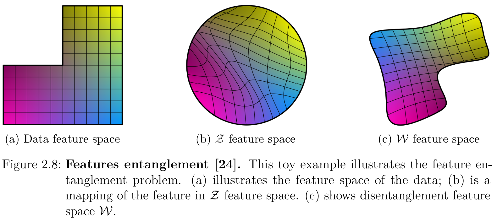
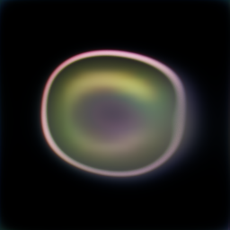
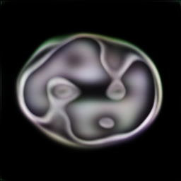
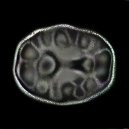
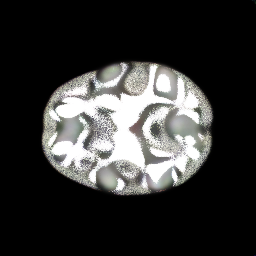
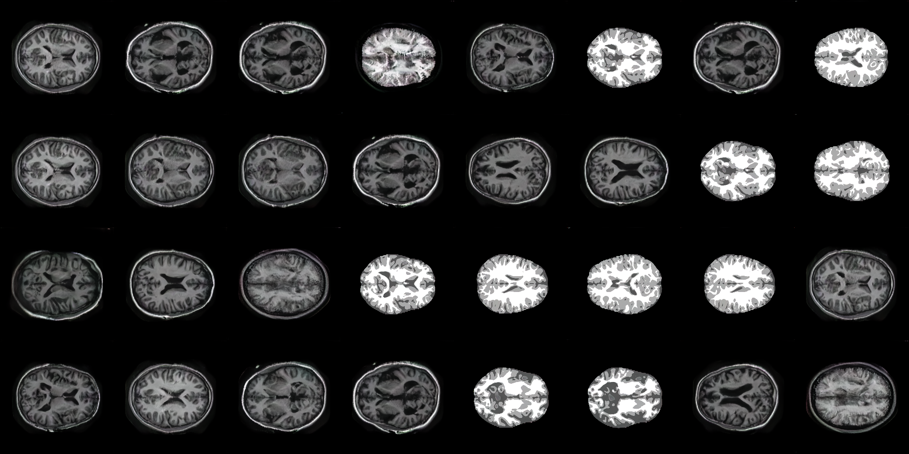
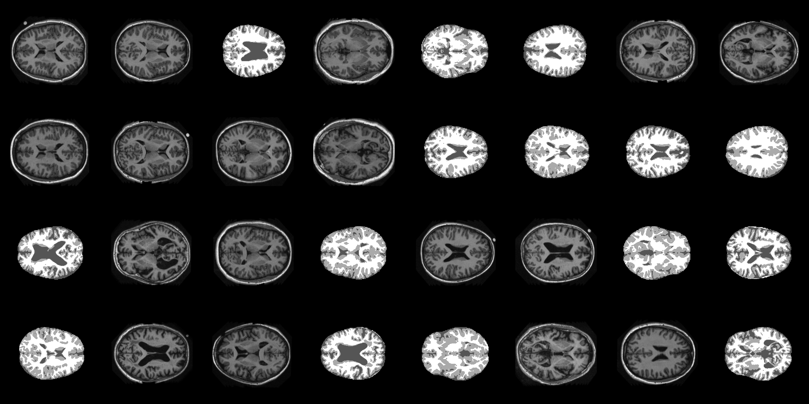

# StyleGAN on the OASIS brain dataset
By: Eli Cox, s4641799
## Task
Create a generative model of one of the OASIS brain, ADNI brain or the OAI AKOA knee data set (see Appendix for links) using either a variant of StyleGAN /StyleGAN2 or Stable Diffusion that has a “reasonably clear image”.

In this project, Stable Diffusion was experimented with, but StyleGAN was the final implementation on the OASIS brain dataset. Stable Diffusion wasn't used due to a lack of familiarity with the model type.

The StyleGAN network is trained until it is able to generate clear images that match the dataset and appear as brain MRIs.
## Project Files
- `dataset.py`: Data loader for the OASIS brain dataset, transforms the data for use with the model.
- `modules.py`: The StyleGAN networks as well as the layers and blocks they use.
- `predict.py`: Generates a batch of fake images that can be compared to the original dataset.
- `train.py`: Training process for the StyleGAN networks, will also generate example images and graph the loss function.
- `utils.py`: Functions used by the other scripts and global variables.
## Model Architecture
### Generative Adversarial Network (GAN)
A GAN consists of two neural networks; A Generator and a Discriminator, where each network will compete against each other to fool the other network.

The generator network will learn how to remove noise from images to generate the original data sought after. That means taking an image from the dataset which has some random noise and transforming the input into a resulting image which resembles data from the original dataset.

The discriminator network will learn to distinguish between real and fake data in the data set. This means supplying it an image from the dataset and an image from the generator, and having it predict which one is real. This enables the discriminator to learn what features should be in a real image from the data set, which in turn allows the generator to learn how to generate these features to trick the discriminator.

As each network learns, the generator will become better at creating fake data and the discriminator will become better at finding the generated image, until the simulation collapses or converges.

For a visual representation of the GAN architecture, see the image below:

### StyleGAN
The StyleGAN is an extension of progressive GAN architecture. This means the generator and discriminator don't work with the final image, but instead compare the image along multiple resolutions. For example, a 256p image would generate a list of images at the resolution of 256, 128, 64, and 32. This allows the generator to learn the general shape of the image at lower layers and learn details at higher layers.
An example of the network can be seen below:

StyleGan also implements the below changes:
#### Mapping network
The mapping network aims to disentangle the feature space into linear subspaces. This allows each dimension to relate to a specific feature and increases the control over specific features. A visual example can be seen below:

#### Noise Injection
The noise injection component of StyleGAN implements adds stochastic variation within generated images. This noise contributes to the variation and realism of the generated images without requiring the generator to learn them. As such, the generator can learn the major features of the images and rely on the added noise to generate the smaller differences in each generated image. An example of the effects can be seen below:

## Training
### The OASIS Brain Dataset
The OASIS brain dataset consists of 457 MRI brain scans with 32 slices taken and two display formats. This results in nearly 30,000 images. The complete dataset can be found on the [OASIS brain website](https://www.oasis-brains.org/).
Examples from the dataset:
## Hyperparameters and variables
**Batch Size:** 32
**Image size:** Initially 128 and then 512 for testing. The final implementation used 256
**Epochs:** Initially 30, then 100, then 150
**Learning Rate:** 1e-3
## Results
The model has been trained up to 150 epochs. It is capable of generating images that are hard to discern from the original dataset. H may be slightly overtrained, as the latest model version will create similar images when creating a batch.
### Generated Images
#### Examples generated by the model:
##### Epoch 1:
Here the GAN has found the basic shape of a brain.

##### Epoch 2:
Here the GAN has distinguished between the two types of scan its learning.

 
##### Epoch 5:
Here the GAN has started to generate the inner shapes and patterns of the brain.

 
##### Epoch 10:
Here the GAN has started to generate better patterns inside the brain.

 
##### Epoch 50:
Here the GAN has started to generate very similar patterns inside the brain to the real dataset and no longer produces a coarse level of noise over the images.

 
##### Epoch 100:
Here the GAN has started producing details inside the brain that are realistic enough to fool someone for a short time.

 
##### Epoch 150:
Here the GAN can fool someone into thinking the created images are a part of the real dataset.

 
##### Epoch 150 Batch:

#### Real Examples:

#### Combination of real data and generated images from epoch 150:

> Hint: the left side is fake.
### Generator Training Loss

### GAN Training Summary
The model was very quickly able to find the shape and colours required to generate the images, however it wasn't until around epoch 100 that the inner details and texturing was enough to fool someone. By epoch 150 I consider the model a success, however, it was starting to generate repeated and similar images. Training the model any longer would most likely cause the model to become overtrained and collapse the training simulation.
## External Dependencies
  - pytorch       2.0.1
  - torchvision  0.15.2
  - tqdm           4.65.0
  - matplotlib   3.7.2
## References
- Referenced implementation of styleGAN model: https://blog.paperspace.com/implementation-stylegan2-from-scratch/#noise-mapping-network
- Explanation of StyleGAN: https://pub.towardsai.net/introduction-to-stylegan-ec0a6b0706c and https://github.com/christianversloot/machine-learning-articles/blob/main/stylegan-a-step-by-step-introduction.md