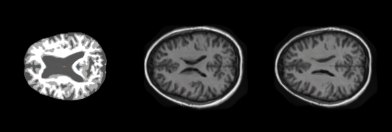

# Brain Image Generation
The purpose of this report is to use the StyleGAN2 deep learning model with the OASIS brain dataset in order to produce realistic 
brain scan images. The StyleGAN2 model was chosen over other models generative models such as the DCGAN and VQVAE as the StyleGAN2 model is renound for its high-quality image generation compared to other models. Furthermore, the style vector allows for fine-grained control over the generated images' styles and features, making it ideal for creating a wide variety of outputs. 

Generating brain images using StyleGAN2 holds significant importance in various industries, primarily in healthcare and neuroscience. It offers a range of advantages, such as data augmentation, privacy preservation, and enhanced anomaly detection. By creating realistic synthetic brain images, it expands the availability of diverse training data for machine learning models, leading to more accurate diagnostic tools and predictive algorithms. Additionally, it addresses privacy concerns by enabling research and development without compromising patient data.

Furthermore, StyleGAN2-generated brain images find applications in education and training, helping medical professionals better understand complex conditions and treatments. They serve as valuable educational tools for medical students and professionals. These synthetic images also facilitate research into neurological disorders, enabling scientists to simulate different conditions and diseases, leading to innovative treatments and interventions.

In terms of cost-effectiveness, generating synthetic brain images reduces the need for expensive data acquisition and medical equipment, making it an efficient option for testing algorithms and technologies. Additionally, it supports personalized medicine by allowing customization and simulation of individual patient profiles. Overall, StyleGAN2's role in generating brain images has the potential to revolutionize medical imaging, research, and healthcare, offering a versatile and ethical approach to data generation, analysis, and application development.

# Project Structure
- `modules.py`: The Generator and Discriminator networks as well as the layers and block that make them up. 
- `dataset.py`: Data loader and preprocessing for the OASIS brain dataset, performing augmentation.
- `train.py`: Training process of for the generator and discriminator networks, saving of models and graphing loss.
- `predict.py`: Loading models to generate images with different style vectors

# How to Use
In order to run this model on the OASIS dataset and see the generated images, you can run the `train.py` file. This file imports the necessary dataset, modules from the `dataset.py`, `modules.py` files respectively. It trains the model on the OASIS dataset saves the models state every 20 epochs to be used for generation later. After the training is complete it plots a graph of the losses of the generator and discriminator networks over time to show that they begin to converge. 

In order to generate the sample images you can run the `predict.py` file which imports everything from train.  It will load each of the saved models and generate 20 images for each with 5 different style vectors. 

# Dependencies 
We first will import torch since we will use PyTorch, and from there we import nn. That will help us create and train the networks, and also let us import optim, a package that implements various optimization algorithms (e.g. sgd, adam,..). From torchvision we import datasets and transforms to prepare the data and apply some transforms.

We will import functional as F from torch.nn, DataLoader from torch.utils.data to create mini-batch sizes, save_image from torchvision.utils to save some fake samples, log2 and sqrt form math, Numpy for linear algebra, os for interaction with the operating system, tqdm to show progress bars, and finally matplotlib.pyplot to plot some images.

# Understanding the Model 
## Introduction to StyleGAN
The StyleGAN2 architecture build upon that of StyleGAN and the basic gan architecture. It made up of a generative model and discrimintative model.
The generator will create images and discriminator will decide whether the image is from the real data set or if it has been created by the generator network. Both, of the networks work with and against each other, the generator trying to fool the discriminator and discriminator trying not to be fooled.  The end goal being the generation of realistic images close to that of the real provided dataset.  

The original StyleGAN model creared by Nvidia in December of 2018, built upon this basic gan architecture aiming to not only improve the quality of the resulting images but also providing more control over the specific styles of the images. The StyleGAN model introduced the style vector and noise components into the model, replacing the latent vector used in traditional gan architectures.  It also employs the adaptive instance normalisation (AdaIN) layer. Instance normalisation is a technique used to normalise the activations of each feature map independently, making the mean activation and the startdard deviation one for each feature map.  The StyleGAN's AdaIn layer takes this a step further by allowing the network to adapt the mean and standard deviation of feature maps for each layer dynamically. This adaptation is controlled by the style vector w, which is generated by the mapping network. This is what allows for the styles to be adjusted post training.

StyleGAN also implements a more advanced mapping network that is responaible for mapping a random noise vector to the style vector w.  This mapping network contains multiple fully connected or linear layers that are connected through non-linear activation functions such as Leaky ReLU. During the training process the mapping network learns to map the noise vector into meaningful latent codes that can be used to effectively control the generators output.  

## Inprovements in StyleGAN2
The StyleGAN2 model architecture expands upon that of the original StyleGAN architecture and aims to solve the main problem of that architecture that being the image artifacts that StyleGAN introduced.  The original StyleGAN model was notirious for leaving small anomolies in the images that would allow for images that had been generated by the StyleGAN network to be easily identifiable. 

StyleGAN2 restricts the use of the adaptive instance noramlisation, get away from progressive growing to resolve the artifacts introduced in StyleGAN, and introduces a perceptual path length normalisation term in it's loss function to improve the latent space interpolation ability.  

# Model Architecture Implementation
The implementation of the StyleGAN2 model used in this report is taken directly from the original paper, however it has been simplified drastically and made to be more compact and readable due to the simpler nature of this specific generation task. We will cover all of the important layers explaining their usages and the theory behind them.  These networks and layers can be seen in the modules.py file.

## Noise Mapping Network
The Mapping Network, implemented as a subclass of nn.Module, serves a crucial role in StyleGAN2. Its purpose is to map a given noise vector, denoted as z, to the style vector w. The network architecture is defined by a series of eight EqualizedLinear layers, followed by ReLU activation functions. This architecture helps to introduce non-linearity and complexity into the mapping process.

In the __init__ method, the network is initialized with two parameters: z_dim and w_dim. z_dim represents the dimensionality of the input noise vector z, and w_dim is the desired dimensionality of the style vector w.

In the forward method, the input x is first subjected to PixelNorm to normalize pixel values and enhance training stability. Subsequently, the normalized x is passed through the network mapping, producing the final style vector w. The PixelNorm operation is essential for ensuring that the input noise is consistently scaled across different dimensions.

## Generator Network
The generator network is broken up into 5 distinct blocks, these are the generator network itself, the generator block, the style block, the ToRBG layer and the convolutional weight layer.  The implemetation and relationships between these are broken down below. 

### Generator
The Generator begins with an initial constant tensor. Subsequently, it employs a series of generator blocks, each of which consists of a convolutional layer, style modulation, and RGB output. The feature map resolution is doubled at each block, progressively increasing the image resolution. The output RGB images from these blocks are scaled up and summed to produce the final RGB image.  Additionally, the toRGB operation incorporates style modulation, although it's not explicitly shown in the figure for simplicity.

In the __init__ method, several crucial parameters are passed: log_resolution, which represents the logarithm base 2 of the image resolution, W_DIM, the dimensionality of the style vector w, n_features, the number of features in the convolution layer at the highest resolution (final block), and max_features, which is the maximum number of features in any generator block. The initialization process involves calculating the number of features for each block and creating instances of various components, including the initial constant, the first style block, the layer for obtaining RGB images, and the generator blocks.

In the forward method, w is passed for each generator block. It has a shape of [n_blocks, batch_size, W-dim]. Additionally, input_noise, a list of noise tensors, is provided for each block, as many blocks, except the initial one, require two noise inputs after each convolution layer. The batch size is determined, and the learned constant is expanded to match the batch size. The initial constant is passed through the first style block to obtain an RGB image. Subsequently, the image is fed through the remaining generator blocks after upsampling. Finally, the last RGB image is returned with a tanh activation function. The use of tanh ensures that pixel values range between -1 and 1, suitable for image generation.

### Generator Block
A Generator Block is a key component of the Generator architecture. It consists of two style blocks, each involving 3x3 convolutions with style modulation, and an RGB output.

In the __init__ method, W_DIM, in_features, and out_features are provided. These parameters define the dimensionality of the style vector w, the number of input features to the block, and the number of output features, respectively. The initialization process includes creating two style blocks and a toRGB layer.

In the forward method, x represents the input feature map with a shape of [batch_size, in_features, height, width]. w has the shape [batch_size, W_DIM], and noise is a tuple of two noise tensors with a shape of [batch_size, 1, height, width].

The input feature map x is passed through the two style blocks, and the RGB image is obtained using the toRGB layer. Both the feature map x and the RGB image are returned.

### Style Block
A Style Block is a fundamental building block in StyleGAN2, responsible for introducing style modulation into the network.

In the __init__ method, W_DIM, in_features, and out_features are passed as parameters. These values determine the dimensionality of the style vector w, the number of input features, and the number of output features. The style block is constructed with components like an EqualizedLinear layer for style vector modulation, a weight-modulated convolution layer, noise scaling, bias, and an activation function (LeakyReLU).

The forward method takes in x, the input feature map of shape [batch_size, in_features, height, width], w, the style vector of shape [batch_size, W_DIM], and noise. The style vector s is computed using the to_style operation. Then, x and s are used in the weight-modulated convolution operation, followed by scaling and noise addition. Finally, bias is applied, and the activation function is evaluated before returning the result.

### ToRGB
The ToRGB layer is responsible for mapping the intermediate feature maps to RGB images. It is not as necessary for this specific report as the dataset used contained only black and white images so the model quickly learnt and adjusted to that.  

In the __init__ method, W_DIM and features are provided as parameters. W_DIM represents the dimensionality of the style vector w, and features is the number of features in the intermediate feature map. The initialization process involves creating components for style vector modulation, weight-modulated convolution, bias, and activation function.

In the forward method, x and w are sent as inputs. The style vector style is obtained using the to_style operation. Then, x and style are used in the weight-modulated convolution. Finally, bias is added, and the activation function is applied before returning the result.

### Convolution Weight Modulation/Demodulation
The Conv2dWeightModulate class represents a convolutional layer with weight modulation and demodulation, which is a crucial component in StyleGAN2.

In the __init__ method, several parameters are provided: in_features, out_features, kernel_size, demodulate, and eps. These parameters define the properties of the convolution layer, including input and output features, kernel size, whether demodulation should be applied, and the epsilon value for normalization. The initialization process includes specifying padding, creating weight parameters with equalized learning rates using the EqualizedWeight class, and setting epsilon.

In the forward method, x is the input feature map, and s represents the style-based scaling tensor. The batch size, height, and width of x are extracted. The scales are reshaped, and equalized weights are obtained. x and s are then modulated, and if demodulation is enabled, they are demodulated using specified equations. The result is returned as x.

This convolutional layer plays a crucial role in introducing style-based changes to the feature maps, which are essential for image generation in StyleGAN2.

## Discriminator Network
The Discriminator is responsible for evaluating the generated images and distinguishing them from real ones. It plays a vital role in the adversarial training process.

### Discriminator
The Discriminator architecture involves transforming an input image of resolution 2^LOG_RESOLUTION by 2^LOG_RESOLUTION into a feature map with the same resolution. This feature map is then processed through a series of Discriminator Blocks, each containing residual connections. At each block, the resolution is downsampled by a factor of 2, while the number of features is doubled.

In the __init__ method, several parameters are provided, including log_resolution, n_features, and max_features. log_resolution represents the logarithm base 2 of the image resolution, n_features specifies the number of features in the initial convolution layer, and max_features sets the maximum number of features in any Discriminator block. The initialization process involves calculating the number of features for each block, creating a from_rgb layer for converting RGB images to feature maps, defining the number of Discriminator blocks, and creating instances of these blocks. Additionally, the architecture incorporates a minibatch standard deviation operation, which helps the Discriminator capture variations within the batch or image.

In the __forward__ method, the input x is processed through the from_rgb layer and then through the sequence of Discriminator blocks. After passing through these blocks, a minibatch standard deviation operation is applied to capture variations within the batch or image. A final 3x3 convolution is performed, and the feature map is flattened before passing through a linear layer to obtain the classification score. The result of this Discriminator is used to distinguish between real and generated images during training.

### Discriminator Block
A Discriminator Block is a building block used in the Discriminator architecture. It consists of two 3x3 convolutions with a residual connection.

In the __init__ method, in_features and out_features are provided as parameters, representing the number of input and output features, respectively. The Discriminator Block includes a residual block with down-sampling, a 1x1 convolution layer for the residual connection, a block layer with two 3x3 convolutions and Leaky ReLU activation, down-sampling using AvgPool2d, and a scale factor.

The __forward__ method takes x as the input feature map. It first calculates the residual using the residual block and down-sampling. Then, x passes through the block layer with two 3x3 convolutions and Leaky ReLU activation. After down-sampling, the result is added to the residual, and scaling is applied. The final result is returned.

### Equalised Linear Layer
The EqualizedLinear class represents a linear layer with equalized learning rate, an important concept in StyleGAN2.

In the __init__ method, in_features, out_features, and bias are provided as parameters. These parameters define the input and output dimensions and whether bias should be included. The EqualizedLinear layer includes weight parameters with equalized learning rates and bias.

In the __forward__ method, x represents the input tensor. The linear transformation is applied to x using the weight and bias parameters. This operation ensures that the learning rates for the weights are equalized, contributing to stable training and improved performance.

## Equalised Convolutional Layer
The EqualizedConv2d class represents a 2D convolutional layer with equalized learning rate, a critical component in StyleGAN2

In the __init__ method, several parameters are provided, including in_features, out_features, kernel_size, and padding. These parameters define the properties of the convolution layer, such as input and output features, kernel size, and padding. The EqualizedConv2d layer incorporates weight parameters with equalized learning rates and bias.

In the __forward__ method, x represents the input feature map. The convolution operation is applied to x using the weight and bias parameters, with padding as specified. This operation ensures that the learning rates for the weights are equalized, contributing to stable training and improved performance.

### Equalised Weight 
The EqualizedWeight class represents a parameter used in convolutional and linear layers for equalized learning rates.

In the __init__ method, shape is provided, which specifies the shape of the weight parameter. The initialization process includes defining a constant c and initializing the weights from a normal distribution with mean 0 and standard deviation 1.

In the __forward__ method, the weights are scaled by the constant c and returned. This scaling ensures that the learning rates for the weights are equalized, contributing to stable training and improved performance.

## Perceptual Path Normalisation
Perceptual Path Length Normalization, also known as the PathLengthPenalty class, plays a crucial role in StyleGAN2 by encouraging a fixed-size step in the style vector w to result in a fixed-magnitude change in the generated image.

### PathLengthPenalty
In the __init__ method, the beta constant is provided, which is used to calculate an exponential moving average a. The initialization process sets up parameters for tracking steps, an exponential sum, and a.

The __forward__ method takes two inputs: w, representing the style vectors, and x, representing the generated images. Within this method, random noise y is generated to compute a certain output. The gradients with respect to w are calculated and used to compute norm. The loss is calculated based on the difference between norm and the exponential moving average a. The penalty term is returned.

## Utilities 
### Gradient Penalty
This function computes the gradient penalty for the Wasserstein GAN with Gradient Penalty (WGAN-GP) loss. It's used to enforce the Lipschitz constraint on the critic (discriminator) network. The gradient penalty encourages smoothness and stability during training.

### Get W
This function samples random noise vectors z and passes them through the mapping network to obtain style vectors w. Style vectors are used to control the appearance of generated images.

### Get Noise
This function generates noise for each generator block. The noise is typically added to different layers of the generator to introduce variety and details in the generated images.

### Generate Examples
This function generates fake images using the generator gen. It does this by sampling random style vectors w and noise for n different images. These fake images are saved for visualization purposes. The function also applies an alpha value to control image appearance.

# Training Process
The training process involves training the StyleGAN2 model using the provided discriminator (critic), generator (gen), mapping network (mapping_network), path length penalty (path_length_penalty), data loader (loader), and optimizers (opt_critic, opt_gen, opt_mapping_network).

## Data Augmentation
In order to increase the size of the datasets, data augmentation was used on the images when loaded into the dataset.  As shown in dataset.py, the transform performed on all of the data was it is being fed into the dataloader was to first resize all of the images to the provided resolution (passed in logarithmic form for ease of use), next the images are converted to tensor objects and a random horizontal flip occurs.  This random flip allows for more data to be generated from the same dataset as the direction that the brain is facing is irrelevant to our goals and will provide the models with more datasources.  Finally, the image pixels are normalsied to have a mean and standard deviation of 0.5. This normalization helps in stabilising and accelerating the training process by keeping the input values within an acceptable range. 

## Train Function
This function represents the training loop for a single batch of real images. It includes the following steps:
- Loading and preprocessing real images.
- Generating random style vectors w and noise for fake images.
- Forward and backward passes for the discriminator (critic) to maximize the difference between real and fake image scores. This includes computing the gradient penalty.
- Backpropagation and optimization of the discriminator.
- Forward and backward passes for the generator (gen) and mapping network (mapping_network) to maximize the fake image scores. It also includes adding a perceptual path length penalty every 16 epochs.
- Backpropagation and optimization of the generator and mapping network.
- Updating progress in the training loop.

## Initialisation of Networks, Optimisers and Dataloaders
- Data loader (loader) is initialized to load real images.
- Generator (gen), Discriminator (critic), Mapping Network (mapping_network), and Path Length Penalty (path_length_penalty) are instantiated and moved to the specified device (usually GPU).
- Optimizers (opt_gen, opt_critic, opt_mapping_network) are defined for each network.

## Training Loop 
- The networks (gen, critic, mapping_network) are set to training mode.
- The training loop is run for the specified number of epochs (EPOCHS).
- In each epoch, the train_fn function is called to train the networks using real and fake images.
- Every 20 epochs, generate_examples is called to generate and save some fake samples for visualization. Here the style vector is manipulated for each EPOCH to changed the number of brain scans in each generated image to display StyleGAN2's unique styling capabilities

This training process follows the principles of training GANs, where the generator tries to generate realistic images to fool the discriminator, while the discriminator tries to distinguish between real and fake images. The path length penalty helps control the variation in generated images.

# Results
After completing the StyleGAN2's training on the OASIS brain dataset for 180 epochs, the following realisitc images were generated by the trained generator model. In order to display the use of the style vector in the StyleGAN model's architecture, the images were generated passing different style vectors to the generator in order to display how the StyleGAN model once trained is able to be styled and shaped. The results have also been compared to that of the original images in the OASIS dataset in order to judge how realsitic the final generators images are.

## Training Images

This is a small sample of images from the OASIS dataset used in order to give some context to how accurate or inaccurate the generated images are in compassison to these. You can compare these to the generate images below. 

## Generated Images after 1 Epoch
### Style Vector Noise of 1 

### Style Vector Noise of 2 

### Style Vector Noise of 3 

### Style Vector Noise of 4 

### Style Vector Noise of 5

In the training images obtained after a single epoch, we observe that the generator and discriminator models are in the early stages of comprehending the basic structure of the brain images. However, at this nascent point in training, the generator model has not yet fully comprehended that the images should be in black and white, leading to an initial production of color images. It is expected that in the ensuing epochs, the generator will undergo a swift adjustment and learn to produce black and white images, aligning more closely with the intended output. This adaptation is indicative of the model's learning capability and its potential to quickly fine-tune its performance in response to training.

## Generated Images after 20 Epochs
### Style Vector of 1 

### Style Vector Noise of 2 

### Style Vector Noise of 3 

### Style Vector Noise of 4 

### Style Vector of 5

After just 20 epochs of training with the dataset, the generator exhibits promising signs of progress. It is beginning to craft images that show notable similarities to the brain dataset in terms of both color and shape. These early outcomes are quite encouraging. However, it is essential to acknowledge that a few discrepancies and imperfections are still present within the generated images at this stage. These imperfections, while relatively minor, are areas for improvement that we anticipate will be addressed and refined in the upcoming epochs of training. As the generator continues to learn and adapt, we can look forward to these inaccuracies being gradually cleaned up and the images becoming more faithful representations of the brain dataset, ultimately leading to a higher quality output.

## Generated Images after 100 Epochs 
### Style Vector of 1 

### Style Vector Noise of 2 

### Style Vector Noise of 3 

### Style Vector Noise of 4 

### Style Vector Boise of 5

After a full 100 epochs of training, the generated images have evolved significantly and are noticeably resembling the dataset in a more pronounced manner. They are becoming increasingly recognizable, bearing a striking resemblance to the original brain dataset in terms of their characteristics. However, it's important to acknowledge that a few minor irregularities, often referred to as "kinks," still persist in the images. Notably, not every single image produced exhibits a completely realistic quality. Yet, it's crucial to emphasize that achieving this level of success in just 100 epochs with a relatively small dataset is a significant accomplishment. Despite the remaining imperfections, these results are indicative of the model's capacity to learn and adapt, and further refinement over additional epochs is likely to produce better results.

## Generated Images after 180 Epochs 
### Style Vector of 1 

### Style Vector Noise of 2 

### Style Vector Noise of 3 

### Style Vector Noise of 4 

### Style Vector Noise of 5

Post-epoch 100, it becomes evident that the progress in image quality has been relatively gradual. The images have undergone some incremental enhancements, but a closer examination of the loss graph reveals that the generator and discriminator losses have reached a point of stability and convergence. This stability suggests that the model's current configuration may have reached its maximum potential in terms of performance. To drive further improvements in the quality of generated images, it is likely that adjustments to the model architecture and dataset composition will be necessary. Consequently, in order to achieve the desired image quality, it may be advantageous to explore modifications that can propel the model beyond its current limitations.

## Generator and Discriminator Loss
A graph of the loss for both the generator and discriminator networks of the models architecture can be seen below. It shows that the model training perfomed relatively as expected as over time the loss of the generator model decreased and towards the end the discriminator became a little worse as do the to generator network's images becoming more and more realistic. This is exactly what we wanted to see for this model!

We can also see in the models above that the loss for both networks seems to converge around 10,000 iterations, then remains quite stable for the rest of the training.  This further reinforces what we see with the results of each 20 epochs, as the improvement from epoch 100 to 180 was negligable.  This just means that with the current model and data that I will not get any more accurate in it's image generation no matter how many epoch we run it for. 

Since, the results are quite good this isn't really a problem, however it is good to not that the reason for this is probably due to the small size of the data that was used.  In total, with the used of some preprocessing the total training images used each epoch was 708.  Considering this the results achieved using the StyleGAN2 model are quite impressive, further adding to it's reputation as one of the more prominant generation architectures in computer vision. 

# Possible Improvements
In order to improve the results and the run time of StyleGAN2 model used on this dataset, the number of input and output channels could be changed as well as the TORGB block removed.  As the dataset is black and white there is no need for three input channels in the model and further no need for the TORGB block.  The removal of these would make the model perform better as it would have less computations per layer and less input and output channels, allowing it to run faster.

Furthermore, as discussed earlier increasing the size of the dataset being trained on could also have positive effects on the accuracy of the images being produced.  As the current model seemed to hit a wall around the 100 epoch range, but increasing the dataset size would help resolve this. 

# Conclusion
To conlude, this StyleGAN2 model used in this report was used to successfully generate realistic brain images, utilising both preprocessing as well as StyleGAN2's unique style vector to extend these to images that contained multiple brain realsitic brain segments facing in both the left and right direction.  It was found that at after around 100 epochs that the model hit it's limit to how realistic it could become, and it is though that the already high quality images could be further improved through the use of a larger dataset.  

# Acknowledgments 
The structure of the models used in this report were created using the StyleGAN2 reasearch paper.  Furthermore, the modules and training procedure were constructed with the help of both of the following resources:
- Nvidia Pytorch implementation: https://github.com/NVlabs/stylegan2-ada-pytorch/tree/main 
- Paperface report breakdown: https://blog.paperspace.com/understanding-stylegan2/ 
- Paperface simplified implementation: https://blog.paperspace.com/implementation-stylegan2-from-scratch/ 
- Huggingface implementation: https://huggingface.co/spaces/mfrashad/ClothingGAN/blob/main/models/stylegan2/stylegan2-pytorch/model.py 
