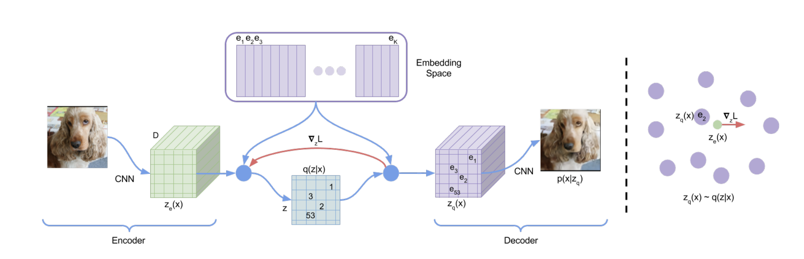
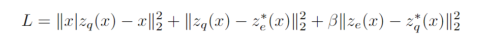
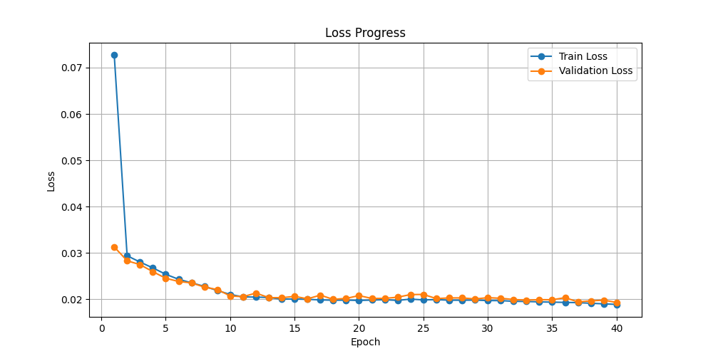
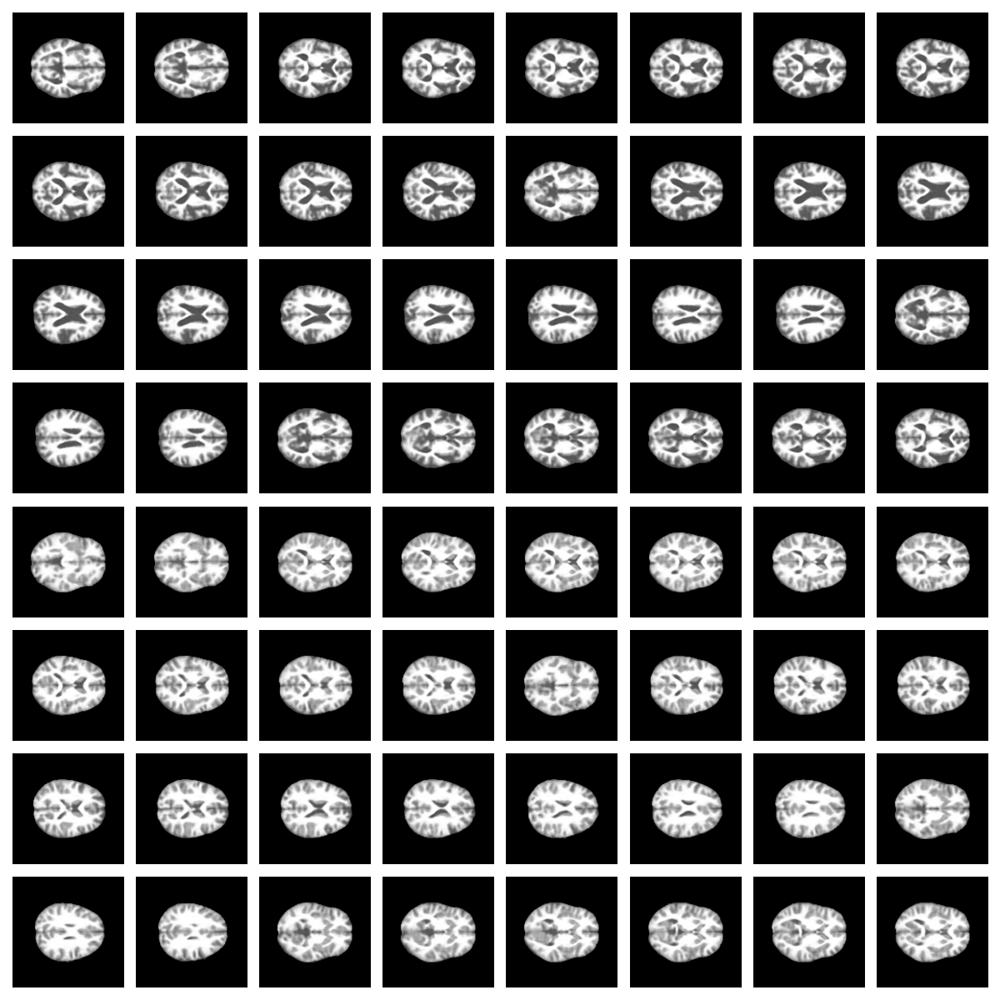

# COMP3710 - Pattern Analysis Report

**Student Number:** s4698512

**Chosen project:** #9 - Vector Quantised Variational Auto Encoder (VQ-VAE) on both OASIS and ADNI Datasets.

**Due Date:** Monday, $16^{\text{th}}$ October, 2023 (Week 12)

## Description of the VQ-VAE Model

The VQ-VAE (or Vector Quantised Variational Auto-Encoder) is a modified version of the well known auto-encoder. In essence, an auto-encoder encodes or compresses an input image down to a latent space, before decoding this in an attempt to recover as much of the input image as possible. A good auto-encoder will minimise the reconstruction loss, leading to applications including but not limited to

-   Image Compression
-   Denoising
-   Image Generation

A visualisation of the VQ-VAE model structure is given in the following diagram.


_Figure 1: VQ-VAE model structure. Source: [arXiv [2]](https://arxiv.org/abs/1711.00937v2)_

The VQ-VAE model differs in three main ways from a standard auto-encoder. Firstly, instead of mapping inputs to discrete vectors within the latent space, it instead learns a Gaussian normal distribution. As a result, the latent space becomes, for one, continuous and differentiable which is useful for backpropagation and gradient-based optimisation, but more importantly, far more interpolatable - a highly useful property for generative models.

Secondly, the vector-quantised part of the VQ-VAE discretises the latent space into $K$ discrete vectors and stores these in a codebook. This seems counterintuitive as the main purpose of a VAE is to make the latent space continuous, however, the learnt discrete latent space distriution of a VQ-VAE, is still regularised, yet it has the additional benefit of learning discrete features of the data it may be learning.

Finally, a reparameterisation trick, similar to parametric bootstrap, is used during model training to overcome the now discrete latent space being non-differentiable. Instead of sampling from the codebook directly, the codebook is modelled as a normal distribution meaning that the latent space can be differentiable during training for the purpose of backpropagation and gradient descent. The discrete codes, however, are still used to represent the data which provides the advantages outlined above.

The loss function during training can be given as follows. The mean squared error (L2 Norm) was used to map (or snap) each encoded image to the nearest discrete vector within the codebook. These discrete vectors are then passed to the model decoder which produces a reconstructed image.



This corresponds to reconstruction loss + VQ loss + $\beta \times$ commitment loss

where

-   $x$ = input
-   $z_e(x)$ = encoded image
-   $z_q(x)$ = decoded image (from the input image)
-   $z_e^*(x)$ = encoded image with gradients detached
-   $z_q(x)$ = decoded image (from the input image) with gradients detached
-   $\beta$ = hyperparameter for commitment vs reconstruction loss

The reconstruction loss is the difference between the input image and the decoded output image produced by the model. The VQ loss is a metric of the information loss when the input embeddings are mapped to discrete codes within the codebook. Finally, the $\beta$ value adjusts how committed the encoder is to a single codebook embeddding versus providing a better reconstruction of the input.

## Implementation of the VQ-VAE

Primarily, the model was designed around the **OASIS** dataset, however, in the train.py and predict.py files, there are variables storing the dataset which can be changed to ADNI and will work just the same.

### Preprocessing

The OASIS data had pre-split data, so the training, validation and test sets were already decided. Importantly, the patients were not used in more than one set so as to avoid data leakage. The images were, however, moved into an alternative folder structure so that they could be imported by the data loader. Part of the code in datasets.py ensured that each patient's images were stored in their own folder within each of the train, validation and test sets. This made reading the data easier.

### Model Architecture

**Encoder**

    Input Image (Channels: 1 (greyscale))
    ↓
    Conv2D (Channels: 128, Kernel: 4x4, Stride: 2, Padding: 1) -> (76, 128, 128, 128)
    BatchNorm2D
    ReLU
    ↓
    Conv2D (Channels: 128, Kernel: 4x4, Stride: 2, Padding: 1) -> (76, 128, 64, 64)
    BatchNorm2D
    ReLU
    ↓
    Conv2D (Channels: 128, Kernel: 4x4, Stride: 2, Padding: 1) -> (76, 128, 32, 32)
    BatchNorm2D
    ReLU

**Codebook**

    K = 32
    num_embeddings = 128

**Decoder**

    ReLU
    ConvTranspose2D (Channels: 128, Kernel: 4x4, Stride: 2, Padding: 1) -> (76, 128, 64, 64)
    BatchNorm2D
    ↓
    ReLU -> (76, 128, 128, 128)
    ConvTranspose2D (Channels: 128, Kernel: 4x4, Stride: 2, Padding: 1) -> (76, 128, 128, 128)
    BatchNorm2D
    ↓
    ReLU -> (76, 128, 128, 128)
    ConvTranspose2D (Channels: 128, Kernel: 4x4, Stride: 2, Padding: 1) -> (76, 128, 256, 256)
    BatchNorm2D
    ↓
    Tanh
    ↓
    Output Image (Channels: 1 (greyscale))

### Hyperparameters

-   The number of embeddings in the codebook was chosen at $32$ and the dimension of the latent space to be $128$.
-   Tests were conducted with number of embeddings ranging all the way up to $512$, however, it was found that $32$ embeddings kept validation loss low while not reducing reconstruction loss too much. It also reduced memory usage on the GPU as this was limited during training.

-   The Adam optimiser was used with a learning rate of $2e-3$. For $40$ epochs, this learning rate was found to yield a nice loss curve
-   The $\beta$ value (commitment loss) was kept at $0.25$, though values up to $1.5$ were tested. A lower reconstruction loss was found to give higher quality output images and increased the value of the final mean SSIM (near the end of training)

## Model Results

### Structured Similarity (SSIM)

After 40 epochs, the model obtained a mean SSIM value of 0.849 across all OASIS training samples which is significantly above the requirement of 0.6 of the task. It is evident that during the beginning of training, the mean SSIM is much lower at 0.715 but increases quickly during the first few epochs and converges towards the end of training.


_Figure 2: Structured Similarity Index_

### Reconstruction Loss

The model was trained for 40 epochs. From the plot of reconstruction loss (both training and validation), it is clear that a low final loss was obtained of just 0.018 and 0.019 for training and validation respectively. It is good to see that the validation loss remains very close to the training loss throughout all the epochs, signifying that the model has done a good job of not overfitting.


_Figure 3: Reconstruction Loss (training and validation)_

### Hardware

The model was trained in a conda environment running on a Windows system with the following specifications

-   Intel(R) Core(TM) i7-12700K @ 5GHz
-   32GB 5200MHz DDR5
-   Samsung 990 Pro 1TB (for storing datasets and reconstructed images)
-   Asus ROG STRIX RTX 3080-Ti OC @ 1940 MHz with 12GB GDDR6X @ 9630MHz

Training 40 epochs took ~ 16 minutes for each training run.

### Reconstructed Images

Here are $8\times 8 = 128$ samples constructed with the VQ-VAE model.



_Figure 4: Sample Reconstructed Images_

The model achieved a mean structred similarity index of 0.849 for the OASIS test set which is above the 0.6 threshold. The figures above show a reasonably clear output image as per the task.

I have also visualised three random samples showing the input, codebook representation and reconstructed image in figure 5


_Figure 5: Visualisation of Reconstruction_

## Usage

-   predict.py - loads a model save file and generates reconstructed images along with SSIM and loss plots.
-   train.py - trains the dataset (OASIS or ADNI) and performs model training. Saves each epoch and best epoch into pt save files.

Datasets should be stored in a folder called datasets within a folder one level outside of the PatternAnalysis-2023 repository called PatternAnalysisData. Inside a subdirectory called datasets, the OASIS dataset should be stored.

```
+-- PatternAnalysis-2023
|   +-- recognition
|       +-- OASIS_VQ_VAE_s4698512
|           ...
|   ...
+-- PatternAnalysisData
|   +-- datasets
|       +-- OASIS
|           +-- keras_png_slices_seg_test
|               +-- seg_xxx_slice_yy.nii.png
|           +-- keras_png_slices_seg_train
|               ...
|           +-- keras_png_slices_seg_validate
|               ...
|   +-- ADNI
|       +-- AD_NC
|           +-- test
|               +-- AD
|                   xxxxxx_yy.jpeg
|               +-- NC
|                   ...
|           +-- train
|               +-- AD
|                   ...
|               +-- NC
|                   ...
|   +-- ModelParams
|       ...
|   +-- generated
|       +-- OASIS
```

## Dependencies Required

The following python libraries are used in my project

-   Pytorch (torch)
-   Matplotlib
-   tqdm
-   numpy
-   torchvision
-   skimage.metrics
-   shutil
-   os

# References

1. Neural Discrete Representation Learning
   Aaron van den Oord, Oriol Vinyals, Koray Kavukcuoglu
   https://doi.org/10.48550/arXiv.1711.00937

2. https://arxiv.org/abs/1711.00937v2

3. https://github.com/ritheshkumar95/pytorch-vqvae/
