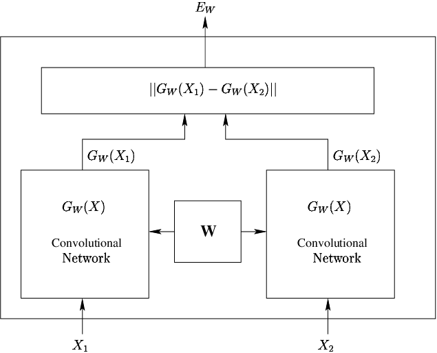
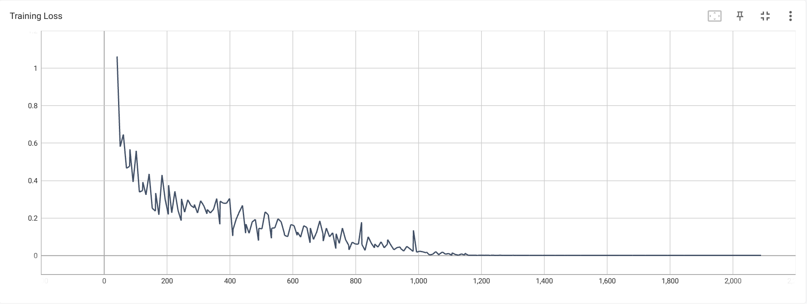

# Using Siamese network to classify Alzheimer’s disease (normal and AD) 

## Author
Name: Fanhao Zeng

Student number: 46398086

Email: fanhao.zeng@uqconnect.edu.au

This project was completed for COMP3710 report 2023

## Description


This aim of this project is to build a Siamese network to classify Alzheimer's disease (normal and AD), on ADNI brain 
data set, and achieve a 0.8 accuracy.

Siamese Networks are a special type of neural network architecture designed for solving problems related to similarity 
comparisons and image verification. In this architecture, two identical subnetworks (or "siamese" subnetworks) work in 
parallel, each taking a different input and outputting a feature vector. These feature vectors are then joined or 
combined for further processing or comparison.

All the relevant code is under the Siamese folder.

## Siamese Networks

### How They Work

1. **Input Stage**: Two different inputs go through two identical subnetworks (having the same parameters and weights).
2. **Feature Extraction**: Each subnetwork extracts features from its input.
3. **Distance Metric**: The extracted features are compared using some form of distance function like Euclidean distance or cosine similarity.
4. **Output**: The network outputs a similarity score between these two inputs.



### Applications

1. **Face Verification**: To determine if two given face images belong to the same person.
2. **Image Retrieval**: To find the image in a database that is most similar to a given image.
3. **Signature Verification**: To check if two signatures are from the same person.

### Advantages

1. **Parameter Sharing**: Both subnetworks share parameters, reducing the total number of model parameters.
2. **Training Efficiency**: Due to parameter sharing, the network can converge more quickly.
3. **Flexibility**: Can be used for one-to-one comparisons and can also be easily extended for one-to-many or many-to-many comparisons.

### Disadvantages

1. **Data Imbalance**: In certain applications, finding positive and negative samples can be a challenge.
2. **Specialization**: This is a task-specific architecture and cannot be easily applied to other types of problems.


In this case the subnetwork is the Resnet18, which is a convolutional neural network that is 18 layers deep. The 
Resnet18 is a pre-trained model, which is trained on the ImageNet dataset and used to extract features from the images. 

### Resnet18 architecture:


For this project, I use to Resnet18 to extract features from the two images, and then calculate the distance between
the two features, and use the distance to classify the images.

### Classifier
The classifier will use the feature extractor portion of the Siamese network (i.e., excluding the final fully-connected 
layer) to obtain a feature representation of the image, which will then be fed into a new classification layer for binary 
classification of normal (NC) and Alzheimer's disease (AD).


## Dataset
The dataset used in this project is ADNI brain data set, which is a public dataset. 
The dataset can be downloaded from [ADNI](http://adni.loni.usc.edu/data-samples/access-data/).
The dataset contains 4,424 images of brain MRI scans, which are divided into  2,315 AD and 2,109 NC images.

Here is an example of AD (left) and NC (right) images:


The dataset have been preprocessed, they are all in same size (256 * 240) and in gray scale.
And all the images have the same naming format, which is "1182968_94.jpeg", the first part is the patient's unique ID, 
and the second part is the image's unique ID, each patient have 12 brain MRI scans.

### Resnet18 architecture: 
<ul style="list-style-type:none;">
  <li>test
    <ul style="list-style-type:none; margin-left:20px;">
      <li>AD</li>
      <li>NC</li>
    </ul>
  </li>
  <li>train
    <ul style="list-style-type:none; margin-left:20px;">
      <li>AD</li>
      <li>NC</li>
    </ul>
  </li>
</ul>

## Training
The training process is divided into two parts, the first part is to train the Resnet18, but in this case we used a 
pre-trained one, and the second part is to train the Siamese network with the training set.

The loss function I use here is the BCELoss loss, which is defined as: BCELoss(x, y) = -y * log(x) - (1 - y) * log(1 - x)
and the optimizer I use is Adam with a 0.001 learning rate.

The training result of 50 epochs are shown below:




The training accuracy shows convergence after 1200 steps.

Here is the Training result for classifier trained 50 epochs:


## Testing
The testing process is similar to the training process, but the testing process is only used to test the Performance.
The testing result of 50 epochs are shown below:


There is another model only trained 10 epochs, but does not have the log and 
the testing result of 10 epochs are shown below:


For classifier, here is an example output


## Dependencies

### Scripts
- Python==3.10.12
- Pytorch==2.0.1
- Pillow==9.4.0
- torchvision==0.15.2

To install the required packages, run the following command:

```bash
pip install -r requirements.txt
```

### Dataset
Click here to get [ADNI](http://adni.loni.usc.edu/data-samples/access-data/)

### Hardware
This model have be trained 50 epochs on a RTX4090 for about 30 minutes. Please take this as a reference and adjust your batch size with your hardware.

# Reference
Chopra, Sumit & Hadsell, Raia & Lecun, Yann. (2005). Learning a similarity metric discriminatively, with application to 
face verification. Proc. Computer Vision and Pattern Recognition. 1. 539- 546 vol. 1. 10.1109/CVPR.2005.202. 
