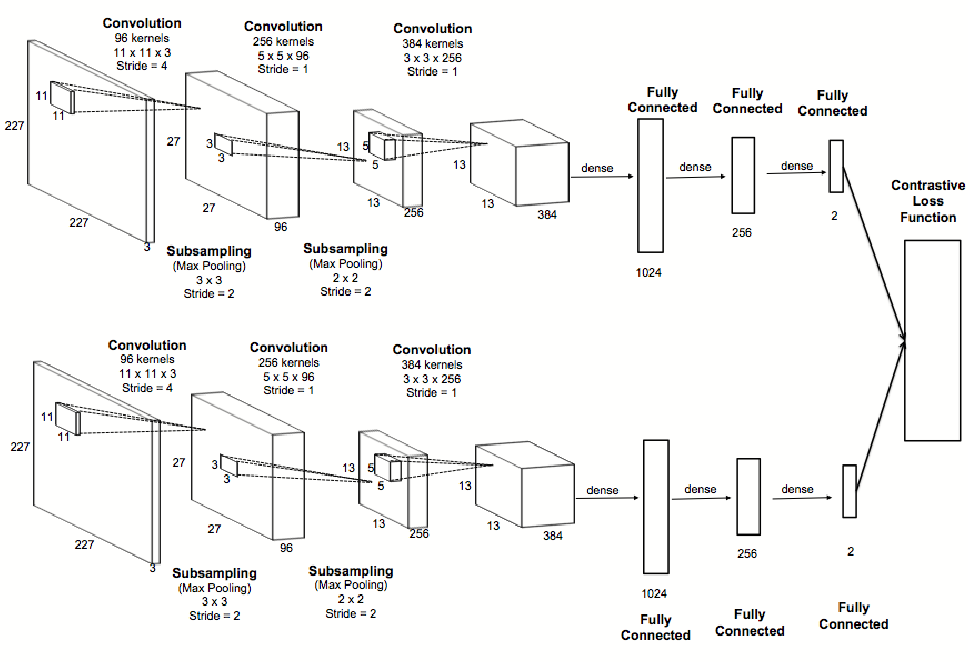
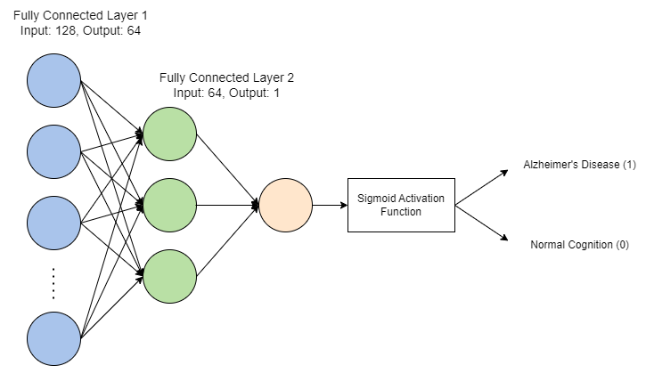
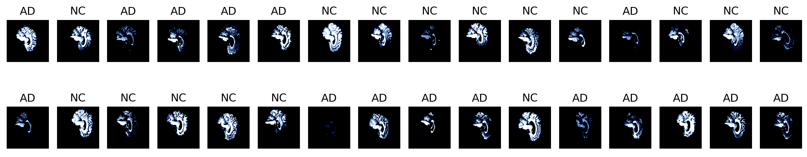
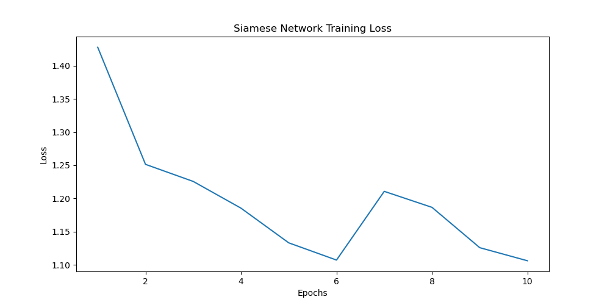
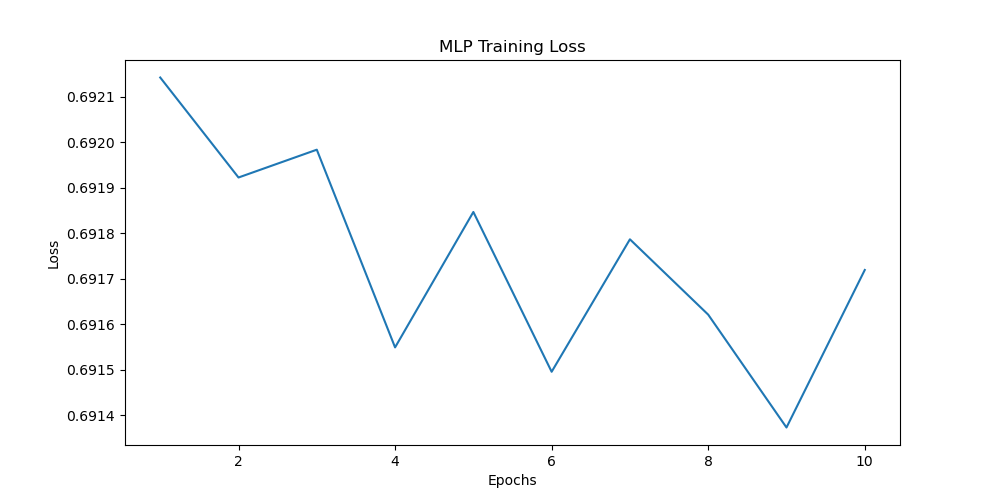

# Classification of Alzheimer's disease of the ADNI Brain data using a Siamese Neural Network

Name: Ethan Pinto<br>
Student Number: 46422860<br>
Course Code: COMP3710<br>
Submission Date: 20/10/2023

## Problem Description:
The ADNI (Alzheimer's Disease Neuroimaging Initiative) Brain Dataset includes both MRI (Magnetic Resonance Imaging) and PET (Positron Emission Tomography) scans. By analysing these scans using deep learning models, we can effectively detect whether a patient has Alzheimer's disease. In this project, a Siamese Neural Network will be utilised to assist in the classification of brain scans into one of two categories: Alzheimer's Disease (AD) or Normal Cognitive ability (NC).

## Description of Algorithm: 
A Siamese network consists of two identical neural networks with the same weights and parameters, each of which takes in an input image. The main objective of an SNN is to differentiate between two images i.e. provide a measure of similarity between the inputs. The outputs of the networks are 128-dimensional feature vectors which are fed into a contrastive loss function, which calculates a similarity measure between the two images. The siamese network should effectively be trained to distinguish between a brain scan which shows AD and NC. The embeddings for a certain class should be groups together and separated for different classes. To classify an image into one of two classes, a Multi Layer Perceptron was trained to take in the feature embedding from the Siamese Neural Network and classify it into one of two classes: Alzheimer's Disease (AD) or Normal Cognitive Ability (NC).

## Breakdown of Siamese Neural Network Classifier
The classifier is made up of two separate stages, the first is the Siamese Neural Network, which takes in a 3 x 128 x 128 image and outputs a 1D feature vector embedding of size 128. The second stage is the multi-layer perceptron, which takes in an embedding and classifies it. Both these architectures can be found in the <i>modules.py</i> file.


 Imaged sourced from [1]
* The inputs to the Siamese Neural Network are pairs of images and a label corresponding to if the images belong to the same class.
* The output of the Siamese Neural Network is a 128-dimension feature vector embeddings of the input image.

<br>



* The input to the MLP is an embedding vector of size 128 x 1 and label corresponding to it's class.
* The output of the MLP is a single value between 0 and 1.


## Dataset Structure
The ADNI dataset is currently stored on the Rangpur HPC and has the following file structure.

> There are a total of 9001 images in the test dataset, and 21521 images in the train dataset.

/home/groups/comp3710/<br>
&nbsp;&nbsp;&nbsp;&nbsp;->ADNI<br>
&nbsp;&nbsp;&nbsp;&nbsp;&nbsp;&nbsp;&nbsp;&nbsp;->test<br>
&nbsp;&nbsp;&nbsp;&nbsp;&nbsp;&nbsp;&nbsp;&nbsp;&nbsp;&nbsp;&nbsp;&nbsp;->AD<br>
&nbsp;&nbsp;&nbsp;&nbsp;&nbsp;&nbsp;&nbsp;&nbsp;&nbsp;&nbsp;&nbsp;&nbsp;->NC<br>
&nbsp;&nbsp;&nbsp;&nbsp;&nbsp;&nbsp;&nbsp;&nbsp;->train<br>
&nbsp;&nbsp;&nbsp;&nbsp;&nbsp;&nbsp;&nbsp;&nbsp;&nbsp;&nbsp;&nbsp;&nbsp;->AD<br>
&nbsp;&nbsp;&nbsp;&nbsp;&nbsp;&nbsp;&nbsp;&nbsp;&nbsp;&nbsp;&nbsp;&nbsp;->NC<br>


## Data Preprocessing
Firstly, the images were labelled using a short script which produces a csv file with two columns: image path and image label. This csv file was then used to create custom datasets for the ADNI dataset. Three datasets were created:
1. Siamese Neural Network training dataset
2. MLP Classifier training dataset
3. Testing Dataset

A transform was also applied to the images, which crops them to 128x128, converts them to tensors, and normalises them for faster convergence. A sample batch of images from the dataset is shown below:



## Training and Results
### Training
First, the Siamese Neural Network was trained for 10 epochs with the following criterion and optimiser:
```
criterion = ContrastiveLoss(margin=2.0)
optimizer = optim.Adam(siamese_net.parameters(), lr=1e-3)
```

A margin value of 2 in the contrastive loss function is relatively large, and should encourage the siamese network to create a larger separation between similar and dissimilar pairs of images. The training output log is shown below:
```
Starting Training Siamese Network...
Epoch 1/10 -> Average loss: 1.427797137744843
Epoch 2/10 -> Average loss: 1.2513651270715018
Epoch 3/10 -> Average loss: 1.2256066978923859
Epoch 4/10 -> Average loss: 1.185328395593734
Epoch 5/10 -> Average loss: 1.1330658452851432
Epoch 6/10 -> Average loss: 1.1071062343461173
Epoch 7/10 -> Average loss: 1.2106480447072832
Epoch 8/10 -> Average loss: 1.1865405837694805
Epoch 9/10 -> Average loss: 1.1257784792355128
Epoch 10/10 -> Average loss: 1.1060347216469901
Finished Training Siamese Network...
Training took 504.9832663536072 secs or 8.41638777256012 mins in total
```

The average loss of the SNN was plotted against the number of epochs as shown here:



The MLP was also trained for 10 epochs with the following criterion and optimiser. Binary cross entropy loss is a widely used loss function for binary classification problems.

```
criterion = nn.BCELoss()
optimizer = optim.SGD(mlp.parameters(), lr=1e-3)
```

The training output log for the MLP is shown below:
```
Starting Training MLP...
Epoch number: 0 -> Average loss: 0.6921
Epoch number: 1 -> Average loss: 0.6919
Epoch number: 2 -> Average loss: 0.6920
Epoch number: 3 -> Average loss: 0.6915
Epoch number: 4 -> Average loss: 0.6918
Epoch number: 5 -> Average loss: 0.6915
Epoch number: 6 -> Average loss: 0.6918
Epoch number: 7 -> Average loss: 0.6916
Epoch number: 8 -> Average loss: 0.6914
Epoch number: 9 -> Average loss: 0.6917
Finished Training MLP...
Training took 174.3776433467865 secs or 2.906294055779775 mins in total
```

The average loss of the MLP was plotted against the number of epochs as shown here:



### Testing
The classifier was tested using the calculate_accuracy function located the predict.py file. The test dataloader was used to identify the accuracy of the model and the ouput was ~60%. This accuracy is reasonable, however, could be improved by using a larger proportion of the training dataset as well as training for more epochs.

## How to Run the SNN Classifier
The script to run the SNN Classifier is found in <i>predict.py</i>, to run an image through the classifier, enter the following commmand into the terminal.
> NOTE: Ensure you are in the same directory as predict.py, and that your environment is setup with the dependencies shown below.


```
python predict.py <path-to-image>
```

The script will output two things: the predicted class (0 - Normal Cognition or 1 - Alzheimer's Disease) as well as the raw output from the MLP. 

<b>Example Usage</b><br>
Input:
```
python predict.py ADNI\AD_NC\test\NC\1182968_94.jpeg
```

Output:
```
Predicted Class: 0
Raw Output: 0.48585471510887146
```


## Dependencies
This project has the following dependencies:

* pytorch - version 2.1.0
* matplotlib - version 3.8.0
* torchvision - version 0.16.0
* numpy - version 1.26.0
* pandas - version 2.1.1
* pillow - version 10.0.1
* math
* os
* time


## References

[1] https://becominghuman.ai/siamese-networks-algorithm-applications-and-pytorch-implementation-4ffa3304c18