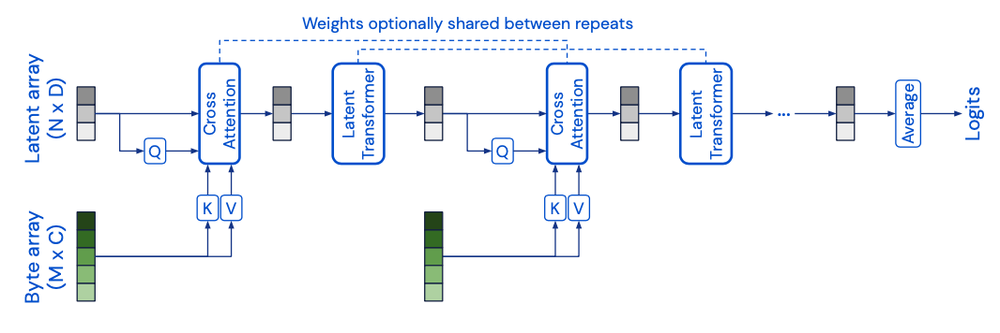
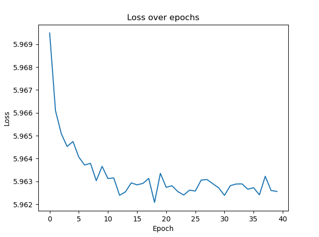
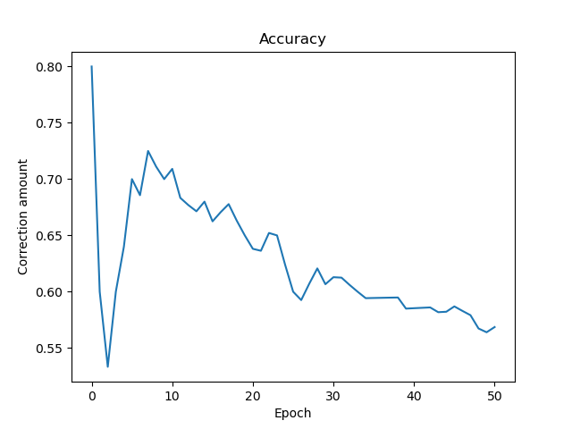
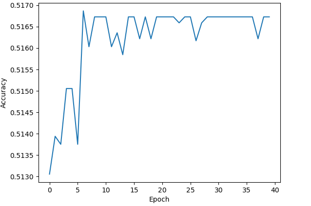
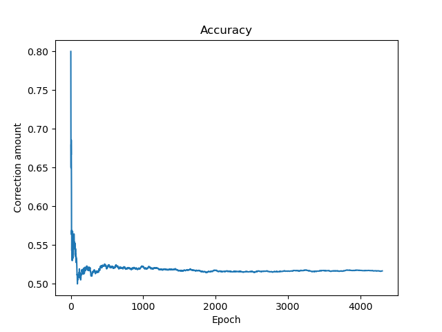

# Classify Alzheimer's disease of ADNI brain data with perceiver transformer
For this project, I use the Alzheimer's Disease Neuroimaging Initiative (ADNI) dataset to classify MRI scans of brains with Alzheimer's. This project aims to create a perceiver transformer that can detect and classify MRI scans and, with over 80% accuracy, determine if it has Alzheimer's. The ADNI dataset has images or scans with a resolution of 256x240. The model completes a binary classification of the images as a brain can either have or not have Alzheimer's.

The Perceiver Transformer was proposed in the paper Attention Is All You Need by a team working at Google https://arxiv.org/pdf/1706.03762.pdf. The Perceiver Transformer was developed to address the limitations of the transformer, which was designed for natural language processing tasks. The Perceiver Transformer is developed upon the base transformer and can be given a wider range of datasets to work on from different modalities. The other limitation of the Transform that the Perceiver Transformer build upon is that the quadratic bottleneck is done through the use of the query, key and values.

Additionally, the Perceiver Transformer utilises a variant of the transformers self attention, resulting in better training and generalisation.

This is the diagram on the overall architecture of the Perceiver Transformer.

The ADNI dataset contains many images of the same patient. This means the images can have similarities as the patients' images can be scattered across the testing and training datasets. This could cause potential overfitting of the model from its learning to identify the same patient's brain rather than detecting Alzheimer's. 

# Implementation
LATENT_DIMENTIONS = 128

EMBEDDED_DIMENTIONS = 32

CROSS_ATTENTION_HEADS = 1

SELF_ATTENTION_HEADS = 4

SELF_ATTENTION_DEPTH = 4

MODEL_DEPTH = 4

EPOCHS = 2

BATCH_SIZE = 5

LEARNING_RATE = 0.0004 

The loss function used was the Cross Entropy Loss function.
For the Optimiser, the Adam optimiser was used. This is because of its general purpose, functionality and efficiency. This also reduces the risk of the model being overfitted to the training data set. 
The model was run for 40 epochs for training.
The cross attention module ran with a single head according to the original paper.
The self attention module ran four heads and performed self attention four times per head. This was done based on values from the original paper.
The latent dimensions value was 128.
The embedded dimensions value was 32.
The batch size was 5. This was due to hardware limitations I was training the model on.
The model depth was 4 meaning that it performed cross attention and the latent transform 4 times
The learning rate used was 0.0004. Originally I had set 0.004 but the model was not accurate during testing with this parameter so the learning rate was reduced and the accuracy improved.

# File Structure
The dataset.py file contains the class ADNI, which fetches and performs the augmentation and transformations on the datasets. This is used for getting both the training and testing datasets. It reads the images from the ADNI/AD_NC/ file path and goes to the test or train subfolders. 

The modules.py file contains the Perceiver Transformer model. Within this file, many classes build key aspects of the model. The class nomenclature is based on its functionality within the model itself. The key classes are Perceiver, which constructs the final architecture of the model. The Block class contains the cross attention and the latest transformer steps of the Perceiver Transformer model. The LatestTransformer contains the self-attention functionality. 

The predict.py file is where the saved model is tested against the testing dataset. The model is saved during training and used here. This file displays various statistics and graphs about the model's accuracy on the testing dataset.

The train.py file is where the training of the model occurs. The hyperparameters are set here and passed into the model for usage. The main training loop runs for the specified number of epochs designated in the hyperparameters.

# Reproducability
To run this model, the path to the downloaded ADNI dataset must be provided in the dataset.py file so the ADNI class can find it. Within the ADNI dataset, there should be a test and train subfolder. To train the model, the hyperparameters below can be used or you can specify your own. The Perceiver class takes those hyperparameters it trained within the main loop in train.py. The predict.py file tests the saved model from training and runs is against the testing dataset. During the training and testing, various plots are produced showing the results and details of the model.

# Results

After training the model for 40 Epochs, it achieved 51% accuracy on the testing set but appears to be random guessing of whether the image is of Alzheimer's or not. To resolve this problem, I attempted to resolve it by changing the transforms I was using as initially I was randomcropping, which could be giving partial segments of the brain; however, this only slightly improved the accuracy. I also altered the hyperparameters used, which had little effect on the outcome. 

# Loss During Training Results

The loss during training fluctuates around 50% and does not change much during the training. The change in the loss seems to remain constant, with the change being very little throughout training. 

# Accuracy During Training Results

The model's accuracy is poor, 50%, and after further investigation, the model appears to be always guessing that the image is an Alzheimer's image. This explains why the accuracy is poor, as it is always guessing the same result regardless of the image. I could not deduce why the model produced such inaccurate results. It may be related to no positional encoding of the pixel positions for the images; however, I tested this theory and discovered no difference between having the positional embedding and not.

# Accuracy of model during testing

This plot shows that the accuracy of the model does increase, however slowly. It plateaus after around 10 epochs. The model does not seem to learn anything after this point. The increase in accuracy in very gradual on the learning increase in the first 10 epochs, going from 51.3% to 51.6%. The model appears only to guess randomly and not learn the Alzheimer's detection. 

# Accuracy of model for entire testing set

The model initially appears to have an extremely high accuracy but quickly drops to just above 50%. This is possibly due to the having lucky early on in testing or from the first testing batch having mainly brains with Alzheimer's as the model seemed to predict Alzheimer's more commonly. Then, the model fluctuates around 53% accuracy. 

Overall, the model does not predict which images have Alzheimer’s accurately. This could be from the dataset being too small or the model overfitting the training images. Another additional reason could be the positional embedded. When I tested this, I found no difference between having positional image embedding and not. However, I should attempt to use other embedded methods like learned embedding. In future development of this model, I will aim to test other variations of positional embeddings to see their impact on the model's accuracy. Furthermore, I will attempt to use a larger dataset and ensure that the same patient's scans are all within the same testing folder. This could potentially cause the model to detect relations between the brains. 

# References
[1]	A. Vaswani et al., "Attention is all you need," presented at the Proceedings of the 31st International Conference on Neural Information Processing Systems, Long Beach, California, USA, 2017.

[2]	C. Tigges, "The Annotated Perceiver," 2022. [Online]. Available: https://medium.com/@curttigges/the-annotated-perceiver-74752113eefb.

[3] G. Klein et all., "The Annotated Transformer," 2018. [Online]. Available: https://nlp.seas.harvard.edu/2018/04/03/attention.html#attention