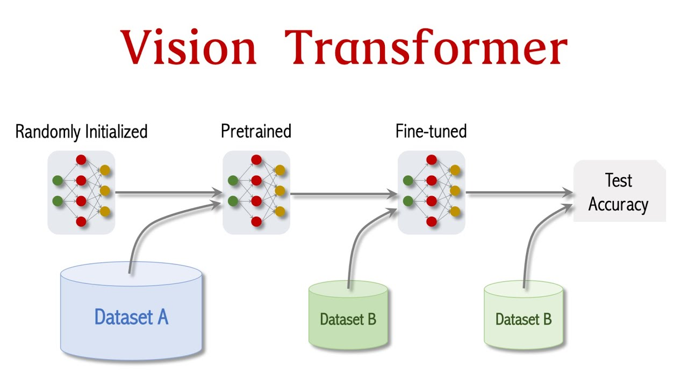
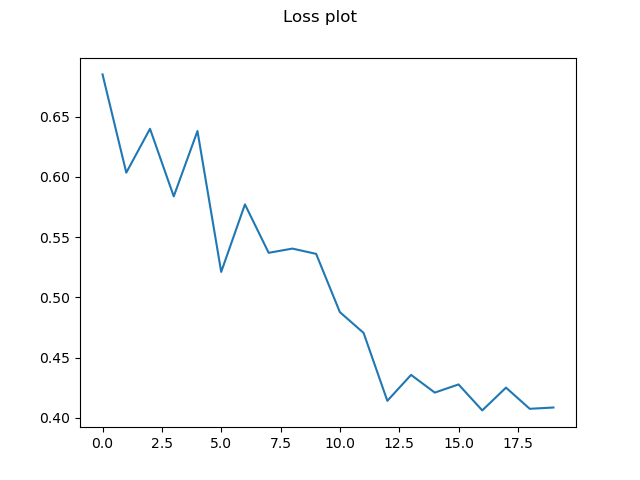
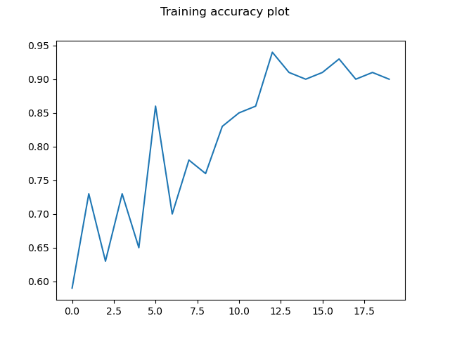

# Visual Transformer
**Classifying Alzheimer's Disease in brain scans with Deep Learning**

Brain scan classification is an essential component of diagnosing neural disorders. In the past, doctors have relied on their visual skills to identify patients with Alzheimers, but with the advent of Deep Learning, this is a concept of the past. Transformers are a class of media processing systems often used in Natural Language Processing that build their knowledge base by comparing the relationships between items. In image processing, they can be used to learn classification weights and classify images by class.

Visual transformers in image recognition work by analysing pixels. To reduce computational cost, images are patched into small sections, e.g. 4x4 pixels, and the relationships calculated on this smaller scale. In this project we have brain scans from the ADNI dataset that are classified as either AD (Alzheimer's Disease) or NC (Cognitive Normal), with a patient level split into training and testing images. The figure below gives an overview of the process; in our case we skipped the 2nd validation step.



1. **Dependencies**

Besides the dataset, whose location can be configured in the ```constants.py``` file, the project relies on the following dependencies:

* Python 3.11.4
* Numpy 1.25.0
* Pytorch 2.0.1
* Torchvision 0.15.2a0
* Matplotlib 3.7.1

2. **Reproducibility of Results**

Multiple test runs were conducted that yielded similiar results.

3. **Examples**

Training the model on the ADNI dataset over 20 epochs then testing all images in the test folder yielded an accuracy of 83.7%. The correctness of a prediction is based on the probability output of the model, e.g. [(0.7, 0.3)] is positive for class 0, or AD. The loss plot is shown below, as well as an accuracy plot on the training set after each epoch.

```Accuracy is 83.7%```





4. **Justification**

A validation split was not considered necessary as the model proved satisfactory without needing a validation step to tune the hyperparameters, but by adjusting the parameters like elarning rate, batch size etc.

5. **Running Method**

To run the program locally, first make sure you have downloaded all the required dependencies and have the dataset available. 

Clone the repo.

```git clone https://github.com/JosephChurchill/PatternAnalysis-2023.git```

Navigate to the correct directory.

```cd PatternAnalysis-2023/recognition/visual-adni-46424051```

Checkout the correct branch.

```git checkout topic-recognition```

Run the test driver script.

```python predict.py```

Check output, showing training loss and accuracy, testing results for each image, and final accuracy, and check the accuracy and loss plots saved in the same directory