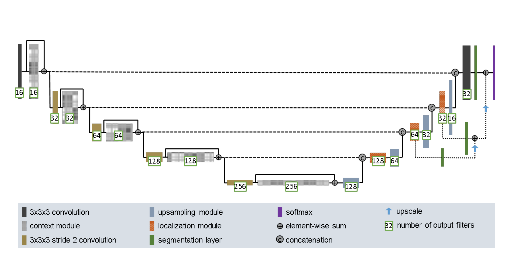
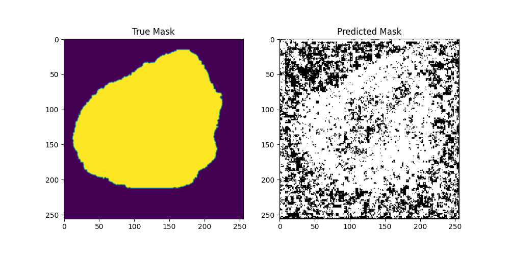

# ISIC Lesion Segmentation Algorithm

## Description
The ISIC Lesion Segmentation Algorithm was designed to automatically segment skin lesion boundaries from dermatoscopic images. Early detection of malignant skin lesions is crucial in improving the prognosis of skin cancers such as melanoma. The algorithm operates by analyzing input images and leverages a convolutional neural network (CNN) to identify and segment potential skin lesions, distinguishing them from healthy skin. The Dice similarity coefficient is used to compare the algorithm output to the ground truth reference mask, which essentially measures the proportion of output pixels that match the true image.

The model is a modified UNet and is composed of several CNN layers, skip connections, and uses deep supervision facilitated by segmentation layers that connect different levels of the network to the final output. The architecture of the model was inspired by the [improved UNet](https://arxiv.org/abs/1802.10508v1) (Figure 1), which proved to be an effective 3D brain tumor segmentation model during the BRATS 2017 challenge. The network is trained using the 2018 ISIC (International Skin Imaging Collaboration) dataset, which contains annotated images of various skin lesions.

Figure 1: Improved UNet architecture. Designed by F. Isensee et al.

## Dependencies

To run the ISIC Lesion Segmentation Algorithm, you'll need the following libraries:

- Python (only verified for 3.7+)
- numpy: For numerical computations and some tensor operations
- PyTorch: For building and training the neural network
- matplotlib: For plotting and visualisation
- PIL (Pillow): For loading the dataset and visualisation

To install any dependencies you can use `pip install`

## Reproducability

To run the algorithm and reproduce the results I've obtained, please be aware of the following considerations:

1. Directory Paths for ISICDataset: The paths specified when initializing ISICDataset may need to be modified to match the directory structure on your machine. Ensure that you point it to the correct location where your dataset resides.

2. Model State Dictionary Directory: The directory where the model state dictionary is saved/loaded may differ based on your setup. Adjust the path accordingly to ensure the algorithm can access the model or save it correctly.

Always ensure that you have the necessary permissions to read/write in the specified directories and that the paths are correctly formatted.

## Usage
#### See predict.py for a full usage demonstration of the model.
### Input
torch.Tensor with shape [batch_size, 6, 256, 256] 
- The batch_size denotes the number of inputted images, this is the only argument that varies
- 6 channels (3 for RGB and 3 for HSV)
- The image has dimensions 256x256

### Output

torch.Tensor was shape [batch_size, 1, 256, 256] 
- The batch_size denotes the number of inputted images, this is the only argument that varies
- 1 channel containing probabilities of being 
- The image has dimensions 256x256

## Results
Ultimately, after extensive training over 50 epochs, the model attained an average Dice similarity coefficient of 0.7364 on the test set. This performance indicates potential areas for improvement. Given more time, I would delve into techniques like hyperparameter tuning and possibly experiment with alternative optimizers.

Figure 2: An example output from a random sample. Black indicates non-lesion, white indicates lesion. (25 epochs)

That said, the model does exhibit proficiency in segmenting the image. This is evident in Figure 2, where the output mask closely mirrors the true mask, especially around the edges.

## Pre-processing
Various transformation pipelines were implemented for both pre-processing and data augmentation. You can find these in the dataset.py file. They serve to convert the provided images or masks into tensors compatible with the model (refer to the Input and Output section), as well as to normalize the inputs. During training, the process_and_augment pipeline was employed, performing random scalings, flips, rotations, and more to enhance the model's generalizability during learning.

# Data Splits

The data was partitioned as follows:

- Training: 70%
- Validation: 20%
- Testing: 10%

With this configuration, a significant majority (70%) of the data is allocated for training. Deep learning models, like the UNet I implemented, require a robust volume of data for effective training. By dedicating a larger segment of the dataset to training, the model can encounter a more diverse array of samples, which is essential for discerning and internalizing underlying patterns. Given the dataset's substantial size (over 2500 samples), allocating 70% to training felt appropriate.

The validation set serves a dual purpose: it allows for ongoing evaluation during training and aids in determining when to cease training — a tactic known as early stopping — to mitigate overfitting. A generous validation set is imperative to ensure that the decision to halt training is anchored in a trustworthy performance metric rather than the inconsistencies of a smaller subset.

Finally, the test set offers an objective assessment of the model's performance post-training. While 10% might seem modest, given the dataset's magnitude, it still yields a significant number of samples. Consequently, the test set furnishes a dependable measure of how the model is likely to perform in real-world scenarios.
The data was divided as follows:
