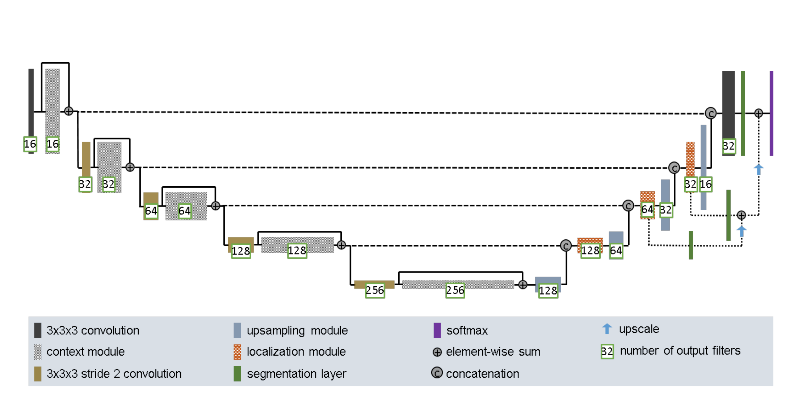

# ISIC Lesion Segmentation Algorithm

## Description
The ISIC Lesion Segmentation Algorithm was designed to automatically segment skin lesion boundaries from dermatocopic images. Early detection of skin lesions is crucial in improving the prognosis of skin cancers such as melanoma. The algorithm operates by analyzing input images and leverages a convolutional neural network (CNN) to identify and segment potential skin lesions, distinguishing them from the healthy skin. The dice similarity coefficient is used to compare the algorithm output to the ground truth reference mask, which essentially measures the proportion of output pixels that match the true image. 

The model is a modified UNet and is comprised of several CNN layers, skip connections and uses deep supervision facilitated by segmentation layers connecting different levels of the network to the final output. The architecture of the model was inspired by the [improved UNet](https://arxiv.org/abs/1802.10508v1) (Figure 1) which proved to be an effective 3D brain tumor segmentation model during the BRATS 2017 challenge. The network is trained using the 2018 ISIC (International Skin Imaging Collaboration) dataset, which contains annotated images of various skin lesions.

Figure 1: Improved UNet architecture. Designed by F. Isensee et al.

## Dependencies

To run the ISIC Lesion Segmentation Algorithm, you'll need the following libraries:

- Python (only verified for 3.7+)
- numpy: For numerical computations and some tensor operations
- PyTorch: For building and training the neural network
- matplotlib: For plotting and visualisation

To install any dependencies you can use `pip install`

## Usage

### Input

### Output

### Plots

## Pre-processing

# Data Splits

The data was divided as follows:

- Training: 70%
- Validation: 20%
- Testing: 10%

With this split the bulk of the data (70%) is dedicated to training. It takes a substantial amount of data to effectively train a deep learning model like my UNet. By training with a larger proportion of the dataset the model is exposed to a broad range of data samples, which is favourable for learning the underlying patterns. Since the dataset was quite large (2500+ samples) I decided 70% was an ample amount.

The validation set is used to evaluate the model thoughout its training. The models performance on the validation set is used as a criteria for early stopping. This is a strategy to prevent overfitting. Thus, having a sufficiently large validation set is crucial as it ensures the decision to stop training is made on a reliable performance metric, rather than the noise of a smaller sample. 

Once the model is fully trained the test set provides a final, unbiased performance assessment.
While 10% is a fairly proportion of the data, it still provides an adequate number of samples considering the size of the dataset. Thus, the test set provides a reliable estimate of the model's real-world performance.
