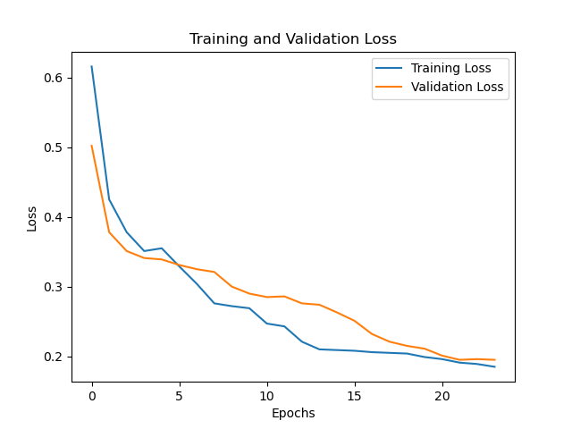
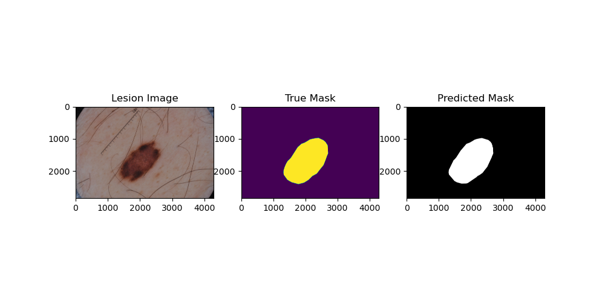

## Lesion Segmentation of ISIC 2017 with Improved UNet

### Table of Contents
  - [ISIC 2017 Lesion Datasets](#ISIC-2017-Lesion-Datasets)
  - [The Improved UNET Architecture](#The-Improved-UNET-Architecture)
  - [Training and Testing](#Training-and-Testing)
  - [Results and Discussion](#Results-andDiscussion)

### ISIC 2017 Lesion Datasets
The [ISIC 2017](https://challenge.isic-archive.com/data/#2017) dataset was used to build the model and perfrom segmentation. The dataset included training, testing and validation sets of 2000 images each, however only a certain number of each were selected due to the limitations on training time, as shown below.

- Training set: 200
- Validation set: 150
- Test set: 9

The dataset included JPG images of skin lesions along with PNG segmentations to determine and back-propogate losses.

Each image was processed by first resizing it to 256 x 256 pixels squared and applying transformations such as random rotation and flipping as it make the model invariant to certain trivial transformations.

### The Improved UNET Architecture
The Improved UNET architecture utilised was the one proposed in [Brain Tumor Segmentation and Radiomics Survival Prediction: Contribution to the BRATS 2017 Challenge](https://arxiv.org/pdf/1802.10508v1.pdf). Originally used for 3D image segmentation on the BRATS 2017 dataset, the Imroved UNET architecture was adopted to better suit 2D segmentation of skin lesions with the ISIC dataset. 

The proposed UNet architecture is a neural network model used for image segmentation tasks. It consists of an encoder part and a decoder part. The encoder part is composed of several convolutional layers with increasing number of filters, followed by a ContextBlock that applies residual connections and dropout regularization. The decoder part is composed of several upsampling layers that increase the spatial resolution of the feature maps, followed by a LocalisationBlock that combines the feature maps from the encoder and decoder parts. The output of the model is a tensor with the same size as the input image, where each pixel is classified into a specific category. The UNet architecture is known for its ability to handle small datasets and produce accurate segmentation results.

### Training and Testing
 24 epochs of training and validation was conducted on the aforementioned sample of images, with demonstration of the required Dice Similarity Coeeficient of greater than 0.8 by the end of the training. Refer to Fig. 1 and 2 below.

### Results

  
  Fig. 1: Training and Validation loss demeonstrating that model can for all test images achive a Dice Similarity Coeeficient of >0.8

  
  Fig 2: Demonstration of successful prediction mask from given Lesion Image

