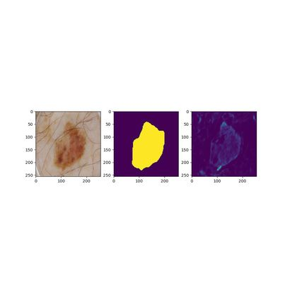

# TASK 1: Improved UNet for Image Segmentation

This project used an Improved UNet model on a segmentation problem for the ISIC melanoma dataset. This architecture was presented by [Isensee et al.](https://arxiv.org/pdf/1802.10508v1.pdf) [1], as a better alternative to the standard UNet structure.

# Dataset
The [ISIC 2017/18](https://challenge.isic-archive.com/data/#2017) dataset is a collection of skin lesion images, with associated segmentations and diagnoses. It is already split into training, validation and test subsets. A custom Dataset class was created to handle these images; it takes the image directory, matches the images to their corresponding mask and then transforms them. In this instance, the images were resized to (256,256), both due to memory requirements as well as simplicity in model (since it is a power of 2). Since there are 2000 images in the training set, data augmentation is not considered necessary; however, it could be interesting to explore in another investigation.

# Dependencies
A `conda` environment was created with the following packages:
```
python 3.10.13
pytorch 2.1.0
torchvision 0.16.0
matplotlib 3.7.2
pandas 2.1.1
```
This model consists of four files:
* `dataset.py` loads the data for processing
* `modules.py` creates the Improved UNet structure, with required blocks
* `train.py` trains the model when run
* `predict.py` visualises the results and tests the model

# Model
This section explains the general structure of Improved UNet, along with the motivation behind it.
## Problem
Automatic segmentation is very useful within medical image processing; it allows areas of interest to be highlighted for further investigation. Improved UNet enhances the performance of regular UNet through various tricks, such as localisation and multi-layer segmentation. Furthermore, it uses a Dice-coefficient based loss function, which reinforces the predicted mask's area compared the ground truth's. This increases its accuracy, hence improving its segmentation capabilities.

## Structure
The Improved UNet model was constructed as outlined by [1], diagram given below:


This required the development of several additional blocks.

### Context
This context is described as a pre-activation residual block, basically two convolutions with a dropout layer inbetween.

### Localisation
This localisation block transfers encoded low spatial resolution information into a higher spatial resolution. In essence, it recombines the upsampled features with the saved outputs from the corresponding context block.

### Segmentation
Segmentation occurs at multiple levels, reducing the feature map back into one feature. This improves the accuracy of the model, as opposed to only performing segmentation on the final output.

# Results
Due to the model size and difficulties in accessing the Rangpur computing cluster, this model was difficult to train. This necessitated some changes: BCELoss() was used instead of DiceLoss due to Dice's relatively slow convergence, and the recommended 300 epochs was not feasible. With more time and computing power, the results are obviously expected to improve.

To get some initial results, the model was simply trained on the validation dataset, purely due to its reduced size. Two sample outputs are given below after 50 epochs of training, demonstrating some feasibility in the model - it does detect some of the mole's shape. As such, with a larger dataset and more epochs, it is believed that these predictions will improve further.




Due to their differences, the Dice coefficient is not meaningful in this context - there is not much overlap.

This process was repeated on the full training set, but only for 20 epochs. The losses are shown in the plot below (high values since total sum of losses not divided by data length).


Using this model again to make predictions, the following results are obtained:


Again, it seems to highlight the overall shape and is expected to improve with more training.

### Recommendations
There are several improvements that could be made to the overall procedure:
* more epochs in training would improve accuracy
* converting the predictions to binarised images (via thresholding) would make the Dice coefficient more meaningful

# References
[1] Isensee, F., Kickingereder, P., Wick, W., Bendszus, M., and Maier-Hein, K. "Brain Tumor Segmentation and Radiomics Survival Prediction: Contribution to the BRATS 2017 Challenge". Feb 28, 2018 [Online]. Accessed from <https://arxiv.org/pdf/1802.10508v1.pdf>