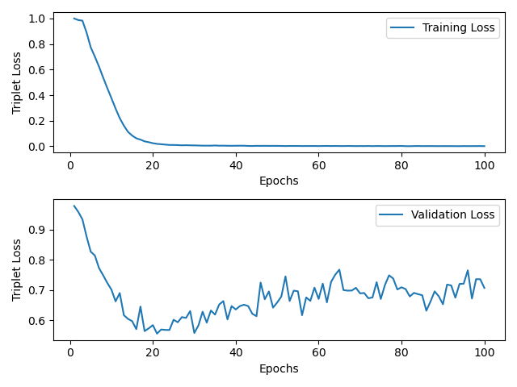
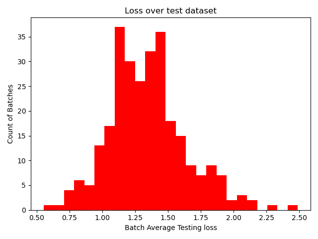

# Siamese Classifier for Alzheimer's disease 
by s4589541

## The Problem

Problem 7 involved creating a classifier based on a Siamese network. The dataset chosen was the ADNI brain dataset, and the problem was to classify Alzheimer's disease (Alzheimer's disease vs Normal cognition) from MRI scan images.

## The Algorithm

The model used was a binary classifier mounted on a Siamese network - specifically a triplet Siamese network. The architecture of the Siamese network involves 3 identical networks (with shared weights) in parallel. When an image is sampled from the dataset (the anchor), another image of the same class is sampled (the positive), as is one from the other class (the negative). These images are each fed through the network, which is a sequence of convolutional layers, maxpooling layers and activation functions, which then feeds into a series of fully connected linear layers, ending in a binary classification layer (i.e., 2x1 tensor). The triplet loss function seeks to minimise the distance between the anchor and positive outputs, and maximise the distance between anchor and negative outputs. Once the Siamese network was trained, it was frozen, and the binary classifier was mounted on it (i.e., the trained Siamese fed into it), and the network was trained, with the classifier using the embeddings from the Siamese network as input.

## Pre-processing

The provided ADNI dataset was split into test and train sets, and had a patient-level split. As a validation set was required, the train set was split 80-20 into new training and validation sets. Care was taken to ensure that the patient-level split was maintained - i.e., no data for a given patient was split between the training, validation or testing sets, to stop contamination of the validation and testing sets. A custom Dataset class was created to provide the triplet sampling functionality described above.

## Reproduction of Results

The dataset split can be acheived by running dataset.py, with the AD_NC/ folder of the ADNI data in the same directory.
```
Siamese Classifier for Alzheimer's disease (s4589541)
├── README.md
├── modules.py
├── dataset.py
├── predict.py
├── train.py
├── utils.py
├── .gitignore
├── AD_NC
|   ├── test
|   |    ├── AD
|   |    |   └── 388206_78.jpeg
|   |    |              .
|   |    |              .
|   |    └── NC
|   |        └── 1182968_94.jpeg
|   |                   .
|   |                   .
|   └── train
|        ├── AD
|        |   └── 218391_78.jpeg
|        |              .
|        |              .
|        └── NC
|            └── 808819_88.jpeg
|                       .
|                       .
└── data    # created by dataset.py
    ├── test
    |    ├── AD
    |    |   └── 388206_78.jpeg
    |    |              .
    |    └── NC
    |        └── 1182968_94.jpeg
    |                   .
    ├── train
    |    ├── AD
    |    |   └── 218393_78.jpeg
    |    |              .
    |    └── NC
    |        └── 808819_88.jpeg
    |                   .
    └── valid
         ├── AD
         |   └── 218391_78.jpeg
         |              .
         └── NC
             └── 836646_88.jpeg
                        .
```


Training and testing can be done by running train.py with `--train` to train and test a new model or `--test path_to_saved_model` to test a saved model. This requires the processed dataset in the same directory under data/ (which dataset.py creates). Running predict.py will provide sample outputs of the trained model.

Below are example graphs of training, validation and testing loss.






### Dependencies

`conda install --yes --file requirements.txt`

- certifi==2023.7.22
- charset-normalizer==3.3.0
- contourpy==1.1.1
- cycler==0.12.1
- filelock==3.12.4
- fonttools==4.43.1
- fsspec==2023.9.2
- idna==3.4
- Jinja2==3.1.2
- kiwisolver==1.4.5
- MarkupSafe==2.1.3
- matplotlib==3.8.0
- mpmath==1.3.0
- networkx==3.1
- numpy==1.26.1
- packaging==23.2
- Pillow==10.1.0
- pyparsing==3.1.1
- python-dateutil==2.8.2
- requests==2.31.0
- six==1.16.0
- sympy==1.12
- torch==2.1.0
- torchvision==0.16.0
- typing_extensions==4.8.0
- urllib3==2.0.6
