# Classifying Alzheimer's Disease in The ADNI Dataset Using The Siamese Network
## Problem
The Alzheimer’s Disease Neuroimaging Initiative (ADNI) dataset for Alzheimer's disease is a collection of MRI images with two classes: Alzheimer’s disease (AD) and Cognitive Normal (CN). This report will detail my attempt in classifying the dataset using a Siamese Network.

## Siamese Network
The Siamese Network aims to classify images based on its similarity to a range "query" images which each represent different classes. 

It does this by passing these test images and query images through the __same__ convolutional neural network (CNN), all with the __same__ weights, to extract the features of the images into single feature vectors. 

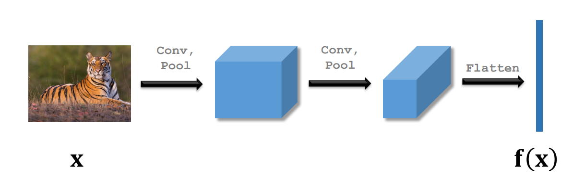

We then take the distance (some metric, i.e. euclidean distance) between an image embedding and all query embeddings. The image is classified as the class of the query image with the shortest distance.

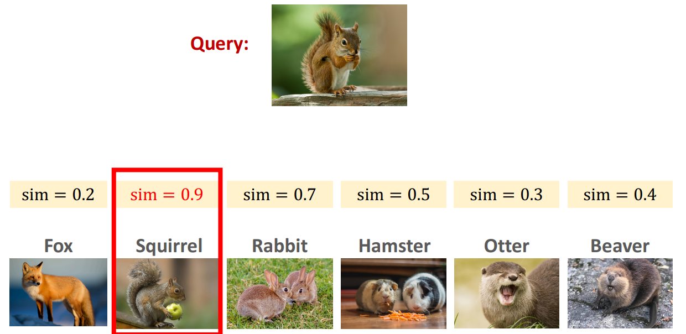

The network is trained on triplets of images - (Anchor, Positive, Negative) where positive has the same class as the anchor and negative has a different class to the anchor.
The ultimate goal is to adjust the CNN weights so that it provides a feature vector that minimizes the distance between the anchor and positive embeddings and maximizes the distance between the anchor and negative embeddings.

## Siamese Implementation
The CNN embedder I implemented is similar to the CNN implemented in figure 4 in "Siamese neural networks for one-shot image recognition"[1], with the main differences being the input image dimensions, use of batch norm, and that the length of the feature vector is 256.
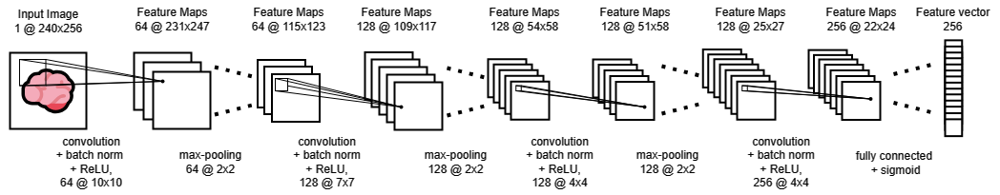
Training was done using functions from the PyTorch metric learning library [2]. The loss was calculated using triplet margin loss using cosine similarity distance - averaging only losses in the batch that are less than 0.3 (threshold reducer). 

The triplets are formed within the batch by the loss function. To get better training, a mutli-similarity miner was used to find "hard pairs" in the batch - negative pairs that are close together and positive pairs that are far apart. The results were passed to the loss function.

Example Triplets:

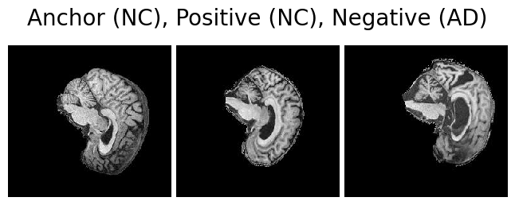

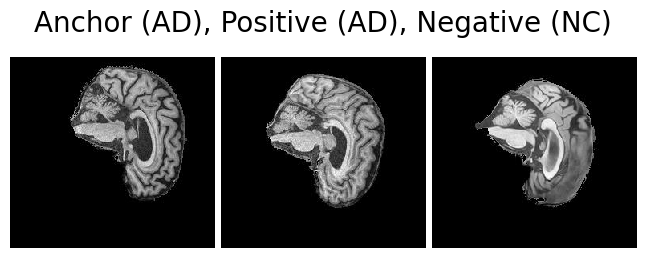

In training, I used SGD as the optimizer with 1e-5 weight decay and a one-cycle learning rate scheduler with a max learning rate of 0.1.

## Classifying the ADNI Dataset
### Preprocessing The Data
The training dataset was split by [0.7, 0.3] to create the validation dataset.
A grayscale transformation was also made on the images so that the pixel values are a value between 0.0 and 1.0 and that the image has only 1 channel.

To help generalize the training set, I also applied a random rotation transformation and a random crop with the same size of the image to get random positions of the scans.

Example Inputs:
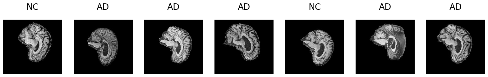

## Results
### Training
The following plot shows the (epoch average) loss for the training and validation set across 35 epochs.

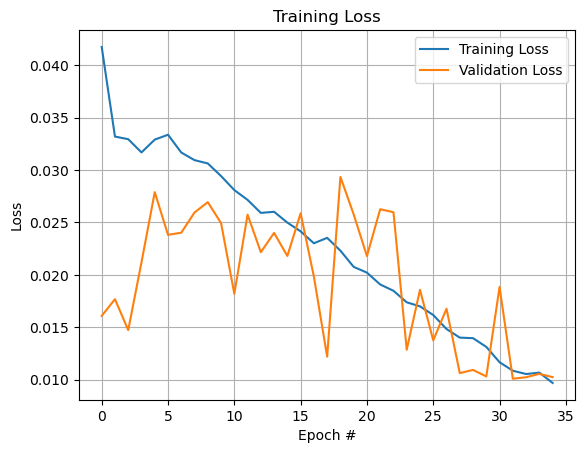

The following plot shows the validation accuracy across 35 epochs.

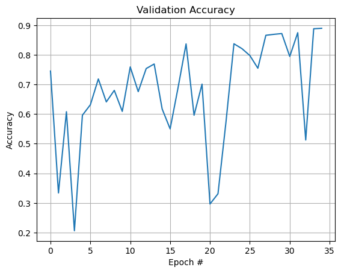

We can see that the model reaches good validation accuracy at around 17 epochs and then fluctuates, reaching over 0.8 accuracy a couple of times. At 35 epochs, the model has decent validation performance. When evaluating the test set, we get slightly worse performance but not quite 80% as seen below:

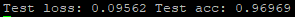

### Prediction
Predicting the class of image requires a 'query' image from each class which will be tested for similarity against the input image. The following plots are two examples predicting the class of an image.

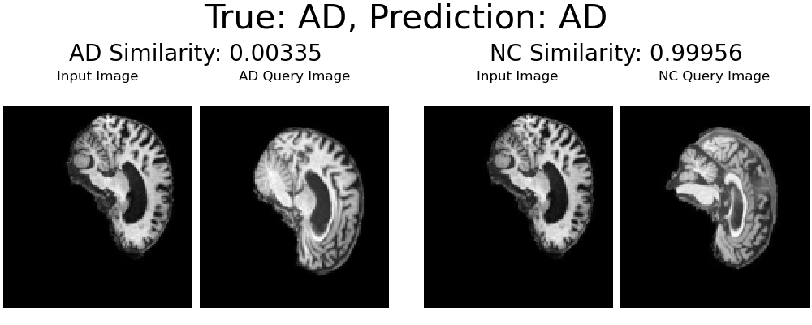
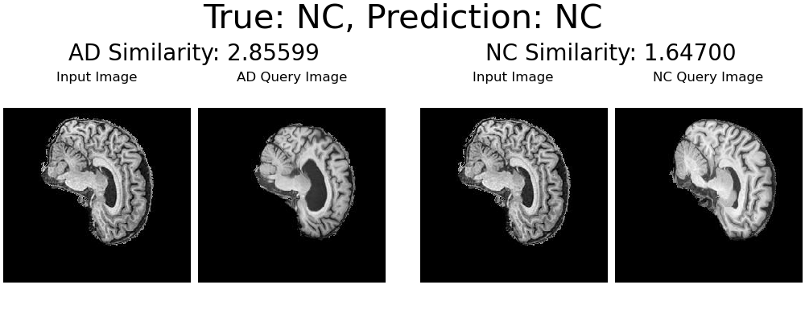
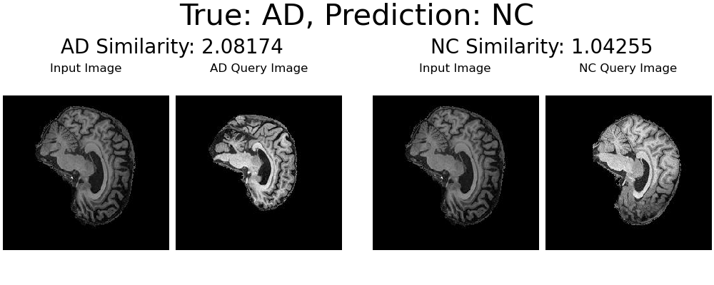

## Reproducibility
train.py includes the best training parameters found (detailed above). The train/validation split will be different for each run. This means the exact results as described in the report will not be achieved for every run. But, as I have observed on repeated runs, similar results will be achieved. It's also worth noting that the query images are drawn at random and may affect the accuracy as it depends on the quality of these query images.

### Dependencies
Python Version 3.11.5
* PyTorch 2.0.1
* Torchvision 0.15.2
* NumPy 1.24.3
* Matplotlib 3.7.1
* pytorch_metric_learning 2.3.0
  

## References

[1] G. Koch, R. Zemel, R. Salakhutdinov et al., “Siamese neural networks for one-shot image recognition,” in ICML deep learning workshop, vol. 2. Lille, 2015, p. 0. (https://www.cs.cmu.edu/~rsalakhu/papers/oneshot1.pdf)
[2] PyTorch Metric Learning, (https://kevinmusgrave.github.io/pytorch-metric-learning/)
[3] Wang, Shusen "Few-Shot Learning (2/3): Siamese Networks", Images (https://www.youtube.com/watch?v=4S-XDefSjTM)
